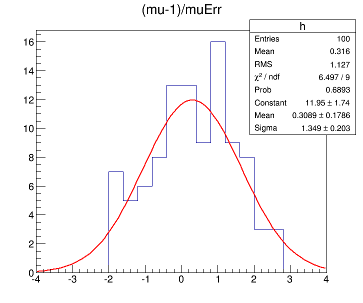
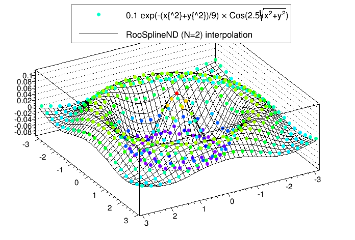

# Advanced Use Cases

This section will cover some of the more specific use cases for combine which are not necessarily related to the main statistics results. 

## Fitting Diagnostics

You may first want to look at the HIG PAG standard checks applied to all datacards if you want to diagnose your limit setting/fitting results which can be found [here](https://twiki.cern.ch/twiki/bin/view/CMS/HiggsWG/HiggsPAGPreapprovalChecks)

If you have already found the higgs boson but it's an exotic one, instead of computing a limit or significance you might want to extract it's cross section by performing a maximum-likelihood fit. Or, more seriously, you might want to use this same package to extract the cross section of some other process (e.g. the di-boson production). Or you might want to know how well the data compares to you model, e.g. how strongly it constraints your other nuisance parameters, what's their correlation, etc. These general diagnostic tools are contained in the method `FitDiagnostics`. 

    combine -M FitDiagnostics datacard.txt

The program will print out the result of the *two fits* performed with signal strength **r** (or first POI in the list) set to zero and a second with floating **r**. The output root tree will contain the best fit value for **r** and it's uncertainty. You will also get a `fitDiagnostics.root` file containing the following objects:

| Object | Description |
|------------------------|---------------------------------------------------------------------------------------------------------------------------------------|
| **`nuisances_prefit`** | `RooArgSet` containing the pre-fit values of the nuisance parameters, and their uncertainties from the external constraint terms only |
| **`fit_b`** | `RooFitResult` object containing the outcome of the fit of the data with signal strength set to zero |
| **`fit_s`** | `RooFitResult` object containing the outcome of the fit of the data with floating signal strength |
| **`covariance_fit_s`** | `TH2D` Covariance matrix of the parameters in the fit with floating signal strength  |
| **`covariance_fit_b`** | `TH2D` Covariance matrix of the parameters in the fit with signal strength set to zero |
| **`tree_prefit`** | `TTree` of pre-fit nuisance parameter values and constraint terms (_In)|
| **`tree_fit_sb`** | `TTree` of fitted nuisance parameter values and constraint terms (_In) with floating signal strength |
| **`tree_fit_b`** | `TTree` of fitted nuisance parameter values and constraint terms (_In) with signal strength set to 0 |


>**[info]** 
>If you use the option `--name` this name will be inserted into the file name for this output file too. 

As well as values of the constrained nuisance parameters (and their constraint values) in the toys, you will also find branches for the number of "bad" nll calls (which you should check is not too large) and the status of the fit `fit_status`. The fit status is computed as follows

```
fit_status = 100 * hesse_status + 10 * minos_status +  minuit_summary_status
```

The `minuit_summary_status` is the usual status from Minuit, details of which can be found [here](https://root.cern.ch/root/htmldoc/ROOT__Minuit2__Minuit2Minimizer.html#ROOT__Minuit2__Minuit2Minimizer:Minimize). For the other status values, check these documentation links for the [`hesse_status`](https://root.cern.ch/root/htmldoc/ROOT__Minuit2__Minuit2Minimizer.html#ROOT__Minuit2__Minuit2Minimizer:Hesse) and the [`minos_status`](https://root.cern.ch/root/htmldoc/ROOT__Minuit2__Minuit2Minimizer.html#ROOT__Minuit2__Minuit2Minimizer:GetMinosError).

A fit status of -1 indicates that the fit failed (Minuit summary was not 0 or 1) and hence the fit is **not** valid.


##### Fit options

- If you need only the signal+background fit, you can run with `--justFit`. This can be useful if the background-only fit is not interesting or not converging (e.g. if the significance of your signal is very very large)
- You can use `--rMin` and `--rMax` to set the range of the first POI; a range that is not too large compared to the uncertainties you expect from the fit usually gives more stable and accurate results.
- By default, the uncertainties are computed using MINOS for the first POI and HESSE for all other parameters (and hence they will be symmetric for the nuisance parameters). You can run MINOS for *all* parameters using the option `--minos all`, or for *none* of the parameters using `--minos none`. Note that running MINOS is slower so you should only consider using it if you think the HESSE uncertainties are not accurate.
- If MINOS or HESSE fails to converge, you can try running with `--robustFit=1` that will do a slower but more robust likelihood scan; this can be further controlled by the parameter `--stepSize` (the default is 0.1, and is relative to the range of the parameter)
- You can set the strategy and tolerance when using the `--robustFit` option using the options `setRobustFitAlgo` (default is `Minuit2,migrad`), `setRobustFitStrategy` (default is 0) and `--setRobustFitTolerance` (default is 0.1). If these options are not set, the defaults (set using `cminDefaultMinimizerX` options) will be used. You can also tune the accuracy of the routine used to find the crossing points of the likelihood using the option `--setCrossingTolerance` (default is set to 0.0001)
- If you find the covariance matrix provided by HESSE is not accurate (i.e. `fit_s->Print()` reports this was forced positive-definite) then a custom HESSE-style calculation of the covariance matrix can be used instead. This is enabled by running FitDiagnostics with the `--robustHesse 1` option. Please note that the status reported by `RooFitResult::Print()` will contain `covariance matrix quality: Unknown, matrix was externally provided` when robustHesse is used, this is normal and does not indicate a problem. NB: one feature of the robustHesse algorithm is that if it still cannot calculate a positive-definite covariance matrix it will try to do so by dropping parameters from the hessian matrix before inverting. If this happens it will be reported in the output to the screen. 
- For other fitting options see the [generic minimizer options](https://github.com/cms-analysis/HiggsAnalysis-CombinedLimit/wiki/runningthetool#generic-minimizer-options) section.

#### Fit parameter uncertainties

If you get a warning message when running `FitDiagnostics` which says `Unable to determine uncertainties on all fit parameters`. This means the covariance matrix calculated in FitDiagnostics was not correct. 

The most common problem is that the covariance matrix is forced positive-definite. In this case the constraints on fit parameters as taken from the covariance matrix are incorrect and should not be used. In particular, if you want to make post-fit plots of the distribution used in the signal extraction fit and are extracting the uncertainties on the signal and background expectations from the covariance matrix, the resulting values will not reflect the truth if the covariance matrix was incorrect. By default if this happens and you passed the `--saveWithUncertainties` flag when calling `FitDiagnostics`, this option will be ignored as calculating the uncertainties would lead to incorrect results. This behaviour can be overridden by passing `--ignoreCovWarning`.

Such problems with the covariance matrix can be caused by a number of things, for example:

- Parameters being close to their boundaries after the fit.

- Strong (anti-) correlations between some parameters.
A discontinuity in the NLL function or its derivatives at or near the minimum.

If you are aware that your analysis has any of these features you could try resolving these. Setting `--cminDefaultMinimizerStrategy 0` can also help with this problem.

#### Pre and post fit nuisance parameters and pulls

It is possible to compare pre-fit and post-fit nuisance parameters with the script [diffNuisances.py](https://github.com/cms-analysis/HiggsAnalysis-CombinedLimit/blob/81x-root606/test/diffNuisances.py). Taking as input a `fitDiagnostics.root` file, the script will by default print out the parameters which have changed significantly w.r.t. their initial estimate. For each of those parameters, it will print out the shift in value and the post-fit uncertainty, both normalized to the input values, and the linear correlation between the parameter and the signal strength.

    python diffNuisances.py fitDiagnostics.root

The script has several options to toggle the thresholds used to decide if a parameter has changed significantly, to get the printout of the absolute value of the nuisance parameters, and to get the output in another format for easy cut-n-paste (supported formats are `html`, `latex`, `twiki`). To print *all* of the parameters, use the option `--all`. 

The output by default will be the changes in the nuisance parameter values and uncertainties, relative to their initial (pre-fit) values (usually relative to initial values of 0 and 1 for most nuisance types). 

The values in the output will be $(\theta-\theta_{I})/\sigma_{I}$ if the nuisance has a pre-fit uncertainty, otherwise it will be $\theta-\theta_{I}$ if not (eg, a `flatParam` has no pre-fit uncertainty). 

The uncertainty reported will be the ratio $\sigma/\sigma_{I}$ - i.e the ratio of the post-fit to the pre-fit uncertainty. If there is no pre-fit uncertainty (as for `flatParam` nuisances) then the post-fit uncertainty is shown. 

With the option `--abs`, instead the pre-fit and post-fit values and (asymmetric) uncertainties will be reported in full. 

>**[info]**
>We recommend you include the options `--abs` and `--all` to get the full information on all of the parameters (including unconstrained nuisance parameters) at least once when checking your datacards.

If instead of the plain values, you wish to report the _pulls_, you can do so with the option `--pullDef X` with `X` being one of the following options; You should note that since the pulls below are only defined when the pre-fit uncertainty exists, *nothing* will be reported for parameters which have no prior constraint (except in the case of the `unconstPullAsym` choice as described below). You may want to run without this option and `--all` to get information on those parameters. 

- `relDiffAsymErrs`: This is the same as the default output of the tool except that only constrained parameters (pre-fit uncertainty defined) are reported. The error is also reported and calculated as $\sigma/\sigma_{I}$. 

- `unconstPullAsym`: Report the pull as $\frac{\theta-\theta_{I}}{\sigma}$ where $\theta_{I}$ and $\sigma$ are the initial value and **post-fit** uncertainty of that nuisance parameter. The pull defined in this way will have no error bar, but *all* nuisance parameters will have a result in this case. 

- `compatAsym`: The pull is defined as $\frac{\theta-\theta_{D}}{\sqrt{\sigma^{2}+\sigma_{D}^{2}}}$, where $\theta_{D}$ and $\sigma_{D}$ are calculated as  $\sigma_{D} = ( \frac{1}{\sigma^{2}} - \frac{1}{\sigma_{I}^{2}} )^{-1} $ and $\theta_{D} = \sigma_{D}(\theta - \frac{\theta_{I}}{\sigma_{I}^{2}})$, where $\theta_{I}$ and $\sigma_{I}$ are the initial value and uncertainty of that nuisance parameter. This can be thought of as a _compatibility_ between the initial measurement (prior) an imagined measurement where only the data (with no constraint) is used to measure the nuisance parameter. There is no error bar associated to this value. 

- `diffPullAsym`: The pull is defined as $\frac{\theta-\theta_{I}}{\sqrt{\sigma_{I}^{2}-\sigma^{2}}}$, where $\theta_{I}$ and $\sigma_{I}$ are the pre-fit value and uncertainty (from [L. Demortier and L. Lyons](http://physics.rockefeller.edu/luc/technical_reports/cdf5776_pulls.pdf)). If the denominator is close to 0 or the post-fit uncertainty is larger than the pre-fit (usually due to some failure in the calculation), the pull is not defined and the result will be reported as `0 +/- 999`. 

If using `--pullDef`, the results for *all* parameters for which the pull can be calculated will be shown (i.e `--all` will be set to `true`), not just those which have moved by some metric.

This script has the option (`-g outputfile.root`) to produce plots of the fitted _values_ of the nuisance parameters and their post-fit, asymmetric uncertainties. Instead, the pulls defined using one of the options above, can be plotted using the option `--pullDef X`. In addition this will produce a plot showing directly a comparison of the post-fit to pre-fit nuisance (symmetrized) uncertainties. 

>**[info]** 
>In the above options, if an asymmetric uncertainty is associated to the nuisance parameter, then the choice of which uncertainty is used in the definition of the pull will depend on the sign of $\theta-\theta_{I}$. 


#### Normalizations

For a certain class of models, like those made from datacards for shape-based analysis, the tool can also compute and save to the output root file the best fit yields of all processes. If this feature is turned on with the option `--saveNormalizations`, the file will also contain three RooArgSet `norm_prefit`, `norm_fit_s`, `norm_fit_b` objects each containing one RooConstVar for each channel `xxx` and process `yyy` with name **`xxx/yyy`** and value equal to the best fit yield. You can use `RooRealVar::getVal` and `RooRealVar::getError` to estimate both the post-(or pre-)fit values and uncertainties of these normalisations. 

The sample pyroot macro [mlfitNormsToText.py](https://github.com/cms-analysis/HiggsAnalysis-CombinedLimit/blob/81x-root606/test/mlfitNormsToText.py) can be used to convert the root file into a text table with four columns: channel, process, yield from the signal+background fit and yield from the background-only fit. To include the uncertainties in the table, add the option `--uncertainties`


>**[warning]**
>Note that when running with multiple toys, the `norm_fit_s`, `norm_fit_b` and `norm_prefit` objects will be stored for the _last_ toy dataset generated and so may not be useful to you. 

Note that this procedure works only for "extended likelihoods" like the ones used in shape-based analysis, not for the cut-and-count datacards. You can however convert a cut-and-count datacard in an equivalent shape-based one by adding a line `shapes * * FAKE` in the datacard after the `imax`, `jmax`, `kmax` or using `combineCards.py countingcard.txt -S > shapecard.txt`. 


##### Per-bin norms for shape analyses
 
If you have a shape based analysis, you can also (instead) include the option `--savePredictionsPerToy`. With this option, additional branches will be filled in the three output trees contained in `fitDiagnostics.root`.  

The normalisation values for each toy will be stored in the branches inside the `TTrees` named **n\_exp[\_final]\_binxxx\_proc\_yyy**. The **\_final** will only be there if there are systematics affecting this process. 

Additionally, there will be filled branches which provide the value of the expected **bin** content for each process, in each channel. These will are named as **n\_exp[\_final]\_binxxx\_proc\_yyy_i** (where **\_final** will only be in the name if there are systematics affecting this process) for channel `xxx`, process `yyy` bin number `i`. In the case of the post-fit trees (`tree_fit_s/b`), these will be resulting expectations from the _fitted_ models, while for the pre-fit tree, they will be the expectation from the generated model (i.e if running toys with `-t N` and using `--genNuisances`, they will be randomised for each toy). These can be useful, for example, for calculating correlations/covariances between different bins, in different channels or processes, within the model from toys. 

>**[info]** 
>Be aware that for *unbinned* models, a binning scheme is adopted based on the `RooRealVar::getBinning` for the observable defining the shape, if it exists, or combine will adopt some appropriate binning for each observable. 


#### Plotting

`FitDiagnostics` can also produce pre- and post-fit plots the model in the same directory as `fitDiagnostics.root` along with the data. To get them, you have to specify the option `--plots`, and then *optionally specify* what are the names of the signal and background pdfs, e.g. `--signalPdfNames='ggH*,vbfH*'` and `--backgroundPdfNames='*DY*,*WW*,*Top*'` (by default, the definitions of signal and background are taken from the datacard). For models with more than 1 observable, a separate projection onto each observable will be produced. 

An alternative is to use the options `--saveShapes`. The result will be additional folders in `fitDiagnostics.root` for each category, with pre and post-fit distributions of the signals and backgrounds as TH1s and the data as TGraphAsymmErrors (with Poisson intervals as error bars).

Three additional folders (**shapes\_prefit**, **shapes\_fit\_sb** and **shapes\_fit\_b** ) will contain the following distributions,

| Object | Description |
|------------------------|---------------------------------------------------------------------------------------------------------------------------------------|
| **`data`** | `TGraphAsymmErrors` containing the observed data (or toy data if using `-t`). The vertical error bars correspond to the 68% interval for a Poisson distribution centered on the observed count. |
| **`$PROCESS`** (id <= 0) | `TH1F` for each signal process in channel, named as in the datacard |
| **`$PROCESS`** (id > 0)  | `TH1F` for each background  process in channel, named as in the datacard|
| **`total_signal`** | `TH1F` Sum over the signal components|
| **`total_background`** | `TH1F` Sum over the background components|
| **`total`** | `TH1F` Sum over all of the signal and background components |


The above distributions are provided *for each channel included in the datacard*, in separate sub-folders, named as in the datacard: There will be one sub-folder per channel.

>**[warning]** 
>The pre-fit signal is by default for `r=1` but this can be modified using the option `--preFitValue`.

The distributions and normalisations are guaranteed to give the correct interpretation: 

- For shape datacards whose inputs are TH1, the histograms/data points will have the bin number as the x-axis and the content of each bin will be a number of events.

- For datacards whose inputs are RooAbsPdf/RooDataHists, the x-axis will correspond to the observable and the bin content will be the PDF density / events divided by the bin width. This means the absolute number of events in a given bin, i, can be obtained from `h.GetBinContent(i)*h.GetBinWidth(i)` or similar for the data graphs. **Note** that for *unbinned* analyses combine will make a reasonable guess as to an appropriate binning. 

Uncertainties on the shapes will be added with the option `--saveWithUncertainties`. These uncertainties are generated by re-sampling of the fit covariance matrix, thereby accounting for the full correlation between the parameters of the fit. 

>**[warning]** 
>It may be tempting to sum up the uncertainties in each bin (in quadrature) to get the *total* uncertainty on a process however, this is (usually) incorrect as doing so would not account for correlations *between the bins*. Instead you can refer to the uncertainties which will be added to the post-fit normalizations described above.


Additionally, the covariance matrix **between** bin yields (or yields/bin-widths) in each channel will also be saved as a `TH2F` named **total_covar**. If the covariance between *all bins* across *all channels* is desired, this can be added using the option `--saveOverallShapes`. Each folder will now contain additional distributions (and covariance matrices) corresponding to the concatenation of the bins in each channel (and therefore the covaraince between every bin in the analysis). The bin labels should make it clear as to which bin corresponds to which channel. 


#### Toy-by-toy diagnostics

`FitDiagnostics` can also be used to diagnose the fitting procedure in toy experiments to identify potentially problematic nuisance parameters when running the full limits/p-values. This can be done by adding the option `-t <num toys>`. The output file, `fitDiagnostics.root` the three `TTrees` will contain the value of the constraint fitted result in each toy, as a separate entry. It is recommended to use the following options when investigating toys to reduce the running time: `--toysFrequentist` `--noErrors` `--minos none`

The results can be plotted using the macro [test/plotParametersFromToys.C](https://github.com/cms-analysis/HiggsAnalysis-CombinedLimit/blob/81x-root606/test/plotParametersFromToys.C)

```c++
$ root -l
.L plotParametersFromToys.C+
plotParametersFomToys("fitDiagnosticsToys.root","fitDiagnosticsData.root","workspace.root","r<0")
```

The first argument is the name of the output file from running with toys, and the second and third (optional) arguments are the name of the file containing the result from a fit to the data and the workspace (created from `text2workspace.py`). The fourth argument can be used to specify a cut string applied to one of the branches in the tree which can be used to correlate strange behaviour with specific conditions. The output will be 2 pdf files (**`tree_fit_(s)b.pdf`**) and 2 root files  (**`tree_fit_(s)b.root`**) containing canvases of the fit results of the tool. For details on the output plots, consult [AN-2012/317](http://cms.cern.ch/iCMS/user/noteinfo?cmsnoteid=CMS%20AN-2012/317).


## Scaling constraints

It possible to scale the **constraints** on the nuisance parameters when converting the datacard to a workspace (see the section on [physics models](/part2/physicsmodels#model-building)) with `text2workspace.py`. This can be useful for projection studies of the analysis to higher luminosities or with different assumptions about the sizes of certain systematics without changing the datacard by hand. 

We consider two kinds of scaling;  

 - A *constant scaling factor* to scale the constraints 
 - A *functional scale factor* that depends on some other parameters in the workspace, eg a luminosity scaling parameter (as a `rateParam` affecting all processes). 
 
In both cases these scalings can be introduced by adding some extra options at the `text2workspace.py` step. 

To add a *constant scaling factor* we use the option `--X-rescale-nuisance`, eg

    text2workspace.py datacard.txt --X-rescale-nuisance '[some regular expression]' 0.5
    
will create the workspace in which ever nuisance parameter whose name matches the specified regular expression will have the width of the gaussian constraint scaled by a factor 0.5. 

Multiple `--X-rescale-nuisance` options can be specified to set different scalings for different nuisances (note that you actually have to write `--X-rescale-nuisance` each time as in `--X-rescale-nuisance 'theory.*' 0.5  --X-rescale-nuisance 'exp.*' 0.1`).

To add a *functional scaling factor* we use the option `--X-nuisance-function`, which works in a similar way. Instead of a constant value you should specify a RooFit factory expression. 

A typical case would be scaling by $1/\sqrt{L}$, where $L$ is a luminosity scale factor eg assuming there is some parameter in the datacard/workspace called **`lumiscale`**, 

    text2workspace.py datacard.txt --X-nuisance-function '[some regular expression]' 'expr::lumisyst("1/sqrt(@0)",lumiscale[1])'
    
This factory syntax is quite flexible, but for our use case the typical format will be: `expr::[function name]("[formula]", [arg0], [arg1], ...)`. The `arg0`, `arg1` ... are represented in the formula by `@0`, `@1`,... placeholders. 

>**[warning]** 
>We are playing a slight trick here with the `lumiscale` parameter. At the point at which `text2workspace.py` is building these scaling terms the `lumiscale` for the `rateParam` has not yet been created. By writing `lumiscale[1]` we are telling RooFit to create this variable with an initial value of 1, and then later this will be re-used by the `rateParam` creation. 

A similar option, `--X-nuisance-group-function`, can be used to scale whole groups of nuisances (see [groups of nuisances](/part2/settinguptheanalysis#groups-of-nuisances)). Instead of a regular expression just give the group name instead, 

    text2workspace.py datacard.txt --X-nuisance-group-function [group name] 'expr::lumisyst("1/sqrt(@0)",lumiscale[1])'


## Nuisance parameter impacts

The impact of a nuisance parameter (NP) θ on a parameter of interest (POI) μ is defined as the shift Δμ that is induced as θ is fixed and brought to its +1σ or −1σ post-fit values, with all other parameters profiled as normal. 

This is effectively a measure of the correlation between the NP and the POI, and is useful for determining which NPs have the largest effect on the POI uncertainty.

It is possible to use the `FitDiagnostics` method of combine with the option `--algo impact -P parameter` to calculate the impact of a particular nuisance parameter on the parameter(s) of interest. We will use the `combineTool.py` script to automate the fits (see the [`combineTool`](/part1/README#combine-tool) section to check out the tool.

We will use an example workspace from the [$H\rightarrow\tau\tau$ datacard](https://github.com/cms-analysis/HiggsAnalysis-CombinedLimit/blob/81x-root606/data/tutorials/htt/125/htt_tt.txt),

```
$ cp HiggsAnalysis/CombinedLimit/data/tutorials/htt/125/htt_tt.txt .
$ text2workspace.py htt_tt.txt -m 125
```

Calculating the impacts is done in a few stages. First we just fit for each POI, using the `--doInitialFit` option with `combineTool.py`, and adding the `--robustFit 1` option that will be passed through to combine,

    combineTool.py -M Impacts -d htt_tt.root -m 125 --doInitialFit --robustFit 1
   
Have a look at the options as for [likelihood scans](/part3/commonstatsmethods.html#useful-options-for-likelihood-scans) when using `robustFit 1`.

Next we perform a similar scan for each nuisance parameter with the `--doFits` options,

    combineTool.py -M Impacts -d htt_tt.root -m 125 --robustFit 1 --doFits
    
Note that this will run approximately 60 scans, and to speed things up the option `--parallel X` can be given to run X combine jobs simultaneously. The batch and grid submission methods described in the [combineTool for job submission](/part3/runningthetool#combinetool-for-job-submission) section can also be used.

Once all jobs are completed the output can be collected and written into a json file:

    combineTool.py -M Impacts -d htt_tt.root -m 125 -o impacts.json
    
A plot summarising the nuisance parameter values and impacts can be made with `plotImpacts.py`, 

    plotImpacts.py -i impacts.json -o impacts

The first page of the output is shown below. 


The direction of the +1σ and -1σ impacts (i.e. when the NP is moved to its +1σ or -1σ values) on the POI indicates whether the parameter is correlated or anti-correlated with it. 

>**[warning]** 
>The plot also shows the *best fit* value of the POI at the top and its uncertainty. You may wish to allow the range to go -ve (i.e using `--setPhysicsModelParameterRanges` or `--rMin`) to avoid getting one-sided impacts!

This script also accepts an optional json-file argument with `-`t which can be used to provide a dictionary for renaming parameters. A simple example would be to create a file `rename.json`,

```python
{
  "r" : "#mu"
}
```

that will rename the POI label on the plot.

>**[info]** 
>Since `combineTool` accepts the usual options for combine you can also generate the impacts on an Asimov or toy dataset. 

The left panel in the summary plot shows the value of $(\theta-\theta_{0})/\Delta_{\theta}$ where $\theta$ and $\theta_{0}$ are the **post** and **pre**-fit values of the nuisance parameter and $\Delta_{\theta}$ is the **pre**-fit uncertainty. The asymmetric error bars show the **pre**-fit uncertainty divided by the **post**-fit uncertainty meaning that parameters with error bars smaller than $\pm 1$ are constrained in the fit. As with the `diffNuisances.py` script, use the option `--pullDef` are defined (eg to show the *pull* instead). 

## Channel Masking 

The `combine` tool has a number of features for diagnostics and plotting results of fits. It can often be useful to turn off particular channels in a combined analysis to see how constraints/pulls can vary. It can also be helpful to plot post-fit shapes + uncertainties of a particular channel (for example a signal region) *without* including the constraints from the data in that region. 

This can in some cases be achieved by removing a specific datacard when running `combineCards.py` however, when doing so the information of particular nuisances and pdfs in that region will be lost. Instead, it is possible to ***mask*** that channel from the likelihood! This is acheived at the `text2Workspace` step using the option `--channel-masks`.

#### Example: removing constraints from the signal region

We will take the control region example from the rate parameters tutorial from [data/tutorials/rate_params/](https://github.com/cms-analysis/HiggsAnalysis-CombinedLimit/tree/81x-root606/data/tutorials/rate_params).

The first step is to combine the cards 
    combineCards.py signal=signal_region.txt dimuon=dimuon_control_region.txt singlemuon=singlemuon_control_region.txt > datacard.txt
    
Note that we use the directive `CHANNELNAME=CHANNEL_DATACARD.txt` so that the names of the channels are under our control and easier to interpret. Next, we make a workspace and tell combine to create the parameters used to *mask channels*
 
    text2workspace.py datacard.txt --channel-masks
    
Now lets try a fit *ignoring* the signal region. We can turn off the signal region by setting the channel mask parameter on: `--setParameters mask_signal=1`. Note that `text2workspace` has created a masking parameter for every channel with the naming scheme **mask_CHANNELNAME**. By default, every parameter is set to 0 so that the channel is unmasked by default.
 
    combine datacard.root -M FitDiagnostics --saveShapes --saveWithUncertainties --setParameters mask_signal=1
    
>**[warning]** 
>There will be a lot of warning from combine. This is safe to ignore as this is due to the s+b fit not converging since the free signal parameter cannot be constrained as the data in the signal region is being ignored. 

We can compare the background post-fit and uncertainties with and without the signal region by re-running with `--setParameters mask_signal=0` (or just removing that command). Below is a comparison of the background in the signal region with and without masking the data in the signal region. We take these from the shapes folder 
**shapes_fit_b/signal/total_background** in the `fitDiagnostics.root` output.


Clearly the background shape is different and much less constrained *without including the signal region*, as expected. Channel masking can be used with *any method* in combine.

## RooMultiPdf conventional bias studies

Several analyses within the Higgs group use a functional form to describe their background which is fit to the data (eg the Higgs to two photons (Hgg) analysis). Often however, there is some uncertainty associated to the choice of which background function to use and this choice will impact results of a fit. It is therefore often the case that in these analyses, a Bias study is performed which will indicate how much potential bias can be present given a certain choice of functional form. These studies can be conducted using combine.

Below is an example script which will produce a workspace based on a simplified Hgg analysis with a *single* category. You will need to get the file [data/tutorials/bias_studies/toyhgg_in.root](https://github.com/cms-analysis/HiggsAnalysis-CombinedLimit/tree/81x-root606/data/tutorials/bias_studies/). 


```c++
void makeRooMultiPdfWorkspace(){

   // Load the combine Library 
   gSystem->Load("libHiggsAnalysisCombinedLimit.so");

   // Open the dummy H->gg workspace 
   TFile *f_hgg = TFile::Open("toyhgg_in.root");
   RooWorkspace *w_hgg = (RooWorkspace*)f_hgg->Get("multipdf");

   // The observable (CMS_hgg_mass in the workspace)
   RooRealVar *mass =  w_hgg->var("CMS_hgg_mass");

   // Get three of the functions inside, exponential, linear polynomial, power law
   RooAbsPdf *pdf_exp = w_hgg->pdf("env_pdf_1_8TeV_exp1");
   RooAbsPdf *pdf_pol = w_hgg->pdf("env_pdf_1_8TeV_bern2");
   RooAbsPdf *pdf_pow = w_hgg->pdf("env_pdf_1_8TeV_pow1");


   // Fit the functions to the data to set the "prefit" state (note this can and should be redone with combine when doing 
   // bias studies as one typically throws toys from the "best-fit"
   RooDataSet *data = (RooDataSet*)w_hgg->data("roohist_data_mass_cat1_toy1_cutrange__CMS_hgg_mass");
   pdf_exp->fitTo(*data);  // index 0
   pdf_pow->fitTo(*data); // index 1 
   pdf_pol->fitTo(*data);   // index 2

   // Make a plot (data is a toy dataset)
   RooPlot *plot = mass->frame();   data->plotOn(plot);
   pdf_exp->plotOn(plot,RooFit::LineColor(kGreen));
   pdf_pol->plotOn(plot,RooFit::LineColor(kBlue));
   pdf_pow->plotOn(plot,RooFit::LineColor(kRed));
   plot->SetTitle("PDF fits to toy data");
   plot->Draw();

   // Make a RooCategory object. This will control which of the pdfs is "active"
   RooCategory cat("pdf_index","Index of Pdf which is active");

   // Make a RooMultiPdf object. The order of the pdfs will be the order of their index, ie for below 
   // 0 == exponential
   // 1 == linear function
   // 2 == powerlaw
   RooArgList mypdfs;
   mypdfs.add(*pdf_exp);
   mypdfs.add(*pdf_pol);
   mypdfs.add(*pdf_pow);
   
   RooMultiPdf multipdf("roomultipdf","All Pdfs",cat,mypdfs);
   
   // As usual make an extended term for the background with _norm for freely floating yield
   RooRealVar norm("roomultipdf_norm","Number of background events",0,10000);
   
   // Save to a new workspace
   TFile *fout = new TFile("background_pdfs.root","RECREATE");
   RooWorkspace wout("backgrounds","backgrounds");
   wout.import(cat);
   wout.import(norm);
   wout.import(multipdf);
   wout.Print();
   wout.Write();

}
```


The signal is modelled as a simple Gaussian with a width approximately that of the diphoton resolution and the background is a choice of 3 functions. An exponential, a power-law and a 2nd order polynomial. This choice is accessible inside combine through the use of the [RooMultiPdf](https://github.com/cms-analysis/HiggsAnalysis-CombinedLimit/blob/81x-root606/interface/RooMultiPdf.h) object which can switch between the functions by setting its associated index (herein called **pdf_index**). This (as with all parameters in combine) is accessible via the `--setPhysicsModelParameters` option.

To asses the bias, one can throw toys using one function and fit with another. All of this only needs to use one datacard [hgg_toy_datacard.txt](https://github.com/cms-analysis/HiggsAnalysis-CombinedLimit/tree/81x-root606/data/tutorials/bias_studies/hgg_toy_datacard.txt)
 
The bias studies are performed in two stages. The first is to generate toys using one of the functions under some value of the signal strength **r** (or $\mu$). This can be repeated for several values of **r** and also at different masses, but here the Higgs mass is fixed to 125 GeV. 

>**[warning]** 
>It is important to freeze `pdf_index` otherwise combine will try to iterate over the index in the frequentist fit.

    combine hgg_toy_datacard.txt -M GenerateOnly --setParameters pdf_index=0 --toysFrequentist -t 100 --expectSignal 1 --saveToys -m 125 --freezeParameters pdf_index
    
Now we have 100 toys which, by setting `pdf_index=0`, sets the background pdf to the exponential function i.e assumes the exponential is the *true* function. Note that the option `--toysFrequentist` is added. This first performs a fit of the pdf, assuming a signal strength of 1, to the data before generating the toys. This is the most obvious choice as to where to throw the toys from.

The next step is to fit the toys under a different background pdf hypothesis. This time we set the `pdf_index` to be 1, the powerlaw and run fits with the `FitDiagnostics` method again freezing pdf_index. 

>**[warning]** 
>You may get warnings about non-accurate errors but these can be ignored and is related to the free parameters of the background pdfs which are not active.

    combine hgg_toy_datacard.txt -M FitDiagnostics  --setParameters pdf_index=1 --toysFile higgsCombineTest.GenerateOnly.mH125.123456.root  -t 100 --rMin -10 --rMax 10 --freezeParameters pdf_index
    
In the output file `fitDiagnostics.root` there is a tree which contains the best fit results under the signal+background hypothesis. One measure of the bias is the *pull* defined as the difference between the measured value of $\mu$ and the generated value (here we used 1) relative to the uncertainty on $\mu$. The pull distribution can be drawn and the mean provides an estimate of the pull...

```c++
root -l fitDiagnostics.root
tree_fit_sb->Draw("(r-1)/rErr>>h(20,-4,4)")
h->Fit("gaus")
```

 


From the fitted Gaussian, we see the mean is at +0.30 which would indicate a bias of ~30% of the uncertainty on mu from choosing the powerlaw when the true function is an exponential.

>**[danger]** 
>If the `discrete` nuisance is left floating, it will be profiled by looping through the possible index values and finding the pdf which gives the best fit. This allows for the [**discrete profiling method**](https://arxiv.org/pdf/1408.6865.pdf) to be applied for any method which involves a profiled likelihood (frequentist methods). You should be careful however since MINOS knows nothing about these nuisances and hence estimations of uncertainties will be incorrect. Instead, uncertainties from scans and limits will correctly account for these nuisances. Currently the Bayesian methods will *not* properly treat the nuisances so some care should be taken when interpreting Bayesian results. 
 
## RooSplineND multidimensional splines

[RooSplineND](https://github.com/cms-analysis/HiggsAnalysis-CombinedLimit/blob/81x-root606/interface/RooSplineND.h) can be used to interpolate from tree of points to produce a continuous function in N-dimensions. This function can then be used as input to workspaces allowing for parametric rates/cross-sections/efficiencies etc OR can be used to up-scale the resolution of likelihood scans (i.e like those produced from combine) to produce smooth contours. 

The following script is an example of its use which produces a 2D spline from a set of points generated from a function. 


```c++
void splinend(){
   // library containing the RooSplineND 
   gSystem->Load("libHiggsAnalysisCombinedLimit.so");

   TTree *tree = new TTree("tree_vals","tree_vals");
   float xb,yb,fb;

   tree->Branch("f",&fb,"f/Float_t");
   tree->Branch("x",&xb,"x/Float_t");
   tree->Branch("y",&yb,"y/Float_t");
   
   TRandom3 *r = new TRandom3();
   int nentries = 20; // just use a regular grid of 20x20

   double xmin = -3.2;
   double xmax = 3.2;
   double ymin = -3.2;
   double ymax = 3.2;

   for (int n=0;n<nentries;n++){
    for (int k=0;k<nentries;k++){

      xb=xmin+n*((xmax-xmin)/nentries);
      yb=ymin+k*((ymax-ymin)/nentries);
      // Gaussian * cosine function radial in "F(x^2+y^2)"
      double R = (xb*xb)+(yb*yb);
      fb = 0.1*TMath::Exp(-1*(R)/9)*TMath::Cos(2.5*TMath::Sqrt(R));
      tree->Fill();
     }
   }
   
   // 2D graph of points in tree
   TGraph2D *p0 = new TGraph2D();
   p0->SetMarkerSize(0.8);
   p0->SetMarkerStyle(20);
   
   int c0=0;
   for (int p=0;p<tree->GetEntries();p++){
        tree->GetEntry(p);
        p0->SetPoint(c0,xb,yb,fb);
        c0++;
        }


   // ------------------------------ THIS IS WHERE WE BUILD THE SPLINE ------------------------ //
   // Create 2 Real-vars, one for each of the parameters of the spline 
   // The variables MUST be named the same as the corresponding branches in the tree
   RooRealVar x("x","x",0.1,xmin,xmax); 
   RooRealVar y("y","y",0.1,ymin,ymax);

   
   // And the spline - arguments are 
   // Required ->   name, title, arglist of dependants, input tree, 
   // Optional ->  function branch name, interpolation width (tunable parameter), rescale Axis bool, cutstring 
   // The tunable parameter gives the radial basis a "width", over which the interpolation will be effectively taken 
   
   // the reascale Axis bool (if true) will first try to rescale the points so that they are of order 1 in range
   // This can be helpful if for example one dimension is in much larger units than another.
   
   // The cutstring is just a ROOT string which can be used to apply cuts to the tree in case only a sub-set of the points should be used 
   
   RooArgList args(x,y);
   RooSplineND *spline = new RooSplineND("spline","spline",args,tree,"f",1,true);
      // ----------------------------------------------------------------------------------------- //
   

   //TGraph *gr = spline->getGraph("x",0.1); // Return 1D graph. Will be a slice of the spline for fixed y generated at steps of 0.1
   
   // Plot the 2D spline 
   TGraph2D *gr = new TGraph2D();
   int pt = 0;
   for (double xx=xmin;xx<xmax;xx+=0.1){
     for (double yy=xmin;yy<ymax;yy+=0.1){
        x.setVal(xx);
        y.setVal(yy);
      gr->SetPoint(pt,xx,yy,spline.getVal());
      pt++;
     }
   }

   gr->SetTitle("");

   gr->SetLineColor(1);
   //p0->SetTitle("0.1 exp(-(x{^2}+y{^2})/9) #times Cos(2.5#sqrt{x^{2}+y^{2}})");
   gr->Draw("surf");
   gr->GetXaxis()->SetTitle("x");
   gr->GetYaxis()->SetTitle("y");
   p0->Draw("Pcolsame");

   //p0->Draw("surfsame");
   TLegend *leg = new TLegend(0.2,0.82,0.82,0.98);
   leg->SetFillColor(0);
   leg->AddEntry(p0,"0.1 exp(-(x{^2}+y{^2})/9) #times Cos(2.5#sqrt{x^{2}+y^{2}})","p");
   leg->AddEntry(gr,"RooSplineND (N=2) interpolation","L");
   leg->Draw();
}
```

Running the script will produce the following plot. The plot shows the sampled points and the spline produced from them.

 


## RooParametricHist gammaN for shapes

Currently, there is no straight-forward implementation of using per-bin **gmN** like uncertainties with shape (histogram) analyses. Instead, it is possible to tie control regions (written as datacards) with the signal region using three methods. 

For analyses who take the normalisation of some process from a control region, it is possible to use either **lnU** or **rateParam** directives to float the normalisation in a correlated way of some process between two regions. Instead if each bin is intended to be determined via a control region, one can use a number of RooFit histogram pdfs/functions to accomplish this. The example below shows a simple implementation of a [RooParametricHist](https://github.com/cms-analysis/HiggsAnalysis-CombinedLimit/blob/81x-root606/interface/RooParametricHist.h) to achieve this.

copy the script below into a file called `examplews.C` and create the input workspace using `root -l examplews.C`...


```c++
void examplews(){
    // As usual, load the combine library to get access to the RooParametricHist
    gSystem->Load("libHiggsAnalysisCombinedLimit.so");

    // Output file and workspace
    TFile *fOut = new TFile("param_ws.root","RECREATE");
    RooWorkspace wspace("wspace","wspace");

    // A search in a MET tail, define MET as our variable
    RooRealVar met("met","E_{T}^{miss}",200,1000);
    RooArgList vars(met);

    // ---------------------------- SIGNAL REGION -------------------------------------------------------------------//
    // Make a dataset, this will be just four bins in MET.
    // its easiest to make this from a histogram. Set the contents to "somehting"
    TH1F data_th1("data_obs_SR","Data observed in signal region",4,200,1000);
    data_th1.SetBinContent(1,100);
    data_th1.SetBinContent(2,50);
    data_th1.SetBinContent(3,25);
    data_th1.SetBinContent(4,10);
    RooDataHist data_hist("data_obs_SR","Data observed",vars,&data_th1);
    wspace.import(data_hist);

    // In the signal region, our background process will be freely floating,
    // Create one parameter per bin representing the yield. (note of course we can have multiple processes like this)
    RooRealVar bin1("bkg_SR_bin1","Background yield in signal region, bin 1",100,0,500);
    RooRealVar bin2("bkg_SR_bin2","Background yield in signal region, bin 2",50,0,500);
    RooRealVar bin3("bkg_SR_bin3","Background yield in signal region, bin 3",25,0,500);
    RooRealVar bin4("bkg_SR_bin4","Background yield in signal region, bin 4",10,0,500);
    RooArgList bkg_SR_bins;
    bkg_SR_bins.add(bin1);
    bkg_SR_bins.add(bin2);
    bkg_SR_bins.add(bin3);
    bkg_SR_bins.add(bin4);

    // Create a RooParametericHist which contains those yields, last argument is just for the binning,
    // can use the data TH1 for that
    RooParametricHist p_bkg("bkg_SR", "Background PDF in signal region",met,bkg_SR_bins,data_th1);
    // Always include a _norm term which should be the sum of the yields (thats how combine likes to play with pdfs)
    RooAddition p_bkg_norm("bkg_SR_norm","Total Number of events from background in signal region",bkg_SR_bins);

    // Every signal region needs a signal
    TH1F signal_th1("signal_SR","Signal expected in signal region",4,200,1000);
    signal_th1.SetBinContent(1,1);
    signal_th1.SetBinContent(2,2);
    signal_th1.SetBinContent(3,3);
    signal_th1.SetBinContent(4,8);
    RooDataHist signal_hist("signal","Data observed",vars,&signal_th1);
    wspace.import(signal_hist);

    // -------------------------------------------------------------------------------------------------------------//
    // ---------------------------- CONTROL REGION -----------------------------------------------------------------//
    TH1F data_CRth1("data_obs_CR","Data observed in control region",4,200,1000);
    data_CRth1.SetBinContent(1,200);
    data_CRth1.SetBinContent(2,100);
    data_CRth1.SetBinContent(3,50);
    data_CRth1.SetBinContent(4,20);

    RooDataHist data_CRhist("data_obs_CR","Data observed",vars,&data_CRth1);
    wspace.import(data_CRhist);

    // This time, the background process will be dependent on the yields of the background in the signal region.
    // The transfer factor TF must account for acceptance/efficiency etc differences in the signal to control
    // In this example lets assume the control region is populated by the same process decaying to clean daughters with 2xBR
    // compared to the signal region

    // NB You could have a different transfer factor for each bin represented by a completely different RooRealVar

    // We can imagine that the transfer factor could be associated with some uncertainty - lets say a 1% uncertainty due to efficiency and 2% due to acceptance.
    // We need to make these nuisance parameters ourselves and give them a nominal value of 0


    RooRealVar efficiency("efficiency", "efficiency nuisance parameter",0);
    RooRealVar acceptance("acceptance", "acceptance nuisance parameter",0);

    // We would need to make the transfer factor a function of those too. Here we've assumed Log-normal effects (i.e the same as putting lnN in the CR datacard)
    // but note that we could use any function which could be used to parameterise the effect - eg if the systematic is due to some alternate template, we could
    // use polynomials for example.


    RooFormulaVar TF("TF","Trasnfer factor","2*TMath::Power(1.01,@0)*TMath::Power(1.02,@1)",RooArgList(efficiency,acceptance) );

    // Finally, we need to make each bin of the background in the control region a function of the background in the signal and the transfer factor
    // N_CR = N_SR x TF

    RooFormulaVar CRbin1("bkg_CR_bin1","Background yield in control region, bin 1","@0*@1",RooArgList(TF,bin1));
    RooFormulaVar CRbin2("bkg_CR_bin2","Background yield in control region, bin 2","@0*@1",RooArgList(TF,bin2));
    RooFormulaVar CRbin3("bkg_CR_bin3","Background yield in control region, bin 3","@0*@1",RooArgList(TF,bin3));
    RooFormulaVar CRbin4("bkg_CR_bin4","Background yield in control region, bin 4","@0*@1",RooArgList(TF,bin4));

    RooArgList bkg_CR_bins;
    bkg_CR_bins.add(CRbin1);
    bkg_CR_bins.add(CRbin2);
    bkg_CR_bins.add(CRbin3);
    bkg_CR_bins.add(CRbin4);
    RooParametricHist p_CRbkg("bkg_CR", "Background PDF in control region",met,bkg_CR_bins,data_th1);
    RooAddition p_CRbkg_norm("bkg_CR_norm","Total Number of events from background in control region",bkg_CR_bins);
    // -------------------------------------------------------------------------------------------------------------//

    // import the pdfs
    wspace.import(p_bkg);
    wspace.import(p_bkg_norm,RooFit::RecycleConflictNodes());
    wspace.import(p_CRbkg);
    wspace.import(p_CRbkg_norm,RooFit::RecycleConflictNodes());
    fOut->cd();
    wspace.Write();

    // Clean up
    fOut->Close();
    fOut->Delete();

}
```

Lets go through what the script is doing. First, the observable for the search is the missing energy so we create a parameter to represent that.

```c++
   RooRealVar met("met","E_{T}^{miss}",200,1000);
```
First, the following lines create a freely floating parameter for each of our bins (in this example, there are only 4 bins, defined for our observable `met`.


```c++
   RooRealVar bin1("bkg_SR_bin1","Background yield in signal region, bin 1",100,0,500);
   RooRealVar bin2("bkg_SR_bin2","Background yield in signal region, bin 2",50,0,500);
   RooRealVar bin3("bkg_SR_bin3","Background yield in signal region, bin 3",25,0,500);
   RooRealVar bin4("bkg_SR_bin4","Background yield in signal region, bin 4",10,0,500);
    
   RooArgList bkg_SR_bins;
   bkg_SR_bins.add(bin1);
   bkg_SR_bins.add(bin2);
   bkg_SR_bins.add(bin3);
   bkg_SR_bins.add(bin4);
```

They are put into a list so that we can create a `RooParametricHist` and its normalisation from that list 

```c++
  RooParametricHist p_bkg("bkg_SR", "Background PDF in signal region",met,bkg_SR_bins,data_th1);

  RooAddition p_bkg_norm("bkg_SR_norm","Total Number of events from background in signal region",bkg_SR_bins);
```

For the control region, the background process will be dependent on the yields of the background in the signal region using a *transfer factor*. The transfer factor `TF` must account for acceptance/efficiency etc differences in the signal to control regions. 

In this example lets assume the control region is populated by the same process decaying to a different final state with twice as large branching ratio compared to the one in the signal region.

We could imagine that the transfer factor could be associated with some uncertainty - lets say a 1% uncertainty due to efficiency and 2% due to acceptance. We need to make nuisance parameters ourselves to model this and give them a nominal value of 0.

```c++
   RooRealVar efficiency("efficiency", "efficiency nuisance parameter",0);
   RooRealVar acceptance("acceptance", "acceptance nuisance parameter",0);
```

We need to make the transfer factor a function of these parameters since variations in these uncertainties will lead to variations of the transfer factor. Here we've assumed Log-normal effects (i.e the same as putting lnN in the CR datacard) but we could use *any function* which could be used to parameterise the effect - eg if the systematic is due to some alternate template, we could use polynomials for example.    

```c++
   RooFormulaVar TF("TF","Trasnfer factor","2*TMath::Power(1.01,@0)*TMath::Power(1.02,@1)",RooArgList(efficiency,acceptance) );
```

Then need to make each bin of the background in the control region a function of the background in the signal and the transfer factor - i.e $N_{CR} = N_{SR} \times TF $. 

```c++
   RooFormulaVar CRbin1("bkg_CR_bin1","Background yield in control region, bin 1","@0*@1",RooArgList(TF,bin1));
   RooFormulaVar CRbin2("bkg_CR_bin2","Background yield in control region, bin 2","@0*@1",RooArgList(TF,bin2));
   RooFormulaVar CRbin3("bkg_CR_bin3","Background yield in control region, bin 3","@0*@1",RooArgList(TF,bin3));
   RooFormulaVar CRbin4("bkg_CR_bin4","Background yield in control region, bin 4","@0*@1",RooArgList(TF,bin4));
```

As before, we also need to create the `RooParametricHist` for this process in the control region but this time the bin yields will be the `RooFormulaVars` we just created instead of free floating parameters. 

```c++
   RooArgList bkg_CR_bins;
   bkg_CR_bins.add(CRbin1);
   bkg_CR_bins.add(CRbin2);
   bkg_CR_bins.add(CRbin3);
   bkg_CR_bins.add(CRbin4);
   
   RooParametricHist p_CRbkg("bkg_CR", "Background PDF in control region",met,bkg_CR_bins,data_th1);
   RooAddition p_CRbkg_norm("bkg_CR_norm","Total Number of events from background in control region",bkg_CR_bins);
```

Below are datacards (for signal and control regions) which can be used in conjunction with the workspace built above. In order to "use" the control region, simply combine the two cards as usual using `combineCards.py`.


```
Signal Region Datacard -- signal category

imax * number of bins
jmax * number of processes minus 1
kmax * number of nuisance parameters

-------------------------------------------------------------------------------------------------------------------------------------------

shapes data_obs    signal   param_ws.root wspace:data_obs_SR 
shapes background  signal   param_ws.root wspace:bkg_SR   # the background model pdf which is freely floating, note other backgrounds can be added as usual
shapes signal      signal   param_ws.root wspace:signal

-------------------------------------------------------------------------------------------------------------------------------------------
bin         signal
observation  -1 
-------------------------------------------------------------------------------------------------------------------------------------------
# background rate must be taken from _norm param x 1      
bin                 signal      signal  
process             background  signal  
process             1            0      
rate               1            -1      
-------------------------------------------------------------------------------------------------------------------------------------------
# Normal uncertainties in the signal region 
lumi_8TeV         lnN    -           1.026 
-------------------------------------------------------------------------------------------------------------------------------------------
# free floating parameters, we do not need to declare them, but its a good idea to 
bkg_SR_bin1  flatParam 
bkg_SR_bin2  flatParam 
bkg_SR_bin3  flatParam 
bkg_SR_bin4  flatParam 
```

```
Control Region Datacard -- control category

imax * number of bins
jmax * number of processes minus 1
kmax * number of nuisance parameters

-------------------------------------------------------------------------------------------------------------------------------------------

shapes data_obs    control   param_ws.root wspace:data_obs_CR 
shapes background  control   param_ws.root wspace:bkg_CR   # the background model pdf which is dependant on that in the SR, note other backgrounds can be added as usual

-------------------------------------------------------------------------------------------------------------------------------------------
bin         control
observation  -1 
-------------------------------------------------------------------------------------------------------------------------------------------
# background rate must be taken from _norm param x 1 
bin                 control     
process             background  
process             1           
rate               1                   
-------------------------------------------------------------------------------------------------------------------------------------------

efficiency param 0 1
acceptance param 0 1
```

Note that for the control region, our nuisance parameters appear as `param` types so that combine will correctly constrain them.  

If we combine the two cards and fit the result with `-M MultiDimFit -v 3` we can see that the parameters which give the rate of background in each bin of the signal region, along with the nuisance parameters and signal strength, are determined by the fit - i.e we have properly included the constraint from the control region, just as with the 1-bin `gmN`. 

```
acceptance	  = 0.00374312	 +/-  0.964632	(limited)
bkg_SR_bin1	  = 99.9922	 +/-  5.92062	(limited)
bkg_SR_bin2	  = 49.9951	 +/-  4.13535	(limited)
bkg_SR_bin3	  = 24.9915	 +/-  2.9267	(limited)
bkg_SR_bin4	  = 9.96478	 +/-  2.1348	(limited)
efficiency	  = 0.00109195	 +/-  0.979334	(limited)
lumi_8TeV	  = -0.0025911	 +/-  0.994458
r	  = 0.00716347	 +/-  12.513	(limited)
```

The example given here  is extremely basic and it should be noted that additional complexity in the transfer factors, additional uncertainties/backgrounds etc in the cards are supported as always. 

>**[danger]** 
>If trying to implement parametric uncertainties in this setup (eg on transfer factors) which are correlated with other channels and implemented separately, you ***MUST*** normalise the uncertainty effect so that the datacard line can read `param name X 1`. That is the uncertainty on this parameter must be 1. Without this, there will be inconsistency with other nuisances of the same name in other channels implemented as **shape** or **lnN**.
