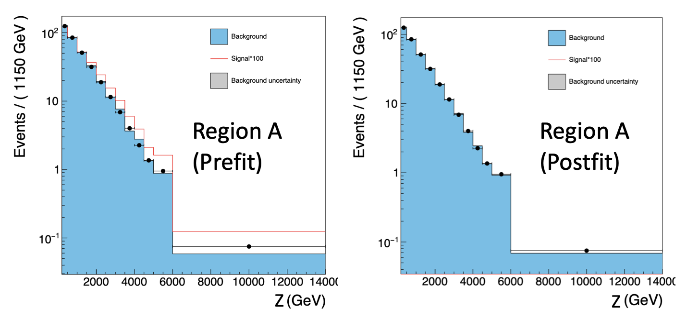

# combine_tutorial_ABCD_rooParametricHist
The following is a tutorial on how to use the `RooParamertricHist` class from <span style="font-variant:small-caps;">Combine</span> to perform an ABCD-like background estimation method.

## Getting started
To get started, you should have a working setup of <span style="font-variant:small-caps;">Combine</span>, please follow the instructions from the [home page](https://cms-analysis.github.io/HiggsAnalysis-CombinedLimit/latest/). Make sure to use the latest recommended release.

Now let's move to the working directory for this tutorial which contains all of the inputs and scripts needed to run the ABCD method with `RooParametricHist` exercise:

```
cd $CMSSW_BASE/src/HiggsAnalysis/CombinedLimit/data/tutorials/abcd_rooparametrichist_exercise

```

## Introduction
The goal of this tutorial is to exemplify the usage of `RooParametricHist` in <span style="font-variant:small-caps;">Combine</span> to implement a bin-by-bin ABCD method.

In this tutorial we will work with a toy example that could resemble a real physics analysis case. We consider the search for a BSM particle $\Phi$ with a mass between 1500 and 5000 GeV, that results in an excess in the tails of an observable $z$ (for example,  $p_{T,\mathrm{miss}}$). We assume that we have found two independent discriminating features $x$ and $y$ that can be used to construct the ABCD plane (the regions A,B,C,D will be defined by selecting regions in $x,y$), and we assume that $z$ is independent of  these two features. In this way, binning the variable $z$ in the same way in the regions A,B,C,D, per-bin transfer factors in the $z$ variable can be derived with the ABCD method to obtain the estimate of the background in the signal region. In our example, we will generate a set of pseudodata from our background-only model, and then the background will be estimated from these data from the control regions B,C,D and compared to data in the Signal Region A.

The tutorial has 4 main parts:

1. [Generate input data](#inputs)
2. [Create RooParametricHist for ABCD method](#rooparametrichist)
3. [Prepare Combine datacards](#datacards)
4. [Run fit](#fit)
5. [Produce limits](#limits)

## Generate input data
<a id="inputs"></a>

The histograms for the $z$ observable in the different regions A,B,C,D can be produced using the `produce_input_histograms_and_analyse.py` script in `utils/produce_input_histograms_and_analyse.py`. In the script the expected rates for different signal hypotheses (as a function of the $\Phi$ mass $m_{\Phi} \in \{1500, 2000, 3000, 4000, 5000 \}$ GeV) and the background yields are specified, as well as the distributions in $x,y,z$ for the signals and backgrounds. In the following steps of the tutorial, we will just consider one of the mass points generated, $m_{\Phi} = 1500$ GeV, but the same analysis can be run separately on other mass points. In the $x-y$ plane, the signal and the background are assumed to be normally distributed, with the background centred at $(0,2,0.2)$, while the signal is centred in the upper-right corner of the plane ($x,y>0.5$). For the $z$ feature, the background and the signal distributions are sampled from an exponential function. In the case of the signal, the tails of the exponential get enhanced as we increase the mass parameter $m_{\Phi}$. 


The ABCD boundaries are chosen in the example to be $(0.5,0.5)$. A is defined as the signal region, while the others are control regions used for the estimation of the background. From the example provided, the signal contamination in the control regions is expected to be low, and the non-closure of the background estimation to be small. The histograms for the different regions are saved in separate root files for each signal hypothesis and total background. 

To generate your own input data, run the following command in the terminal

```
python3 utils/produce_input_histograms_and_analyse.py

```

## Create RooParametricHist objects for the ABCD method
<a id="rooparametrichist"></a>

In order to prepare the datacards for our ABCD method we will need to pass the histograms of our data in the A, B, C, and D regions to the datacard to be read in by <span style="font-variant:small-caps;">Combine</span>. 
Moreover, we will need to relate the bins of our signal region A $N_{A}^{bin,i}$ to the bins of the control regions $N_{B/C/D}^{bin,i}$ via the ABCD method formula $N_{A}^{bin,i} = N_{B}^{bin,i} \cdot TF^{bin,i}$, where the transfer factor is $TF^{bin,i} = N_{C}^{bin,i}/N_{D}^{bin,i}$. To achieve our goal, we can use the `RooParametricHist` object implemented in <span style="font-variant:small-caps;">Combine</span> (for further documentation look [here](https://cms-analysis.github.io/HiggsAnalysis-CombinedLimit/latest/part3/nonstandard/?h=rooparametrichist#rooparametrichist-gamman-for-shapes)). 

The `RooParametricHist` is a custom implementation within the ROOT framework, specifically designed for handling parametric histograms in a way that integrates with RooFit. The idea is that `RooParametricHist` allows to define histograms as PDFs where each bin can be either a `RooRealVar` or a `RooFormulaVar`. This will allow us to relate each bin of our signal region histogram A with the corresponding one of the control regions via the ABCD method formula.

A `RooParamtricHist` object can be initialized as follows:

```
RooParametricHist parametric_hist("paramtric_hist", "Parametric Hist",variable,roo_arg_list_bins,data_th1)
```
where `variable` is a `RooRealVar` defining the observable which is being binned, `roo_arg_list_bins` is a `RooArgList` containing bins defined as `RooRealVar` or `RooFormulaVar` and `data_th1` is a `TH1` used to initialize the `RooParametricHist` bin boundaries. It is also possible to define a normalization parameter for the parametric histogram as follows,

```
RooAddition parametric_hist_norm("paramtric_hist_norm","Total Number of events for Parametric Hist",roo_arg_list_bins)

```

This normalization parameter is relevant for our ABCD method since we would like to know also the total predicted background yield in our Signal Region.

In the following we describe how to build parametric histograms for our ABCD method regions and how to construct the `RooWorskpace` which can be referred to in the <span style="font-variant:small-caps;">Combine</span> datacard.


## Prepare Combine datacards 
<a id="datacards"></a>

fFor each signal hypothesis, 4 datacards can be built using the input histograms, one for each region of the ABCD plane. Examples of the templates for the datacards (for a signal mass point at 1500 GeV) can be found in the following. All the example datacards are stored in the directory `sgn_CRs` in `$CMSSW_BASE/src/HiggsAnalysis/CombinedLimit/data/tutorials/abcd_rooparametrichist_exercise/datacards/`. We consider for now the datacards stored in the directory `sgn_CRs`, for which the signal is present in the control regions.

Let's take as an example the cards for the $m_{\Phi} = 1500$ GeV in the directory `$CMSSW_BASE/src/HiggsAnalysis/CombinedLimit/data/tutorials/abcd_rooparametrichist_exercise/datacards/sgn_CRs/mPhi1500/`,


<details>
<summary> Datacard Region A (Signal Region) </summary>
  
```
imax * number of bins 
jmax * number of processes minus 1 
kmax * number of nuisance parameters
-----------------------------------------------------------------------------------
shapes   data_obs  A    param_ws.root    wspace:data_obs_A
shapes   Bkg  A    param_ws.root    wspace:bkg_A
shapes   mPhi_1500  A    param_ws.root    wspace:mPhi_1500_A
-----------------------------------------------------------------------------------
bin               A
observation       -1
-----------------------------------------------------------------------------------
bin                                     A                                            A                                          
process                                 Bkg                                          mPhi_1500                                   
process                                 1                                           0                                          
rate                                    1                                           -1                                         
-----------------------------------------------------------------------------------
lumi                lnN                 -                                            1.0160000000
BkgRate             lnN                 1.05                                         - 

```

</details>

<details>
<summary> Datacard Region B  </summary>

```
imax * number of bins 
jmax * number of processes minus 1 
kmax * number of nuisance parameters
-----------------------------------------------------------------------------------
shapes   data_obs  B    param_ws.root    wspace:data_obs_B
shapes   Bkg  B    param_ws.root    wspace:bkg_B
shapes   mPhi_1500  B    param_ws.root    wspace:mPhi_1500_B
-----------------------------------------------------------------------------------
bin               B
observation       -1
-----------------------------------------------------------------------------------
bin                                     B                                           B                                          
process                                 Bkg                                         mPhi1500                                   
process                                 1                                           0                                          
rate                                    1                                           -1                                         
-----------------------------------------------------------------------------------
lumi                lnN                 -                                          1.0160000000

```

</details>

<details>
<summary> Datacard Region C  </summary>
  
```
imax * number of bins 
jmax * number of processes minus 1 
kmax * number of nuisance parameters
-----------------------------------------------------------------------------------
shapes   data_obs  C    param_ws.root    wspace:data_obs_C
shapes   Bkg  C    param_ws.root    wspace:bkg_C
shapes   mPhi_1500  C    param_ws.root    wspace:mPhi_1500_C
-----------------------------------------------------------------------------------
bin               C
observation       -1
-----------------------------------------------------------------------------------
bin                                     C                                           C                                          
process                                 Bkg                                         mPhi1500                                   
process                                 1                                           0                                          
rate                                    1                                           -1                                         
-----------------------------------------------------------------------------------
lumi                lnN                 -                                          1.0160000000

```

</details>

<details>
<summary> Datacard Region D  </summary>
  
```
imax * number of bins 
jmax * number of processes minus 1 
kmax * number of nuisance parameters
-----------------------------------------------------------------------------------
shapes   data_obs  D    param_ws.root    wspace:data_obs_D
shapes   Bkg  D    param_ws.root    wspace:bkg_D
shapes   mPhi_1500  D    param_ws.root    wspace:mPhi_1500_D
-----------------------------------------------------------------------------------
bin               D
observation       -1
-----------------------------------------------------------------------------------
bin                                     D                                           D                                          
process                                 Bkg                                         mPhi1500                                   
process                                 1                                           0                                          
rate                                    1                                           -1                                         
-----------------------------------------------------------------------------------
lumi                lnN                 -                                          1.0160000000

```
</details>

For each datacard, we have assigned a systematic uncertainty on the integrated luminosity of 1.6% for the signal processes, and an overall systematic of 5% to background rate in the SR, to account for the non-closure of the method. 
Notice that each datacard for each region has a `shapes` section for the observed data `data_obs`, for the background `Bkg` and for the signal. The signal and data shapes are stored in a workspace `wspace`. The background shapes are stored as `RooParametricHist` objects. In the following we show how to construct the workspace. 

We follow the main steps implemented in a working code to create the workspace `create_workspace.py` in `$CMSSW_BASE/src/HiggsAnalysis/CombinedLimit/data/tutorials/abcd_rooparametrichist_exercise/utils/`.
First, we create a `RooWorkspace` object then, using the function `__get_histograms_regions`, read the input histograms from the A,B,C,D regions and import them as `RooDataHist` objects in the workspace.

<details>
<summary> Import histograms in workspace for signal and observed data  </summary>
  
``` 
#Output file and workspace
#Here we create a TFile where to store the workspace
output_file_ws =  ROOT.TFile(card_output_directory+"param_ws.root","RECREATE")
ws = RooWorkspace("wspace","wspace")

#Define a RooRealVar for the observable z to fit
variable_z = RooRealVar( "z", "z", 200, 14000, "GeV")

#Getting histograms for observed data saved in input ROOT file as TH1F for all the regions
histA_obs , histB_obs, histC_obs, histD_obs =  __get_histograms_regions("bkg", input_file_bkg)

#Save TH1F histograms for data in RooDataHist for all the regions.
#RooDataHist can be initialized using a RooArgList with the observable to use, the TH1F for a given region and weight=1
histData_A = RooDataHist("data_obs_A", "Obs Data region A",  RooArgList(variable_z), histA_obs, 1.)
histData_B = RooDataHist("data_obs_B", "Obs Data region B",  RooArgList(variable_z), histB_obs, 1.)
histData_C = RooDataHist("data_obs_C", "Obs Data region C",  RooArgList(variable_z), histC_obs, 1.)
histData_D = RooDataHist("data_obs_D", "Obs Data region D",  RooArgList(variable_z), histD_obs, 1.)

#Import data in workspace
getattr(ws, "import")(histData_A, RooFit.Rename("data_obs_A"))
getattr(ws, "import")(histData_B, RooFit.Rename("data_obs_B"))
getattr(ws, "import")(histData_C, RooFit.Rename("data_obs_C"))
getattr(ws, "import")(histData_D, RooFit.Rename("data_obs_D"))

#Save the signals in RooDataHist
histA_sgn , histB_sgn, histC_sgn, histD_sgn =  __get_histograms_regions("sgn", input_file_sgn)
histSgn_A = RooDataHist(signal+"_A", "Sgn Data region A",  RooArgList(variable_z), histA_sgn, 1.)
histSgn_B = RooDataHist(signal+"_B", "Sgn Data region B",  RooArgList(variable_z), histB_sgn, 1.)
histSgn_C = RooDataHist(signal+"_C", "Sgn Data region C",  RooArgList(variable_z), histC_sgn, 1.)
histSgn_D = RooDataHist(signal+"_D", "Sgn Data region D",  RooArgList(variable_z), histD_sgn, 1.)

#Import signals in workspace
getattr(ws, "import")(histSgn_A, RooFit.Rename(signal+"_A"))
getattr(ws, "import")(histSgn_B, RooFit.Rename(signal+"_B"))
getattr(ws, "import")(histSgn_C, RooFit.Rename(signal+"_C"))
getattr(ws, "import")(histSgn_D, RooFit.Rename(signal+"_D"))

```
</details>

For the B,C,D regions, we create a `RooParametricHist` object, storing the content of the background bins in B,C,D as `RooRealVar`,

<details>
<summary> Create RooParametricHist for control regions background templates  </summary>

```
#Here we define the background histograms from "data" (which in our case is equal to the background)
#They will be used to build the parametric histograms we use for modelling the background
histA_pr , histB_pr, histC_pr, histD_pr =  __get_histograms_regions("bkg", input_file_bkg)        

#Save in RooArgList the content of the bins of histB_pr to define the RooParametricHist for the B region
process_B_region_bins = RooArgList()
process_B_region_bins_list = []

#Save in RooArgList the content of the bins of histC_pr to define the RooParametricHist for the C region
process_C_region_bins = RooArgList()
process_C_region_bins_list = []

#Save in RooArgList the content of the bins of histD_pr to define the RooParametricHist for the D region
process_D_region_bins = RooArgList()
process_D_region_bins_list = []

#Add yields for each bin for the RooParametricHist in the B Region
#each bin is defined as a RooRealVar initialized at the nominal bin content, and with a range between 0 and 2 times the nominal rate
for i in range(1,histB_obs.GetNbinsX()+1):
    bin_B_i = RooRealVar("Bkg_B_region_bin_"+str(i),"Background yield in control region B bin " + str(i),histB_obs.GetBinContent(i),0.,2.0*histB_obs.GetBinContent(i))
    process_B_region_bins_list.append(bin_B_i)
    process_B_region_bins.add(process_B_region_bins_list[i-1])


#Add yields for each bin for the RooParametricHist in the C Region
#each bin is defined as a RooRealVar initialized at the nominal bin content, and with a range between 0 and 2 times the nominal rate
for i in range(1,histC_obs.GetNbinsX()+1):
    bin_C_i = RooRealVar("Bkg_C_region_bin_"+str(i),"Background yield in control region C bin " + str(i),histC_obs.GetBinContent(i),0.,2.0*histC_obs.GetBinContent(i))
    process_C_region_bins_list.append(bin_C_i)
    process_C_region_bins.add(process_C_region_bins_list[i-1])


#Add yields for each bin for the RooParametricHist in the D Region
#each bin is defined as a RooRealVar initialized at the nominal bin content, and with a range between 0 and 2 times the nominal rate
for i in range(1,histD_obs.GetNbinsX()+1):
    bin_D_i = RooRealVar("Bkg_D_region_bin_"+str(i),"Background yield in control region D bin " + str(i),histD_obs.GetBinContent(i),0.,2.0*histD_obs.GetBinContent(i))
    process_D_region_bins_list.append(bin_D_i)
    process_D_region_bins.add(process_D_region_bins_list[i-1])


#Define the parametric histogram for control region B.
#Here we consider the B region to be the transfering region, so the region for which each bin content will be multiplied by a transfer factor (determined by C, D yields)
#The RooParametricHist is initalized giving as input the observable, the RooArgList of the bins previously built and a template TH1F. 
param_hist_B_region = RooParametricHist("bkg_B", "Background PDF in B region",variable_z,process_B_region_bins,histB_pr)

#Here we define the total normalization for the RooparametricHist in the B region
param_Bkg_B_norm = RooAddition("bkg_B"+"_norm","Total Number of events from background in control region B",process_B_region_bins)

#Here we import the the parametric histogram and the normalization in our workspace
getattr(ws, "import")(param_hist_B_region, RooFit.Rename("bkg_B"))
getattr(ws, "import")(param_Bkg_B_norm, RooFit.Rename("bkg_B"+"_norm"),RooFit.RecycleConflictNodes())

#Define the parametric histogram for control region C.
#The RooParametricHist is initalized giving as input the observable, the RooArgList of the bins previously built and a template TH1F. 
param_hist_C_region = RooParametricHist("bkg_C", "Background PDF in C region",variable_z,process_C_region_bins,histC_pr)

#Here we define the total normalization for the RooparametricHist in the C region
param_Bkg_C_norm = RooAddition("bkg_C"+"_norm","Total Number of events from background in control region C",process_C_region_bins)

#Here we import the the parametric histogram and the normalization in our workspace
getattr(ws, "import")(param_hist_C_region, RooFit.Rename("bkg_C"))
getattr(ws, "import")(param_Bkg_C_norm, RooFit.Rename("bkg_C"+"_norm"),RooFit.RecycleConflictNodes())

#Define the parametric histogram for control region D.
param_hist_D_region = RooParametricHist("bkg_D", "Background PDF in D region",variable_z,process_D_region_bins,histD_pr)

#Here we define the total normalization for the RooparametricHist in the D region
param_Bkg_D_norm = RooAddition("bkg_D"+"_norm","Total Number of events from background in control region D",process_D_region_bins)

#Here we import the the parametric histogram and the normalization in our workspace
getattr(ws, "import")(param_hist_D_region, RooFit.Rename("bkg_D"))
getattr(ws, "import")(param_Bkg_D_norm, RooFit.Rename("bkg_D"+"_norm"),RooFit.RecycleConflictNodes())

```
</details>

For the signal region A, we create a `RooParametricHist` with each content represented by a `RooFormulaVar` object that relates the C,D,B region yields to the yield in region A via the ABCD formula. 

<details>
<summary> Create RooParametricHist for SR background template  </summary>

```
#Relate the signal region (A) to control region B via transfer factors
#Define RooArgList for expected yields in region A after applying transfer factors
process_AB_region_bins = RooArgList()
#Define list for transfer factors
TF_list = []
#Define list for expected yields in region A after applying transfer factors
process_AB_region_bins_list = []

#Compute per-bin transfer factor
#Loop over the bins of the transfering region B, and compute the transfer factors as C/D
for i in range(1,histB_pr.GetNbinsX()+1):
    #Define transfer factor as a RooFormulaVar. Use the method .obj for RooWorkSpace to retrieve the yield for a given bin and region
    TF_i = RooFormulaVar("TF"+str(i),"Transfer factor C/D bin " + str(i),"(@0/@1)",RooArgList(ws.obj("Bkg_C_region_bin_"+str(i)) , ws.obj("Bkg_D_region_bin_"+str(i)) ))
    TF_list.append(TF_i)
    #Compute the expected yield in the signal region as A = B * TF. This will be used to initialise the RooParametricHist in the Signal Region
    bin_AB_i = RooFormulaVar("Bkg_AB_region_bin_"+str(i),"Background yield in SR A region bin " + str(i), "@0*@1", RooArgList(TF_i, ws.obj("Bkg_B_region_bin_"+str(i)) ))
    process_AB_region_bins_list.append(bin_AB_i)
    process_AB_region_bins.add(process_AB_region_bins_list[i-1])

#Create parametric histogram for signal region (A) using bin contents saved in process_AB_region_bins
param_hist_A_region = RooParametricHist("bkg_A", "Background PDF in A region",variable_z,process_AB_region_bins,histB_pr)

#Define total normalization parameter
param_bkg_A_norm = RooAddition("bkg_A"+"_norm","Total Number of events from background in A region",process_AB_region_bins)

#Store in Workspace
getattr(ws, "import")(param_hist_A_region, RooFit.Rename("bkg_A"))
getattr(ws, "import")(param_bkg_A_norm, RooFit.Rename("bkg_A"+"_norm"),RooFit.RecycleConflictNodes())

```
</details>

To run the workspace creation script, use the following command, 

```
python3 utils/create_workspace.py -m 1500

```

where `-m` is the flag for the mass point you want to run the script on. The script will use the histograms stored in `generated_histograms` in the tutorial directory.
After running the script, the workspace will be saved in `example_analysis/datacards/`. To create the datacards automatically fatching the correct workspace, run, 


```
python3 utils/create_datacards.py -m 1500

```

The datacards will be created in the directory `example_analysis/datacards/mPhi1500/` inside the tutorial directory. Now we need to move into the directory where the datacards are stored,
```
cd example_analysis/datacards/mPhi1500/

```

The datacards can be combined using the usual command:

```
combineCards.py mPhi_1500_*2018*.txt > combined_mPhi_1500_2018.txt

```

<details>
<summary> Datacard with A,B,C,D regions combined  </summary>

```
Combination of mPhi1500_Catany_2018_CR_B.txt  mPhi1500_Catany_2018_CR_C.txt  mPhi1500_Catany_2018_CR_D.txt  mPhi1500_Catany_2018_SR.txt
imax 4 number of bins
jmax 1 number of processes minus 1
kmax 2 number of nuisance parameters
----------------------------------------------------------------------------------------------------------------------------------
shapes Bkg       ch1       param_ws.root wspace:bkg_B
shapes data_obs  ch1       param_ws.root wspace:data_obs_B
shapes mPhi_1500  ch1      param_ws.root wspace:mPhi_1500_B
shapes Bkg       ch2       param_ws.root wspace:bkg_C
shapes data_obs  ch2       param_ws.root wspace:data_obs_C
shapes mPhi_1500  ch2      param_ws.root wspace:mPhi_1500_C
shapes Bkg       ch3       param_ws.root wspace:bkg_D
shapes data_obs  ch3       param_ws.root wspace:data_obs_D
shapes mPhi_1500  ch3      param_ws.root wspace:mPhi_1500_D
shapes Bkg       ch4       param_ws.root wspace:bkg_A
shapes data_obs  ch4       param_ws.root wspace:data_obs_A
shapes mPhi_1500  ch4      param_ws.root wspace:mPhi_1500_A
----------------------------------------------------------------------------------------------------------------------------------
bin          ch1    ch2    ch3    ch4  
observation  -1     -1     -1     -1   
----------------------------------------------------------------------------------------------------------------------------------
bin                             ch1       ch1       ch2       ch2       ch3       ch3       ch4       ch4     
process                         mPhi_1500  Bkg      mPhi_1500  Bkg      mPhi_1500  Bkg      mPhi_1500  Bkg     
process                         0         1         0         1         0         1         0         1       
rate                            -1        1         -1        1         -1        1         -1        1       
----------------------------------------------------------------------------------------------------------------------------------
BkgRate                 lnN     -         -         -         -         -         -         -         1.05    
lumi                    lnN     1.016     -         1.016     -         1.016     -         1.016     -


```
</details>


## Run Fit
<a id="fit"></a>

From the combined datacard for all the regions, one can run the usual fit diagnostics as follows,

```
combine -M FitDiagnostics combined_mPhi_1500_2018.txt -m 1500 --saveShapes --saveWithUncertainties --saveNormalizations

```

<details>
<summary> Results FitDiagnostics  </summary>

```
 --- FitDiagnostics ---
Best fit r: 1.25367e-06  -1.25367e-06/+0.278001  (68% CL)

```
</details>


Using the output ```fitDiagnosticsTest.root```, one can run the script ```$CMSSW_BASE/src/HiggsAnalysis/CombinedLimit/test/mlfitNormsToText.py``` to get the predictions for the normalizations:

```
python3 $CMSSW_BASE/src/HiggsAnalysis/CombinedLimit/test/mlfitNormsToText.py fitDiagnosticsTest.root

```

<details>
<summary> Normalizations predictions </summary>
  
```
Channel                                  Process                                Pre-fit              S+B Fit           B-Only Fit
---------------------------------------------------------------------------------------------------------------------------------
ch1                                      mPhi_1500                              594.749                0.001                0.000
ch2                                      mPhi_1500                              605.251                0.001                0.000
ch3                                      mPhi_1500                              245.161                0.000                0.000
ch4                                      mPhi_1500                             1541.786                0.002                0.000
ch1                                      Bkg                                 236222.924           236225.827           236225.566
ch2                                      Bkg                                 235703.859           235706.772           235706.507
ch3                                      Bkg                                 381479.390           381476.654           381476.592
ch4                                      Bkg                                 145963.042           146872.863           146873.546
ch1                                      total                               236817.673           236225.828           236225.566
ch1                                      total_signal                           594.749                0.001                0.000
ch1                                      total_background                    236222.924           236225.827           236225.566
ch2                                      total                               236309.110           235706.773           235706.507
ch2                                      total_signal                           605.251                0.001                0.000
ch2                                      total_background                    235703.859           235706.772           235706.507
ch3                                      total                               381724.551           381476.654           381476.592
ch3                                      total_signal                           245.161                0.000                0.000
ch3                                      total_background                    381479.390           381476.654           381476.592
ch4                                      total                               147504.828           146872.865           146873.546
ch4                                      total_signal                          1541.786                0.002                0.000
ch4                                      total_background                    145963.042           146872.863           146873.546

```
</details>

Moreover, you can run the script in `$CMSSW_BASE/src/HiggsAnalysis/CombinedLimit/data/tutorials/longexercise/postFitPlot.py` to get pre-fit and post-fit plots in the signal region (in the combined datacard `ch4`):

```
python3 $CMSSW_BASE/src/HiggsAnalysis/CombinedLimit/data/tutorials/longexercise/postFitPlot.py --input_file fitDiagnosticsTest.root --shape_type <shapes_type> --region <region>

```

where the argument `<shapes_type>` can be `shapes_prefit`, `shapes_fit_b` or `shapes_fit_s` to obtain the prefit, background-only fit or signal+background fit plots. The argument `<region>` specifies the region, which should be `ch4` for the signal region A.



## Produce limits
<a id="limits"></a>

Limits can be computed from the combined datacard for all the regions using the following command (in case of asymptotic limits),

```
combine -M AsymptoticLimits combined_mPhi_1500_2018.txt -m 1500  2>&1 | tee  asymp_limits_mPhi_1500_2018.txt

```

<details>
<summary> Results AsymptoticLimits  </summary>

```
 -- AsymptoticLimits ( CLs ) --
Observed Limit: r < 0.5986
Expected  2.5%: r < 0.3532
Expected 16.0%: r < 0.4662
Expected 50.0%: r < 0.6367
Expected 84.0%: r < 0.8702
Expected 97.5%: r < 1.1325

```
</details>


Both the observed (from nominal Monte Carlo) and the expected limits can be computed for each mass point. 

The same exercise can be repeated generating a workspace where the control regions are depleted from the signal (see datacards in `$CMSSW_BASE/src/HiggsAnalysis/CombinedLimit/data/tutorials/abcd_rooparametrichist_exercise/datacards/no_sgn_CRs/`), and re-running the limits. This should give a hint of how much the signal contamination in the control regions is impacting the limits.  If you want to generate the workspace and the cards where the signal is removed from the CRs, just run the scripts `create_workspace.py` and `create_datacards.py` with the flag `--deplete_crs_from_signal`.

The analysis illustrated can be run for multiple mass points, and the typical exclusion plot can be produced similar to the one below. 


As we can see, the expected limit without signal in the control regions is better when compared to the one taking into account the signal, showing that in this example there is an impact from the signal contamination of the control regions affecting the final sensitivity. 
