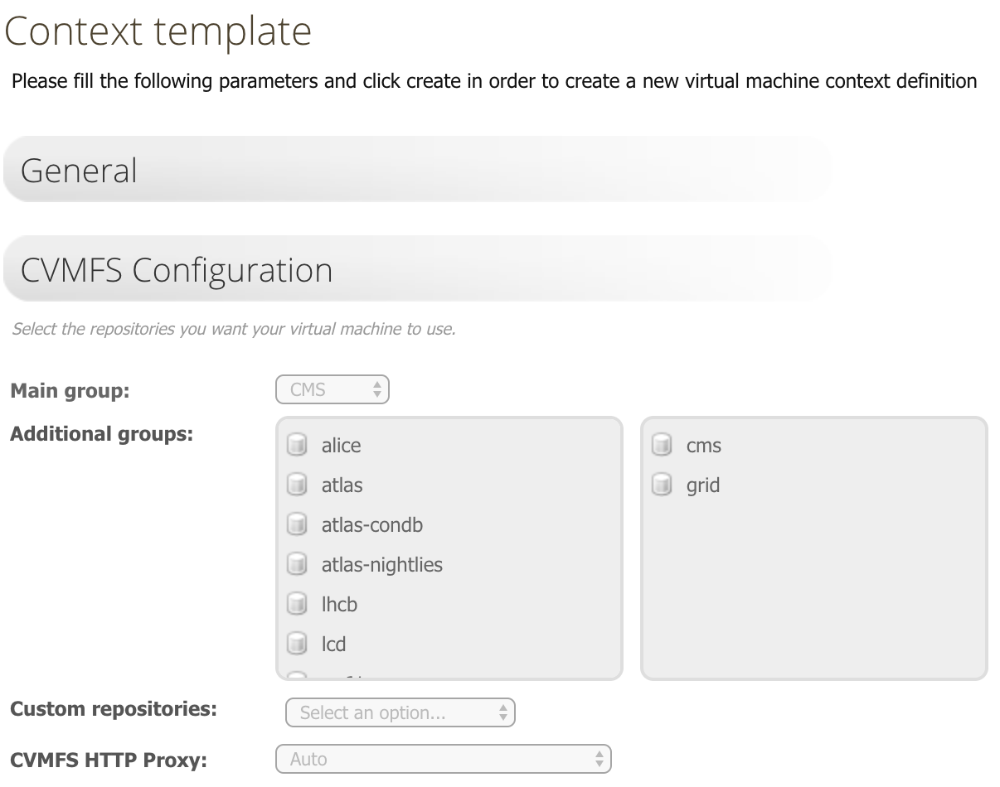

# Introduction

These pages document the [RooStats](https://twiki.cern.ch/twiki/bin/view/RooStats/WebHome) / [RooFit](https://root.cern.ch/roofit) - based software tools used for statistical analysis within the [Higgs PAG](HiggsWG) - **combine**.

Combine provides a command line interface to many different statistical techniques available inside RooFit/RooStats used widely inside CMS.

The package exists in GIT under [https://github.com/cms-analysis/HiggsAnalysis-CombinedLimit](https://github.com/cms-analysis/HiggsAnalysis-CombinedLimit)

For more information about GIT and its usage in CMS, see [http://cms-sw.github.io/cmssw/faq.html](http://cms-sw.github.io/cmssw/faq.html)

The code can be checked out from GIT and compiled on top of a CMSSW release that includes a recent RooFit/RooStats

# Setting up the environment and installation

The instructions below are for installation within a CMSSW environment

## For end users that don't need to commit or do any development

You can find the latest releases on github under [https://github.com/cms-analysis/HiggsAnalysis-CombinedLimit/releases](https://github.com/cms-analysis/HiggsAnalysis-CombinedLimit/releases)

### CC7 release `CMSSW_10_2_X` - recommended version

Setting up the environment (once):

```sh
export SCRAM_ARCH=slc7_amd64_gcc700
cmsrel CMSSW_10_2_13
cd CMSSW_10_2_13/src
cmsenv
git clone https://github.com/cms-analysis/HiggsAnalysis-CombinedLimit.git HiggsAnalysis/CombinedLimit
cd HiggsAnalysis/CombinedLimit
```
Update to a recommended tag - currently the recommended tag is **v8.2.0**: [see release notes](https://github.com/cms-analysis/HiggsAnalysis-CombinedLimit/releases/tag/v8.2.0)

```sh
cd $CMSSW_BASE/src/HiggsAnalysis/CombinedLimit
git fetch origin
git checkout v8.2.0
scramv1 b clean; scramv1 b # always make a clean build
```

### SLC6/CC7 release `CMSSW_8_1_X`

Setting up the environment (once):

```sh
# For CC7:
export SCRAM_ARCH=slc7_amd64_gcc530
# For SLC6:
export SCRAM_ARCH=slc6_amd64_gcc530

cmsrel CMSSW_8_1_0
cd CMSSW_8_1_0/src
cmsenv
git clone https://github.com/cms-analysis/HiggsAnalysis-CombinedLimit.git HiggsAnalysis/CombinedLimit
cd HiggsAnalysis/CombinedLimit
```
Update to a recommended tag - currently the recommended tag is **v7.0.13**:

```sh
cd $CMSSW_BASE/src/HiggsAnalysis/CombinedLimit
git fetch origin
git checkout v7.0.13
scramv1 b clean; scramv1 b # always make a clean build
```

## Standalone version 

The standalone version can be easily compiled using the \verb@cvmfs@ as it relies on dependencies which are already installed at [/cvmfs/cms.cern.ch/](/cvmfs/cms.cern.ch/). 

Access to `/cvmfs/cms.cern.ch/` can be obtained from lxplus machines or via `CernVM`, by adding the `CMS` group to the CVMFS Configuration. A minimal `CernVM` working context setup can be found in the CernVM Marketplace under `Experimental/HiggsCombine` or at [https://cernvm-online.cern.ch/context/view/9ee5960ce4b143f5829e72bbbb26d382](https://cernvm-online.cern.ch/context/view/9ee5960ce4b143f5829e72bbbb26d382). At least 2GB of disk space should be reserved on the virtual machine for Combine to work properly. In case you do not want to use the `cvmfs` area, you will need to adapt the location of the dependencies listed in both the `Makefile` and `env_standalone.sh` files.

```
git clone https://github.com/cms-analysis/HiggsAnalysis-CombinedLimit.git HiggsAnalysis/CombinedLimit
cd HiggsAnalysis/CombinedLimit/ 
git fetch origin
git checkout v8.1.0
. env_standalone.sh
make
```

You will need to source `env_standalone.sh` each time you want to use the package, or add it to your login.

## What has changed between tags? 

You can generate a diff of any two tags (eg for `v7.0.8` and `v7.0.6`) by using following the url:

[https://github.com/cms-analysis/HiggsAnalysis-CombinedLimit/compare/v7.0.6...v7.0.7](https://github.com/cms-analysis/HiggsAnalysis-CombinedLimit/compare/v7.0.6...v7.0.7)

Replace the tag names in the url to any tags you which to compare.

## For developers

We use the _Fork and Pull_ model for development: each user creates a copy of the repository on github, commits their requests there and then sends pull requests for the administrators to merge.

_Prerequisites_

1. Register on github, as needed anyway for CMSSW development: [http://cms-sw.github.io/cmssw/faq.html](http://cms-sw.github.io/cmssw/faq.html)

2. Register your SSH key on github: [https://help.github.com/articles/generating-ssh-keys](https://help.github.com/articles/generating-ssh-keys) 1 Fork the repository to create your copy of it: [https://github.com/cms-analysis/HiggsAnalysis-CombinedLimit/fork](https://github.com/cms-analysis/HiggsAnalysis-CombinedLimit/fork) (more documentation at [https://help.github.com/articles/fork-a-repo](https://help.github.com/articles/fork-a-repo) )

You will now be able to browse your fork of the repository from [https://github.com/your-github-user-name/HiggsAnalysis-CombinedLimit](https://github.com/your-github-user-name/HiggsAnalysis-CombinedLimit)

### Recommended way to develop a feature (in a branch)

```sh
# get the updates of the master branch of the remote repository
git fetch upstream

# branch straight off the upstream master
git checkout -b feature_name_branch upstream/81x-root606

# implement the feature
# commit, etc

# before publishing:
# get the updates of the master branch of the remote repository
git fetch upstream

# if you're ready to integrate the upstream changes into your repository do
git rebase upstream/81x-root606

# fix any conflicts
git push origin feature_name_branch
```

And proceed to make a pull request from the branch you created.

#### Committing changes to your repository

```sh
git add ....
git commit -m "...."
git push
```

You can now make a pull request to the repository.

## Combine Tool

An additional tool for submitting combine jobs to batch/crab, developed originally for HiggsToTauTau. Since the repository contains a certain amount of analysis-specific code, the following scripts can be used to clone it with a sparse checkout for just the core [`CombineHarvester/CombineTools`](https://github.com/cms-analysis/CombineHarvester/blob/master/CombineTools/) subpackage, speeding up the checkout and compile times:

git clone via ssh:

```sh
bash <(curl -s https://raw.githubusercontent.com/cms-analysis/CombineHarvester/master/CombineTools/scripts/sparse-checkout-ssh.sh)
```

git clone via https:

```sh
bash <(curl -s https://raw.githubusercontent.com/cms-analysis/CombineHarvester/master/CombineTools/scripts/sparse-checkout-https.sh)
```

make sure to run `scram`  to compile the `CombineTools` package.

See the [`CombineHarvester`](http://cms-analysis.github.io/CombineHarvester/) documentation pages for more details on using this tool and additional features available in the full package.

# Standalone version of combine

Combine is also released as a standalone package, still meant to be run on SLC7 machines. Please note that while the CMSSW version is maintained regularly, the same might not be true for the standalone version. For CMS members, we advise to use the CMSSW version when possible.

To compile the standalone version on suitable machines, please run:
```
git clone https://github.com/cms-analysis/HiggsAnalysis-CombinedLimit.git HiggsAnalysis/CombinedLimit
cd HiggsAnalysis/CombinedLimit/ 
git fetch origin
git checkout v8.2.0
. env_standalone.sh
make
```
You will need to source env_standalone.sh each time you want to use the package, or add it to your login. 

## Available machines for standalone combine

The standalone version can be easily compiled via _CVMFS_ as it relies on dependencies which are already installed at _/cvmfs/cms.cern.ch/_. Access to _/cvmfs/cms.cern.ch/_ can be obtained from lxplus machines or via [`CernVM`](https://cernvm-online.cern.ch/). The only requirement will be to add the _CMS_ group to the CVMFS configuration as shown in the picture



At least 2GB of disk space should be reserved on the virtual machine for combine to work properly. A minimal CernVM working context setup can be found in the CernVM Marketplace under [`Experimental/HiggsCombine`](https://cernvm-online.cern.ch/context/view/9ee5960ce4b143f5829e72bbbb26d382). 

To use this predefined context, first locally launch the CernVM (eg you can use the .ova with VirtualBox, by downloading from [here](http://cernvm.cern.ch/releases/production/cernvm4-micro-2020.07-1.ova) and launching the downloaded file. You can click on "pair an instance of CernVM" from the cernvm-online dashboard, which displays a PIN. In the VirtualBox terminal, pair the virtual machine with this PIN code (enter in the terminal using #PIN eg `#123456`. After this, you will be asked again for username (use `user`) and then a password (use `hcomb`).

In case you do not want to use the cvmfs area, you will need to adapt the location of the dependencies listed in both the Makefile and env_standalone.sh files.
