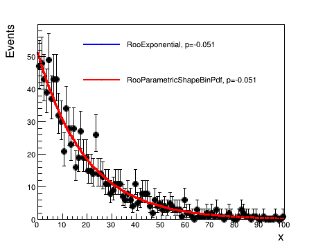

# Preparing the datacard

The input to combine, which defines the details of the experiment, is a datacard file is a plain ASCII file. This is true whether the experiment is a simple counting experiment or a shape analysis. 

## A simple counting experiment

The file [data/tutorials/counting/realistic-counting-experiment.txt](https://github.com/cms-analysis/HiggsAnalysis-CombinedLimit/blob/81x-root606/data/tutorials/counting/realistic-counting-experiment.txt) shows an example of a counting experiment.

The first lines can be used as a description and are not parsed by the program. They have to begin with a "\#":

    # Simple counting experiment, with one signal and a few background processes 
    # Simplified version of the 35/pb H->WW analysis for mH = 160 GeV

Then one declares the **number of observables**, **`imax`**, that are present in the model used to calculate limits/significances. The number of observables will typically be the number of channels in a counting experiment or the number of bins in a binned shape fit. (If one specifies for **`imax`** the value **`*`** it means "figure it out from the rest of the datacard", but in order to better catch mistakes it's recommended to specify it explicitly)

    imax 1  number of channels

Then one declares the number of background sources to be considered, **`jmax`**, and the number of **independent sources of systematic uncertainties**, **`kmax`**:

    jmax 3  number of backgrounds
    kmax 5  number of nuisance parameters (sources of systematic uncertainties)

In the example there is 1 channel, there are 3 background sources, and there are 5 independent sources of systematic uncertainty.

Then there are the lines describing what is actually observed: the number of events observed in each channel. The first line, starting with **`bin`** defines the label used for each channel. In the example we have 1 channel, labelled **`1`**, and in the following line, **`observation`**, are listed the events observed, **`0`** in this example:

    # we have just one channel, in which we observe 0 events
    bin bin1
    observation 0

Following is the part related to the number of events expected, for each bin and process, arranged in (\#channels)\*(\#processes) columns.

    bin          bin1     bin1     bin1     bin1
    process         ggH  qqWW  ggWW  others
    process          0     1     2     3
    rate           1.47  0.63  0.06  0.22

-   The **`bin`** line identifies the channel the column is referring to. It goes from **`1`** to the **`imax`** declared above.
-   The first **`process`** line contains the labels of the various sources
-   The second **`process`** line must have a positive number for backgrounds, and **`0`** or a negative number for the signals. You should use different process ids for different processes.
-   The last line, **`rate`**, tells the expected yield of events in the specified bin and process

All bins should be declared in increasing order, and within each bin one should include all processes in increasing order, specifying a **0** for processes that do not contribute.

The last section contains the description of the systematic uncertainties:

    lumi    lnN    1.11    -   1.11    -    lumi affects both signal and gg->WW (mc-driven). lnN = lognormal
    xs_ggH  lnN    1.16    -     -     -    gg->H cross section + signal efficiency + other minor ones.
    WW_norm gmN 4    -   0.16    -     -    WW estimate of 0.64 comes from sidebands: 4 events in sideband times 0.16 (=> ~50% statistical uncertainty)
    xs_ggWW lnN      -     -   1.50    -    50% uncertainty on gg->WW cross section
    bg_others lnN    -     -     -   1.30   30% uncertainty on the rest of the backgrounds

-   the first columns is a label identifying the uncertainty
-   the second column identifies the type of distribution used
    -   **`lnN`** stands for [Log-normal](http://en.wikipedia.org/wiki/Log-normal_distribution), which is the recommended choice for multiplicative corrections (efficiencies, cross sections, ...).
        If **Δx/x** is the relative uncertainty on the multiplicative correction, one should put **1+Δx/x** in the column corresponding to the process and channel. Asymetric log-normals are supported by providing **κ<sub>down</sub>/κ<sub>up</sub>** where **κ<sub>down</sub>** is the ratio of the the yield to the nominal value for a -1σ deviation of the nuisance and **κ<sub>up</sub>** is the ratio of the the yield to the nominal value for a +1σ deviation.
    -   **`gmN`** stands for [Gamma](http://en.wikipedia.org/wiki/Gamma_distribution), and is the recommended choice for the statistical uncertainty on a background coming from the number of events in a control region (or in a MC sample with limited statistics).
        If the control region or MC contains **N** events, and the extrapolation factor from the control region to the signal region is **α** then one shoud put **N** just after the **`gmN`** keyword, and then the value of **α** in the proper column. Also, the yield in the **`rate`** row should match with **Nα**
    -   **`lnU`** stands for log-uniform distribution. A value of **1+ε** in the column will imply that the yield of this background is allowed to float freely between **x(1+ε)** and **x/(1+ε)** (in particular, if ε is small, then this is approximately **(x-Δx,x+Δx)** with **ε=Δx/x** )
        This is normally useful when you want to set a large a-priori uncertainty on a given background and then rely on the correlation between channels to constrain it. Beware that while Gaussian-like uncertainties behave in a similar way under profiling and marginalization, uniform uncertainties do not, so the impact of the uncertainty on the result will depend on how the nuisances are treated.
-   then there are (\#channels)\*(\#processes) columns reporting the relative effect of the systematic uncertainty on the rate of each process in each channel. The columns are aligned with the ones in the previous lines declaring bins, processes and rates.

In the example, there are 5 uncertainties:

-   the first uncertainty affects the signal by 11%, and affects the **`ggWW`** process by 11%
-   the second uncertainty affects the signal by 16% leaving the backgrounds unaffected
-   the third line specifies that the **`qqWW`** background comes from a sideband with 4 observed events and an extrapolation factor of 0.16; the resulting uncertainty on the expected yield is $1/\sqrt{4+1}$ = 45%
-   the fourth uncertainty does not affect the signal, affects the **`ggWW`** background by 50%, leaving the other backgrounds unaffected
-   the last uncertainty does not affect the signal, affects by 30% the **`others`** backgrounds, leaving the rest of the backgrounds unaffected

## Shape analysis 

The datacard has to be supplemented with two extensions: 

   * A new block of lines defining how channels and processes are mapped into shapes 
   * The block for systematics that can contain also rows with shape uncertainties.

The expected shape can be parametric or not parametric. In the first case the parametric pdfs have to be given as input to the tool. In the latter case, for each channel, histograms have to be provided for the expected shape of each process. For what concerns data, they have to be provided as input to the tool as a histogram to perform a ***binned*** shape analysis and as a RooDataSet to perform an ***unbinned*** shape analysis.

>**[danger]**
>If using RooFit based inputs (RooDataHists/RooDataSets/RooAbsPdfs) then you should be careful to use *different* RooRealVars as the observable in each category being combined. It is possible to use the same RooRealVar if the observable has the same range (and binning if using binned data) in each category though in most cases it is simpler to avoid doing so. 

#### Rates for shape analysis

As with the counting experiment, the total nominal *rate* of a given process must be identified in the **rate** line of the datacard. However, there are special options for shape based analyses as follows 

   * A value of **-1** in the rate line indicates to combine to calculate the rate from the input TH1 (via TH1::Integral) or RooDataSet/RooDataHist (via RooAbsData::sumEntries)
   * For parametric shapes (RooAbsPdf), if a parameter is found in the input workspace with the name pdfname**\_norm** the rate will be multiplied by the value of that parameter. Note that since this parameter can be freely floating, the normalization of a shape can be made to freely float this way. This can also be achieved through the use of [`rateParams`](#rate-parameters)

### Binned shape analysis 

For each channel, histograms have to be provided for the observed shape and for the expected shape of each process.

-   Within each channel, all histograms must have the same binning.
-   The normalization of the data histogram must correspond to the number of observed events
-   The normalization of the expected histograms must match the expected yields

The combine tool can take as input histograms saved as TH1 or as RooAbsHist in a RooFit workspace (an example of how to create a RooFit workspace and save histograms is available in [github](https://github.com/cms-analysis/HiggsAnalysis-CombinedLimit/blob/81x-root606/data/benchmarks/shapes/make_simple_shapes.cxx)).

The block of lines defining the mapping (first block in the datacard) contains one or more rows in the form

-   **shapes *process* *channel* *file* *histogram* *[histogram_with_systematics]* **

In this line

-   ***process*** is any one the process names, or **\*** for all processes, or **data\_obs** for the observed data
-   ***channel*** is any one the process names, or **\*** for all channels
-   *file*, *histogram* and *histogram_with_systematics* identify the names of the files and of the histograms within the file, after doing some replacements (if any are found):
    -   **$PROCESS** is replaced with the process name (or "**data\_obs**" for the observed data)
    -   **$CHANNEL** is replaced with the channel name
    -   **$SYSTEMATIC** is replaced with the name of the systematic + (**Up, Down**)
    -   **$MASS** is replaced with the higgs mass value which is passed as option in the command line used to run the limit tool

In addition, user defined keywords can be included to be replaced. Any word in the datacard **$WORD** will be replaced by **VALUE** when including the option `--keyword-value WORD=VALUE`. The option can be repeated multiple times for multiple keywords.
  
#### Template shape uncertainties

Shape uncertainties can be taken into account by vertical interpolation of the histograms. The shapes are interpolated quadratically for shifts below 1σ and linearly beyond. The normalizations are interpolated linearly in log scale just like we do for log-normal uncertainties.

For each shape uncertainty and process/channel affected by it, two additional input shapes have to be provided, obtained shifting that parameter up and down by one standard deviation. When building the likelihood, each shape uncertainty is associated to a nuisance parameter taken from a unit gaussian distribution, which is used to interpolate or extrapolate using the specified histograms.

For each given source of shape uncertainty, in the part of the datacard containing shape uncertainties (last block), there must be a row

-   ** *name* *shape* *effect_for_each_process_and_channel* **

The effect can be "-" or 0 for no effect, 1 for normal effect, and possibly something different from 1 to test larger or smaller effects (in that case, the unit gaussian is scaled by that factor before using it as parameter for the interpolation)


The datacard in [data/tutorials/shapes/simple-shapes-TH1.txt](https://github.com/cms-analysis/HiggsAnalysis-CombinedLimit/blob/81x-root606/data/tutorials/shapes/simple-shapes-TH1.txt) is a clear example of how to include shapes in the datacard. In the first block the following line specifies the shape mapping:

    shapes * * simple-shapes-TH1.root $PROCESS $PROCESS_$SYSTEMATIC

The last block concerns the treatment of the systematics affecting shapes. In this part the two uncertainties effecting on the shape are listed.

    alpha  shape    -           1   uncertainty on background shape and normalization
    sigma  shape    0.5         -   uncertainty on signal resolution. Assume the histogram is a 2 sigma shift, 
    #                                so divide the unit gaussian by 2 before doing the interpolation

There are two options for the interpolation algorithm in the "shape" uncertainty. Putting **`shape`** will result in a quadratic interpolation (within +/-1 sigma) and a linear extrapolation (beyond +/-1 sigma) of the **fraction of events in each bin** - i.e the histograms are first normalised before interpolation. Putting **`shapeN`** while instead base the interpolation on the logs of the fraction in each bin. For _both_ **`shape`**  and **`shapeN`**, the total normalisation is interpolated using an asymmetric log-normal so that the effect of the systematic on both the shape and normalisation are accounted for. The following image shows a comparison of those two algorithms for this datacard.

 


In this case there are two processes, *signal* and *background*, and two uncertainties affecting background (*alpha*) and signal shape (*sigma*). Within the root file 2 histograms per systematic have to be provided, they are the shape obtained, for the specific process, shifting up and down the parameter associated to the uncertainty: `background_alphaUp` and `background_alphaDown`, `signal_sigmaUp` and `signal_sigmaDown`. 

This is the content of the root file [simple-shapes-TH1.root ](https://github.com/cms-analysis/HiggsAnalysis-CombinedLimit/blob/81x-root606/data/benchmarks/shapes/simple-shapes-TH1.root) associated to the datacard [data/tutorials/shapes/simple-shapes-TH1.txt](https://github.com/cms-analysis/HiggsAnalysis-CombinedLimit/blob/81x-root606/data/benchmarks/shapes/simple-shapes-TH1.txt):

    root [0] 
    Attaching file simple-shapes-TH1.root as _file0...
    root [1] _file0->ls()
    TFile**     simple-shapes-TH1.root  
     TFile*     simple-shapes-TH1.root  
      KEY: TH1F signal;1    Histogram of signal__x
      KEY: TH1F signal_sigmaUp;1    Histogram of signal__x
      KEY: TH1F signal_sigmaDown;1  Histogram of signal__x
      KEY: TH1F background;1    Histogram of background__x
      KEY: TH1F background_alphaUp;1    Histogram of background__x
      KEY: TH1F background_alphaDown;1  Histogram of background__x
      KEY: TH1F data_obs;1  Histogram of data_obs__x
      KEY: TH1F data_sig;1  Histogram of data_sig__x


For example, without shape uncertainties you could have just one row with
`shapes * * shapes.root $CHANNEL/$PROCESS`
Then for a simple example for two channels "e", "mu" with three processes "higgs", "zz", "top" you should create a rootfile that contains the following

| histogram     | meaning                                      |
|:--------------|:---------------------------------------------|
| `e/data_obs`  | observed data in electron channel            |
| `e/higgs`     | expected shape for higgs in electron channel |
| `e/zz`        | expected shape for ZZ in electron channel    |
| `e/top`       | expected shape for top in electron channel   |
| `mu/data_obs` | observed data in muon channel                |
| `mu/higgs`    | expected shape for higgs in muon channel     |
| `mu/zz`       | expected shape for ZZ in muon channel        |
| `mu/top`      | expected shape for top in muon channel       |

If you also have one uncertainty that affects the shape, e.g. jet energy scale, you should create shape histograms for the jet energy scale shifted up by one sigma, you could for example do one folder for each process and write a like like

`shapes * * shapes.root $CHANNEL/$PROCESS/nominal  $CHANNEL/$PROCESS/$SYSTEMATIC`

or just attach a postifx to the name of the histogram

`shapes * * shapes.root $CHANNEL/$PROCESS  $CHANNEL/$PROCESS_$SYSTEMATIC`

For a detailed example of a template based binned analysis see the [H→ττ 2014 DAS tutorial](https://twiki.cern.ch/twiki/bin/viewauth/CMS/SWGuideCMSDataAnalysisSchool2014HiggsCombPropertiesExercise#A_shape_analysis_using_templates)

### Unbinned or parametric shape analysis 

In some cases, it can be convenient to describe the expected signal and background shapes in terms of analytical functions rather than templates; a typical example are the searches where the signal is apparent as a narrow peak over a smooth continuum background. In this context, uncertainties affecting the shapes of the signal and backgrounds can be implemented naturally as uncertainties on the parameters of those analytical functions. It is also possible to adapt an agnostic approach in which the parameters of the background model are left freely floating in the fit to the data, i.e. only requiring the background to be well described by a smooth function.

Technically, this is implemented by means of the RooFit package, that allows writing generic probability density functions, and saving them into ROOT files. The pdfs can be either taken from RooFit's standard library of functions (e.g. Gaussians, polynomials, ...) or hand-coded in C++, and combined together to form even more complex shapes.

In the datacard using templates, the column after the file name would have been the name of the histogram. For the parametric analysis we need two names to identify the mapping, separated by a colon (**`:`**). 

   **shapes process channel shapes.root *workspace_name:pdf_name***

The first part identifies the name of the input [RooWorkspace](http://root.cern.ch/root/htmldoc/RooWorkspace.html) containing the pdf, and the second part the name of the [RooAbsPdf](http://root.cern.ch/root/htmldoc/RooAbsPdf.html) inside it (or, for the observed data, the [RooAbsData](http://root.cern.ch/root/htmldoc/RooAbsData.html)). There can be multiple input workspaces, just as there can be multiple input root files. You can use any of the usual RooFit pre-defined pdfs for your signal and background models. 

>**[danger]**
>If you are using RooAddPdfs in your model in which the coefficients are *not defined recursively*, combine will not interpret them properly. You can add the option `--X-rtd ADDNLL_RECURSIVE=0` to any combine command in order to recover the correct interpretation, however we recommend that you instead redefine your pdf so that the coefficients are recursive (as described on the [RooAddPdf documentation](https://root.cern.ch/doc/master/classRooAddPdf.html)) and keep the total normalisation (i.e extended term) as a separate object as in the case of the tutorial datacard. 

For example, take a look at the [data/tutorials/shapes/simple-shapes-parametric.txt](https://github.com/cms-analysis/HiggsAnalysis-CombinedLimit/blob/81x-root606/data/tutorials/shapes/simple-shapes-parametric.txt). We see the following line.

```
shapes * * simple-shapes-parametric_input.root w:$PROCESS
[...]
bin          1          1
process      sig 	bkg
```

which indicates that the input file `simple-shapes-parametric_input.root` should contain an input workspace (`w`) with pdfs named `sig` and `bkg` since these are the names of the two processes in the datacard. Additionally, we expect there to be a dataset named `data_obs`. If we look at the contents of the workspace inside `data/tutorials/shapes/simple-shapes-parametric_input.root`, this is indeed what we see...

```
root [1] w->Print()

RooWorkspace(w) w contents

variables
---------
(MH,bkg_norm,cc_a0,cc_a1,cc_a2,j,vogian_sigma,vogian_width)

p.d.f.s
-------
RooChebychev::bkg[ x=j coefList=(cc_a0,cc_a1,cc_a2) ] = 2.6243
RooVoigtian::sig[ x=j mean=MH width=vogian_width sigma=vogian_sigma ] = 0.000639771

datasets
--------
RooDataSet::data_obs(j)
```


In this datacard, the signal is parameterised in terms of the hypothesised mass (`MH`). Combine will use this variable, instead of creating its own, which will be interpreted as the value for `-m`. For this reason, we should add the option `-m 30` (or something else within the observable range) when running combine. You will also see there is a variable named `bkg_norm`. This is used to normalize the background rate (see the section on [Rate parameters](/part2/settinguptheanalysis#rate-parameters) below for details).


>**[warning]**
>Combine will not accept RooExtendedPdfs as an input. This is to alleviate a bug that lead to improper treatment of normalization when using multiple RooExtendedPdfs to describe a single process. You should instead use RooAbsPdfs and provide the rate as a separate object (see the [Rate parameters](/part2/settinguptheanalysis#rate-parameters) section).

The part of the datacard related to the systematics can include lines with the syntax

  - **name *param*  X Y**

These lines encode uncertainties on the parameters of the signal and background pdfs. The parameter is to be assigned a Gaussian uncertainty of **Y** around its mean value of **X**. One can change the mean value from 0 to 1 (or really any value, if one so chooses) if the parameter in question is multiplicative instead of additive. 

In the [data/tutorials/shapes/simple-shapes-parametric.txt](https://github.com/cms-analysis/HiggsAnalysis-CombinedLimit/blob/81x-root606/data/tutorials/shapes/simple-shapes-parametric.txt) datacard, there are lines for one such parametric uncertainty,

    sigma   param 1.0      0.1 

meaning there is a parameter already contained in the input workspace called **`sigma`** which should be *constrained* with a Gaussian centered at 1.0 with a width of 0.1. Note that, the exact interpretation (i.e all combine knows is that 1.0 should be the most likely value and 0.1 is its 1σ uncertainy) of these parameters is left to the user since the signal pdf is constructed externally by you. Asymmetric uncertainties are written as with `lnN` using the syntax **-1σ/+1σ** in the datacard. 

If one wants to specify a parameter that is freely floating across its given range, and not gaussian constrained, the following syntax is used:

 - **name *flatParam* **

Though this is *not strictly necessary* in frequentist methods using profiled likelihoods as combine will still profile these nuisances when performing fits (as is the case for the `simple-shapes-parametric.txt` datacard). 

>**[danger]** 
>All parameters which are floating or constant in the user's input workspaces will remain floating or constant. Combine will ***not*** modify those for you!

A full example of a parametric analysis can be found in this [H→γγ 2014 DAS tutorial](https://twiki.cern.ch/twiki/bin/viewauth/CMS/SWGuideCMSDataAnalysisSchool2014HiggsCombPropertiesExercise#A_parametric_shape_analysis_H)

#### Caveat on using parametric pdfs with binned datasets

Users should be aware of a feature that affects the use of parametric pdfs together with binned datasets.

RooFit uses the integral of the pdf, computed analytically (or numerically, but disregarding the binning), to normalize it, but then computes the expected event yield in each bin evaluating only the pdf at the bin center. This means that if the variation of the pdf is sizeable within the bin then there is a mismatch between the sum of the event yields per bin and the pdf normalization, and that can cause a bias in the fits (more properly, the bias is there if the contribution of the second derivative integrated on the bin size is not negligible, since for linear functions evaluating them at the bin center is correct). There are two reccomended ways to work around this ... 

**1. Use narrow bins** 

It is recommended to use bins that are significantly finer than the characteristic scale of the pdfs - which would anyway be the recommended thing even in the absence of this feature. Obviously, this caveat does not apply to analyses using templates (they're constant across each bin, so there's no bias), or using unbinned datasets.

**2. Use a RooParametricShapeBinPdf**

Another solution (currently implemented for 1-dimensional histograms only) is to use a custom pdf which performs the correct integrals internally as in [RooParametricShapeBinPdf](https://github.com/cms-analysis/HiggsAnalysis-CombinedLimit/blob/81x-root606/src/RooParametricShapeBinPdf.cc)

Note that this pdf class now allows parameters that are themselves **RooAbsReal** objects (i.e. functions of other variables). The integrals are handled internally by calling the underlying pdf’s `createIntegral()` method with named ranges created for each of the bins. This means that if the analytical integrals for the underlying pdf are available, they will be used.

The constructor for this class requires a **RooAbsReal** (eg any **RooAbsPdf**)along with a list of **RooRealVars** (the parameters, excluding the observable $x$),

```c++
RooParametricShapeBinPdf(const char *name, const char *title,  RooAbsReal& _pdf, RooAbsReal& _x, RooArgList& _pars, const TH1 &_shape )
```

Below is a comparison of a fit to a binned dataset containing 1000 events with one observable $x\varepsilon \left[0,100\right] $. The fit function is
a **RooExponential** of the form $e^{xp}$.




In the upper plot, the data are binned in 100 evenly spaced bins, while in the lower plot, there are 3 irregular bins. The blue lines show the result of the fit
when using the **RooExponential** directly while the red shows the result when wrapping the pdf inside a **RooParametricShapeBinPdf**. In the narrow binned case, the two
agree well while for wide bins, accounting for the integral over the bin yields a better fit.

You should note that using this class will result in slower fits so you should first decide if the added accuracy is enough to justify the reduced efficiency.

## Beyond simple datacards

Datacards can be extended in order to provide additional functionality and flexibility during runtime. These can also allow for the production of more complicated models and performing advanced computation of results beyond limits and significances. 

### Rate parameters

The overall rate "expected" of a particular process in a particular bin does not necessarily need to be a fixed quantity. Scale factors can be introduced to modify the rate directly in the datacards for **ANY** type of analysis. This can be achieved using the directive `rateParam` in the datacard with the following syntax,  

    name rateParam bin process initial_value [min,max]

The `[min,max]` argument is optional and if not included, combine  will remove the range of this parameter. This will produce a new parameter in the model (unless it already exists) which multiplies the rate of that particular **process** in the given **bin** by its value. 

You can attach the same `rateParam` to multiple processes/bins by either using a wild card (eg `*` will match everything, `QCD_*` will match everything starting with `QCD_` etc.) in the name of the bin and/or process or by repeating the `rateParam` line in the datacard for different bins/processes with the same name.  

>**[warning]**
> `rateParam` is not a shortcut to evaluate the post-fit yield of a process since **other nuisances can also change the normalisation**. E.g., finding that the `rateParam` best-fit value is 0.9 does not necessarily imply that the process yield is 0.9 times the initial one. The best is to evaluate the yield taking into account the values of all nuisance parameters using [`--saveNormalizations`](../part3/nonstandard#normalizations).


This parameter is by default, freely floating. It is possible to include a Gaussian constraint on any `rateParam` which is floating (i.e not a `formula` or spline) by adding a `param` nuisance line in the datacard with the same name.

In addition to rate modifiers which are freely floating, modifiers which are functions of other parameters can be included using the following syntax,

    name rateParam bin process formula args

where `args` is a comma separated list of the arguments for the string `formula`. You can include other nuisance parameters in the `formula`, including ones which are Gaussian constrained (i,e via the `param` directive.)
    
Below is an example datacard which uses the `rateParam` directive to implement an ABCD like method in combine. For a more realistic description of it's use for ABCD, see the single-lepton SUSY search implementation described [here](http://cms.cern.ch/iCMS/jsp/openfile.jsp?tp=draft&files=AN2015_207_v5.pdf)

<pre><code> 
imax 4  number of channels
jmax 0  number of processes -1
kmax *  number of nuisance parameters (sources of systematical uncertainties)
-------
bin                   B      C       D        A   
observation           50    100      500      10
-------                                         
bin                   B      C       D        A   
process               bkg    bkg     bkg      bkg 
process               1      1       1         1   
rate                  1      1       1         1   
-------                                         

alpha rateParam A bkg (@0*@1/@2) beta,gamma,delta
beta  rateParam B bkg 50
gamma rateParam C bkg 100 
delta rateParam D bkg 500 
</code></pre>

For more examples of using `rateParam` (eg for fitting process normalisations in control regions and signal regions simultaneously) see this [2016 CMS tutorial](https://indico.cern.ch/event/577649/contributions/2339440/attachments/1380196/2097805/beyond_simple_datacards.pdf)

Finally, any pre-existing RooAbsReal inside some rootfile with a workspace can be imported using the following 

    name rateParam bin process rootfile:workspacename

The name should correspond to the name of the object which is being picked up inside the RooWorkspace. A simple example using the SM XS and BR splines available in HiggsAnalysis/CombinedLimit can be found under [data/tutorials/rate_params/simple_sm_datacard.txt](https://github.com/cms-analysis/HiggsAnalysis-CombinedLimit/blob/81x-root606/data/tutorials/rate_params/simple_sm_datacard.txt)

After running `text2workspace.py` on your datacard, you can check the normalisation objects using the tool `test/printWorkspaceNormalisations.py`. See the example below for the [data/tutorials/shapes/simple-shapes-parametric.txt](https://github.com/cms-analysis/HiggsAnalysis-CombinedLimit/blob/81x-root606/data/tutorials/shapes/simple-shapes-parametric.txt) datacard.


```
  text2workspace.py data/tutorials/shapes/simple-shapes-parametric.txt
  python test/printWorkspaceNormalisations.py data/tutorials/shapes/simple-shapes-parametric.root
  ... 

  ---------------------------------------------------------------------------
  ---------------------------------------------------------------------------
  Channel - bin1
  ---------------------------------------------------------------------------
    Top-level normalisation for process bkg -> n_exp_final_binbin1_proc_bkg
    -------------------------------------------------------------------------
  RooProduct::n_exp_final_binbin1_proc_bkg[ n_exp_binbin1_proc_bkg * shapeBkg_bkg_bin1__norm ] = 521.163
   ... is a product, which contains  n_exp_binbin1_proc_bkg
  RooRealVar::n_exp_binbin1_proc_bkg = 1 C  L(-INF - +INF)
    -------------------------------------------------------------------------
    default value =  521.163204829
  ---------------------------------------------------------------------------
    Top-level normalisation for process sig -> n_exp_binbin1_proc_sig
    -------------------------------------------------------------------------
  Dumping ProcessNormalization n_exp_binbin1_proc_sig @ 0x464f700
	  nominal value: 1
	  log-normals (1):
		   kappa = 1.1, logKappa = 0.0953102, theta = lumi = 0
	  asymm log-normals (0):
	  other terms (1):
		   term r (class RooRealVar), value = 1

    -------------------------------------------------------------------------
    default value =  1.0
```

This tells us that the normalisation for the background process, named `n_exp_final_binbin1_proc_bkg` is a product of two objects `n_exp_binbin1_proc_bkg * shapeBkg_bkg_bin1__norm`. The first object is just from the **rate** line in the datacard (equal to 1) and the second is a floating parameter. For the signal, the normalisation is called `n_exp_binbin1_proc_sig` and is a `ProcessNormalization` object which contains the rate modifications due to the systematic uncertainties. You can see that it also has a "*nominal value*" which again is just from the value given in the **rate** line of the datacard (again=1).


    
#### Extra arguments
    
If a parameter is intended to be used and it is *not* a user defined `param` or `rateParam`, it can be picked up by first issuing an `extArgs` directive before this line in the datacard. The syntax for `extArgs` is 

    name extArg rootfile:workspacename

The string ":RecycleConflictNodes" can be added at the end of the final argument (i.e. rootfile:workspacename:RecycleConflictNodes) to apply the corresponding RooFit option when the object is imported into the workspace. It is also possible to simply add a RooRealVar using `extArg` for use in function `rateParams` with the following 

    name extArg init [min,max]

Note that the `[min,max]` argument is optional and if not included, the code will remove the range of this parameter. 

### Manipulation of Nuisance parameters

It can often be useful to modify datacards, or the runtime behavior, without having to modify individual systematics lines. This can be acheived through the following. 

#### Nuisance modifiers 

If a nuisance parameter needs to be renamed for certain processes/channels, it can be done so using a single `nuisance edit` directive at the end of a datacard 
    
    nuisance edit rename process channel oldname newname

This will have the effect that nuisance parameter effecting a given process/channel will be renamed, thereby de-correlating it from other processes/channels.  Use options `ifexists` to skip/avoid error if nuisance not found. Other edits are also supported as follows,

   * `nuisance edit add process channel name pdf value [options]`  -> add a new or add to a nuisance. If options is `addq`, value will be added in quadrature to this nuisance for this process/channel. If options is `overwrite`, the nuisance value will be replaced with this value  
   * `nuisance edit drop process channel name [options]`  -> remove this nuisance from the process/channel. Use options `ifexists` to skip/avoid error if nuisance not found.
   * `nuisance edit changepdf name newpdf` -> change the pdf type of a given nuisance to `newpdf`.
   * `nuisance edit split process channel oldname newname1 newname2 value1 value2` -> split a nuisance line into two separate nuisances called `newname1` and `newname2` with values `value1` and `value2`. Will produce two separate lines to that the original nuisance `oldname` becomes two uncorrelated nuisances. 
   * `nuisance edit freeze name [options]`  -> set nuisance to frozen by default. Can be over-ridden in `combine` command line using `--floatNuisances` option Use options `ifexists` to skip/avoid error if nuisance not found.
   * `nuisance edit merge process channel name1 name2` -> merge systematic `name2` into `name1` by adding their values in quadrature and removing `name2`. This only works if, for each process and channel included, they go in the same direction. For example, you can add 1.1 to 1.2, but not to 0.9.

Note that the wildcard (**\***) can be used for either/both of process and channel. 

The above edits support nuisances which are any of **`shape[N]`**, **`lnN`**, **`lnU`**, **`gmN`**, **`param`**, **`flatParam`**, **`rateParam`** or **`discrete`** types. 

#### Groups of nuisances 

Often it is desirable to freeze one or more nuisances to check the impact they have on limits, likelihood scans, significances etc. 

However, for large groups of nuisances (eg everything associated to theory) it is easier to define ***nuisance groups*** in the datacard. The following line in a datacard will, for example, produce a group of nuisances with the group name 
`theory` which contains two parameters, `QCDscale` and `pdf`.

    theory group = QCDscale pdf 

Multiple groups can be defined in this way. It is also possible to extend nuisance groups in datacards using **+=** in place of **=**.

These groups can be manipulated at runtime (eg for freezing all nuisances associated to a group at runtime, see [Running the tool](#running-the-tool)). You can find more info on groups of nuisances [here](https://github.com/cms-analysis/HiggsAnalysis-CombinedLimit/tree/81x-root606/data/tutorials/groups)

Note that when using the automatic addition of statistical uncertainties (autoMCStats), the corresponding nuisance parameters are created by `text2workspace.py` and so do not exist in the datacards. It is therefore not possible to add autoMCStats parameters to groups of nuisances in the way described above. However, `text2workspace.py` will automatically create a group labelled **`autoMCStats`** which contains all autoMCStats parameters.

This group is useful for freezing all parameters created by autoMCStats. For freezing subsets of the parameters, for example if the datacard contains two categories, **cat_label_1** and **cat_label_2**, to only freeze the autoMCStat parameters created for category **cat_label_1** the regular expression features can be used. In this example this can be achieved by using `--freezeParameters 'rgx{prop_bincat_label_1_bin.*}'`. 

### Combination of multiple datacards

If you have separate channels each with it's own datacard, it is possible to produce a combined datacard using the script **`combineCards.py`**

The syntax is simple: **`combineCards.py Name1=card1.txt Name2=card2.txt .... > card.txt`**
If the input datacards had just one bin each, then the output channels will be called `Name1`, `Name2`, and so on. Otherwise, a prefix `Name1_` ... `Name2_` will be added to the bin labels in each datacard. The supplied bin names `Name1`, `Name2`, etc. must themselves conform to valid C++/python identifier syntax.

>**[warning]**
>Systematics which have different names will be assumed to be uncorrelated, and the ones with the same name will be assumed 100% correlated. A systematic correlated across channels must have the same p.d.f. in all cards (i.e. always **`lnN`**, or all **`gmN`** with same `N`)

The `combineCards.py` script will complain if you are trying to combine a *shape* datacard with a *counting* datacard. You can however convert a *counting* datacard in an equivalent shape-based one by adding a line `shapes * * FAKE` in the datacard after the `imax`, `jmax` and `kmax` section. Alternatively, you can add the option `-S` in `combineCards.py` which will do this for you while making the combination. 

### Automatic production of datacards and workspaces 

For complicated analyses or cases in which multiple datacards are needed (e.g. optimisation studies), you can avoid writing these by hand. The object [Datacard](https://github.com/cms-analysis/HiggsAnalysis-CombinedLimit/blob/81x-root606/python/Datacard.py) defines the analysis and can be created as a python object. The template python script below will produce the same workspace as running `textToWorkspace.py` (see the section on [Physics Models](/part2/physicsmodels)) on the [realistic-counting-experiment.txt](https://github.com/cms-analysis/HiggsAnalysis-CombinedLimit/blob/81x-root606/data/tutorials/counting/realistic-counting-experiment.txt) datacard. 


```python
from HiggsAnalysis.CombinedLimit.DatacardParser import *
from HiggsAnalysis.CombinedLimit.ModelTools import *
from HiggsAnalysis.CombinedLimit.ShapeTools import *
from HiggsAnalysis.CombinedLimit.PhysicsModel import *

from sys import exit
from optparse import OptionParser
parser = OptionParser()
addDatacardParserOptions(parser)
options,args = parser.parse_args()
options.bin = True # make a binary workspace

DC = Datacard()
MB = None

############## Setup the datacard (must be filled in) ###########################

DC.bins = 	['bin1'] # <type 'list'>
DC.obs = 	{'bin1': 0.0} # <type 'dict'>
DC.processes = 	['ggH', 'qqWW', 'ggWW', 'others'] # <type 'list'>
DC.signals = 	['ggH'] # <type 'list'>
DC.isSignal = 	{'qqWW': False, 'ggWW': False, 'ggH': True, 'others': False} # <type 'dict'>
DC.keyline = 	[('bin1', 'ggH', True), ('bin1', 'qqWW', False), ('bin1', 'ggWW', False), ('bin1', 'others', False)] # <type 'list'>
DC.exp = 	{'bin1': {'qqWW': 0.63, 'ggWW': 0.06, 'ggH': 1.47, 'others': 0.22}} # <type 'dict'>
DC.systs = 	[('lumi', False, 'lnN', [], {'bin1': {'qqWW': 0.0, 'ggWW': 1.11, 'ggH': 1.11, 'others': 0.0}}), ('xs_ggH', False, 'lnN', [], {'bin1': {'qqWW': 0.0, 'ggWW': 0.0, 'ggH': 1.16, 'others': 0.0}}), ('WW_norm', False, 'gmN', [4], {'bin1': {'qqWW': 0.16, 'ggWW': 0.0, 'ggH': 0.0, 'others': 0.0}}), ('xs_ggWW', False, 'lnN', [], {'bin1': {'qqWW': 0.0, 'ggWW': 1.5, 'ggH': 0.0, 'others': 0.0}}), ('bg_others', False, 'lnN', [], {'bin1': {'qqWW': 0.0, 'ggWW': 0.0, 'ggH': 0.0, 'others': 1.3}})] # <type 'list'>
DC.shapeMap = 	{} # <type 'dict'>
DC.hasShapes = 	False # <type 'bool'>
DC.flatParamNuisances =  {} # <type 'dict'>
DC.rateParams =  {} # <type 'dict'>
DC.extArgs = 	{} # <type 'dict'>
DC.rateParamsOrder 	=  set([]) # <type 'set'>
DC.frozenNuisances 	=  set([]) # <type 'set'>
DC.systematicsShapeMap =  {} # <type 'dict'>
DC.nuisanceEditLines 	=  [] # <type 'list'>
DC.groups 	=  {} # <type 'dict'>
DC.discretes 	=  [] # <type 'list'>


###### User defined options #############################################

options.out 	 = "combine_workspace.root"  	# Output workspace name
options.fileName = "./" 			# Path to input ROOT files
options.verbose  = "1" 				# Verbosity

##########################################################################

if DC.hasShapes:
    MB = ShapeBuilder(DC, options)
else:
    MB = CountingModelBuilder(DC, options)

# Set physics models
MB.setPhysics(defaultModel)
MB.doModel()
```


Any existing datacard can be converted into such a template python script by using the `--dump-datacard` option in `text2workspace.py` in case a more complicated template is needed. 

>**[warning]** 
>The above is **not advised** for final results as this script is not easily combined with other analyses so should only be used for internal studies. 

For the automatic generation of datacards (which are combinable), you should instead use the [CombineHarvester](http://cms-analysis.github.io/CombineHarvester/) package which includes many features for producing complex datacards in a reliable, automated way.
 


 
  
   
    
      
