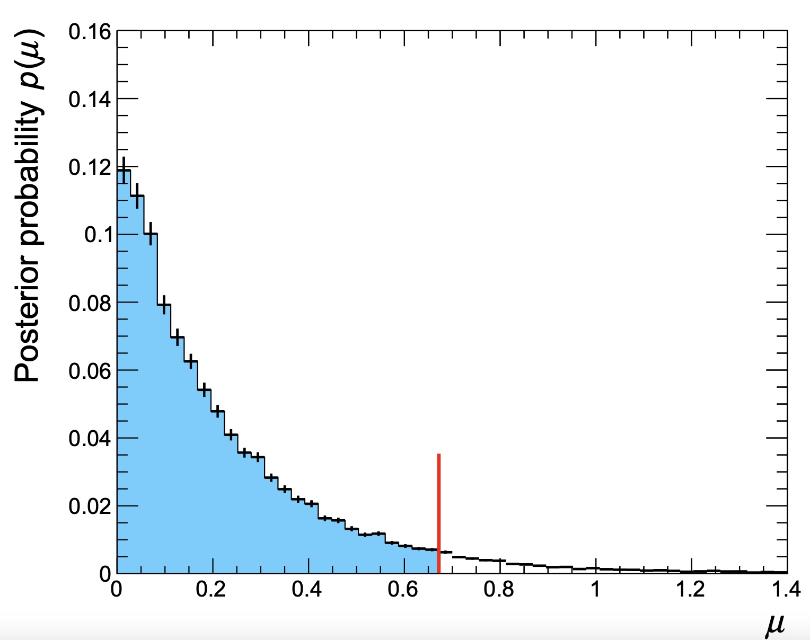

# Common Statistical Methods

In this section, the most commonly used statistical methods from combine will be covered including specific instructions on how to obtain limits, significances and likelihood scans. For all of these methods, the assumed parameters of interest (POI) is the overall signal strength **r** (i.e the default PhysicsModel). In general however, the first POI in the list of POIs (as defined by the PhysicsModel) will be taken instead of **r** which may or may not make sense for a given method ... use your judgment!

This section will assume that you are using the default model unless otherwise specified.

## Asymptotic Frequentist Limits

The `AsymptoticLimits` method allows to compute quickly an estimate of the observed and expected limits, which is fairly accurate when the event yields are not too small and the systematic uncertainties don't play a major role in the result.
The limit calculation relies on an asymptotic approximation of the distributions of the **LHC** test-statistic, which is based on a profile likelihood ratio, under signal and background hypotheses to compute two p-values $p_{\mu}, p_{b}$ and therefore $CL_s=p_{\mu}/(1-p_{b})$ (see the (see the [FAQ](/part4/usefullinks.html#faq) section for a description of these) - i.e it is the asymptotic approximation of computing limits with frequentist toys.

This method is so commonly used that it is the default method (i.e not specifying `-M` will run `AsymptoticLimits`)

A realistic example of datacard for a counting experiment can be found in the HiggsCombination package: [data/tutorials/counting/realistic-counting-experiment.txt](https://github.com/cms-analysis/HiggsAnalysis-CombinedLimit/blob/81x-root606/data/tutorials/counting/realistic-counting-experiment.txt)

The method can be run using

```sh
combine -M AsymptoticLimits realistic-counting-experiment.txt
```

The program will print out the limit on the signal strength r (number of signal events / number of expected signal events) e .g. `Observed Limit: r < 1.6297 @ 95% CL` , the median expected limit `Expected 50.0%: r < 2.3111` and edges of the 68% and 95% ranges for the expected limits.

```nohighlight
 <<< Combine >>>
>>> including systematics
>>> method used to compute upper limit is AsymptoticLimits
[...]
 -- AsymptoticLimits ( CLs ) --
Observed Limit: r < 1.6281
Expected  2.5%: r < 0.9640
Expected 16.0%: r < 1.4329
Expected 50.0%: r < 2.3281
Expected 84.0%: r < 3.9800
Expected 97.5%: r < 6.6194

Done in 0.01 min (cpu), 0.01 min (real)
```

By default, the limits are calculated using the CL<sub>s</sub> prescription, as noted in the output, which takes the ratio of p-values under the signal plus background and background only hypothesis. This can be altered to using the strict p-value by using the option `--rule CLsplusb` (note that `CLsplusb` is the jargon for calculating the p-value $p_{\mu}$). You can also change the confidence level (default is 95%) to 90% using the option `--cl 0.9` or any other confidence level. You can find the full list of options for `AsymptoticLimits` using `--help -M AsymptoticLimits`.


!!! warning
    You may find that combine issues a warning that the best fit for the background-only Asimov dataset returns a non-zero value for the signal strength for example;

    `WARNING: Best fit of asimov dataset is at r = 0.220944 (0.011047 times` `rMax), while it should be at zero`

    If this happens, you should check to make sure that there are no issues with the datacard or the Asimov generation used for your setup. For details on debugging it is recommended that you follow the simple checks used by the HIG PAG [here](https://twiki.cern.ch/twiki/bin/view/CMS/HiggsWG/HiggsPAGPreapprovalChecks).

The program will also create a rootfile `higgsCombineTest.AsymptoticLimits.mH120.root` containing a root tree `limit` that contains the limit values and other bookeeping information. The important columns are `limit` (the limit value) and `quantileExpected` (-1 for observed limit, 0.5 for median expected limit, 0.16/0.84 for the edges of the 65% interval band of expected limits, 0.025/0.975 for 95%).

```nohighlight
$ root -l higgsCombineTest.AsymptoticLimits.mH120.root
root [0] limit->Scan("*")
************************************************************************************************************************************
*    Row   *     limit *  limitErr *        mh *      syst *      iToy *     iSeed *  iChannel *     t_cpu *    t_real * quantileE *
************************************************************************************************************************************
*        0 * 0.9639892 *         0 *       120 *         1 *         0 *    123456 *         0 *         0 *         0 * 0.0250000 *
*        1 * 1.4329109 *         0 *       120 *         1 *         0 *    123456 *         0 *         0 *         0 * 0.1599999 *
*        2 *  2.328125 *         0 *       120 *         1 *         0 *    123456 *         0 *         0 *         0 *       0.5 *
*        3 * 3.9799661 *         0 *       120 *         1 *         0 *    123456 *         0 *         0 *         0 * 0.8399999 *
*        4 * 6.6194028 *         0 *       120 *         1 *         0 *    123456 *         0 *         0 *         0 * 0.9750000 *
*        5 * 1.6281188 * 0.0050568 *       120 *         1 *         0 *    123456 *         0 * 0.0035000 * 0.0055123 *        -1 *
************************************************************************************************************************************
```

### Blind limits

The `AsymptoticLimits` calculation follows the frequentist paradigm for calculating expected limits. This means that the routine will first fit the observed data, conditionally for a fixed value of **r** and set the nuisance parameters to the values obtained in the fit for generating the Asimov data, i.e it calculates the **post-fit** or **a-posteriori** expected limit. In order to use the **pre-fit** nuisance parameters (to calculate an **a-priori** limit), you must add the option `--noFitAsimov` or `--bypassFrequentistFit`.

For blinding the results completely (i.e not using the data) you can include the option `--run blind`.

!!! warning
    You should *never* use `-t -1` to get blind limits!


### Splitting points

In case your model is particularly complex, you can perform the asymptotic calculation by determining the value of CL<sub>s</sub> for a set grid of points (in `r`) and merging the results. This is done by using the option `--singlePoint X` for multiple values of X, hadding the output files and reading them back in,

```sh
combine -M AsymptoticLimits realistic-counting-experiment.txt --singlePoint 0.1 -n 0.1
combine -M AsymptoticLimits realistic-counting-experiment.txt --singlePoint 0.2 -n 0.2
combine -M AsymptoticLimits realistic-counting-experiment.txt --singlePoint 0.3 -n 0.3
...

hadd limits.root higgsCombine*.AsymptoticLimits.*

combine -M AsymptoticLimits realistic-counting-experiment.txt --getLimitFromGrid limits.root
```

## Asymptotic Significances

The significance of a result is calculated using a ratio of profiled likelihoods, one in which the signal strength is set to 0 and the other in which it is free to float, i.e the quantity is $-2\ln[\mathcal{L}(\textrm{data}|r=0,\hat{\theta}_{0})/\mathcal{L}(\textrm{data}|r=\hat{r},\hat{\theta})]$, in which the nuisance parameters are profiled separately for $r=\hat{r}$ and $r=0$.

The distribution of this test-statistic can be determined using Wilke's theorem provided the number of events is large enough (i.e in the *Asymptotic limit*). The significance (or p-value) can therefore be calculated very quickly and uses the `Significance` method.

It is also possible to calculate the ratio of likelihoods between the freely floating signal strength to that of a fixed signal strength *other than 0*, by specifying it with the option `--signalForSignificance=X`

!!! info
    This calculation assumes that the signal strength can only be positive (i.e we are not interested in negative signal strengths). This can be altered by including the option `--uncapped`

### Compute the observed significance

The observed significance is calculated using the `Significance` method, as

  `combine -M Significance datacard.txt`

The printed output will report the significance and the p-value, for example, when using the [realistic-counting-experiment.txt](https://github.com/cms-analysis/HiggsAnalysis-CombinedLimit/blob/81x-root606/data/tutorials/counting/realistic-counting-experiment.txt) datacard, you will see

```nohighlight
 <<< Combine >>>
>>> including systematics
>>> method used is Significance
[...]
 -- Significance --
Significance: 0
       (p-value = 0.5)
Done in 0.00 min (cpu), 0.01 min (real)
```

which is not surprising since 0 events were observed in that datacard.

The output root file will contain the significance value in the branch **limit**. To store the p-value instead, include the option `--pval`. These can be converted between one another using the RooFit functions `RooFit::PValueToSignificance` and `RooFit::SignificanceToPValue`.

You may find it useful to resort to a brute-force fitting algorithm when calculating the significance which scans the nll (repeating fits until a tolerance is reached), bypassing MINOS, which can be activated with the option `bruteForce`. This can be tuned using the options `setBruteForceAlgo`, `setBruteForceTypeAndAlgo` and `setBruteForceTolerance`.

### Computing the expected significance

The expected significance can be computed from an Asimov dataset of signal+background. There are two options for this

* a-posteriori expected: will depend on the observed dataset.
* a-priori expected (the default behavior): does not depend on the observed dataset, and so is a good metric for optimizing an analysis when still blinded.

The **a-priori** expected significance from the Asimov dataset is calculated as

```sh
combine -M Significance datacard.txt -t -1 --expectSignal=1
```

In order to produced the **a-posteriori** expected significance, just generate a post-fit Asimov (i.e add the option `--toysFreq` in the command above).

The output format is the same as for observed signifiances: the variable **limit** in the tree will be filled with the significance (or with the p-value if you put also the option `--pvalue`)


## Bayesian Limits and Credible regions

Bayesian calculation of limits requires the user to assume a particular prior distribution for the parameter of interest (default **r**). You can specify the prior using the `--prior` option, the default is a flat pior in **r**.

Since the Bayesian methods are much less frequently used, the tool will not build the default prior. For running the two methods below, you should include the option ``--noDefaultPrior=0``.

### Computing the observed bayesian limit (for simple models)

The `BayesianSimple` method computes a Bayesian limit performing classical numerical integration; very fast and accurate but only works for simple models (a few channels and nuisance parameters).

```nohighlight
combine -M BayesianSimple simple-counting-experiment.txt --noDefaultPrior=0
[...]

 -- BayesianSimple --
Limit: r < 0.672292 @ 95% CL
Done in 0.04 min (cpu), 0.05 min (real)
```

The output tree will contain a single entry corresponding to the observed 95% upper limit. The confidence level can be modified to **100*X%** using `--cl X`.

### Computing the observed bayesian limit (for arbitrary models)

The `MarkovChainMC` method computes a Bayesian limit performing a monte-carlo integration. From the statistics point of view it is identical to the `BayesianSimple` method, only the technical implementation is different. The method is slower, but can also handle complex models. For this method, you can increase the accuracy of the result by increasing the number of markov chains at the expense of a longer running time (option `--tries`, default is 10). Let's use the realistic counting experiment datacard to test the method

To use the MarkovChainMC method, users need to specify this method in the command line, together with the options they want to use. For instance, to set the number of times the algorithm will run with different random seeds, use option `--tries`:

```nohighlight
combine -M MarkovChainMC realistic-counting-experiment.txt --tries 100 --noDefaultPrior=0
[...]

 -- MarkovChainMC --
Limit: r < 2.20438 +/- 0.0144695 @ 95% CL (100 tries)
Average chain acceptance: 0.078118
Done in 0.14 min (cpu), 0.15 min (real)
```

Again, the resulting limit tree will contain the result. You can also save the chains using the option `--saveChain` which will then also be included in the output file.

Exclusion regions can be made from the posterior once an ordering principle is defined to decide how to grow the contour (there's infinite possible regions that contain 68% of the posterior pdf...)
Below is a simple example script which can be used to plot the posterior distribution from these chains and calculate the *smallest* such region,

```python
import ROOT

rmin = 0
rmax = 30
nbins = 100
CL = 0.95
chains = "higgsCombineTest.MarkovChainMC.blahblahblah.root"

def findSmallestInterval(hist,CL):
 bins = hist.GetNbinsX()
 best_i = 1
 best_j = 1
 bd = bins+1
 val = 0;
 for i in range(1,bins+1):
   integral = hist.GetBinContent(i)
   for j in range(i+1,bins+2):
    integral += hist.GetBinContent(j)
    if integral > CL :
      val = integral
      break
   if integral > CL and  j-i < bd :
     bd = j-i
     best_j = j+1
     best_i = i
     val = integral
 return hist.GetBinLowEdge(best_i), hist.GetBinLowEdge(best_j), val

fi_MCMC = ROOT.TFile.Open(chains)
# Sum up all of the chains (or we could take the average limit)
mychain=0
for k in fi_MCMC.Get("toys").GetListOfKeys():
    obj = k.ReadObj
    if mychain ==0:
        mychain = k.ReadObj().GetAsDataSet()
    else :
        mychain.append(k.ReadObj().GetAsDataSet())
hist = ROOT.TH1F("h_post",";r;posterior probability",nbins,rmin,rmax)
for i in range(mychain.numEntries()):
  mychain.get(i)
  hist.Fill(mychain.get(i).getRealValue("r"), mychain.weight())
hist.Scale(1./hist.Integral())
hist.SetLineColor(1)
vl,vu,trueCL = findSmallestInterval(hist,CL)
histCL = hist.Clone()
for b in range(nbins):
  if histCL.GetBinLowEdge(b+1) < vl or histCL.GetBinLowEdge(b+2)>vu: histCL.SetBinContent(b+1,0)
c6a = ROOT.TCanvas()
histCL.SetFillColor(ROOT.kAzure-3)
histCL.SetFillStyle(1001)
hist.Draw()
histCL.Draw("histFsame")
hist.Draw("histsame")
ll = ROOT.TLine(vl,0,vl,2*hist.GetBinContent(hist.FindBin(vl))); ll.SetLineColor(2); ll.SetLineWidth(2)
lu = ROOT.TLine(vu,0,vu,2*hist.GetBinContent(hist.FindBin(vu))); lu.SetLineColor(2); lu.SetLineWidth(2)
ll.Draw()
lu.Draw()

print " %g %% (%g %%) interval (target)  = %g < r < %g "%(trueCL,CL,vl,vu)
```

Running the script on the output file produced for the same datacard (including the `--saveChain` option) will produce the following output

	0.950975 % (0.95 %) interval (target)  = 0 < r < 2.2

along with a plot of the posterior shown below. This is the same as the output from combine but the script can also be used to find lower limits (for example) or credible intervals.



An example to make contours when ordering by probability density is in [bayesContours.cxx](https://github.com/cms-analysis/HiggsAnalysis-CombinedLimit/81x-root606/master/test/multiDim/bayesContours.cxx), but the implementation is very simplistic, with no clever handling of bin sizes nor any smoothing of statistical fluctuations.


The `MarkovChainMC` algorithm has many configurable parameters, and you're encouraged to experiment with those because the default configuration might not be the best for you (or might not even work for you at all)

##### Iterations, burn-in, tries

Three parameters control how the MCMC integration is performed:

-   the number of **tries** (option `--tries`): the algorithm will run multiple times with different ransom seeds and report as result the truncated mean and rms of the different results. The default value is 10, which should be ok for a quick computation, but for something more accurate you might want to increase this number even up to ~200.
-   the number of **iterations** (option `-i`) determines how many points are proposed to fill a single Markov Chain. The default value is 10k, and a plausible range is between 5k (for quick checks) and 20-30k for lengthy calculations. Usually beyond 30k you get a better tradeoff in time vs accuracy by increasing the number of chains (option `--tries`)
-   the number of **burn-in steps** (option `-b`) is the number of points that are removed from the beginning of the chain before using it to compute the limit. IThe default is 200. If your chain is very long, you might want to try increase this a bit (e.g. to some hundreds). Instead going below 50 is probably dangerous.

##### Proposals

The option `--proposal` controls the way new points are proposed to fill in the MC chain.

-   **uniform**: pick points at random. This works well if you have very few nuisance parameters (or none at all), but normally fails if you have many.
-   **gaus**: Use a product of independent gaussians one for each nuisance parameter; the sigma of the gaussian for each variable is 1/5 of the range of the variable (this can be controlled using the parameter `--propHelperWidthRangeDivisor`). This proposal appears to work well for a reasonable number of nuisances (up to ~15), provided that the range of the nuisance parameters is reasonable, like ±5σ. It does **not** work without systematics.
-   **ortho** (**default**): This proposalis similar to the multi-gaussian proposal but at every step only a single coordinate of the point is varied, so that the acceptance of the chain is high even for a large number of nuisances (i.e. more than 20).
-   **fit**: Run a fit and use the uncertainty matrix from HESSE to construct a proposal (or the one from MINOS if the option `--runMinos` is specified). This sometimes work fine, but sometimes gives biased results, so we don't recommend it in general.

If you believe there's something going wrong, e.g. if your chain remains stuck after accepting only a few events, the option `--debugProposal` can be used to have a printout of the first *N* proposed points to see what's going on (e.g. if you have some region of the phase space with probability zero, the **gaus** and **fit** proposal can get stuck there forever)


### Computing the expected bayesian limit

The expected limit is computed by generating many toy mc observations and compute the limit for each of them. This can be done passing the option `-t` . E.g. to run 100 toys with the `BayesianSimple` method, just do

    combine -M BayesianSimple datacard.txt -t 100 --noDefaultPrior=0

The program will print out the mean and median limit, and the 68% and 95% quantiles of the distributions of the limits. This time, the output root tree will contain **one entry per toy**.

For more heavy methods (eg the `MarkovChainMC`) you'll probably want to split this in multiple jobs. To do this, just run `combine` multiple times specifying a smaller number of toys (can be as low as `1`) each time using a different seed to initialize the random number generator (option `-s` if you set it to -1, the starting seed will be initialized randomly at the beginning of the job), then merge the resulting trees with `hadd` and look at the distribution in the merged file.

### Multidimensional bayesian credible regions

The `MarkovChainMC` method allows the user to produce the posterior pdf as a function of (in principle) any number of parameter of interest. In order to do so, you first need to create a workspace with more than one parameter, as explained in the [physics models](/part2/physicsmodels) section.

For example, lets use the toy datacard [test/multiDim/toy-hgg-125.txt](https://github.com/cms-analysis/HiggsAnalysis-CombinedLimit/blob/81x-root606/test/multiDim/toy-hgg-125.txt) (counting experiment which vaguely resembles the H→γγ analysis at 125 GeV) and convert the datacard into a workspace with 2 parameters, ggH and qqH cross sections using `text2workspace` with the option `-P HiggsAnalysis.CombinedLimit.PhysicsModel:floatingXSHiggs --PO modes=ggH,qqH`.

Now we just run one (or more) MCMC chain(s) and save them in the output tree.By default, the nuisance parameters will be marginalized (integrated) over their pdfs. You can ignore the complaints about not being able to compute an upper limit (since for more than 1D, this isn't well defined),

    combine -M MarkovChainMC workspace.root --tries 1 --saveChain -i 1000000 -m 125 -s seed --noDefaultPrior=0

The output of the markov chain is again a RooDataSet of weighted events distributed according to the posterior pdf (after you cut out the burn in part), so it can be used to make histograms or other distributions of the posterior pdf. See as an example [bayesPosterior2D.cxx](https://github.com/cms-analysis/HiggsAnalysis-CombinedLimit/blob/81x-root606/test/multiDim/bayesPosterior2D.cxx).

Below is an example of the output of the macro,

```c++
$ root -l higgsCombineTest.MarkovChainMC....
.L bayesPosterior2D.cxx
bayesPosterior2D("bayes2D","Posterior PDF")
```


## Computing Limits with toys

The `HybridNew` method is used to compute either the hybrid bayesian-frequentist limits popularly known as "CL<sub>s</sub> of LEP or Tevatron type" or the fully frequentist limits which are the current recommended method by the LHC Higgs Combination Group. Note that these methods can be resource intensive for complex models.

It is possible to define the criterion used for setting limits using `--rule CLs` (to use the CL<sub>s</sub> criterion) or `--rule CLsplusb` (to calculate the limit using $p_{\mu}$) and as always the confidence level desired using `--cl=X`

The choice of test-statistic can be made via the option `--testStat` and different methodologies for treatment of the nuisance parameters are available. While it is possible to mix different test-statistics with different nuisance parameter treatments, this is highly **not-reccomended**. Instead one should follow one of the following three procedures,

* **LEP-style**: `--testStat LEP --generateNuisances=1 --fitNuisances=0`
    * The test statistic is defined using the ratio of likelihoods $q_{\mathrm{LEP}}=-2\ln[\mathcal{L}(\mathrm{data}|r=0)/\mathcal{L}(\mathrm{data}|r)]$.
    * The nuisance parameters are fixed to their nominal values for the purpose of evaluating the likelihood, while for generating toys, the nuisance parameters are first randomized within their pdfs before generation of the toy.

* **TEV-style**: `--testStat TEV --generateNuisances=0 --generateExternalMeasurements=1 --fitNuisances=1`
    * The test statistic is defined using the ratio of likelihoods $ q_{\mathrm{TEV}}=-2\ln\[\mathcal{L}(\mathrm{data}|r=0,\hat{\theta}_{0})/\mathcal{L}(\mathrm{data}|r,\hat{\theta}_{r})\] $, in which the nuisance parameters are profiled separately for $r=0$ and $r$.
    * For the purposes of toy generation, the nuisance parameters are fixed to their post-fit values from the data (conditional on r), while the constraint terms are randomized for the evaluation of the likelihood.

* **LHC-style**: `--LHCmode LHC-limits`
, which is the shortcut for `--testStat LHC --generateNuisances=0 --generateExternalMeasurements=1 --fitNuisances=1`
    * The test statistic is defined using the ratio of likelihoods $q_{r} = -2\ln[\mathcal{L}(\mathrm{data}|r,\hat{\theta}_{r})/\mathcal{L}(\mathrm{data}|r=\hat{r},\hat{\theta}])$ , in which the nuisance parameters are profiled separately for $r=\hat{r}$ and $r$.
    * The value of $q_{r}$ set to 0 when $\hat{r}>r$ giving a one sided limit. Furthermore, the constraint $r>0$ is enforced in the fit. This means that if the unconstrained value of $\hat{r}$ would be negative, the test statistic $q_{r}$ is evaluated as $-2\ln[\mathcal{L}(\mathrm{data}|r,\hat{\theta}_{r})/\mathcal{L}(\mathrm{data}|r=0,\hat{\theta}_{0}])$
    * For the purposes of toy generation, the nuisance parameters are fixed to their **post-fit** values from the data (conditionally on the value of **r**), while the constraint terms are randomized in the evaluation of the likelihood.

!!! warning
    The recommended style is the **LHC-style**. Please note that this method is sensitive to the *observation in data* since the *post-fit* (after a fit to the data) values of the nuisance parameters (assuming different values of **r**) are used when generating the toys. For completely blind limits you can first generate a *pre-fit* asimov toy dataset (described in the [toy data generation](/part3/runningthetool#toy-data-generation) section) and use that in place of the data.

While the above shortcuts are the common variants, you can also try others. The treatment of the nuisances can be changed to the so-called "Hybrid-Bayesian" method which effectively integrates over the nuisance parameters. This can be achieved (with any test-statistic which is not profiled over the nuisances) by setting `--generateNuisances=1 --generateExternalMeasurements=0 --fitNuisances=0`.

!!! info
    Note that (observed and toy) values of the test statistic stored in the instances of `RooStats::HypoTestResult` when the option `--saveHybridResult` has been specified, are defined without the factor 2 and therefore are twice as small as the values given by the formulas above. This factor is however included automatically by all plotting script supplied within the Combine package.

### Simple models

For relatively simple models, the observed and expected limits can be calculated interactively. Since the **LHC-style** is the reccomended procedure for calculating limits using toys, we will use that in this section but the same applies to the other methods.

```sh
combine realistic-counting-experiment.txt -M HybridNew --LHCmode LHC-limits
```

<details>
<summary><b>Show output</b></summary>

<pre><code> <<< Combine >>>
>>> including systematics
>>> using the Profile Likelihood test statistics modified for upper limits (Q_LHC)
>>> method used is HybridNew
>>> random number generator seed is 123456
Computing results starting from observation (a-posteriori)
Search for upper limit to the limit
  r = 20 +/- 0
	CLs = 0 +/- 0
	CLs      = 0 +/- 0
	CLb      = 0.264 +/- 0.0394263
	CLsplusb = 0 +/- 0

Search for lower limit to the limit
Now doing proper bracketing & bisection
  r = 10 +/- 10
	CLs = 0 +/- 0
	CLs      = 0 +/- 0
	CLb      = 0.288 +/- 0.0405024
	CLsplusb = 0 +/- 0

  r = 5 +/- 5
	CLs = 0 +/- 0
	CLs      = 0 +/- 0
	CLb      = 0.152 +/- 0.0321118
	CLsplusb = 0 +/- 0

  r = 2.5 +/- 2.5
	CLs = 0.0192308 +/- 0.0139799
	CLs = 0.02008 +/- 0.0103371
	CLs = 0.0271712 +/- 0.00999051
	CLs = 0.0239524 +/- 0.00783634
	CLs      = 0.0239524 +/- 0.00783634
	CLb      = 0.208748 +/- 0.0181211
	CLsplusb = 0.005 +/- 0.00157718

  r = 2.00696 +/- 1.25
	CLs = 0.0740741 +/- 0.0288829
	CLs = 0.0730182 +/- 0.0200897
	CLs = 0.0694474 +/- 0.0166468
	CLs = 0.0640182 +/- 0.0131693
	CLs = 0.0595 +/- 0.010864
	CLs = 0.0650862 +/- 0.0105575
	CLs = 0.0629286 +/- 0.00966301
	CLs = 0.0634945 +/- 0.00914091
	CLs = 0.060914 +/- 0.00852667
	CLs = 0.06295 +/- 0.00830083
	CLs = 0.0612758 +/- 0.00778181
	CLs = 0.0608142 +/- 0.00747001
	CLs = 0.0587169 +/- 0.00697039
	CLs = 0.0591432 +/- 0.00678587
	CLs = 0.0599683 +/- 0.00666966
	CLs = 0.0574868 +/- 0.00630809
	CLs = 0.0571451 +/- 0.00608177
	CLs = 0.0553836 +/- 0.00585531
	CLs = 0.0531612 +/- 0.0055234
	CLs = 0.0516837 +/- 0.0052607
	CLs = 0.0496776 +/- 0.00499783
	CLs      = 0.0496776 +/- 0.00499783
	CLb      = 0.216635 +/- 0.00801002
	CLsplusb = 0.0107619 +/- 0.00100693

Trying to move the interval edges closer
  r = 1.00348 +/- 0
	CLs = 0.191176 +/- 0.0459911
	CLs      = 0.191176 +/- 0.0459911
	CLb      = 0.272 +/- 0.0398011
	CLsplusb = 0.052 +/- 0.00992935

  r = 1.50522 +/- 0
	CLs = 0.125 +/- 0.0444346
	CLs = 0.09538 +/- 0.0248075
	CLs = 0.107714 +/- 0.0226712
	CLs = 0.103711 +/- 0.018789
	CLs = 0.0845069 +/- 0.0142341
	CLs = 0.0828468 +/- 0.0126789
	CLs = 0.0879647 +/- 0.0122332
	CLs      = 0.0879647 +/- 0.0122332
	CLb      = 0.211124 +/- 0.0137494
	CLsplusb = 0.0185714 +/- 0.00228201

  r = 1.75609 +/- 0
	CLs = 0.0703125 +/- 0.0255807
	CLs = 0.0595593 +/- 0.0171995
	CLs = 0.0555271 +/- 0.0137075
	CLs = 0.0548727 +/- 0.0120557
	CLs = 0.0527832 +/- 0.0103348
	CLs = 0.0555828 +/- 0.00998248
	CLs = 0.0567971 +/- 0.00923449
	CLs = 0.0581822 +/- 0.00871417
	CLs = 0.0588835 +/- 0.00836245
	CLs = 0.0594035 +/- 0.00784761
	CLs = 0.0590583 +/- 0.00752672
	CLs = 0.0552067 +/- 0.00695542
	CLs = 0.0560446 +/- 0.00679746
	CLs = 0.0548083 +/- 0.0064351
	CLs = 0.0566998 +/- 0.00627124
	CLs = 0.0561576 +/- 0.00601888
	CLs = 0.0551643 +/- 0.00576338
	CLs = 0.0583584 +/- 0.00582854
	CLs = 0.0585691 +/- 0.0057078
	CLs = 0.0599114 +/- 0.00564585
	CLs = 0.061987 +/- 0.00566905
	CLs = 0.061836 +/- 0.00549856
	CLs = 0.0616849 +/- 0.0053773
	CLs = 0.0605352 +/- 0.00516844
	CLs = 0.0602028 +/- 0.00502875
	CLs = 0.058667 +/- 0.00486263
	CLs      = 0.058667 +/- 0.00486263
	CLb      = 0.222901 +/- 0.00727258
	CLsplusb = 0.0130769 +/- 0.000996375

  r = 2.25348 +/- 0
	CLs = 0.0192308 +/- 0.0139799
	CLs = 0.0173103 +/- 0.00886481
	CLs      = 0.0173103 +/- 0.00886481
	CLb      = 0.231076 +/- 0.0266062
	CLsplusb = 0.004 +/- 0.001996

  r = 2.13022 +/- 0
	CLs = 0.0441176 +/- 0.0190309
	CLs = 0.0557778 +/- 0.01736
	CLs = 0.0496461 +/- 0.0132776
	CLs = 0.0479048 +/- 0.0114407
	CLs = 0.0419333 +/- 0.00925719
	CLs = 0.0367934 +/- 0.0077345
	CLs = 0.0339814 +/- 0.00684844
	CLs = 0.03438 +/- 0.0064704
	CLs = 0.0337633 +/- 0.00597315
	CLs = 0.0321262 +/- 0.00551608
	CLs      = 0.0321262 +/- 0.00551608
	CLb      = 0.230342 +/- 0.0118665
	CLsplusb = 0.0074 +/- 0.00121204

  r = 2.06859 +/- 0
	CLs = 0.0357143 +/- 0.0217521
	CLs = 0.0381957 +/- 0.0152597
	CLs = 0.0368622 +/- 0.0117105
	CLs = 0.0415097 +/- 0.0106676
	CLs = 0.0442816 +/- 0.0100457
	CLs = 0.0376644 +/- 0.00847235
	CLs = 0.0395133 +/- 0.0080427
	CLs = 0.0377625 +/- 0.00727262
	CLs = 0.0364415 +/- 0.00667827
	CLs = 0.0368015 +/- 0.00628517
	CLs = 0.0357251 +/- 0.00586442
	CLs = 0.0341604 +/- 0.00546373
	CLs = 0.0361935 +/- 0.00549648
	CLs = 0.0403254 +/- 0.00565172
	CLs = 0.0408613 +/- 0.00554124
	CLs = 0.0416682 +/- 0.00539651
	CLs = 0.0432645 +/- 0.00538062
	CLs = 0.0435229 +/- 0.00516945
	CLs = 0.0427647 +/- 0.00501322
	CLs = 0.0414894 +/- 0.00479711
	CLs      = 0.0414894 +/- 0.00479711
	CLb      = 0.202461 +/- 0.00800632
	CLsplusb = 0.0084 +/- 0.000912658


 -- HybridNew, before fit --
Limit: r < 2.00696 +/- 1.25 [1.50522, 2.13022]
Warning in <ROOT::Math::FitConfig::CreateMinimizer>: Could not create the Migrad minimizer. Try using the minimizer Minuit
Fit to 5 points: 1.91034 +/- 0.0388334

 -- Hybrid New --
Limit: r < 1.91034 +/- 0.0388334 @ 95% CL
Done in 0.01 min (cpu), 4.09 min (real)
Failed to delete temporary file roostats-Sprxsw.root: No such file or directory</pre></code>
</details>

The result stored in the **limit** branch of the output tree will be the upper limit (and its error stored in **limitErr**). The default behavior will be, as above, to search for the upper limit on **r** however, the values of $p_{\mu}, p_{b}$ and CL<sub>s</sub> can be calculated for a particular value **r=X** by specifying the option `--singlePoint=X`. In this case, the value stored in the branch **limit** will be the value of CL<sub>s</sub> (or $p_{\mu}$) (see the [FAQ](/part4/usefullinks.html#faq) section). 

#### Expected Limits

For the simple models, we can just run interactively 5 times to compute the median expected and the 68% and 95% interval boundaries. Use the `HybridNew` method with the same options as per the observed limit but adding a `--expectedFromGrid=<quantile>` where the quantile is 0.5 for the median, 0.84 for the +ve side of the 68% band, 0.16 for the -ve side of the 68% band, 0.975 for the +ve side of the 95% band, 0.025 for the -ve side of the 95% band.

The output file will contain the value of the quantile in the branch **quantileExpected** which can be used to separate the points.


#### Accuracy

The search for the limit is performed using an adaptive algorithm, terminating when the estimate of the limit value is below some limit or when the precision cannot be futher improved with the specified options. The options controlling this behaviour are:

-   `rAbsAcc`, `rRelAcc`: define the accuracy on the limit at which the search stops. The default values are 0.1 and 0.05 respectively, meaning that the search is stopped when Δr < 0.1 or Δr/r < 0.05.
-   `clsAcc`: this determines the absolute accuracy up to which the CLs values are computed when searching for the limit. The default is 0.5%. Raising the accuracy above this value will increase significantly the time to run the algorithm, as you need N<sup>2</sup> more toys to improve the accuracy by a factor N, you can consider enlarging this value if you're computing limits with a larger CL (e.g. 90% or 68%). Note that if you're using the `CLsplusb` rule then this parameter will control the uncertainty on $p_{\mu}$ rather than CL<sub>s</sub>.
-   `T` or `toysH`: controls the minimum number of toys that are generated for each point. The default value of 500 should be ok when computing the limit with 90-95% CL. You can decrease this number if you're computing limits at 68% CL, or increase it if you're using 99% CL.

Note, to further improve the accuracy when searching for the upper limit, combine will also fit an exponential function to several of the points and interpolate to find the crossing.

### Complex models

For complicated models, it is best to produce a *grid* of test statistic distributions at various values of the signal strength, and use it to compute the observed and expected limit and bands. This approach is good for complex models since the grid of points can be distributed across any number of jobs. In this approach we will store the distributions of the test-statistic at different values of the signal strength using the option `--saveHybridResult`. The distribution at a single value of **r=X** can be determined by

```sh
combine datacard.txt -M HybridNew --LHCmode LHC-limits --singlePoint X --saveToys --saveHybridResult -T 500 --clsAcc 0
```

!!! warning
    We have specified the accuracy here by including `clsAcc=0` which turns off adaptive sampling and specifying the number of toys to be 500 with the `-T N` option. For complex models, it may be necessary to split the toys internally over a number of instances of `HybridNew` using the option `--iterations I`. The **total** number of toys will be the product **I*N**.

The above can be repeated several times, in parallel, to build the distribution of the test-statistic (giving the random seed option `-s -1`). Once all of the distributions are finished, the resulting output files can be merged into one using **hadd** and read back to calculate the limit, specifying the merged file with `--grid=merged.root`.

The observed limit can be obtained with

```sh
combine datacard.txt -M HybridNew --LHCmode LHC-limits --readHybridResults --grid=merged.root
```

and similarly, the median expected and quantiles can be determined using

```sh
combine datacard.txt -M HybridNew --LHCmode LHC-limits --readHybridResults --grid=merged.root --quantileExpected <quantile>
```

substituting `<quantile>` with 0.5 for the median, 0.84 for the +ve side of the 68% band, 0.16 for the -ve side of the 68% band, 0.975 for the +ve side of the 95% band, 0.025 for the -ve side of the 95% band.

The splitting of the jobs can be left to the user's preference. However, users may wish to use the **combineTool** for automating this as described in the section on [combineTool for job submission](#)


#### Plotting

A plot of the CL<sub>s</sub> (or $p_{\mu}$) as a function of **r**, which is used to find the crossing, can be produced using the option `--plot=limit_scan.png`. This can be useful for judging if the grid was sufficient in determining the upper limit.

If we use our [realistic-counting-experiment.txt](https://github.com/cms-analysis/HiggsAnalysis-CombinedLimit/blob/81x-root606/data/tutorials/counting/realistic-counting-experiment.txt) datacard and generate a grid of points $r\varepsilon[1.4,2.2]$ in steps of 0.1, with 5000 toys for each point, the plot of the observed CL<sub>s</sub> vs **r** should look like the following,


You should judge in each case if the limit is accurate given the spacing of the points and the precision of CL<sub>s</sub> at each point. If it is not sufficient, simply generate more points closer to the limit and/or more toys at each point.

The distributions of the test-statistic can also be plotted, at each value in the grid, using the simple python tool,

```sh
python test/plotTestStatCLs.py --input mygrid.root --poi r --val all --mass MASS
```

The resulting output file will contain a canvas showing the distribution of the test statistic background only and signal+background hypothesis at each value of **r**.

!!! info
    If you used the TEV or LEP style test statistic (using the commands as described above), then you should include the option `--doublesided`, which will also take care of defining the correct integrals for $p_{\mu}$ and $p_{b}$.

## Computing Significances with toys

Computation of expected significance with toys is a two step procedure: first you need to run one or more jobs to construct the expected distribution of the test statistic. As with setting limits, there are a number of different configurations for generating toys but we will use the preferred option using,

* **LHC-style**: `--LHCmode LHC-significance`
, which is the shortcut for `--testStat LHC --generateNuisances=0 --generateExternalMeasurements=1 --fitNuisances=1 --significance`
    * The test statistic is defined using the ratio of likelihoods $q_{0} = -2\ln[\mathcal{L}(\textrm{data}|r=0,\hat{\theta}_{0})/\mathcal{L}(\textrm{data}|r=\hat{r},\hat{\theta})]$, in which the nuisance parameters are profiled separately for $r=\hat{r}$ and $r=0$.
    * The value of the test statistic is set to 0 when $\hat{r}<0$
    * For the purposes of toy generation, the nuisance parameters are fixed to their post-fit values from the data assuming **no** signal, while the constraint terms are randomized for the evaluation of the likelihood.

### Observed significance

To construct the distribution of the test statistic run as many times as necessary,

```sh
combine -M HybridNew datacard.txt --LHCmode LHC-significance  --saveToys --fullBToys --saveHybridResult -T toys -i iterations -s seed
```

with different seeds, or using `-s -1` for random seeds, then merge all those results into a single root file with `hadd`.

The *observed* significance can be calculated as

```sh
combine -M HybridNew datacard.txt --LHCmode LHC-significance --readHybridResult --grid=input.root [--pvalue ]
```

where the option `--pvalue` will replace the result stored in the **limit** branch output tree to be the p-value instead of the signficance.

### Expected significance, assuming some signal

The *expected* significance, assuming a signal with **r=X** can be calculated, by including the option `--expectSignal X` when generating the distribution of the test statistic and using the option `--expectedFromGrid=0.5` when calculating the significance for the median. To get the ±1σ bands, use 0.16 and 0.84 instead of 0.5, and so on...

You need a total number of background toys large enough to compute the value of the significance, but you need less signal toys (especially if you only need the median). For large significance, you can then run most of the toys without the `--fullBToys` option (about a factor 2 faster), and only a smaller part with that option turned on.

As with calculating limits with toys, these jobs can be submitted to the grid or batch systems with the help of the `combineTool` as described in the section on [combineTool for job submission](#)


## Goodness of fit tests

The `GoodnessOfFit` method can be used to evaluate how compatible the observed data are with the model pdf.

The module can be run specifying an algorithm, and will compute a goodness of fit indicator for that algorithm and the data. The procedure is therefore to first run on the real data

```sh
combine -M GoodnessOfFit datacard.txt --algo=<some-algo>
```

and then to run on many toy mc datasets to determine the distribution of the goodness of fit indicator

```sh
combine -M GoodnessOfFit datacard.txt --algo=<some-algo> -t <number-of-toys> -s <seed>
```

When computing the goodness of fit, by default the signal strength is left floating in the fit, so that the measure is independent from the presence or absence of a signal. It is possible to instead keep it fixed to some value by passing the option `--fixedSignalStrength=<value>`.

The following algorithms are supported:

- **saturated**: Compute a goodness-of-fit measure for binned fits based on the *saturated model* method, as prescribed by the StatisticsCommittee [(note)](http://www.physics.ucla.edu/~cousins/stats/cousins_saturated.pdf). This quantity is similar to a chi-square, but can be computed for an arbitrary combination of binned channels with arbitrary constraints.

- **KS**: Compute a goodness-of-fit measure for binned fits using the *Kolmogorov-Smirnov* test. It is based on the highest difference between the cumulative distribution function and the empirical distribution function of any bin.

- **AD**: Compute a goodness-of-fit measure for binned fits using the *Anderson-Darling* test. It is based on the integral of the difference between the cumulative distribution function and the empirical distribution function over all bins. It also gives the tail ends of the distribution a higher weighting.

The output tree will contain a branch called **`limit`** which contains the value of the test-statistic in each toy. You can make a histogram of this test-statistic $t$ and from this distribution ($f(t)$) and the single value obtained in the data ($t_{0}$) you can calculate the p-value $$p = \int_{t=t_{0}}^{\mathrm{+inf}} f(t) dt $$.

When generating toys, the default behavior will be used. See the section on [toy generation](#toy-generation) for options on how to generate/fit nuisance parameters in these tests. It is recomended to use the *frequentist toys* (`--toysFreq`) when running the **saturated** model, and the default toys for the other two tests.

Further goodness of fit methods could be added on request, especially if volunteers are available to code them.
The output limit tree will contain the value of the test-statistic in each toy (or the data)

!!! warning
    The above algorithms are all concerned with *one-sample* tests. For *two-sample* tests, you can follow an example CMS HIN analysis described [in this Twiki](https://twiki.cern.ch/twiki/bin/viewauth/CMS/HiggsCombineTwoDatasetCompatibility)

### Masking analysis regions in the saturated model

For searches that employs a simultaneous fit across signal and control regions, it may be useful to mask one or more analysis regions either when the likelihood is maximized (fit) or when the test-statistic is computed. This can be done by using the options `--setParametersForFit` and `--setParametersForEval`, respectively. A realistic example for a binned shape analysis performed in one signal region and two control samples can be found in this directory of the Higgs-combine package [Datacards-shape-analysis-multiple-regions](https://github.com/cms-analysis/HiggsAnalysis-CombinedLimit/tree/81x-root606/data/tutorials/rate_params).

First of all, one needs to combine the individual datacards to build a single model and to introduce the channel-masking variables as follow:

```sh
combineCards.py signal_region.txt dimuon_control_region.txt singlemuon_control_region.txt > combined_card.txt
text2workspace.py combined_card.txt --channel-masks
```

More information about the channel-masking can be found in this
section [Channel Masking](#). The saturated test-static value for a simultaneous fit across all the analysis regions can be calculated as:

```sh
combine -M GoodnessOfFit -d combined_card.root --algo=saturated -n _result_sb
```

In this case, signal and control regions are included in both the fit and in the evaluation of the test-static, and the signal strength is freely floating. This measures the compatibility between the signal+background fit and the observed data. Moreover, it can be interesting to assess the level of compatibility between the observed data in all the regions and the background prediction obtained by only fitting the control regions (CR-only fit). This is computed as follow:

```sh
combine -M GoodnessOfFit -d combined_card.root --algo=saturated -n _result_bonly_CRonly --setParametersForFit mask_ch1=1 --setParametersForEval mask_ch1=0 --freezeParameters r --setParameters r=0
```

where the signal strength is frozen and the signal region is not considered in the fit (`--setParametersForFit mask_ch1=1`), but it is included in the test-statistic computation (`--setParametersForEval mask_ch1=0`). To show the differences between the two models being tested, one can perform a fit to the data using the FitDiagnostics method as:

```sh
combine -M FitDiagnostics -d combined_card.root -n _fit_result --saveShapes --saveWithUncertainties
combine -M FitDiagnostics -d combined_card.root -n _fit_CRonly_result --saveShapes --saveWithUncertainties --setParameters mask_ch1=1
```

By taking the total background, the total signal, and the data shapes from FitDiagnostics output, we can compare the post-fit predictions from the S+B fit (first case) and the CR-only fit (second case) with the observation as reported below:

??? "FitDiagnostics S+B fit"
    

??? "FitDiagnostics CR-only fit"
    

To compute a p-value for the two results, one needs to compare the observed goodness-of-fit value previously computed with expected distribution of the test-statistic obtained in toys:

    combine -M GoodnessOfFit combined_card.root --algo=saturated -n result_toy_sb --toysFrequentist -t 500
    combine -M GoodnessOfFit -d combined_card.root --algo=saturated -n _result_bonly_CRonly_toy --setParametersForFit mask_ch1=1 --setParametersForEval mask_ch1=0 --freezeParameters r --setParameters r=0,mask_ch1=1 -t 500 --toysFrequentist

where the former gives the result for the S+B model, while the latter gives the test-statistic for CR-only fit. The command `--setParameters r=0,mask_ch1=1` is needed to ensure that toys are thrown using the nuisance parameters estimated from the CR-only fit to the data. The comparison between the observation and the expected distribition should look like the following two plots:

??? "Goodness-of-fit for S+B model"
    

??? "Goodness-of-fit for CR-only model"
    

## Channel Compatibility

The `ChannelCompatibilityCheck` method can be used to evaluate how compatible are the measurements of the signal strength from the separate channels of a combination.

The method performs two fits of the data, first with the nominal model in which all channels are assumed to have the *same signal strength multiplier* $r$, and then another allowing *separate signal strengths* $r_{i}$ in each channel. A chisquare-like quantity is computed as $-2 \ln \mathcal{L}(\mathrm{data}| r)/L(data|\{r_{i}\}_{i=1}^{N_{\mathrm{chan}}})$. Just like for the goodness of fit indicators, the expected distribution of this quantity under the nominal model can be computed from toy mc.

By default, the signal strength is kept floating in the fit with the nominal model. It can however be fixed to a given value by passing the option `--fixedSignalStrength=<value>`.

In the default models build from the datacards the signal strengths in all channels are constrained to be non-negative. One can allow negative signal strengths in the fits by changing the bound on the variable (option `--rMin=<value>`), which should make the quantity more chisquare-like under the hypothesis of zero signal; this however can create issues in channels with small backgrounds, since total expected yields and pdfs in each channel must be positive.

When run with the a verbosity of 1, as the default, the program also prints out the best fit signal strengths in all channels; as the fit to all channels is done simultaneously, the correlation between the other systematical uncertainties is taken into account, and so these results can differ from the ones obtained fitting each channel separately.


Below is an example output from combine,

```nohighlight
$ combine -M ChannelCompatibilityCheck comb_hww.txt -m 160 -n HWW
 <<< Combine >>>
>>> including systematics
>>> method used to compute upper limit is ChannelCompatibilityCheck
>>> random number generator seed is 123456

Sanity checks on the model: OK
Computing limit starting from observation

--- ChannelCompatibilityCheck ---
Nominal fit : r = 0.3431 -0.1408/+0.1636
Alternate fit: r = 0.4010 -0.2173/+0.2724 in channel hww_0jsf_shape
Alternate fit: r = 0.2359 -0.1854/+0.2297 in channel hww_0jof_shape
Alternate fit: r = 0.7669 -0.4105/+0.5380 in channel hww_1jsf_shape
Alternate fit: r = 0.3170 -0.3121/+0.3837 in channel hww_1jof_shape
Alternate fit: r = 0.0000 -0.0000/+0.5129 in channel hww_2j_cut
Chi2-like compatibility variable: 2.16098
Done in 0.08 min (cpu), 0.08 min (real)
```

The output tree will contain the value of the compatibility (chisquare variable) in the **limit** branch. If the option `--saveFitResult` is specified, the output root file contains also two [RooFitResult](http://root.cern.ch/root/htmldoc/RooFitResult.html) objects **fit_nominal** and **fit_alternate** with the results of the two fits.

This can be read and used to extract the best fit for each channel and the overall best fit using

```c++
$ root -l
TFile* _file0 = TFile::Open("higgsCombineTest.ChannelCompatibilityCheck.mH120.root");
fit_alternate->floatParsFinal().selectByName("*ChannelCompatibilityCheck*")->Print("v");
fit_nominal->floatParsFinal().selectByName("r")->Print("v");
```

The macro [cccPlot.cxx](https://github.com/cms-analysis/HiggsAnalysis-CombinedLimit/blob/81x--rot606/test/plotting/cccPlot.cxx) can be used to produce a comparison plot of the best fit signals from all channels.

## Likelihood Fits and Scans

The `MultiDimFit` method can do multi-dimensional fits and likelihood based scans/contours using models with several parameters of interest.

Taking a toy datacard [test/multiDim/toy-hgg-125.txt](https://github.com/cms-analysis/HiggsAnalysis-CombinedLimit/blob/81x-root606/test/multiDim/toy-hgg-125.txt) (counting experiment which vaguely resembles the H→γγ analysis at 125 GeV), we need to convert the datacard into a workspace with 2 parameters, ggH and qqH cross sections

```sh
text2workspace.py toy-hgg-125.txt -m 125 -P HiggsAnalysis.CombinedLimit.PhysicsModel:floatingXSHiggs --PO modes=ggH,qqH
```

A number of different algorithms can be used with the option `--algo <algo>`,

-  **none** (default):  Perform a maximum likelihood fit `combine -M MultiDimFit toy-hgg-125.root`; The output root tree will contain two columns, one for each parameter, with the fitted values.

-  **singles**: Perform a fit of each parameter separately, treating the others as *unconstrained nuisances*: `combine -M MultiDimFit toy-hgg-125.root --algo singles --cl=0.68` . The output root tree will contain two columns, one for each parameter, with the fitted values; there will be one row with the best fit point (and **quantileExpected** set to -1) and two rows for each fitted parameter, where the corresponding column will contain the maximum and minimum of that parameter in the 68% CL interval, according to a *one-dimensional chisquare* (i.e. uncertainties on each fitted parameter ***do not*** increase when adding other parameters if they're uncorrelated). Note that if you run, for example, with `--cminDefaultMinimizerStrategy=0`, these uncertainties will be derived from the Hessian, while `--cminDefaultMinimizerStrategy=1` will invoke Minos to derive them.

-  **cross**:  Perform joint fit of all parameters: `combine -M MultiDimFit toy-hgg-125.root --algo=cross --cl=0.68`. The output root tree will have one row with the best fit point, and two rows for each parameter, corresponding to the minimum and maximum of that parameter on the likelihood contour corresponding to the specified CL, according to a *N-dimensional chisquare* (i.e. uncertainties on each fitted parameter ***do*** increase when adding other parameters, even if they're uncorrelated). Note that the output of this way of running **are not** 1D uncertainties on each parameter, and shouldn't be taken as such.

-   **contour2d**: Make a 68% CL contour a la minos `combine -M MultiDimFit toy-hgg-125.root --algo contour2d --points=20 --cl=0.68`. The output will contain values corresponding to the best fit point (with **quantileExpected** set to -1) and for a set of points on the contour (with **quantileExpected** set to 1-CL, or something larger than that if the contour is hitting the boundary of the parameters). Probabilities are computed from the the n-dimensional $\chi^{2}$ distribution. For slow models, you can split it up by running several times with *different* number of points and merge the outputs (something better can be implemented). You can look at the [contourPlot.cxx](https://github.com/cms-analysis/HiggsAnalysis-CombinedLimit/blob/81x-root606/test/multiDim/contourPlot.cxx) macro for how to make plots out of this algorithm.

-   **random**: Scan N random points and compute the probability out of the profile likelihood `combine -M MultiDimFit toy-hgg-125.root --algo random --points=20 --cl=0.68`. Again, best fit will have **quantileExpected** set to -1, while each random point will have **quantileExpected** set to the probability given by the profile likelihood at that point.

-   **fixed**: Compare the log-likelihood at a fixed point compared to the best fit. `combine -M MultiDimFit toy-hgg-125.root --algo fixed --fixedPointPOIs r=r_fixed,MH=MH_fixed`. The output tree will contain the difference in the negative log-likelihood between the points ($\hat{r},\hat{m}_{H}$) and ($\hat{r}_{fixed},\hat{m}_{H,fixed}$) in the branch **deltaNLL**.

-  **grid**:  Scan on a fixed grid of points not with approximately N points in total. `combine -M MultiDimFit toy-hgg-125.root --algo grid --points=10000`.
    * You can partition the job in multiple tasks by using options `--firstPoint` and `--lastPoint`, for complicated scans, the points can be split as described in the [combineTool for job submission](#) section. The output file will contain a column **deltaNLL** with the difference in negative log likelihood with respect to the best fit point. Ranges/contours can be evaluated by filling TGraphs or TH2 histograms with these points.
    * By default the "min" and "max" of the POI ranges are *not* included and the points which are in the scan are *centered* , eg `combine -M MultiDimFit --algo grid --rMin 0 --rMax 5 --points 5` will scan at the points $r=0.5, 1.5, 2.5, 3.5, 4.5$. You can instead include the option `--alignEdges 1` which causes the points to be aligned with the endpoints of the parameter ranges - eg `combine -M MultiDimFit --algo grid --rMin 0 --rMax 5 --points 6 --alignEdges 1` will now scan at the points $r=0, 1, 2, 3, 4, 5$. NB - the number of points must be increased by 1 to ensure both end points are included.

With the algorithms **none** and **singles** you can save the RooFitResult from the initial fit using the option `--saveFitResult`. The fit result is saved into a new file called `muiltidimfit.root`.

As usual, any *floating* nuisance parameters will be *profiled* which can be turned of using the `--freezeParameters` option.

For most of the methods, for lower precision results you can turn off the profiling of the nuisances setting option `--fastScan`, which for complex models speeds up the process by several orders of magnitude. **All** nuisance parameters will be kept fixed at the value corresponding to the best fit point.

As an example, lets produce the $-2\Delta\ln{\mathcal{L}}$ scan as a function of **`r_ggH`** and **`r_qqH`** from the toy H→γγ datacard, with the nuisance parameters *fixed* to their global best fit values.

```sh
combine toy-hgg-125.root -M MultiDimFit --algo grid --points 2000 --setParameterRanges r_qqH=0,10:r_ggH=0,4 -m 125 --fastScan
```

<details>
<summary><b>Show output</b> </summary>
<pre><code>
 <<< Combine >>>
>>> including systematics
>>> method used is MultiDimFit
>>> random number generator seed is 123456
ModelConfig 'ModelConfig' defines more than one parameter of interest. This is not supported in some statistical methods.
Set Range of Parameter r_qqH To : (0,10)
Set Range of Parameter r_ggH To : (0,4)
Computing results starting from observation (a-posteriori)
 POI: r_ggH= 0.88152 -> [0,4]
 POI: r_qqH= 4.68297 -> [0,10]
Point 0/2025, (i,j) = (0,0), r_ggH = 0.044444, r_qqH = 0.111111
Point 11/2025, (i,j) = (0,11), r_ggH = 0.044444, r_qqH = 2.555556
Point 22/2025, (i,j) = (0,22), r_ggH = 0.044444, r_qqH = 5.000000
Point 33/2025, (i,j) = (0,33), r_ggH = 0.044444, r_qqH = 7.444444
Point 55/2025, (i,j) = (1,10), r_ggH = 0.133333, r_qqH = 2.333333
Point 66/2025, (i,j) = (1,21), r_ggH = 0.133333, r_qqH = 4.777778
Point 77/2025, (i,j) = (1,32), r_ggH = 0.133333, r_qqH = 7.222222
Point 88/2025, (i,j) = (1,43), r_ggH = 0.133333, r_qqH = 9.666667
Point 99/2025, (i,j) = (2,9), r_ggH = 0.222222, r_qqH = 2.111111
Point 110/2025, (i,j) = (2,20), r_ggH = 0.222222, r_qqH = 4.555556
Point 121/2025, (i,j) = (2,31), r_ggH = 0.222222, r_qqH = 7.000000
Point 132/2025, (i,j) = (2,42), r_ggH = 0.222222, r_qqH = 9.444444
Point 143/2025, (i,j) = (3,8), r_ggH = 0.311111, r_qqH = 1.888889
Point 154/2025, (i,j) = (3,19), r_ggH = 0.311111, r_qqH = 4.333333
Point 165/2025, (i,j) = (3,30), r_ggH = 0.311111, r_qqH = 6.777778
Point 176/2025, (i,j) = (3,41), r_ggH = 0.311111, r_qqH = 9.222222
Point 187/2025, (i,j) = (4,7), r_ggH = 0.400000, r_qqH = 1.666667
Point 198/2025, (i,j) = (4,18), r_ggH = 0.400000, r_qqH = 4.111111
Point 209/2025, (i,j) = (4,29), r_ggH = 0.400000, r_qqH = 6.555556
Point 220/2025, (i,j) = (4,40), r_ggH = 0.400000, r_qqH = 9.000000
[...]

Done in 0.00 min (cpu), 0.02 min (real)
</code></pre>
</details>

The scan, along with the best fit point can be drawn using root,

```c++
$ root -l higgsCombineTest.MultiDimFit.mH125.root

limit->Draw("2*deltaNLL:r_ggH:r_qqH>>h(44,0,10,44,0,4)","2*deltaNLL<10","prof colz")

limit->Draw("r_ggH:r_qqH","quantileExpected == -1","P same")
TGraph *best_fit = (TGraph*)gROOT->FindObject("Graph")

best_fit->SetMarkerSize(3); best_fit->SetMarkerStyle(34); best_fit->Draw("p same")
```


To make the full profiled scan just remove the `--fastScan` option from the combine command.

Similarly, 1D scans can be drawn directly from the tree, however for 1D likelihood scans, there is a python script from the [`CombineHarvester/CombineTools`](/part1/README/#combine-tool) package [plot1DScan.py](https://github.com/cms-analysis/CombineHarvester/blob/master/CombineTools/scripts/plot1DScan.py) which can be used to make plots and extract the crossings of the `2*deltaNLL` - e.g the 1σ/2σ boundaries.


### Useful options for likelihood scans

A number of common, useful options (especially for computing likelihood scans with the **grid** algo) are,

* `--autoBoundsPOIs arg`: Adjust bounds for the POIs if they end up close to the boundary. This can be a comma separated list of POIs, or "*" to get all of them.
* `--autoMaxPOIs arg`: Adjust maxima for the POIs if they end up close to the boundary. Can be a list of POIs, or "*" to get all.
* `--autoRange X`: Set to any **X >= 0** to do the scan in the $\hat{p}$ $\pm$ Xσ range, where $\hat{p}$ and σ are the best fit parameter value and uncertainty from the initial fit (so it may be fairly approximate). In case you do not trust the estimate of the error from the initial fit, you can just centre the range on the best fit value by using the option `--centeredRange X` to do the scan in the $\hat{p}$ $\pm$ X range centered on the best fit value.
* `--squareDistPoiStep`:  POI step size based on distance from midpoint ( either (max-min)/2 or the best fit if used with `--autoRange` or `--centeredRange` ) rather than linear separation.
* `--skipInitialFit`: Skip the initial fit (saves time if for example a snapshot is loaded from a previous fit)

Below is a comparison in a likelihood scan, with 20 points, as a function of **`r_qqH`** with our `toy-hgg-125.root` workspace with and without some of these options. The options added tell combine to scan more points closer to the minimum (best-fit) than with the default.


You may find it useful to use the `--robustFit=1` option to turn on robust (brute-force) for likelihood scans (and other algorithms). You can set the strategy and tolerance when using the `--robustFit` option using the options `--setRobustFitAlgo` (default is `Minuit2,migrad`), `setRobustFitStrategy` (default is 0) and `--setRobustFitTolerance` (default is 0.1). If these options are not set, the defaults (set using `cminDefaultMinimizerX` options) will be used.

If running `--robustFit=1` with the algo **singles**, you can tune the accuracy of the routine used to find the crossing points of the likelihood using the option `--setCrossingTolerance` (default is set to 0.0001)

If you suspect your fits/uncertainties are not stable, you may also try to run custom HESSE-style calculation of the covariance matrix. This is enabled by running `MultiDimFit` with the `--robustHesse=1` option. A simple example of how the default behaviour in a simple datacard is given [here](https://github.com/cms-analysis/HiggsAnalysis-CombinedLimit/issues/498).

For a full list of options use `combine -M MultiDimFit --help`

##### Fitting only some parameters

If your model contains more than one parameter of interest, you can still decide to fit a smaller number of them, using the option `--parameters` (or `-P`), with a syntax like this:

```sh
combine -M MultiDimFit [...] -P poi1 -P poi2 ... --floatOtherPOIs=(0|1)
```

If `--floatOtherPOIs` is set to 0, the other parameters of interest (POIs), which are not included as a `-P` option, are kept *fixed* to their nominal values. If it's set to 1, they are kept *floating*, which has different consequences depending on `algo`:

-   When running with `--algo=singles`, the other floating POIs are treated as unconstrained nuisance parameters.
-   When running with `--algo=cross` or `--algo=contour2d`, the other floating POIs are treated as other POIs, and so they increase the number of dimensions of the chi-square.

As a result, when running with `floatOtherPOIs` set to 1, the uncertainties on each fitted parameters do not depend on what's the selection of POIs passed to MultiDimFit, but only on the number of parameters of the model.

!!! info
    Note that `poi` given to the the option `-P` can also be any nuisance parameter. However, by default, the other nuisance parameters are left *floating*, so you do not need to specify that.

You can save the values of the other parameters of interest in the output tree by adding the option `saveInactivePOI=1`. You can additionally save the post-fit values any nuisance parameter, function or discrete index (RooCategory) defined in the workspace using the following options;

-   `--saveSpecifiedNuis=arg1,arg2,...` will store the fitted value of any specified *constrained* nuisance parameter. Use `all` to save every constrained nuisance parameter. **Note** that if you want to store the values of `flatParams` (or floating parameters which are not defined in the datacard) or `rateParams`,  which are *unconstrained*, you should instead use the generic option `--trackParameters` as described [here](/part3/runningthetool#common-command-line-options).
-   `--saveSpecifiedFunc=arg1,arg2,...` will store the value of any function (eg `RooFormulaVar`) in the model.
-   `--saveSpecifiedIndex=arg1,arg2,...` will store the index of any `RooCategory` object - eg a `discrete` nuisance.


### Using best fit snapshots

This can be used to save time when performing scans so that the best-fit needs not be redone and can also be used to perform scans with some nuisances frozen to the best-fit values. Sometimes it is useful to scan freezing certain nuisances to their *best-fit* values as opposed to the default values. To do this here is an example,

-  Create a workspace workspace for a floating $r,m_{H}$ fit

```sh
text2workspace.py hgg_datacard_mva_8TeV_bernsteins.txt -m 125 -P HiggsAnalysis.CombinedLimit.PhysicsModel:floatingHiggsMass --PO higgsMassRange=120,130 -o testmass.root`
```

-  Perfom the fit, *saving* the workspace

```sh
combine -m 123 -M MultiDimFit --saveWorkspace -n teststep1 testmass.root  --verbose 9
```

Now we can load the best-fit $\hat{r},\hat{m}_{H}$ and fit for $r$ freezing $m_{H}$ and **lumi_8TeV** to the best-fit values,

```sh
combine -m 123 -M MultiDimFit -d higgsCombineteststep1.MultiDimFit.mH123.root -w w --snapshotName "MultiDimFit" -n teststep2  --verbose 9 --freezeParameters MH,lumi_8TeV
```
## Feldman Cousins

The Feldman-Cousins (FC) procedure for computing confidence intervals for a generic model is,

-   use the profile likelihood as the test-statistic $q(x) = - 2 \ln \mathcal{L}(\mathrm{data}|x,\hat{\theta}_{x})/\mathcal{L}(\mathrm{data}|\hat{x},\hat{\theta})$ where $x$ is a  point in the (N-dimensional) parameter space, and $\hat{x}$ is the point corresponding to the best fit. In this test-statistic, the nuisance parameters are profiled, separately both in the  numerator and denominator.
-   for each point $x$:
    -   compute the observed test statistic $q_{\mathrm{obs}}(x)$
    -   compute the expected distribution of $q(x)$ under the hypothesis of $x$ as the true value.
    -   accept the point in the region if $p_{x}=P\left[q(x) > q_{\mathrm{obs}}(x)| x\right] > \alpha$

With a critical value $\alpha$.

In `combine`, you can perform this test on each individual point (**param1, param2,...**) = (**value1,value2,...**) by doing,

```sh
combine workspace.root -M HybridNew --LHCmode LHC-feldman-cousins --clsAcc 0 --singlePoint  param1=value1,param2=value2,param3=value3,... --saveHybridResult [Other options for toys, iterations etc as with limits]
```

The point belongs to your confidence region if $p_{x}$ is larger than $\alpha$ (e.g. 0.3173 for a 1σ region, $1-\alpha=0.6827$).

!!! warning
    You should not use this method without the option `--singlePoint`. Although combine will not complain, the algorithm to find the crossing will only find a single crossing and therefore not find the correct interval. Instead you should calculate the Feldman-Cousins intervals as described above.

#### Physical boundaries

Imposing physical boundaries (such as requiring $\mu>0$ for a signal strength) is achieved by setting the ranges of the physics model parameters using

```sh
--setParameterRanges param1=param1_min,param1_max:param2=param2_min,param2_max ....
```

The boundary is imposed by **restricting the parameter range(s)** to those set by the user, in the fits. This can sometimes be an issue as Minuit may not know if has successfully converged when the minimum lies outside of that range. If there is no upper/lower boundary, just set that value to something far from the region of interest.

!!! info
    One can also imagine imposing the boundaries by first allowing Minuit to find the minimum in the *un-restricted* (and potentially unphysical) region and then setting the test-statistic to 0 in the case that minimum lies outside the physical boundary. If you are interested in implementing this version in combine, please contact the development team.

As in general for `HybridNew`, you can split the task into multiple tasks (grid and/or batch) and then merge the outputs, as described in the [combineTool for job submission](#) section.


#### Extracting contours

As in general for `HybridNew`, you can split the task into multiple tasks (grid and/or batch) and then merge the outputs with `hadd`. You can also refer to the [combineTool for job submission](#) section for submitting the jobs to the grid/batch.

##### 1D intervals

For *one-dimensional* models only, and if the parameter behaves like a cross-section, the code is somewhat able to do interpolation and determine the values of your parameter on the contour (just like it does for the limits). As with limits, read in the grid of points and extract 1D intervals using,

```sh
combine workspace.root -M HybridNew --LHCmode LHC-feldman-cousins --readHybridResults --grid=mergedfile.root --cl <1-alpha>
```

The output tree will contain the values of the POI which crosses the critical value ($\alpha$) - i.e, the boundaries of the confidence intervals,

You can produce a plot of the value of $p_{x}$ vs the parameter of interest $x$ by adding the option `--plot <plotname>`.

##### 2D contours

There is a tool for extracting *2D contours* from the output of `HybridNew` located in `test/makeFCcontour.py` provided the option `--saveHybridResult` was included when running `HybridNew`. It can be run with the usual combine  output files (or several of them) as input,

```sh
./test/makeFCcontour.py  toysfile1.root toysfile2.root .... [options] -out outputfile.root
```

To extract 2D contours, the names of each parameter must be given `--xvar poi_x --yvar poi_y`. The output will be a root file containing a 2D histogram of value of $p_{x,y}$ for each point $(x,y)$ which can be used to draw 2D contours. There will also be a histogram containing the number of toys found for each point.

There are several options for reducing the running time (such as setting limits on the region of interest or the minimum number of toys required for a point to be included) Finally, adding the option `--storeToys` in this python tool will add histograms for each point to the output file of the test-statistic distribution. This will increase the momory usage however as all of the toys will be stored in memory.


