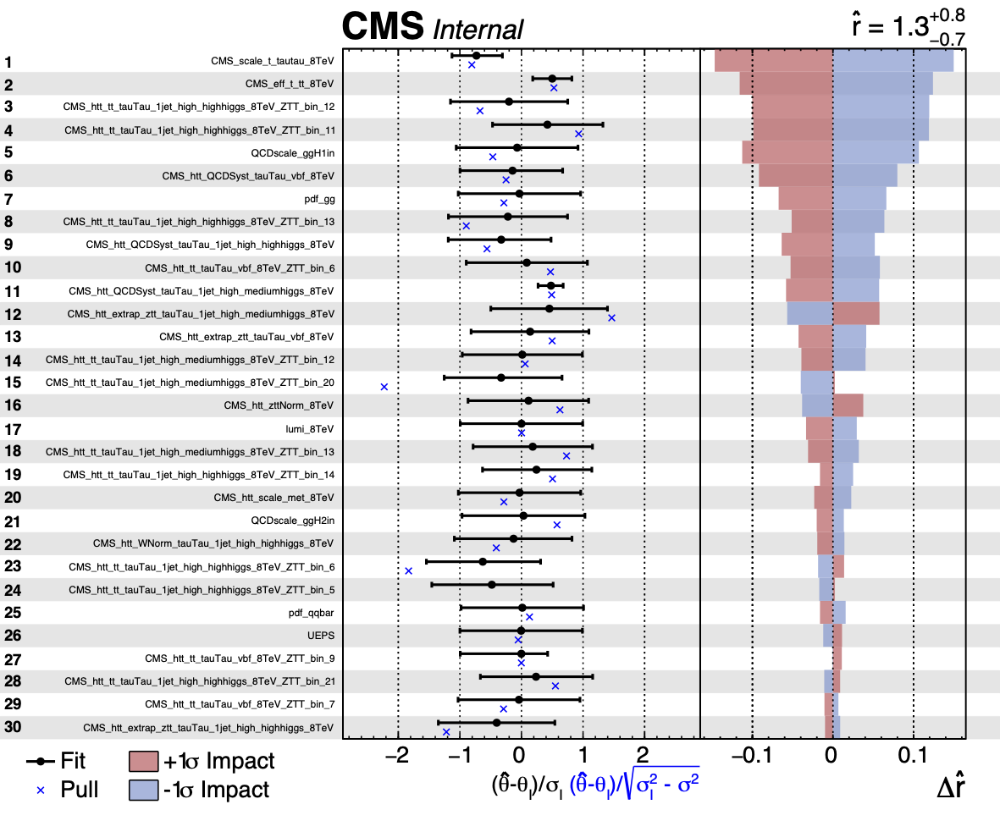
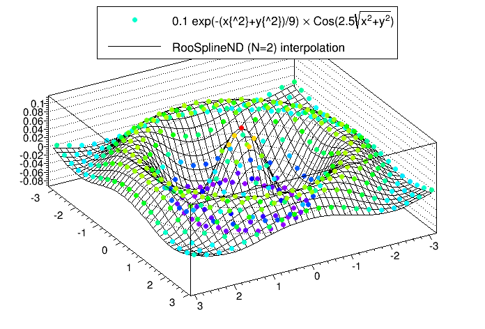

# Advanced Use Cases

This section will cover some of the more specific use cases for <span style="font-variant:small-caps;">Combine</span> that are not necessarily related to the main results of the analysis.

## Fit Diagnostics

If you want to diagnose your limits/fit results, you may first want to look at the HIG PAG standard checks, which are applied to all datacards and can be found [here](https://twiki.cern.ch/twiki/bin/view/CMS/HiggsWG/HiggsPAGPreapprovalChecks).

If you have already found the Higgs boson but it's an exotic one, instead of computing a limit or significance you might want to extract its cross section by performing a maximum-likelihood fit. Alternatively, you might want to know how compatible your data and your model are, e.g. how strongly your nuisance parameters are constrained, to what extent they are correlated, etc. These general diagnostic tools are contained in the method `FitDiagnostics`.

```
    combine -M FitDiagnostics datacard.txt
```

The program will print out the result of _two fits_. The first one is performed with the signal strength **r** (or the first POI in the list, in models with multiple POIs) set to zero and a second with floating **r**. The output ROOT tree will contain the best fit value for **r** and its uncertainty. You will also get a `fitDiagnostics.root` file containing the following objects:

| Object                 | Description                                                                                                                           |
| ---------------------- | ------------------------------------------------------------------------------------------------------------------------------------- |
| **`nuisances_prefit`** | `RooArgSet` containing the pre-fit values of the nuisance parameters, and their uncertainties from the external constraint terms only |
| **`fit_b`**            | `RooFitResult` object containing the outcome of the fit of the data with signal strength set to zero                                  |
| **`fit_s`**            | `RooFitResult` object containing the outcome of the fit of the data with floating signal strength                                     |
| **`tree_prefit`**      | `TTree` of pre-fit nuisance parameter values and constraint terms (\_In)                                                              |
| **`tree_fit_sb`**      | `TTree` of fitted nuisance parameter values and constraint terms (\_In) with floating signal strength                                 |
| **`tree_fit_b`**       | `TTree` of fitted nuisance parameter values and constraint terms (\_In) with signal strength set to 0                                 |

by including the option `--plots`, you will additionally find the following contained in the ROOT file:

| Object                         | Description                                                                                                              |
| ------------------------------ | ------------------------------------------------------------------------------------------------------------------------ |
| **`covariance_fit_s`**         | `TH2D` Covariance matrix of the parameters in the fit with floating signal strength                                      |
| **`covariance_fit_b`**         | `TH2D` Covariance matrix of the parameters in the fit with signal strength set to zero                                   |
| **`category_variable_prefit`** | `RooPlot` plot of the pre-fit PDFs/templates with the data (or toy if running with `-t`) overlaid                        |
| **`category_variable_fit_b`**  | `RooPlot` plot of the PDFs/templates from the background only fit with the data (or toy if running with `-t`) overlaid   |
| **`category_variable_fit_s`**  | `RooPlot` plot of the PDFs/templates from the signal+background fit with the data (or toy if running with `-t`) overlaid |

There will be one `RooPlot` object per category in the likelihood, and one per variable if using a multi-dimensional dataset. For each of these additional objects a png file will also be produced.

!!! info
    If you use the option `--name`, this additional name will be inserted into the file name for this output file.

As well as the values of the constrained nuisance parameters (and their constraints), you will also find branches for the number of "bad" nll calls (which you should check is not too large) and the status of the fit `fit_status`. The fit status is computed as follows

```
fit_status = 100 * hesse_status + 10 * minos_status +  minuit_summary_status
```

The `minuit_summary_status` is the usual status from Minuit, details of which can be found [here](https://root.cern.ch/root/htmldoc/ROOT__Minuit2__Minuit2Minimizer.html#ROOT__Minuit2__Minuit2Minimizer:Minimize). For the other status values, check these documentation links for the [`hesse_status`](https://root.cern.ch/root/htmldoc/ROOT__Minuit2__Minuit2Minimizer.html#ROOT__Minuit2__Minuit2Minimizer:Hesse) and the [`minos_status`](https://root.cern.ch/root/htmldoc/ROOT__Minuit2__Minuit2Minimizer.html#ROOT__Minuit2__Minuit2Minimizer:GetMinosError).

A fit status of -1 indicates that the fit failed (Minuit summary was not 0 or 1) and hence the fit result is **not** valid.

### Fit options

- If you only want to run the signal+background fit, and do not need the output file, you can run with `--justFit`. In case you would like to run only the signal+background fit but would like to produce the output file, you should use the option `--skipBOnlyFit` instead.
- You can use `--rMin` and `--rMax` to set the range of the first POI; a range that is not too large compared with the uncertainties you expect from the fit usually gives more stable and accurate results.
- By default, the uncertainties are computed using MINOS for the first POI and HESSE for all other parameters. For the nuisance parameters the uncertainties will therefore be symmetric. You can run MINOS for _all_ parameters using the option `--minos all`, or for _none_ of the parameters using `--minos none`. Note that running MINOS is slower so you should only consider using it if you think the HESSE uncertainties are not accurate.
- If MINOS or HESSE fails to converge, you can try running with `--robustFit=1`. This will do a slower, but more robust, likelihood scan, which can be further controlled with the parameter `--stepSize` (the default value is 0.1, and is relative to the range of the parameter).
- The strategy and tolerance when using the `--robustFit` option can be set using the options `setRobustFitAlgo` (default is `Minuit2,migrad`), `setRobustFitStrategy` (default is 0) and `--setRobustFitTolerance` (default is 0.1). If these options are not set, the defaults (set using `cminDefaultMinimizerX` options) will be used. You can also tune the accuracy of the routine used to find the crossing points of the likelihood using the option `--setCrossingTolerance` (the default is set to 0.0001)
- If you find the covariance matrix provided by HESSE is not accurate (i.e. `fit_s->Print()` reports this was forced positive-definite) then a custom HESSE-style calculation of the covariance matrix can be used instead. This is enabled by running `FitDiagnostics` with the `--robustHesse 1` option. Please note that the status reported by `RooFitResult::Print()` will contain `covariance matrix quality: Unknown, matrix was externally provided` when robustHesse is used, this is normal and does not indicate a problem. NB: one feature of the robustHesse algorithm is that if it still cannot calculate a positive-definite covariance matrix it will try to do so by dropping parameters from the hessian matrix before inverting. If this happens it will be reported in the output to the screen.
- For other fitting options see the [generic minimizer options](https://github.com/cms-analysis/HiggsAnalysis-CombinedLimit/wiki/runningthetool#generic-minimizer-options) section.

### Fit parameter uncertainties

If you get a warning message when running `FitDiagnostics` that says `Unable to determine uncertainties on all fit parameters`. This means the covariance matrix calculated in `FitDiagnostics` was not correct.

The most common problem is that the covariance matrix is forced positive-definite. In this case the constraints on fit parameters as taken from the covariance matrix are incorrect and should not be used. In particular, if you want to make post-fit plots of the distribution used in the signal extraction fit and are extracting the uncertainties on the signal and background expectations from the covariance matrix, the resulting values will not reflect the truth if the covariance matrix was incorrect. By default if this happens and you passed the `--saveWithUncertainties` flag when calling `FitDiagnostics`, this option will be ignored as calculating the uncertainties would lead to incorrect results. This behaviour can be overridden by passing `--ignoreCovWarning`.

Such problems with the covariance matrix can be caused by a number of things, for example:

- Parameters being close to their boundaries after the fit.

- Strong (anti-) correlations between some parameters.
  A discontinuity in the NLL function or its derivatives at or near the minimum.

If you are aware that your analysis has any of these features you could try resolving these. Setting `--cminDefaultMinimizerStrategy 0` can also help with this problem.

### Pre- and post-fit nuisance parameters

It is possible to compare pre-fit and post-fit nuisance parameter values with the script [diffNuisances.py](https://github.com/cms-analysis/HiggsAnalysis-CombinedLimit/blob/main/test/diffNuisances.py). Taking as input a `fitDiagnosticsTest.root` file, the script will by default print out the parameters that have changed significantly with respect to their initial estimate. 

For each of those parameters, it will print out 

- The shift in value and the post-fit uncertainty, both normalized to the initial (pre-fit) value from the s+b fit and the b-only fit. 
- The linear correlation between the parameter and the signal strength `r` - $\rho(r,\nu)$.
- The approximate impact of the nuisance parameter determined as $I(r,\nu) = \sigma_{r}\sigma_{\nu}\rho(r,\nu)$, where $\sigma_{r}$ and $\sigma_{\nu}$ are the symmetrized total uncertainties on the signal strength and nuisance parameter, respectively (see the section on [Nuisance parameter impacts](http://cms-analysis.github.io/HiggsAnalysis-CombinedLimit/latest/part3/nonstandard/#nuisance-parameter-impacts) for our recommend calculation of impacts.).

The script has several options to toggle the thresholds used to decide whether a parameter has changed significantly, to get the printout of the absolute value of the nuisance parameters, and to get the output in another format for use on a webpage or in a note (the supported formats are `html`, `latex`, `twiki`). To print *all* of the parameters, use the option `--all`. 

An example of using this script is shown below, 

```sh
combine data/tutorials/counting/realistic-counting-experiment.txt -M FitDiagnostics --forceRecreateNLL --rMin -1 --rMax 1
python diffNuisances.py fitDiagnosticsTest.root
```

/// details | Show output 

=== "`--format text` (default)" 
    ```sh
    diffNuisances run on fitDiagnosticsTest.root, at 2024-07-01 18:05:37.585109 with the following options ... {'vtol': 0.3, 'stol': 0.1, 'vtol2': 2.0, 'stol2': 0.5, 'show_all_parameters': False, 'absolute_values': False, 'poi': 'r', 'format': 'text', 'plotfile': None, 'pullDef': '', 'skipFitS': False, 'skipFitB': False, 'sortBy': 'correlation', 'regex': '.*'}

    name                                              b-only fit            s+b fit         rho  approx impact
    CMS_scale_t_tautau_8TeV                          -0.60, 0.40     ! -0.73, 0.39!     !-0.19!      -0.051
    CMS_eff_t_tt_8TeV                                +0.57, 0.32     ! +0.50, 0.32!     !-0.17!      -0.037
    CMS_htt_tt_tauTau_1jet_high_highhiggs_8TeV_ZTT_bin_12         +0.21, 0.89        -0.20, 0.96       -0.15      -0.103
    CMS_htt_tt_tauTau_1jet_high_highhiggs_8TeV_ZTT_bin_11         +0.71, 0.87        +0.42, 0.90       -0.15      -0.095
    CMS_htt_QCDSyst_tauTau_vbf_8TeV                  +0.16, 0.82        -0.15, 0.84       -0.12      -0.071
    CMS_htt_tt_tauTau_vbf_8TeV_ZTT_bin_6             +0.32, 0.97        +0.09, 0.99       -0.08      -0.054
    CMS_htt_QCDSyst_tauTau_1jet_high_mediumhiggs_8TeV         +0.52, 0.20     ! +0.48, 0.20!     !-0.08!      -0.011
    CMS_htt_QCDSyst_tauTau_1jet_high_highhiggs_8TeV         -0.15, 0.84        -0.33, 0.84       -0.08      -0.044
    CMS_htt_extrap_ztt_tauTau_1jet_high_mediumhiggs_8TeV         +0.34, 0.95        +0.45, 0.95       +0.07      +0.049
    CMS_htt_extrap_ztt_tauTau_vbf_8TeV               +0.31, 0.96        +0.14, 0.96       -0.06      -0.040
    CMS_htt_tt_tauTau_1jet_high_highhiggs_8TeV_ZTT_bin_14         +0.29, 0.88        +0.24, 0.89       -0.03      -0.018
    CMS_htt_tt_tauTau_1jet_high_highhiggs_8TeV_ZTT_bin_6         -0.67, 0.94        -0.63, 0.93       +0.02      +0.014
    CMS_htt_tt_tauTau_1jet_high_highhiggs_8TeV_ZTT_bin_23         +0.44, 0.92        +0.46, 0.92       +0.01      +0.004
    CMS_htt_tt_tauTau_1jet_high_highhiggs_8TeV_ZTT_bin_18         +0.44, 0.92        +0.43, 0.93       -0.01      -0.005
    CMS_htt_tt_tauTau_1jet_high_highhiggs_8TeV_ZTT_bin_17         -0.62, 1.00        -0.61, 1.00       +0.01      +0.004
    CMS_htt_tt_tauTau_1jet_high_highhiggs_8TeV_ZTT_bin_15         -0.55, 0.98        -0.54, 0.98       +0.01      +0.005
    CMS_htt_extrap_ztt_tauTau_1jet_high_highhiggs_8TeV         -0.34, 0.95        -0.41, 0.95       -0.01      -0.006
    CMS_htt_tt_tauTau_1jet_high_mediumhiggs_8TeV_ZTT_bin_20         -0.34, 0.99        -0.33, 0.99       +0.00      +0.003
    CMS_htt_tt_tauTau_1jet_high_highhiggs_8TeV_ZTT_bin_5         -0.49, 1.00        -0.48, 1.00       +0.00      +0.003
    CMS_htt_tt_tauTau_1jet_high_highhiggs_8TeV_ZTT_bin_26         -0.47, 0.96        -0.46, 0.97       +0.00      +0.003
    ```

=== "`--format html`"
    
///

By default, the changes in the nuisance parameter values and uncertainties are given relative to their initial (pre-fit) values (usually relative to initial values of 0 and 1 for most nuisance types).

The values in the output will be $(\nu-\nu_{I})/\sigma_{I}$ if the nuisance has a pre-fit uncertainty, otherwise they will be $\nu-\nu_{I}$ (for example, a `flatParam` has no pre-fit uncertainty).

The reported uncertainty will be the ratio $\sigma/\sigma_{I}$ - i.e the ratio of the post-fit to the pre-fit uncertainty. If there is no pre-fit uncertainty (as for `flatParam` nuisances), the post-fit uncertainty is shown.

To print the pre-fit and post-fit values and (asymmetric) uncertainties, rather than the ratios, the option `--abs` can be used.

!!! info
    We recommend that you include the options `--abs` and `--all` to get the full information on all of the parameters (including unconstrained nuisance parameters) at least once when checking your datacards. 


#### Pulls 

If instead of the nuisance parameter values, you wish to report the _pulls_, you can do so using the option `--pullDef X`, with `X` being one of the options listed below. You should note that since the pulls below are only defined when the pre-fit uncertainty exists, _nothing_ will be reported for parameters that have no prior constraint (except in the case of the `unconstPullAsym` choice as described below). You may want to run without this option and `--all` to get information about those parameters.

- `relDiffAsymErrs`: This is the same as the default output of the tool, except that only constrained parameters (i.e. where the pre-fit uncertainty is defined) are reported. The uncertainty is also reported and calculated as $\sigma/\sigma_{I}$.

- `unconstPullAsym`: Report the pull as $\frac{\nu-\nu_{I}}{\sigma}$, where $\nu_{I}$ and $\sigma$ are the initial value and **post-fit** uncertainty of that nuisance parameter. The pull defined in this way will have no error bar, but _all_ nuisance parameters will have a result in this case.

- `compatAsym`: The pull is defined as $\frac{\nu-\nu_{D}}{\sqrt{\sigma^{2}+\sigma_{D}^{2}}}$, where $\nu_{D}$ and $\sigma_{D}$ are calculated as $\sigma_{D} = (\frac{1}{\sigma^{2}} - \frac{1}{\sigma_{I}^{2}})^{-1}$ and $\nu_{D} = \sigma_{D}(\nu - \frac{\nu_{I}}{\sigma_{I}^{2}})$. In this expression $\nu_{I}$ and $\sigma_{I}$ are the initial value and uncertainty of that nuisance parameter. This can be thought of as a _compatibility_ between the initial measurement (prior) and an imagined measurement where only the data (with no constraint on the nuisance parameter) is used to measure the nuisance parameter. There is no error bar associated with this value.

- `diffPullAsym`: The pull is defined as $\frac{\nu-\nu_{I}}{\sqrt{\sigma_{I}^{2}-\sigma^{2}}}$, where $\nu_{I}$ and $\sigma_{I}$ are the pre-fit value and uncertainty (from [L. Demortier and L. Lyons](http://physics.rockefeller.edu/luc/technical_reports/cdf5776_pulls.pdf)). If the denominator is close to 0 or the post-fit uncertainty is larger than the pre-fit (usually due to some failure in the calculation), the pull is not defined and the result will be reported as `0 +/- 999`.

If using `--pullDef`, the results for _all_ parameters for which the pull can be calculated will be shown (i.e `--all` will be set to `true`), not just those that have moved by some metric.

This script has the option (`-g outputfile.root`) to produce plots of the fitted _values_ of the nuisance parameters and their post-fit, asymmetric uncertainties. Instead, the pulls defined using one of the options above, can be plotted using the option `--pullDef X`. In addition this will produce a plot showing a comparison between the post-fit and pre-fit (symmetrized) uncertainties on the nuisance parameters.

!!! info
    In the above options, if an asymmetric uncertainty is associated with the nuisance parameter, then the choice of which uncertainty is used in the definition of the pull will depend on the sign of $\nu-\nu_{I}$.

### Normalizations

For a certain class of models, like those made from datacards for shape-based analysis, the tool can also compute and save the best fit yields of all processes to the output ROOT file. If this feature is turned on with the option `--saveNormalizations`, the file will also contain three `RooArgSet` objects `norm_prefit`, `norm_fit_s`, and `norm_fit_b`. These each contain one `RooConstVar` for each channel `xxx` and process `yyy` with name **`xxx/yyy`** and value equal to the best fit yield. You can use `RooRealVar::getVal` and `RooRealVar::getError` to estimate both the post-fit (or pre-fit) values and uncertainties of these normalizations.

The sample `pyROOT` macro [mlfitNormsToText.py](https://github.com/cms-analysis/HiggsAnalysis-CombinedLimit/blob/main/test/mlfitNormsToText.py) can be used to convert the ROOT file into a text table with four columns: channel, process, yield from the signal+background fit, and yield from the background-only fit. To include the uncertainties in the table, add the option `--uncertainties`.

!!! warning
    Note that when running with multiple toys, the `norm_fit_s`, `norm_fit_b`, and `norm_prefit` objects will be stored for the _last_ toy dataset generated and so may not be useful to you.

Note that this procedure works only for "extended likelihoods" like the ones used in shape-based analysis, not for counting experiment datacards. You can however convert a counting experiment datacard to an equivalent shape-based one by adding a line `shapes * * FAKE` in the datacard after the `imax`, `jmax`, `kmax` lines. Alternatively, you can use `combineCards.py countingcard.txt -S > shapecard.txt` to do this conversion.

#### Per-bin norms for shape analyses

If you have a shape-based analysis, you can include the option `--savePredictionsPerToy`. With this option, additional branches will be filled in the three output trees contained in `fitDiagnostics.root`.

The normalization values for each toy will be stored in the branches inside the `TTrees` named **n_exp[\_final]\_binxxx_proc_yyy**. The **\_final** will only be there if there are systematic uncertainties affecting this process.

Additionally, there will be branches that provide the value of the expected **bin** content for each process, in each channel. These are named **n_exp[\_final]\_binxxx_proc_yyy_i** (where **\_final** will only be in the name if there are systematic uncertainties affecting this process) for channel `xxx`, process `yyy`, bin number `i`. In the case of the post-fit trees (`tree_fit_s/b`), these will be the expectations from the _fitted_ models, while for the pre-fit tree, they will be the expectation from the generated model (i.e if running toys with `-t N` and using `--genNuisances`, they will be randomized for each toy). These can be useful, for example, for calculating correlations/covariances between different bins, in different channels or processes, within the model from toys.

!!! info
    Be aware that for _unbinned_ models, a binning scheme is adopted based on the `RooRealVar::getBinning` for the observable defining the shape, if it exists, or <span style="font-variant:small-caps;">Combine</span> will adopt some appropriate binning for each observable.

### Plotting

`FitDiagnostics` can also produce pre- and post-fit plots of the model along with the data. They will be stored in the same directory as `fitDiagnostics.root`. To obtain these, you have to specify the option `--plots`, and then _optionally specify_ the names of the signal and background PDFs/templates, e.g. `--signalPdfNames='ggH*,vbfH*'` and `--backgroundPdfNames='*DY*,*WW*,*Top*'` (by default, the definitions of signal and background are taken from the datacard). For models with more than 1 observable, a separate projection onto each observable will be produced.

An alternative is to use the option `--saveShapes`. This will add additional folders in `fitDiagnostics.root` for each category, with pre- and post-fit distributions of the signals and backgrounds as TH1s, and the data as `TGraphAsymmErrors` (with Poisson intervals as error bars).

!!! info
    If you want to save post-fit shapes at a specific **r** value, add the options `--customStartingPoint` and `--skipSBFit`, and set the **r** value. The result will appear in **shapes_fit_b**, as described below.

Three additional folders (**shapes_prefit**, **shapes_fit_sb** and **shapes_fit_b** ) will contain the following distributions:

| Object                   | Description                                                                                                                                                                                                                                                                                                                                     |
| ------------------------ | ----------------------------------------------------------------------------------------------------------------------------------------------------------------------------------------------------------------------------------------------------------------------------------------------------------------------------------------------- |
| **`data`**               | `TGraphAsymmErrors` containing the observed data (or toy data if using `-t`). The vertical error bars correspond to the 68% interval for a Poisson distribution centered on the observed count (Garwood intervals), following the [recipe provided by the CMS Statistics Committee](https://twiki.cern.ch/twiki/bin/view/CMS/PoissonErrorBars). |
| **`$PROCESS`** (id <= 0) | `TH1F` for each signal process in each channel, named as in the datacard                                                                                                                                                                                                                                                                        |
| **`$PROCESS`** (id > 0)  | `TH1F` for each background process in each channel, named as in the datacard                                                                                                                                                                                                                                                                    |
| **`total_signal`**       | `TH1F` Sum over the signal components                                                                                                                                                                                                                                                                                                           |
| **`total_background`**   | `TH1F` Sum over the background components                                                                                                                                                                                                                                                                                                       |
| **`total`**              | `TH1F` Sum over all of the signal and background components                                                                                                                                                                                                                                                                                     |

The above distributions are provided _for each channel included in the datacard_, in separate subfolders, named as in the datacard: There will be one subfolder per channel.

!!! warning
    The pre-fit signal is evaluated for `r=1` by default, but this can be modified using the option `--preFitValue`.

The distributions and normalizations are guaranteed to give the correct interpretation:

- For shape datacards whose inputs are `TH1`, the histograms/data points will have the bin number as the x-axis and the content of each bin will be a number of events.

- For datacards whose inputs are `RooAbsPdf`/`RooDataHist`s, the x-axis will correspond to the observable and the bin content will be the PDF density / events divided by the bin width. This means the absolute number of events in a given bin, i, can be obtained from `h.GetBinContent(i)*h.GetBinWidth(i)` or similar for the data graphs. **Note** that for _unbinned_ analyses <span style="font-variant:small-caps;">Combine</span> will make a reasonable guess as to an appropriate binning.

Uncertainties on the shapes will be added with the option `--saveWithUncertainties`. These uncertainties are generated by re-sampling of the fit covariance matrix, thereby accounting for the full correlation between the parameters of the fit.

!!! warning
    It may be tempting to sum up the uncertainties in each bin (in quadrature) to get the _total_ uncertainty on a process. However, this is (usually) incorrect, as doing so would not account for correlations _between the bins_. Instead you can refer to the uncertainties which will be added to the post-fit normalizations described above.

Additionally, the covariance matrix **between** bin yields (or yields/bin-widths) in each channel will also be saved as a `TH2F` named **total_covar**. If the covariance between _all bins_ across _all channels_ is desired, this can be added using the option `--saveOverallShapes`. Each folder will now contain additional distributions (and covariance matrices) corresponding to the concatenation of the bins in each channel (and therefore the covaraince between every bin in the analysis). The bin labels should make it clear as to which bin corresponds to which channel.

### Toy-by-toy diagnostics

`FitDiagnostics` can also be used to diagnose the fitting procedure in toy experiments to identify potentially problematic nuisance parameters when running the full limits/p-values. This can be done by adding the option `-t <num toys>`. The output file, `fitDiagnostics.root` the three `TTrees` will contain the value of the constraint fitted result in each toy, as a separate entry. It is recommended to use the following options when investigating toys to reduce the running time: `--toysFrequentist` `--noErrors` `--minos none`

The results can be plotted using the macro [test/plotParametersFromToys.C](https://github.com/cms-analysis/HiggsAnalysis-CombinedLimit/blob/main/test/plotParametersFromToys.C)

```c++
$ root -l
.L plotParametersFromToys.C+
plotParametersFromToys("fitDiagnosticsToys.root","fitDiagnosticsData.root","workspace.root","r<0")
```

The first argument is the name of the output file from running with toys, and the second and third (optional) arguments are the name of the file containing the result from a fit to the data and the workspace (created from `text2workspace.py`). The fourth argument can be used to specify a cut string applied to one of the branches in the tree, which can be used to correlate strange behaviour with specific conditions. The output will be 2 pdf files (**`tree_fit_(s)b.pdf`**) and 2 ROOT files (**`tree_fit_(s)b.root`**) containing canvases of the fit results of the tool. For details on the output plots, consult [AN-2012/317](http://cms.cern.ch/iCMS/user/noteinfo?cmsnoteid=CMS%20AN-2012/317).

## Scaling constraints

It possible to scale the **constraints** on the nuisance parameters when converting the datacard to a workspace (see the section on [physics models](http://cms-analysis.github.io/HiggsAnalysis-CombinedLimit/part2/physicsmodels/)) with `text2workspace.py`. This can be useful for projection studies of the analysis to higher luminosities or with different assumptions about the sizes of certain systematics without changing the datacard by hand.

We consider two kinds of scaling;

- A _constant scaling factor_ to scale the constraints
- A _functional scale factor_ that depends on some other parameters in the workspace, eg a luminosity scaling parameter (as a `rateParam` affecting all processes).

In both cases these scalings can be introduced by adding some extra options at the `text2workspace.py` step.

To add a _constant scaling factor_ we use the option `--X-rescale-nuisance`, eg

    text2workspace.py datacard.txt --X-rescale-nuisance '[some regular expression]' 0.5

will create the workspace in which every nuisance parameter whose name matches the specified regular expression will have the width of the gaussian constraint scaled by a factor 0.5.

Multiple `--X-rescale-nuisance` options can be specified to set different scalings for different nuisances (note that you actually have to write `--X-rescale-nuisance` each time as in `--X-rescale-nuisance 'theory.*' 0.5  --X-rescale-nuisance 'exp.*' 0.1`).

To add a _functional scaling factor_ we use the option `--X-nuisance-function`, which works in a similar way. Instead of a constant value you should specify a `RooFit` factory expression.

A typical case would be scaling by $1/\sqrt{L}$, where $L$ is a luminosity scale factor. For example, assuming there is some parameter in the datacard/workspace called **`lumiscale`**,

    text2workspace.py datacard.txt --X-nuisance-function '[some regular expression]' 'expr::lumisyst("1/sqrt(@0)",lumiscale[1])'

This factory syntax is flexible, but for our use case the typical format will be: `expr::[function name]("[formula]", [arg0], [arg1], ...)`. The `arg0`, `arg1` ... are represented in the formula by `@0`, `@1`,... placeholders.

!!! warning
    We are playing a slight trick here with the `lumiscale` parameter. At the point at which `text2workspace.py` is building these scaling terms the `lumiscale` for the `rateParam` has not yet been created. By writing `lumiscale[1]` we are telling RooFit to create this variable with an initial value of 1, and then later this will be re-used by the `rateParam` creation.

A similar option, `--X-nuisance-group-function`, can be used to scale whole groups of nuisances (see [groups of nuisances](http://cms-analysis.github.io/HiggsAnalysis-CombinedLimit/part2/settinguptheanalysis/#groups-of-nuisances)). Instead of a regular expression just give the group name instead,

    text2workspace.py datacard.txt --X-nuisance-group-function [group name] 'expr::lumisyst("1/sqrt(@0)",lumiscale[1])'

## Nuisance parameter impacts

The impact of a nuisance parameter (NP) θ on a parameter of interest (POI) μ is defined as the shift Δμ that is induced as θ is fixed and brought to its +1σ or −1σ post-fit values, with all other parameters profiled as normal (see [JHEP 01 (2015) 069](<https://link.springer.com/article/10.1007/JHEP01(2015)069>) for a description of this method).

This is effectively a measure of the correlation between the NP and the POI, and is useful for determining which NPs have the largest effect on the POI uncertainty.

It is possible to use the `MultiDimFit` method of <span style="font-variant:small-caps;">Combine</span> with the option `--algo impact -P parameter` to calculate the impact of a particular nuisance parameter on the parameter(s) of interest. We will use the `combineTool.py` script to automate the fits.

We will use an example workspace from the [$H\rightarrow\tau\tau$ datacard](https://github.com/cms-analysis/HiggsAnalysis-CombinedLimit/blob/main/data/tutorials/htt/125/htt_tt.txt),

```
$ cp HiggsAnalysis/CombinedLimit/data/tutorials/htt/125/htt_tt.txt .
$ text2workspace.py htt_tt.txt -m 125
```

Calculating the impacts is done in a few stages. First we just fit for each POI, using the `--doInitialFit` option with `combineTool.py`, and adding the `--robustFit 1` option that will be passed through to <span style="font-variant:small-caps;">Combine</span>,

    combineTool.py -M Impacts -d htt_tt.root -m 125 --doInitialFit --robustFit 1

Have a look at the options as for [likelihood scans](http://cms-analysis.github.io/HiggsAnalysis-CombinedLimit/part3/commonstatsmethods/#useful-options-for-likelihood-scans) when using `robustFit 1`.

Next we perform a similar scan for each nuisance parameter with the `--doFits` options,

    combineTool.py -M Impacts -d htt_tt.root -m 125 --robustFit 1 --doFits

Note that this will run approximately 60 scans, and to speed things up the option `--parallel X` can be given to run X <span style="font-variant:small-caps;">Combine</span> jobs simultaneously. The batch and grid submission methods described in the [combineTool for job submission](http://cms-analysis.github.io/HiggsAnalysis-CombinedLimit/part3/runningthetool/#combinetool-for-job-submission) section can also be used.

Once all jobs are completed, the output can be collected and written into a json file:

    combineTool.py -M Impacts -d htt_tt.root -m 125 -o impacts.json

A plot summarizing the nuisance parameter values and impacts can be made with `plotImpacts.py`,

    plotImpacts.py -i impacts.json -o impacts

The first page of the output is shown below. Note that in these figures, the nuisance parameters are labelled as $\theta$ instead of $\nu$.



The direction of the +1σ and -1σ impacts (i.e. when the NP is moved to its +1σ or -1σ values) on the POI indicates whether the parameter is correlated or anti-correlated with it.

For models with multiple POIs, the <span style="font-variant:small-caps;">Combine</span> option `--redefineSignalPOIs X,Y,Z...` should be specified in all three of the `combineTool.py -M Impacts [...]` steps above. The final step will produce the `impacts.json` file which will contain the impacts for all the specified POIs. In the `plotImpacts.py` script, a particular POI can be specified with `--POI X`.

!!! warning
    The plot also shows the _best fit_ value of the POI at the top and its uncertainty. You may wish to allow the range to go negative (i.e using `--setParameterRanges` or `--rMin`) to avoid getting one-sided impacts!

This script also accepts an optional json-file argument with `-t`, which can be used to provide a dictionary for renaming parameters. A simple example would be to create a file `rename.json`,

```python
{
  "r" : "#mu"
}
```

that will rename the POI label on the plot.

!!! info
    Since `combineTool` accepts the usual options for combine you can also generate the impacts on an Asimov or toy dataset.

The left panel in the summary plot shows the value of $(\nu-\nu_{0})/\Delta_{\nu}$ where $\nu$ and $\nu_{0}$ are the **post** and **pre**-fit values of the nuisance parameter and $\Delta_{\nu}$ is the **pre**-fit uncertainty. The asymmetric error bars show the **post**-fit uncertainty divided by the **pre**-fit uncertainty meaning that parameters with error bars smaller than $\pm 1$ are constrained in the fit. The pull will additionally be shown. As with the `diffNuisances.py` script, the option `--pullDef` can be used (to modify the definition of the _pull_ that is shown).

## Breakdown of uncertainties

Often you will want to report the breakdown of your total (systematic) uncertainty on a measured parameter due to one or more groups of nuisance parameters. For example, these groups could be theory uncertainties, trigger uncertainties, ... The prodecude to do this in <span style="font-variant:small-caps;">Combine</span> is to sequentially freeze groups of nuisance parameters and subtract (in quadrature) from the total uncertainty. Below are the steps to do so. We will use the `data/tutorials/htt/125/htt_tt.txt` datacard for this.

1. Add groups to the datacard to group nuisance parameters. Nuisance parameters not in groups will be considered as "rest" in the later steps. The lines should look like the following and you should add them to the end of the datacard

```
theory 	    group = QCDscale_VH QCDscale_ggH1in QCDscale_ggH2in QCDscale_qqH UEPS pdf_gg pdf_qqbar
calibration group = CMS_scale_j_8TeV CMS_scale_t_tautau_8TeV CMS_htt_scale_met_8TeV
efficiency  group = CMS_eff_b_8TeV   CMS_eff_t_tt_8TeV CMS_fake_b_8TeV
```

2. Create the workspace with `text2workspace.py data/tutorials/htt/125/htt_tt.txt -m 125`.

3. Run a fit with all nuisance parameters floating and store the workspace in an output file - `combine data/tutorials/htt/125/htt_tt.root -M MultiDimFit --saveWorkspace -n htt.postfit`

4. Run a scan from the postfit workspace

```
combine higgsCombinehtt.postfit.MultiDimFit.mH120.root -M MultiDimFit -n htt.total --algo grid --snapshotName MultiDimFit --setParameterRanges r=0,4
```

5. Run additional scans using the post-fit workspace, sequentially adding another group to the list of groups to freeze

```
combine higgsCombinehtt.postfit.MultiDimFit.mH120.root -M MultiDimFit --algo grid --snapshotName MultiDimFit --setParameterRanges r=0,4  --freezeNuisanceGroups theory -n htt.freeze_theory

combine higgsCombinehtt.postfit.MultiDimFit.mH120.root -M MultiDimFit --algo grid --snapshotName MultiDimFit --setParameterRanges r=0,4  --freezeNuisanceGroups theory,calibration -n htt.freeze_theory_calibration

combine higgsCombinehtt.postfit.MultiDimFit.mH120.root -M MultiDimFit --algo grid --snapshotName MultiDimFit --setParameterRanges r=0,4  --freezeNuisanceGroups theory,calibration,efficiency -n htt.freeze_theory_calibration_efficiency
```

6. Run one last scan freezing all of the constrained nuisance parameters (this represents the statistical uncertainty only).

```
combine higgsCombinehtt.postfit.MultiDimFit.mH120.root -M MultiDimFit --algo grid --snapshotName MultiDimFit --setParameterRanges r=0,4  --freezeParameters allConstrainedNuisances -n htt.freeze_all
```

7. Use the `combineTool` script `plot1DScan.py` to report the breakdown of uncertainties.

```
plot1DScan.py higgsCombinehtt.total.MultiDimFit.mH120.root --main-label "Total Uncert."  --others higgsCombinehtt.freeze_theory.MultiDimFit.mH120.root:"freeze theory":4 higgsCombinehtt.freeze_theory_calibration.MultiDimFit.mH120.root:"freeze theory+calibration":7 higgsCombinehtt.freeze_theory_calibration_efficiency.MultiDimFit.mH120.root:"freeze theory+calibration+efficiency":2 higgsCombinehtt.freeze_all.MultiDimFit.mH120.root:"stat only":6  --output breakdown --y-max 10 --y-cut 40 --breakdown "theory,calibration,efficiency,rest,stat"
```

The final step calculates the contribution of each group of nuisance parameters as the subtraction in quadrature of each scan from the previous one. This procedure guarantees that the sum in quadrature of the individual components is the same as the total uncertainty.

The plot below is produced,


!!! warning
    While the above procedure is guaranteed the have the effect that the sum in quadrature of the breakdown will equal the total uncertainty, the order in which you freeze the groups can make a difference due to correlations induced by the fit. You should check if the answers change significantly if changing the order and we recommend you start with the largest group (in terms of overall contribution to the uncertainty) first, working down the list in order of the size of the contribution.

## Channel Masking

The <span style="font-variant:small-caps;">Combine</span> tool has a number of features for diagnostics and plotting results of fits. It can often be useful to turn off particular channels in a combined analysis to see how constraints/shifts in parameter values can vary. It can also be helpful to plot the post-fit shapes and uncertainties of a particular channel (for example a signal region) _without_ including the constraints from the data in that region.

This can in some cases be achieved by removing a specific datacard when running `combineCards.py`. However, when doing so, the information of particular nuisance parameters and PDFs in that region will be lost. Instead, it is possible to **_mask_** that channel from the likelihood. This is achieved at the `text2Workspace` step using the option `--channel-masks`.

### Example: removing constraints from the signal region

We will take the control region example from the rate parameters tutorial from [data/tutorials/rate_params/](https://github.com/cms-analysis/HiggsAnalysis-CombinedLimit/tree/81x-root606/data/tutorials/rate_params).

The first step is to combine the cards
combineCards.py signal=signal_region.txt dimuon=dimuon_control_region.txt singlemuon=singlemuon_control_region.txt > datacard.txt

Note that we use the directive `CHANNELNAME=CHANNEL_DATACARD.txt` so that the names of the channels are under our control and easier to interpret. Next, we make a workspace and tell <span style="font-variant:small-caps;">Combine</span> to create the parameters used to _mask channels_

    text2workspace.py datacard.txt --channel-masks

Now we will try to do a fit _ignoring_ the signal region. We can turn off the signal region by setting the corresponding channel mask parameter to 1: `--setParameters mask_signal=1`. Note that `text2workspace` has created a masking parameter for every channel with the naming scheme **mask_CHANNELNAME**. By default, every parameter is set to 0 so that the channel is unmasked by default.

    combine datacard.root -M FitDiagnostics --saveShapes --saveWithUncertainties --setParameters mask_signal=1

!!! warning
    There will be a lot of warnings from <span style="font-variant:small-caps;">Combine</span>. These are safe to ignore as they are due to the s+b fit not converging. This is expected as the free signal parameter cannot be constrained because the data in the signal region is being ignored.

We can compare the post-fit background and uncertainties with and without the signal region included by re-running with `--setParameters mask_signal=0` (or just removing that option completely). Below is a comparison of the background in the signal region with and without masking the data in the signal region. We take these from the shapes folder
**shapes_fit_b/signal/total_background** in the `fitDiagnostics.root` output.


Clearly the background shape is different and much less constrained _without including the signal region_, as expected. Channel masking can be used with _any method_ in <span style="font-variant:small-caps;">Combine</span>.

## RooMultiPdf conventional bias studies

Several analyses in CMS use a functional form to describe the background. This functional form is fit to the data. Often however, there is some uncertainty associated with the choice of which background function to use, and this choice will impact the fit results. It is therefore often the case that in these analyses, a bias study is performed. This study will give an indication of the size of the potential bias in the result, given a certain choice of functional form. These studies can be conducted using <span style="font-variant:small-caps;">Combine</span>.

Below is an example script that will produce a workspace based on a simplified Higgs to diphoton (Hgg) analysis with a _single_ category. It will produce the data and PDFs necessary for this example, and you can use it as a basis to construct your own studies.

```c++
void makeRooMultiPdfWorkspace(){

   // Load the combine Library
   gSystem->Load("libHiggsAnalysisCombinedLimit.so");

   // mass variable
   RooRealVar mass("CMS_hgg_mass","m_{#gamma#gamma}",120,100,180);


   // create 3 background pdfs
   // 1. exponential
   RooRealVar expo_1("expo_1","slope of exponential",-0.02,-0.1,-0.0001);
   RooExponential exponential("exponential","exponential pdf",mass,expo_1);

   // 2. polynomial with 2 parameters
   RooRealVar poly_1("poly_1","T1 of chebychev polynomial",0,-3,3);
   RooRealVar poly_2("poly_2","T2 of chebychev polynomial",0,-3,3);
   RooChebychev polynomial("polynomial","polynomial pdf",mass,RooArgList(poly_1,poly_2));

   // 3. A power law function
   RooRealVar pow_1("pow_1","exponent of power law",-3,-6,-0.0001);
   RooGenericPdf powerlaw("powerlaw","TMath::Power(@0,@1)",RooArgList(mass,pow_1));

   // Generate some data (lets use the power lay function for it)
   // Here we are using unbinned data, but binning the data is also fine
   RooDataSet *data = powerlaw.generate(mass,RooFit::NumEvents(1000));

   // First we fit the pdfs to the data (gives us a sensible starting value of parameters for, e.g - blind limits)
   exponential.fitTo(*data);   // index 0
   polynomial.fitTo(*data);   // index 1
   powerlaw.fitTo(*data);     // index 2

   // Make a plot (data is a toy dataset)
   RooPlot *plot = mass.frame();   data->plotOn(plot);
   exponential.plotOn(plot,RooFit::LineColor(kGreen));
   polynomial.plotOn(plot,RooFit::LineColor(kBlue));
   powerlaw.plotOn(plot,RooFit::LineColor(kRed));
   plot->SetTitle("PDF fits to toy data");
   plot->Draw();

   // Make a RooCategory object. This will control which of the pdfs is "active"
   RooCategory cat("pdf_index","Index of Pdf which is active");

   // Make a RooMultiPdf object. The order of the pdfs will be the order of their index, ie for below
   // 0 == exponential
   // 1 == polynomial
   // 2 == powerlaw
   RooArgList mypdfs;
   mypdfs.add(exponential);
   mypdfs.add(polynomial);
   mypdfs.add(powerlaw);

   RooMultiPdf multipdf("roomultipdf","All Pdfs",cat,mypdfs);
   // By default the multipdf will tell combine to add 0.5 to the nll for each parameter (this is the penalty for the discrete profiling method)
   // It can be changed with
   //   multipdf.setCorrectionFactor(penalty)
   // For bias-studies, this isn;t relevant however, so lets just leave the default

   // As usual make an extended term for the background with _norm for freely floating yield
   RooRealVar norm("roomultipdf_norm","Number of background events",1000,0,10000);

   // We will also produce a signal model for the bias studies
   RooRealVar sigma("sigma","sigma",1.2); sigma.setConstant(true);
   RooRealVar MH("MH","MH",125); MH.setConstant(true);
   RooGaussian signal("signal","signal",mass,MH,sigma);


   // Save to a new workspace
   TFile *fout = new TFile("workspace.root","RECREATE");
   RooWorkspace wout("workspace","workspace");

   data->SetName("data");
   wout.import(*data);
   wout.import(cat);
   wout.import(norm);
   wout.import(multipdf);
   wout.import(signal);
   wout.Print();
   wout.Write();
}
```

The signal is modelled as a simple Gaussian with a width approximately that of the diphoton resolution. For the background there is a choice of 3 functions: an exponential, a power-law, and a 2nd order polynomial. This choice is accessible within <span style="font-variant:small-caps;">Combine</span> through the use of the [RooMultiPdf](https://github.com/cms-analysis/HiggsAnalysis-CombinedLimit/blob/main/interface/RooMultiPdf.h) object, which can switch between the functions by setting their associated indices (herein called **pdf_index**). This (as with all parameters in <span style="font-variant:small-caps;">Combine</span>) can be set via the `--setParameters` option.

To assess the bias, one can throw toys using one function and fit with another. To do this, only a single datacard is needed: [hgg_toy_datacard.txt](https://github.com/cms-analysis/HiggsAnalysis-CombinedLimit/tree/main/data/tutorials/bias_studies/hgg_toy_datacard.txt).

The bias studies are performed in two stages. The first is to generate toys using one of the functions, under some value of the signal strength **r** (or $\mu$). This can be repeated for several values of **r** and also at different masses, but in this example the Higgs boson mass is fixed to 125 GeV.

```bash
    combine hgg_toy_datacard.txt -M GenerateOnly --setParameters pdf_index=0 --toysFrequentist -t 100 --expectSignal 1 --saveToys -m 125 --freezeParameters pdf_index
```

!!! warning
    It is important to freeze `pdf_index`, otherwise <span style="font-variant:small-caps;">Combine</span> will try to iterate over the index in the frequentist fit.

Now we have 100 toys which, by setting `pdf_index=0`, sets the background PDF to the exponential function. This means we assume that the exponential is the _true_ function. Note that the option `--toysFrequentist` is added; this first performs a fit of the PDF, assuming a signal strength of 1, to the data before generating the toys. This is the most obvious choice as to where to throw the toys from.

The next step is to fit the toys under a different background PDF hypothesis. This time we set the `pdf_index` to 1, which selects the powerlaw, and run fits with the `FitDiagnostics` method, again freezing `pdf_index`.

```bash
    combine hgg_toy_datacard.txt -M FitDiagnostics  --setParameters pdf_index=1 --toysFile higgsCombineTest.GenerateOnly.mH125.123456.root  -t 100 --rMin -10 --rMax 10 --freezeParameters pdf_index --cminDefaultMinimizerStrategy=0
```

Note how we add the option `--cminDefaultMinimizerStrategy=0`. This is because we do not need the Hessian, as `FitDiagnostics` will run MINOS to get the uncertainty on `r`. If we do not do this, Minuit will think the fit failed as we have parameters (those not attached to the current PDF) for which the likelihood is flat.

!!! warning
    You may get warnings about non-accurate errors such as `[WARNING]: Unable to determine uncertainties on all fit parameters in b-only fit` - These can be ignored since they are related to the free parameters of the background PDFs which are not active.

In the output file `fitDiagnostics.root` there is a tree that contains the best fit results under the signal+background hypothesis. One measure of the bias is the _pull_ defined as the difference between the measured value of $\mu$ and the generated value (here we used 1) relative to the uncertainty on $\mu$. The pull distribution can be drawn and the mean provides an estimate of the pull. In this example, we are averaging the positive and negative uncertainties, but we could do something smarter if the uncertainties are very asymmetric.

```c++
root -l fitDiagnostics.root
tree_fit_sb->Draw("(r-1)/(0.5*(rHiErr+rLoErr))>>h(20,-5,5)")
h->Fit("gaus")
```


From the fitted Gaussian, we see the mean is at -1.29, which would indicate a bias of 129% of the uncertainty on mu from choosing the polynomial when the true function is an exponential.

### Discrete profiling

If the `discrete` nuisance is left floating, it will be profiled by looping through the possible index values and finding the PDF that gives the best fit. This allows for the [**discrete profiling method**](https://arxiv.org/pdf/1408.6865.pdf) to be applied for any method which involves a profiled likelihood (frequentist methods).

!!! warning
    You should be careful since MINOS knows nothing about the discrete nuisances and hence estimations of uncertainties will be incorrect via MINOS. Instead, uncertainties from scans and limits will correctly account for these nuisance parameters. Currently the Bayesian methods will _not_ properly treat the nuisance parameters, so some care should be taken when interpreting Bayesian results.

As an example, we can peform a likelihood scan as a function of the Higgs boson signal strength in the toy Hgg datacard. By leaving the object `pdf_index` non-constant, at each point in the likelihood scan, the PDFs will be iterated over and the one that gives the lowest -2 times log-likelihood, including the correction factor $c$ (as defined in the paper linked above) will be stored in the output tree. We can also check the scan when we fix at each PDF individually to check that the envelope is achieved. For this, you will need to include the option `--X-rtd REMOVE_CONSTANT_ZERO_POINT=1`. In this way, we can take a look at the absolute value to compare the curves, if we also include `--saveNLL`.

For example for a full scan, you can run

```bash
    combine -M MultiDimFit -d hgg_toy_datacard.txt --algo grid --setParameterRanges r=-1,3 --cminDefaultMinimizerStrategy 0 --saveNLL -n Envelope -m 125 --setParameters myIndex=-1 --X-rtd REMOVE_CONSTANT_ZERO_POINT=1
```

and for the individual `pdf_index` set to `X`,

```bash
    combine -M MultiDimFit -d hgg_toy_datacard.txt --algo grid --setParameterRanges r=-1,3 --cminDefaultMinimizerStrategy 0 --saveNLL --freezeParameters pdf_index --setParameters pdf_index=X -n fixed_pdf_X -m 125 --X-rtd REMOVE_CONSTANT_ZERO_POINT=1
```

for `X=0,1,2`

You can then plot the value of `2*(deltaNLL+nll+nll0)` to plot the absolute value of (twice) the negative log-likelihood, including the correction term for extra parameters in the different PDFs.

The above output will produce the following scans.


As expected, the curve obtained by allowing the `pdf_index` to float (labelled "Envelope") picks out the best function (maximum corrected likelihood) for each value of the signal strength.

In general, the performance of <span style="font-variant:small-caps;">Combine</span> can be improved when using the discrete profiling method by including the option `--X-rtd MINIMIZER_freezeDisassociatedParams`. This will stop parameters not associated to the current PDF from floating in the fits. Additionally, you can include the following options:

- `--X-rtd MINIMIZER_multiMin_hideConstants`: hide the constant terms in the likelihood when recreating the minimizer
- `--X-rtd MINIMIZER_multiMin_maskConstraints`: hide the constraint terms during the discrete minimization process
- `--X-rtd MINIMIZER_multiMin_maskChannels=<choice>` mask the channels that are not needed from the NLL:
  - `<choice> 1`: keeps unmasked all channels that are participating in the discrete minimization.
  - `<choice> 2`: keeps unmasked only the channel whose index is being scanned at the moment.

You may want to check with the <span style="font-variant:small-caps;">Combine</span> development team if you are using these options, as they are somewhat for _expert_ use.

## RooSplineND multidimensional splines

[RooSplineND](https://github.com/cms-analysis/HiggsAnalysis-CombinedLimit/blob/main/interface/RooSplineND.h) can be used to interpolate from a tree of points to produce a continuous function in N-dimensions. This function can then be used as input to workspaces allowing for parametric rates/cross-sections/efficiencies. It can also be used to up-scale the resolution of likelihood scans (i.e like those produced from <span style="font-variant:small-caps;">Combine</span>) to produce smooth contours.

The spline makes use of a radial basis decomposition to produce a continous $N \to 1$ map (function) from $M$ provided sample points. The function of the $N$ variables $\vec{x}$
is assumed to be of the form,

$$
f(\vec{x}) = \sum_{i=1}^{M}w_{i}\phi(||\vec{x}-\vec{x}_{i}||),
$$

where $\phi(||\vec{z}||) = e^{-\frac{||\vec{z}||}{\epsilon^{2}}}$. The distance $||.||$ between two points is given by,

$$
||\vec{x}-\vec{y}||  = \sum_{j=1}^{N}(x_{j}-y_{j})^{2},
$$

if the option `rescale=false` and,

$$
||\vec{x}-\vec{y}||  = \sum_{j=1}^{N} M^{1/N} \cdot \left( \frac{ x_{j}-y_{j} }{ \mathrm{max_{i=1,M}}(x_{i,j})-\mathrm{min_{i=1,M}}(x_{i,j}) }\right)^{2},
$$

if the option `rescale=true`. Given the sample points, it is possible to determine the weights $w_{i}$ as the solution of the set of equations,

$$
\sum_{i=1}^{M}w_{i}\phi(||\vec{x}_{j}-\vec{x}_{i}||) = f(\vec{x}_{j}).
$$

The solution is obtained using the `eigen` c++ package.

The typical constructor of the object is as follows;

```c++
RooSplineND(const char *name, const char *title, RooArgList &vars, TTree *tree, const char* fName="f", double eps=3., bool rescale=false, std::string cutstring="" ) ;
```

where the arguments are:

- `vars`: A `RooArgList` of `RooRealVars` representing the $N$ dimensions of the spline. The length of this list determines the dimension $N$ of the spline.
- `tree`: a TTree pointer where each entry represents a sample point used to construct the spline. The branch names must correspond to the names of the variables in `vars`.
- `fName`: is a string representing the name of the branch to interpret as the target function $f$.
- `eps` : is the value of $\epsilon$ and represents the _width_ of the basis functions $\phi$.
- `rescale` : is an option to rescale the input sample points so that each variable has roughly the same range (see above in the definition of $||.||$).
- `cutstring` : a string to remove sample points from the tree. Can be any typical cut string (eg "var1>10 && var2<3").

The object can be treated as a `RooAbsArg`; its value for the current values of the parameters is obtained as usual by using the `getVal()` method.

!!! warning
    You should not include more variable branches than contained in `vars` in the tree, as the spline will interpret them as additional sample points. You will get a warning if there are two _nearby_ points in the input samples and this will cause a failure in determining the weights. If you cannot create a reduced tree, you can remove entries by using the `cutstring`.

The following script is an example that produces a 2D spline (`N=2`) from a set of 400 points (`M=400`) generated from a function.

<details>
<summary><b>Show script</b></summary>
```c++
void splinend(){
   // library containing the RooSplineND
   gSystem->Load("libHiggsAnalysisCombinedLimit.so");

   TTree *tree = new TTree("tree_vals","tree_vals");
   float xb,yb,fb;

   tree->Branch("f",&fb,"f/F");
   tree->Branch("x",&xb,"x/F");
   tree->Branch("y",&yb,"y/F");

   TRandom3 *r = new TRandom3();
   int nentries = 20; // just use a regular grid of 20x20=400 points

   double xmin = -3.2;
   double xmax = 3.2;
   double ymin = -3.2;
   double ymax = 3.2;

   for (int n=0;n<nentries;n++){
    for (int k=0;k<nentries;k++){

      xb=xmin+n*((xmax-xmin)/nentries);
      yb=ymin+k*((ymax-ymin)/nentries);
      // Gaussian * cosine function radial in "F(x^2+y^2)"
      double R = (xb*xb)+(yb*yb);
      fb = 0.1*TMath::Exp(-1*(R)/9)*TMath::Cos(2.5*TMath::Sqrt(R));
      tree->Fill();
     }
   }

   // 2D graph of points in tree
   TGraph2D *p0 = new TGraph2D();
   p0->SetMarkerSize(0.8);
   p0->SetMarkerStyle(20);

   int c0=0;
   for (int p=0;p<tree->GetEntries();p++){
        tree->GetEntry(p);
        p0->SetPoint(c0,xb,yb,fb);
        c0++;
        }


   // ------------------------------ THIS IS WHERE WE BUILD THE SPLINE ------------------------ //
   // Create 2 Real-vars, one for each of the parameters of the spline
   // The variables MUST be named the same as the corresponding branches in the tree
   RooRealVar x("x","x",0.1,xmin,xmax);
   RooRealVar y("y","y",0.1,ymin,ymax);


   // And the spline - arguments are
   // Required ->   name, title, arglist of dependants, input tree,
   // Optional ->  function branch name, interpolation width (tunable parameter), rescale Axis bool, cutstring
   // The tunable parameter gives the radial basis a "width", over which the interpolation will be effectively taken

   // the reascale Axis bool (if true) will first try to rescale the points so that they are of order 1 in range
   // This can be helpful if for example one dimension is in much larger units than another.

   // The cutstring is just a ROOT string which can be used to apply cuts to the tree in case only a sub-set of the points should be used

   RooArgList args(x,y);
   RooSplineND *spline = new RooSplineND("spline","spline",args,tree,"f",1,true);
      // ----------------------------------------------------------------------------------------- //


   //TGraph *gr = spline->getGraph("x",0.1); // Return 1D graph. Will be a slice of the spline for fixed y generated at steps of 0.1

   // Plot the 2D spline
   TGraph2D *gr = new TGraph2D();
   int pt = 0;
   for (double xx=xmin;xx<xmax;xx+=0.1){
     for (double yy=xmin;yy<ymax;yy+=0.1){
        x.setVal(xx);
        y.setVal(yy);
        gr->SetPoint(pt,xx,yy,spline->getVal());
        pt++;
     }
   }

   gr->SetTitle("");

   gr->SetLineColor(1);
   //p0->SetTitle("0.1 exp(-(x{^2}+y{^2})/9) #times Cos(2.5#sqrt{x^{2}+y^{2}})");
   gr->Draw("surf");
   gr->GetXaxis()->SetTitle("x");
   gr->GetYaxis()->SetTitle("y");
   p0->Draw("Pcolsame");

   //p0->Draw("surfsame");
   TLegend *leg = new TLegend(0.2,0.82,0.82,0.98);
   leg->SetFillColor(0);
   leg->AddEntry(p0,"0.1 exp(-(x{^2}+y{^2})/9) #times Cos(2.5#sqrt{x^{2}+y^{2}})","p");
   leg->AddEntry(gr,"RooSplineND (N=2) interpolation","L");
   leg->Draw();
}
```
</details>

Running the script will produce the following plot. The plot shows the sampled points and the spline produced from them.



## RooParametricHist gammaN for shapes

Currently, there is no straightforward implementation of using per-bin **gmN**-like uncertainties with shape (histogram) analyses. Instead, it is possible to tie control regions (written as datacards) with the signal region using three methods.

For analyses that take the normalization of some process from a control region, it is possible to use either **lnU** or **rateParam** directives to float the normalization in a correlated way of some process between two regions. Instead if each bin is intended to be determined via a control region, one can use a number of `RooFit` histogram PDFs/functions to accomplish this. The example below shows a simple implementation of a [RooParametricHist](https://github.com/cms-analysis/HiggsAnalysis-CombinedLimit/blob/main/interface/RooParametricHist.h) to achieve this.

Copy the script below into a file called `examplews.C` and create the input workspace using `root -l examplews.C`...

<details>
<summary><b>Show script</b></summary>

```c++
void examplews(){
    // As usual, load the combine library to get access to the RooParametricHist
    gSystem->Load("libHiggsAnalysisCombinedLimit.so");

    // Output file and workspace
    TFile *fOut = new TFile("param_ws.root","RECREATE");
    RooWorkspace wspace("wspace","wspace");

    // better to create the bins rather than use the "nbins,min,max" to avoid spurious warning about adding bins with different
    // ranges in combine - see https://root-forum.cern.ch/t/attempt-to-divide-histograms-with-different-bin-limits/17624/3 for why!
    const int nbins = 4;
    double xmin=200.;
    double xmax=1000.;
    double xbins[5] = {200.,400.,600.,800.,1000.};

    // A search in a MET tail, define MET as our variable

    RooRealVar met("met","E_{T}^{miss}",200,xmin,xmax);
    RooArgList vars(met);


    // ---------------------------- SIGNAL REGION -------------------------------------------------------------------//
    // Make a dataset, this will be just four bins in MET.
    // its easiest to make this from a histogram. Set the contents to "somehting"
    TH1F data_th1("data_obs_SR","Data observed in signal region",nbins,xbins);

    data_th1.SetBinContent(1,100);
    data_th1.SetBinContent(2,50);
    data_th1.SetBinContent(3,25);
    data_th1.SetBinContent(4,10);
    RooDataHist data_hist("data_obs_SR","Data observed",vars,&data_th1);
    wspace.import(data_hist);

    // In the signal region, our background process will be freely floating,
    // Create one parameter per bin representing the yield. (note of course we can have multiple processes like this)
    RooRealVar bin1("bkg_SR_bin1","Background yield in signal region, bin 1",100,0,500);
    RooRealVar bin2("bkg_SR_bin2","Background yield in signal region, bin 2",50,0,500);
    RooRealVar bin3("bkg_SR_bin3","Background yield in signal region, bin 3",25,0,500);
    RooRealVar bin4("bkg_SR_bin4","Background yield in signal region, bin 4",10,0,500);
    RooArgList bkg_SR_bins;
    bkg_SR_bins.add(bin1);
    bkg_SR_bins.add(bin2);
    bkg_SR_bins.add(bin3);
    bkg_SR_bins.add(bin4);

    // Create a RooParametericHist which contains those yields, last argument is just for the binning,
    // can use the data TH1 for that
    RooParametricHist p_bkg("bkg_SR", "Background PDF in signal region",met,bkg_SR_bins,data_th1);
    // Always include a _norm term which should be the sum of the yields (thats how combine likes to play with pdfs)
    RooAddition p_bkg_norm("bkg_SR_norm","Total Number of events from background in signal region",bkg_SR_bins);

    // Every signal region needs a signal
    TH1F signal_th1("signal_SR","Signal expected in signal region",nbins,xbins);

    signal_th1.SetBinContent(1,1);
    signal_th1.SetBinContent(2,2);
    signal_th1.SetBinContent(3,3);
    signal_th1.SetBinContent(4,8);
    RooDataHist signal_hist("signal","Data observed",vars,&signal_th1);
    wspace.import(signal_hist);

    // -------------------------------------------------------------------------------------------------------------//
    // ---------------------------- CONTROL REGION -----------------------------------------------------------------//
    TH1F data_CRth1("data_obs_CR","Data observed in control region",nbins,xbins);

    data_CRth1.SetBinContent(1,200);
    data_CRth1.SetBinContent(2,100);
    data_CRth1.SetBinContent(3,50);
    data_CRth1.SetBinContent(4,20);

    RooDataHist data_CRhist("data_obs_CR","Data observed",vars,&data_CRth1);
    wspace.import(data_CRhist);

    // This time, the background process will be dependent on the yields of the background in the signal region.
    // The transfer factor TF must account for acceptance/efficiency etc differences in the signal to control
    // In this example lets assume the control region is populated by the same process decaying to clean daughters with 2xBR
    // compared to the signal region

    // NB You could have a different transfer factor for each bin represented by a completely different RooRealVar

    // We can imagine that the transfer factor could be associated with some uncertainty - lets say a 1% uncertainty due to efficiency and 2% due to acceptance.
    // We need to make these nuisance parameters ourselves and give them a nominal value of 0


    RooRealVar efficiency("efficiency", "efficiency nuisance parameter",0);
    RooRealVar acceptance("acceptance", "acceptance nuisance parameter",0);

    // We would need to make the transfer factor a function of those too. Here we've assumed Log-normal effects (i.e the same as putting lnN in the CR datacard)
    // but note that we could use any function which could be used to parameterise the effect - eg if the systematic is due to some alternate template, we could
    // use polynomials for example.


    RooFormulaVar TF("TF","Trasnfer factor","2*TMath::Power(1.01,@0)*TMath::Power(1.02,@1)",RooArgList(efficiency,acceptance) );

    // Finally, we need to make each bin of the background in the control region a function of the background in the signal and the transfer factor
    // N_CR = N_SR x TF

    RooFormulaVar CRbin1("bkg_CR_bin1","Background yield in control region, bin 1","@0*@1",RooArgList(TF,bin1));
    RooFormulaVar CRbin2("bkg_CR_bin2","Background yield in control region, bin 2","@0*@1",RooArgList(TF,bin2));
    RooFormulaVar CRbin3("bkg_CR_bin3","Background yield in control region, bin 3","@0*@1",RooArgList(TF,bin3));
    RooFormulaVar CRbin4("bkg_CR_bin4","Background yield in control region, bin 4","@0*@1",RooArgList(TF,bin4));

    RooArgList bkg_CR_bins;
    bkg_CR_bins.add(CRbin1);
    bkg_CR_bins.add(CRbin2);
    bkg_CR_bins.add(CRbin3);
    bkg_CR_bins.add(CRbin4);
    RooParametricHist p_CRbkg("bkg_CR", "Background PDF in control region",met,bkg_CR_bins,data_th1);
    RooAddition p_CRbkg_norm("bkg_CR_norm","Total Number of events from background in control region",bkg_CR_bins);
    // -------------------------------------------------------------------------------------------------------------//


    // we can also use the standard interpolation from combine by providing alternative shapes (as RooDataHists)
    // here we're adding two of them (JES and ISR)
    TH1F background_up("tbkg_CR_JESUp","",nbins,xbins);
    background_up.SetBinContent(1,CRbin1.getVal()*1.01);
    background_up.SetBinContent(2,CRbin2.getVal()*1.02);
    background_up.SetBinContent(3,CRbin3.getVal()*1.03);
    background_up.SetBinContent(4,CRbin4.getVal()*1.04);
    RooDataHist bkg_CRhist_sysUp("bkg_CR_JESUp","Bkg sys up",vars,&background_up);
    wspace.import(bkg_CRhist_sysUp);

    TH1F background_down("bkg_CR_JESDown","",nbins,xbins);
    background_down.SetBinContent(1,CRbin1.getVal()*0.90);
    background_down.SetBinContent(2,CRbin2.getVal()*0.98);
    background_down.SetBinContent(3,CRbin3.getVal()*0.97);
    background_down.SetBinContent(4,CRbin4.getVal()*0.96);
    RooDataHist bkg_CRhist_sysDown("bkg_CR_JESDown","Bkg sys down",vars,&background_down);
    wspace.import(bkg_CRhist_sysDown);

    TH1F background_2up("tbkg_CR_ISRUp","",nbins,xbins);
    background_2up.SetBinContent(1,CRbin1.getVal()*0.85);
    background_2up.SetBinContent(2,CRbin2.getVal()*0.9);
    background_2up.SetBinContent(3,CRbin3.getVal()*0.95);
    background_2up.SetBinContent(4,CRbin4.getVal()*0.99);
    RooDataHist bkg_CRhist_sys2Up("bkg_CR_ISRUp","Bkg sys 2up",vars,&background_2up);
    wspace.import(bkg_CRhist_sys2Up);

    TH1F background_2down("bkg_CR_ISRDown","",nbins,xbins);
    background_2down.SetBinContent(1,CRbin1.getVal()*1.15);
    background_2down.SetBinContent(2,CRbin2.getVal()*1.1);
    background_2down.SetBinContent(3,CRbin3.getVal()*1.05);
    background_2down.SetBinContent(4,CRbin4.getVal()*1.01);
    RooDataHist bkg_CRhist_sys2Down("bkg_CR_ISRDown","Bkg sys 2down",vars,&background_2down);
    wspace.import(bkg_CRhist_sys2Down);

    // import the pdfs
    wspace.import(p_bkg);
    wspace.import(p_bkg_norm,RooFit::RecycleConflictNodes());
    wspace.import(p_CRbkg);
    wspace.import(p_CRbkg_norm,RooFit::RecycleConflictNodes());
    fOut->cd();
    wspace.Write();

    // Clean up
    fOut->Close();
    fOut->Delete();


}
```

</details>

We will now discuss what the script is doing. First, the observable for the search is the missing energy, so we create a parameter to represent this observable.

```c++
   RooRealVar met("met","E_{T}^{miss}",xmin,xmax);
```

The following lines create a freely floating parameter for each of our bins (in this example, there are only 4 bins, defined for our observable `met`).

```c++
   RooRealVar bin1("bkg_SR_bin1","Background yield in signal region, bin 1",100,0,500);
   RooRealVar bin2("bkg_SR_bin2","Background yield in signal region, bin 2",50,0,500);
   RooRealVar bin3("bkg_SR_bin3","Background yield in signal region, bin 3",25,0,500);
   RooRealVar bin4("bkg_SR_bin4","Background yield in signal region, bin 4",10,0,500);

   RooArgList bkg_SR_bins;
   bkg_SR_bins.add(bin1);
   bkg_SR_bins.add(bin2);
   bkg_SR_bins.add(bin3);
   bkg_SR_bins.add(bin4);
```

They are put into a list so that we can create a `RooParametricHist` and its normalisation from that list

```c++
  RooParametricHist p_bkg("bkg_SR", "Background PDF in signal region",met,bkg_SR_bins,data_th1);

  RooAddition p_bkg_norm("bkg_SR_norm","Total Number of events from background in signal region",bkg_SR_bins);
```

For the control region, the background process will be dependent on the yields of the background in the signal region using a _transfer factor_. The transfer factor `TF` must account for acceptance/efficiency/etc differences between the signal region and the control regions.

In this example we will assume the control region is populated by the same process decaying to a different final state with twice as large branching fraction as the one in the signal region.

We could imagine that the transfer factor could be associated with some uncertainty - for example a 1% uncertainty due to efficiency and a 2% uncertainty due to acceptance differences. We need to make nuisance parameters ourselves to model this, and give them a nominal value of 0.

```c++
   RooRealVar efficiency("efficiency", "efficiency nuisance parameter",0);
   RooRealVar acceptance("acceptance", "acceptance nuisance parameter",0);
```

We need to make the transfer factor a function of these parameters, since variations in these uncertainties will lead to variations of the transfer factor. Here we have assumed Log-normal effects (i.e the same as putting lnN in the CR datacard), but we could use _any function_ which could be used to parameterize the effect - for example if the systematic uncertainty is due to some alternate template, we could use polynomials.

```c++
   RooFormulaVar TF("TF","Trasnfer factor","2*TMath::Power(1.01,@0)*TMath::Power(1.02,@1)",RooArgList(efficiency,acceptance) );
```

Then, we need to make each bin of the background in the control region a function of the background in the signal region and the transfer factor - i.e $N*{CR} = N*{SR} \times TF $.

```c++
   RooFormulaVar CRbin1("bkg_CR_bin1","Background yield in control region, bin 1","@0*@1",RooArgList(TF,bin1));
   RooFormulaVar CRbin2("bkg_CR_bin2","Background yield in control region, bin 2","@0*@1",RooArgList(TF,bin2));
   RooFormulaVar CRbin3("bkg_CR_bin3","Background yield in control region, bin 3","@0*@1",RooArgList(TF,bin3));
   RooFormulaVar CRbin4("bkg_CR_bin4","Background yield in control region, bin 4","@0*@1",RooArgList(TF,bin4));
```

As before, we also need to create the `RooParametricHist` for this process in the control region but this time the bin yields will be the `RooFormulaVars` we just created instead of freely floating parameters.

```c++
   RooArgList bkg_CR_bins;
   bkg_CR_bins.add(CRbin1);
   bkg_CR_bins.add(CRbin2);
   bkg_CR_bins.add(CRbin3);
   bkg_CR_bins.add(CRbin4);

   RooParametricHist p_CRbkg("bkg_CR", "Background PDF in control region",met,bkg_CR_bins,data_th1);
   RooAddition p_CRbkg_norm("bkg_CR_norm","Total Number of events from background in control region",bkg_CR_bins);
```

Finally, we can also create alternative shape variations (Up/Down) that can be fed to <span style="font-variant:small-caps;">Combine</span> as we do with `TH1` or `RooDataHist` type workspaces. These need
to be of type `RooDataHist`. The example below is for a Jet Energy Scale type shape uncertainty.

```c++
   TH1F background_up("tbkg_CR_JESUp","",nbins,xbins);
   background_up.SetBinContent(1,CRbin1.getVal()*1.01);
   background_up.SetBinContent(2,CRbin2.getVal()*1.02);
   background_up.SetBinContent(3,CRbin3.getVal()*1.03);
   background_up.SetBinContent(4,CRbin4.getVal()*1.04);
   RooDataHist bkg_CRhist_sysUp("bkg_CR_JESUp","Bkg sys up",vars,&background_up);
   wspace.import(bkg_CRhist_sysUp);

   TH1F background_down("bkg_CR_JESDown","",nbins,xbins);
   background_down.SetBinContent(1,CRbin1.getVal()*0.90);
   background_down.SetBinContent(2,CRbin2.getVal()*0.98);
   background_down.SetBinContent(3,CRbin3.getVal()*0.97);
   background_down.SetBinContent(4,CRbin4.getVal()*0.96);
   RooDataHist bkg_CRhist_sysDown("bkg_CR_JESDown","Bkg sys down",vars,&background_down);
   wspace.import(bkg_CRhist_sysDown);
```

Below are datacards (for signal and control regions) which can be used in conjunction with the workspace built above. In order to "use" the control region, simply combine the two cards as usual using `combineCards.py`.

<details>
<summary><b>Show Signal Region Datacard</b></summary>
```
Signal Region Datacard -- signal category

imax _ number of bins
jmax _ number of processes minus 1
kmax \* number of nuisance parameters

---

shapes data_obs signal param_ws.root wspace:data_obs_SR
shapes background signal param_ws.root wspace:bkg_SR # the background model pdf which is freely floating, note other backgrounds can be added as usual
shapes signal signal param_ws.root wspace:signal

---

bin signal
observation -1

---

# background rate must be taken from \_norm param x 1

bin signal signal
process background signal
process 1 0
rate 1 -1

---

# Normal uncertainties in the signal region

## lumi_8TeV lnN - 1.026

# free floating parameters, we do not need to declare them, but its a good idea to

bkg_SR_bin1 flatParam
bkg_SR_bin2 flatParam
bkg_SR_bin3 flatParam
bkg_SR_bin4 flatParam

```
</details>
<details>
<summary><b>Show Control Region Datacard</b></summary>
```

Control Region Datacard -- control category

imax _ number of bins
jmax _ number of processes minus 1
kmax \* number of nuisance parameters

---

shapes data*obs control param_ws.root wspace:data_obs_CR
shapes background control param_ws.root wspace:bkg_CR wspace:bkg_CR*$SYSTEMATIC # the background model pdf which is dependant on that in the SR, note other backgrounds can be added as usual

---

bin control
observation -1

---

# background rate must be taken from \_norm param x 1

bin control
process background
process 1
rate 1

---

JES shape 1
ISR shape 1
efficiency param 0 1
acceptance param 0 1

```
</details>

Note that for the control region, our nuisance parameters appear as `param` types, so that <span style="font-variant:small-caps;">Combine</span> will correctly constrain them.

If we combine the two cards and fit the result with `-M MultiDimFit -v 3` we can see that the parameters that give the rate of background in each bin of the signal region, along with the nuisance parameters and signal strength, are determined by the fit - i.e we have properly included the constraint from the control region, just as with the 1-bin `gmN`.

```

acceptance = 0.00374312 +/- 0.964632 (limited)
bkg_SR_bin1 = 99.9922 +/- 5.92062 (limited)
bkg_SR_bin2 = 49.9951 +/- 4.13535 (limited)
bkg_SR_bin3 = 24.9915 +/- 2.9267 (limited)
bkg_SR_bin4 = 9.96478 +/- 2.1348 (limited)
efficiency = 0.00109195 +/- 0.979334 (limited)
lumi_8TeV = -0.0025911 +/- 0.994458
r = 0.00716347 +/- 12.513 (limited)

```

The example given here is extremely basic and it should be noted that additional complexity in the transfer factors, as well as additional uncertainties/backgrounds etc in the cards are, as always, supported.

!!! danger
    If trying to implement parametric uncertainties in this setup (eg on transfer factors) that are correlated with other channels and implemented separately, you **_MUST_** normalize the uncertainty effect so that the datacard line can read `param name X 1`. That is, the uncertainty on this parameter must be 1. Without this, there will be inconsistency with other nuisances of the same name in other channels implemented as **shape** or **lnN**.

## Look-elsewhere effect for one parameter

In case you see an excess somewhere in your analysis, you can evaluate the look-elsewhere effect (LEE) of that excess. For an explanation of the LEE, take a look at the CMS Statistics Committee Twiki [here](https://twiki.cern.ch/twiki/bin/viewauth/CMS/LookElsewhereEffect).

To calculate the look-elsewhere effect for a single parameter (in this case the mass of the resonance), you can follow the instructions below. Note that these instructions assume you have a workspace that is parametric in your resonance mass $m$, otherwise you need to fit each background toy with separate workspaces. We will assume the local significance for your excess is $\sigma$.

- Generate background-only toys `combine ws.root -M GenerateOnly --toysFrequentist -m 16.5 -t 100 --saveToys --expectSignal=0`. The output will be something like `higgsCombineTest.GenerateOnly.mH16.5.123456.root`.

- For each toy, calculate the significance for a predefined range (e.g $m\in [10,35]$ GeV) in steps suitable to the resolution (e.g. 1 GeV). For `toy_1` the procedure would be: `for i in $(seq 10 35); do combine ws.root -M Significance --redefineSignalPOI r --freezeParameters MH --setParameter MH=$i -n $i -D higgsCombineTest.GenerateOnly.mH16.5.123456.root:toys/toy_1`. Calculate the maximum significance over all of these mass points - call this $\sigma_{max}$.

- Count how many toys have a maximum significance larger than the local one for your observed excess. This fraction of toys with $\sigma_{max}>\sigma$ is the global p-value.

You can find more tutorials on the LEE [here](https://indico.cern.ch/event/456547/contributions/1126036/attachments/1188691/1724680/20151117_comb_tutorial_Lee.pdf)

