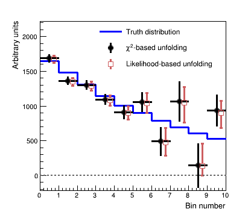
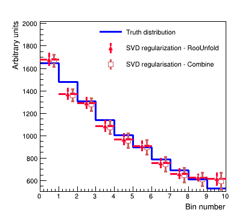

# Unfolding & regularization

This section details how to perform an unfolded cross-section measurement, *including regularization*, within <span style="font-variant:small-caps;">Combine</span>. 

There are many resources available that describe unfolding, including when to use it (or not), and what the common issues surrounding it are. For CMS users, useful summary is available in the [CMS Statistics Committee pages](https://twiki.cern.ch/twiki/bin/view/CMS/ScrecUnfolding) on unfolding. You can also 
find an overview of unfolding and its usage in <span style="font-variant:small-caps;">Combine</span> in [these slides](https://indico.cern.ch/event/399923/contributions/956409/attachments/800899/1097609/2015_06_24_LHCXSWG.pdf#search=Marini%20AND%20StartDate%3E%3D2015-06-24%20AND%20EndDate%3C%3D2015-06-24).

The basic idea behind the unfolding technique is to describe smearing introduced through the reconstruction (e.g. of the particle energy) in a given truth level bin $x_{i}$ through a linear relationship with the effects in the nearby truth-bins. We can make statements about the probability $p_{j}$ that the event falling in the truth bin $x_{i}$ is reconstructed in the bin $y_{i}$ via the linear relationship,

$$
y_{obs} = \tilde{\boldsymbol{R}}\cdot x_{true} + b
$$

or, if the truth bins are expressed relative to some particular model, we use the usual *signal strength* terminology, 

$$
y_{obs} = \boldsymbol{R}\cdot \mu + b
$$

Unfolding aims to find the distribution at truth level $x$, given the observations $y$ at reco-level.


## Likelihood-based unfolding

Since <span style="font-variant:small-caps;">Combine</span> has access to the full likelihood for any analysis written in the usual datacard format, we will use likelihood-based unfolding 
throughout - for other approaches, there are many other tools available (eg `RooUnfold` or `TUnfold`), which can be used instead. 

The benefits of the likelihood-based approach are that, 

* Background subtraction is accounted for directly in the likelihood
* Systematic uncertainties are accounted for directly during the unfolding as nuisance parameters
* We can profile the nuisance parameters during the unfolding to make the most of the data available 

In practice, one must construct the *response matrix* and unroll it in the reconstructed bins:

* First, one derives the truth distribution, e.g. after the generator-level selection only, $x_{i}$.
* Each reconstructed bin (e.g. each datacard) should describe the contribution from each truth bin - this is how <span style="font-variant:small-caps;">Combine</span> knows about the response matrix $\boldsymbol{R}$ 
and folds in the acceptance/efficiency effects as usual.
* The out-of-acceptance contributions can also be included in the above.

The model we use for this is then just the usual [`PhysicsModel:multiSignalModel`](https://github.com/cms-analysis/HiggsAnalysis-CombinedLimit/blob/main/python/PhysicsModel.py#L98), where each *signal* refers to a particular truth level bin. The results can be extracted through a 
simple maximum-likelihood fit with, 

```
    text2workspace.py -m 125 --X-allow-no-background -o datacard.root datacard.txt
       -P HiggsAnalysis.CombinedLimit.PhysicsModel:multiSignalModel --PO map='.*GenBin0.*:r_Bin0[1,-1,20]' --PO map='.*GenBin1.*:r_Bin1[1,-1,20]' --PO map='.*GenBin2.*:r_Bin2[1,-1,20]' --PO map='.*GenBin3.*:r_Bin3[1,-1,20]' --PO map='.*GenBin4.*:r_Bin4[1,-1,20]'

    combine -M MultiDimFit --setParameters=r_Bin0=1,r_Bin1=1,r_Bin2=1,r_Bin3=1,r_Bin4=1 -t -1 -m 125 datacard.root
    combine -M MultiDimFit --setParameters=r_Bin0=1,r_Bin1=1,r_Bin2=1,r_Bin3=1,r_Bin4=1 -t -1 -m 125 --algo=grid --points=100 -P r_Bin1 --setParameterRanges r_Bin1=0.5,1.5 --floatOtherPOIs=1 datacard.root
```

Notice that one can also perform the so called bin-by-bin unfolding (though it is strongly discouraged, except for testing) with, 

```
    text2workspace.py -m 125 --X-allow-no-background -o datacard.root datacard.txt
      -P HiggsAnalysis.CombinedLimit.PhysicsModel:multiSignalModel --PO map='.*RecoBin0.*:r_Bin0[1,-1,20]' --PO map='.*RecoBin1.*:r_Bin1[1,-1,20]' --PO map='.*RecoBin2.*:r_Bin2[1,-1,20]' --PO map='.*RecoBin3.*:r_Bin3[1,-1,20]' --PO map='.*RecoBin4.*:r_Bin4[1,-1,20]'
```

Nuisance parameters can be added to the likelihood function and profiled in the usual way via the datacards. Theory uncertainties on the inclusive cross section are typically not included in unfolded measurements.

The figure below shows a comparison of likelihood-based unfolding and a least-squares based unfolding as implemented in `RooUnfold`. 

/// details | **Show comparison**



///

## Regularization

The main difference with respect to other models with multiple signal contributions is the introduction of **Regularization**, which is used to stabilize the unfolding process. 

An example of unfolding in <span style="font-variant:small-caps;">Combine</span> with and without regularization, can be found under 
[data/tutorials/regularization](https://github.com/cms-analysis/HiggsAnalysis-CombinedLimit/tree/102x/data/tutorials/regularization). 

Running `python createWs.py [-r]` will create a simple datacard and perform a fit both with and without including regularization.

The simplest way to introduce regularization in the likelihood based approach, is to apply a penalty term, which 
depends on the values of the truth bins, in the likelihood function (so-called *Tikhonov regularization*):

$$
-2\ln L = -2\ln L + P(\vec{x}) 
$$

Here, $P$ is a linear operator. There are two different approaches that are supported to construct $P$.
If you run `python makeModel.py`, you will create a more complex datacard with the two regularization schemes implemented. You will need 
to uncomment the relevant sections of code to activate `SVD` or `TUnfold`-type regularization.

!!! warning
    When using any unfolding method with regularization, you must perform studies of the potential bias/coverage properties introduced through the 
inclusion of regularization, and how strong the associated regularization is. Advice on this can be found in the CMS Statistics Committee pages. 

### Singular Value Decomposition (SVD)

In the SVD approach - as described in the SVD paper - the penalty term is constructed directly based on the strengths ($\vec{\mu}=\{\mu_{i}\}_{i=1}^{N}$), 

$$
P = \tau\left| A\cdot \vec{\mu} \right|^{2},
$$

where $A$ is typically the discrete curvature matrix, with 

$$
A = 
\begin{bmatrix} 
1 & -1 & ... \\
1 & -2 & 1 &  ... \\
... 
\end{bmatrix}
$$

Penalty terms on the derivatives can also be included. Such a penalty term is included by modifying the likelihood to include one constraint for each 
row of the product $A\cdot\vec{\mu}$, by including them as lines in the datacard of the form, 

```
    name constr formula dependents delta
```
where the regularization strength is $\delta=\frac{1}{\sqrt{\tau}}$ and can either be a fixed value (e.g. by directly putting `0.01`) or as 
a modifiable parameter with e.g. `delta[0.01]`. 

For example, for 3 bins and a regularization strength of 0.03, the first line would be 

```
    name constr @0-2*@2+@1 r_Bin0,r_Bin1,r_Bin2 0.03
```

Alternative valid syntaxes are  

```
    constr1 constr r_bin0-r_bin1 0.01
    constr1 constr r_bin0-r_bin1 delta[0.01]
    constr1 constr r_bin0+r_bin1 r_bin0,r_bin1 0.01
    constr1 constr r_bin0+r_bin1 {r_bin0,r_bin1} delta[0.01]
```

The figure below shows an example unfolding using the "SVD regularization" approach with the least squares method (as implemented by `RooUnfold`) and implemented as a penalty term added to the likelihood using the maximum likelihood approach in <span style="font-variant:small-caps;">Combine</span>.

/// details | **Show comparison**



///

### TUnfold method

The Tikhonov regularization as implemented in `TUnfold` uses the MC information, or rather the density prediction, as a bias vector. 
In order to give this information to <span style="font-variant:small-caps;">Combine</span>, a single datacard for each reconstruction-level bin needs to be produced, so that we have access to the proper normalization terms during the minimization. In this case the bias vector is $\vec{x}_{obs}-\vec{x}_{true}$ 

Then one can write a constraint term in the datacard via, for example,

```
    constr1 constr (r_Bin0-1.)*(shapeSig_GenBin0_RecoBin0__norm+shapeSig_GenBin0_RecoBin1__norm+shapeSig_GenBin0_RecoBin2__norm+shapeSig_GenBin0_RecoBin3__norm+shapeSig_GenBin0_RecoBin4__norm)+(r_Bin2-1.)*(shapeSig_GenBin2_RecoBin0__norm+shapeSig_GenBin2_RecoBin1__norm+shapeSig_GenBin2_RecoBin2__norm+shapeSig_GenBin2_RecoBin3__norm+shapeSig_GenBin2_RecoBin4__norm)-2*(r_Bin1-1.)*(shapeSig_GenBin1_RecoBin0__norm+shapeSig_GenBin1_RecoBin1__norm+shapeSig_GenBin1_RecoBin2__norm+shapeSig_GenBin1_RecoBin3__norm+shapeSig_GenBin1_RecoBin4__norm) {r_Bin0,r_Bin1,r_Bin2,shapeSig_GenBin1_RecoBin0__norm,shapeSig_GenBin0_RecoBin0__norm,shapeSig_GenBin2_RecoBin0__norm,shapeSig_GenBin1_RecoBin1__norm,shapeSig_GenBin0_RecoBin1__norm,shapeSig_GenBin2_RecoBin1__norm,shapeSig_GenBin1_RecoBin2__norm,shapeSig_GenBin0_RecoBin2__norm,shapeSig_GenBin2_RecoBin2__norm,shapeSig_GenBin1_RecoBin3__norm,shapeSig_GenBin0_RecoBin3__norm,shapeSig_GenBin2_RecoBin3__norm,shapeSig_GenBin1_RecoBin4__norm,shapeSig_GenBin0_RecoBin4__norm,shapeSig_GenBin2_RecoBin4__norm} delta[0.03]
```

