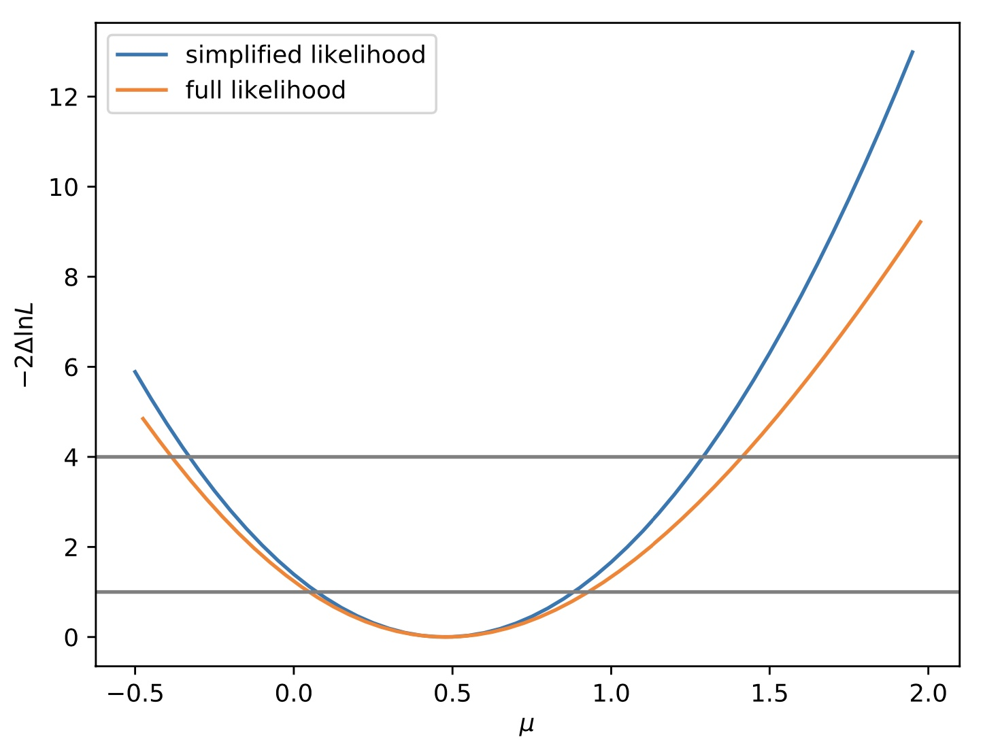

# Procedure for creating and validating simplified likelihood inputs

This page is to give a brief outline for the creation of (potentially aggregated) predictions and their covariance to facilitate external reinterpretation using the simplified likelihood (SL) approach. Instructions for validating the simplified likelihood method (detailed in the CMS note [here](https://cds.cern.ch/record/2242860/files/NOTE2017_001.pdf) and "[The Simplified Likelihood Framework](https://link.springer.com/article/10.1007/JHEP04(2019)064)" paper) are also given.

## Requirements 

You need an up to date version of <span style="font-variant:small-caps;">Combine</span>. Note You should use the latest release of <span style="font-variant:small-caps;">Combine</span> for the exact commands on this page. You should be using <span style="font-variant:small-caps;">Combine</span> tag `v9.0.0` or higher or the latest version of the `112x` branch to follow these instructions.  

You will find the python scripts needed to convert <span style="font-variant:small-caps;">Combine</span> outputs into simplified likelihood inputs under `test/simplifiedLikelihood`

If you're using the `102x` branch (not recommended), then you can obtain these scripts from here by running: 
```
curl -s https://raw.githubusercontent.com/nucleosynthesis/work-tools/master/sparse-checkout-SL-ssh.sh > checkoutSL.sh
bash checkoutSL.sh
ls work-tools/stats-tools
```

If you also want to validate your inputs and perform fits/scans using them, you can use the package [SLtools](https://gitlab.cern.ch/SimplifiedLikelihood/SLtools/-/blob/master/README.md) from [The Simplified Likelihood Framework](https://link.springer.com/article/10.1007/JHEP04(2019)064) paper for this.
```
git clone https://gitlab.cern.ch/SimplifiedLikelihood/SLtools.git
```

## Producing covariance for recasting

Producing the necessary predictions and covariance for recasting varies depending on whether or not control regions are explicitly included in the datacard when running fits. Instructions for cases where the control regions *are* and *are not* included are detailed below.

!!! warning
    The instructions below will calculate moments based on the assumption that $E[x]=\hat{x}$, i.e it will use the maximum likelihood estimators for the yields as the expectation values. If instead you want to use the full definition of the moments, you can run the `FitDiagnostics` method with the `-t` option and include `--savePredictionsPerToy` and remove the other options, which will produce a tree of the toys in the output from which moments can be calculated. 

### Type A - Control regions included in datacard

For an example datacard 'datacard.txt' including two signal channels 'Signal1' and 'Signal2', make the workspace including the masking flags

```
text2workspace.py --channel-masks --X-allow-no-signal --X-allow-no-background datacard.txt -o datacard.root
```
    
Run the fit making the covariance (output saved as `fitDiagnostics.root`) masking the signal channels. Note that all signal channels must be masked!

```
combine datacard.root -M FitDiagnostics --saveShapes --saveWithUnc --numToysForShape 2000 --setParameters mask_Signal1=1,mask_Signal2=1 --saveOverall  -N Name
```
Where "Name" can be specified by you.

Outputs, including predictions and covariance, will be saved in `fitDiagnosticsName.root` folder `shapes_fit_b`

### Type B - Control regions not included in datacard 

For an example datacard 'datacard.txt' including two signal channels 'Signal1' and 'Signal2', make the workspace
    
```
text2workspace.py --X-allow-no-signal --X-allow-no-background datacard.txt -o datacard.root
```
    
Run the fit making the covariance (output saved as `fitDiagnosticsName.root`) setting no pre-fit signal contribution. Note we *must* set `--preFitValue 0` in this case since, we will be using the pre-fit uncertainties for the covariance calculation and we do not want to include the uncertainties on the signal. 

```
combine datacard.root -M FitDiagnostics --saveShapes --saveWithUnc --numToysForShape 2000 --saveOverall --preFitValue 0   -n Name
```
Where "Name" can be specified by you.

Outputs, including predictions and covariance, will be saved in `fitDiagnosticsName.root` folder `shapes_prefit`

In order to also extract the signal yields corresponding to `r=1` (in case you want to run the validation step later), you also need to produce a second file with the pre-fit value set to 1. For this you do not need to run many toys. To save time you can set `--numToysForShape` to a low value. 

```
combine datacard.root -M FitDiagnostics --saveShapes --saveWithUnc --numToysForShape 1 --saveOverall --preFitValue 1   -n Name2
```

You should check that the order of the bins in the covariance matrix is as expected.


## Produce simplified likelihood inputs

Head over to the `test/simplifiedLikelihoods` directory inside your <span style="font-variant:small-caps;">Combine</span> area. The following instructions depend on whether you are aggregating or not aggregating your signal regions. Choose the instructions for your case. 

### Not Aggregating    
Run the `makeLHInputs.py` script to prepare the inputs for the simplified likelihood. The filter flag can be used to select only signal regions based on the channel names. To include all channels do not include the filter flag.

The SL input must NOT include any control regions that were not masked in the fit.
 
If your analysis is Type B (i.e everything in the datacard is a signal region), then you can just run 

```
python makeLHInputs.py -i fitDiagnosticsName.root -o SLinput.root 
```

If necessary (i.e as in Type B analyses) you may also need to run the same on the output of the run where the pre-fit value was set to 1. 

```
python makeLHInputs.py -i fitDiagnosticsName2.root -o SLinput2.root 
```

If you instead have a Type A analysis (some of the regions are control regions that were used to fit but not masked) then you should add the option `--filter SignalName` where `SignalName` is some string that defines the signal regions in your datacards (for example, "SR" is a common name for these).

Note: If your signal regions cannot be easily identified by a string, follow the instructions below for aggregating, but define only one channel for each aggregate region. This will maintain the full information and will not actually aggregate any regions.


### Aggregating    
If aggregating based on covariance, edit the config file `aggregateCFG.py` to define aggregate regions based on channel names. Note that wildcards are supported. You can then make likelihood inputs using
    
```
python makeLHInputs.py -i fitDiagnosticsName.root -o SLinput.root --config aggregateCFG.py
```

At this point you have the inputs as ROOT files necessary to publish and run the simplified likelihood. 

## Validating the simplified likelihood approach

The simplified likelihood relies on several assumptions (detailed in the documentation at the top). To test the validity for your analysis, statistical results between <span style="font-variant:small-caps;">Combine</span> and the simplified likelihood can be compared. 

We will use the package [SLtools](https://gitlab.cern.ch/SimplifiedLikelihood/SLtools/-/blob/master/README.md) from the [Simplified Likelihood Paper](https://link.springer.com/article/10.1007/JHEP04(2019)064) for this. The first step is to convert the ROOT files into python configs to run in the tool. 

### Convert ROOT to Python 

If you followed the steps above, you have all of the histograms already necessary to generate the python configs. The script `test/simplifiedLikelihoods/convertSLRootToPython.py`  can be used to do the conversion. Just provide the following options when running with python.

   * `-O/--outname` : The output python file containing the model (default is `test.py`)
   * `-s/--signal` : The signal histogram, should be of format `file.root:location/to/histogram`
   * `-b/--background` : The background histogram, should be of format `file.root:location/to/histogram`
   * `-d/--data` : The data TGraph, should be of format `file.root:location/to/graph`
   * `-c/--covariance` : The covariance TH2 histogram, should be of format `file.root:location/to/histogram`

For example, to get the correct output from a Type B analysis with no aggregating, you can run 

```sh
python test/simplifiedLikelihoods/convertSLRootToPython.py -O mymodel.py -s SLinput.root:shapes_prefit/total_signal  -b SLinput.root:shapes_prefit/total_M2 d -d SLinput.root:shapes_prefit/total_data -c SLinput.root:shapes_prefit/total_M2
```

The output will be a python file with the right format for the SL tool. You can mix different ROOT files for these inputs. Note that the `SLtools` package also has some tools to covert `.yaml`-based inputs into the python config for you.

### Run a likelihood scan with the SL 

If you have checked out the [SLtools](https://gitlab.cern.ch/SimplifiedLikelihood/SLtools/-/blob/master/README.md), you can create a simple python script as the one below to produce a scan of the simplified likelihood from your inputs.

```python
#! /usr/bin/env python
import simplike as sl

exec(open("mymodel.py").read())
slp1 = sl.SLParams(background, covariance, obs=data, sig=signal)

import numpy as np
npoints = 50
mus = np.arange(-0.5, 2, (2+0.5)/npoints)
tmus1 = [slp1.tmu(mu) for mu in mus]
from matplotlib import pyplot as plt
plt.plot(mus,tmus1)
plt.show()
```

Where the `mymodel.py` config is a simple python file defined as;

   * `data` : A python array of observed data, one entry per bin.
   * `background` : A python array of expected background, one entry per bin.
   * `covariance` : A python array of the covariance between expected backgrounds. The format is a flat array which is converted into a 2D array inside the tool
   * `signal` : A python array of the expected signal, one entry per bin. This should be replaced with whichever signal model you are testing.

This `model.py` can also just be the output of the previous section converted from the ROOT files for you.

The example below is from the note CMS-NOTE-2017-001

<details>
<summary><b>Show example</b></summary>
    
<pre><code>
import numpy
import array

name = "CMS-NOTE-2017-001 dummy model"
nbins = 8
data = array.array('d',[1964,877,354,182,82,36,15,11])
background = array.array('d',[2006.4,836.4,350.,147.1,62.0,26.2,11.1,4.7])
signal = array.array('d',[47,29.4,21.1,14.3,9.4,7.1,4.7,4.3])
covariance = array.array('d', [ 18774.2, -2866.97, -5807.3, -4460.52, -2777.25, -1572.97, -846.653, -442.531, -2866.97, 496.273, 900.195, 667.591, 403.92, 222.614, 116.779, 59.5958, -5807.3, 900.195, 1799.56, 1376.77, 854.448, 482.435, 258.92, 134.975, -4460.52, 667.591, 1376.77, 1063.03, 664.527, 377.714, 203.967, 106.926, -2777.25, 403.92, 854.448, 664.527, 417.837, 238.76, 129.55, 68.2075, -1572.97, 222.614, 482.435, 377.714, 238.76, 137.151, 74.7665, 39.5247, -846.653, 116.779, 258.92, 203.967, 129.55, 74.7665, 40.9423, 21.7285, -442.531, 59.5958, 134.975, 106.926, 68.2075, 39.5247, 21.7285, 11.5732])
</pre></code>
</details>

## Example using tutorial datacard

For this example, we will use the tutorial datacard `data/tutorials/longexercise/datacard_part3.txt`. This datacard is of **Type B** since there are no control regions (all regions are signal regions). 

First, we will create the binary file (run `text2workspace`)
```
text2workspace.py --X-allow-no-signal --X-allow-no-background data/tutorials/longexercise/datacard_part3.txt  -m 200
```

And next, we will generate the covariance between the bins of the background model. 
```
combine data/tutorials/longexercise/datacard_part3.root -M FitDiagnostics --saveShapes --saveWithUnc --numToysForShape 10000 --saveOverall --preFitValue 0   -n SimpleTH1 -m 200

combine data/tutorials/longexercise/datacard_part3.root -M FitDiagnostics --saveShapes --saveWithUnc --numToysForShape 1 --saveOverall --preFitValue 1   -n SimpleTH1_Signal1 -m 200
```
We will also want to compare our scan to that from the full likelihood, which we can get as usual from <span style="font-variant:small-caps;">Combine</span>. 

```
combine -M MultiDimFit data/tutorials/longexercise/datacard_part3.root --rMin -0.5 --rMax 2 --algo grid -n SimpleTH1 -m 200
```

Next, since we do not plan to aggregate any of the bins, we will follow the instructions for this and pick out the right covariance matrix.

```
python test/simplifiedLikelihoods/makeLHInputs.py -i fitDiagnosticsSimpleTH1.root -o SLinput.root 

python test/simplifiedLikelihoods/makeLHInputs.py -i fitDiagnosticsSimpleTH1_Signal1.root -o SLinput_Signal1.root 
```

We now have everything we need to provide the simplified likelihood inputs:

```
$ root -l SLinput.root
root [0] .ls

Attaching file SLinput.root as _file0...
(TFile *) 0x3667820
root [1] .ls
TFile**         SLinput.root
 TFile*         SLinput.root
  KEY: TDirectoryFile   shapes_fit_b;1  shapes_fit_b
  KEY: TDirectoryFile   shapes_prefit;1 shapes_prefit
  KEY: TDirectoryFile   shapes_fit_s;1  shapes_fit_s
```

We can convert this to a python module that we can use to run a scan with the `SLtools` package. Note, since we have a **Type B** datacard, we will be using the *pre-fit* covariance matrix. Also, this means we want to take the signal from the file where the prefit value of `r` was 1. 

```
python test/simplifiedLikelihoods/convertSLRootToPython.py -O mymodel.py -s SLinput_Signal1.root:shapes_prefit/total_signal  -b SLinput.root:shapes_prefit/total_M1-d SLinput.root:shapes_prefit/total_data -c SLinput.root:shapes_prefit/total_M2
```

We can compare the profiled likelihood scans from our simplified likelihood (using the python file we just created) and from the full likelihood (that we created with <span style="font-variant:small-caps;">Combine</span>.). For the former, we need to first checkout the `SLtools` package 

```
git clone https://gitlab.cern.ch/SimplifiedLikelihood/SLtools.git
mv higgsCombineSimpleTH1.MultiDimFit.mH200.root SLtools/ 
mv mymodel.py SLtools/
cd SLtools
```

The script below will create a plot of the comparison for us. 

```python
#! /usr/bin/env python
import simplike as sl

exec(open("mymodel.py").read())

slp1 = sl.SLParams(background, covariance, obs=data, sig=signal)

import ROOT 
fi = ROOT.TFile.Open("higgsCombineSimpleTH1.MultiDimFit.mH200.root")
tr = fi.Get("limit")

points = []
for i in range(tr.GetEntries()):
  tr.GetEntry(i)
  points.append([tr.r,2*tr.deltaNLL])
points.sort()

mus2=[pt[0] for pt in points]
tmus2=[pt[1] for pt in points]

import numpy as np
npoints = 50
mus1 = np.arange(-0.5, 2, (2+0.5)/npoints)
tmus1 = [slp1.tmu(mu) for mu in mus1]

from matplotlib import pyplot as plt
plt.plot(mus1,tmus1,label='simplified likelihood')
plt.plot(mus2,tmus2,label='full likelihood')
plt.legend()
plt.xlabel("$\mu$")
plt.ylabel("$-2\Delta \ln L$")

plt.savefig("compareLH.pdf")
```
This will produce a figure like the one below. 



It is also possible to include the third moment of each bin to improve the precision of the simplified likelihood [ [JHEP 64 2019](https://link.springer.com/article/10.1007/JHEP04(2019)064) ]. The necessary information is stored in the outputs from <span style="font-variant:small-caps;">Combine</span>, therefore you just need to include the option `-t SLinput.root:shapes_prefit/total_M3` in the options list for `convertSLRootToPython.py` to  include this in the model file. The third moment information can be included in `SLtools` by using ` sl.SLParams(background, covariance, third_moment, obs=data, sig=signal)`
