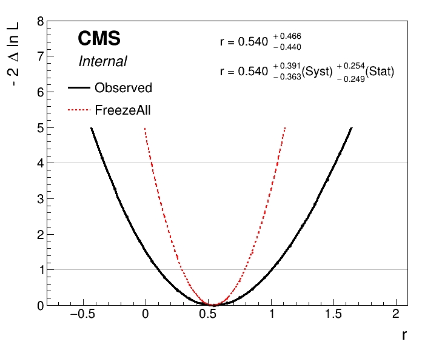

# Long exercise: main features of Combine
This exercise is designed to give a broad overview of the tools available for statistical analysis in CMS using the combine tool. Combine is a high-level tool for building RooFit/RooStats models and running common statistical methods. We will cover the typical aspects of setting up an analysis and producing the results, as well as look at ways in which we can diagnose issues and get a deeper understanding of the statistical model. This is a long exercise - expect to spend some time on it especially if you are new to Combine. If you get stuck while working through this exercise or have questions specifically about the exercise, you can ask them on [this mattermost channel](https://mattermost.web.cern.ch/cms-exp/channels/hcomb-tutorial). Finally, we also provide some solutions to some of the questions that are asked as part of the exercise. These are available [here](https://cms-analysis.github.io/HiggsAnalysis-CombinedLimit/part5/longexerciseanswers).

For the majority of this course we will work with a simplified version of a real analysis, that nonetheless will have many features of the full analysis. The analysis is a search for an additional heavy neutral Higgs boson decaying to tau lepton pairs. Such a signature is predicted in many extensions of the standard model, in particular the minimal supersymmetric standard model (MSSM). You can read about the analysis in the paper [here](https://arxiv.org/pdf/1803.06553.pdf). The statistical inference makes use of a variable called the total transverse mass ($M_{\mathrm{T}}^{\mathrm{tot}}$) that provides good discrimination between the resonant high-mass signal and the main backgrounds, which have a falling distribution in this high-mass region. The events selected in the analysis are split into a several categories which target the main di-tau final states as well as the two main production modes: gluon-fusion (ggH) and b-jet associated production (bbH). One example is given below for the fully-hadronic final state in the b-tag category which targets the bbH signal:


Initially we will start with the simplest analysis possible: a one-bin counting experiment using just the high $M_{\mathrm{T}}^{\mathrm{tot}}$ region of this distribution, and from there each section of this exercise will expand on this, introducing a shape-based analysis and adding control regions to constrain the backgrounds.

## Getting started
We need to set up a new CMSSW area and checkout the combine package: 

```shell
export SCRAM_ARCH=slc7_amd64_gcc700
cmsrel CMSSW_10_2_13
cd CMSSW_10_2_13/src
cmsenv
git clone https://github.com/cms-analysis/HiggsAnalysis-CombinedLimit.git HiggsAnalysis/CombinedLimit
cd HiggsAnalysis/CombinedLimit

cd $CMSSW_BASE/src/HiggsAnalysis/CombinedLimit
git fetch origin
git checkout v8.1.0

cd $CMSSW_BASE/src
```
We will also make use another package, `CombineHarvester`, which contains some high-level tools for working with combine. The following command will download the repository and checkout just the parts of it we need for this tutorial:
```shell
bash <(curl -s https://raw.githubusercontent.com/cms-analysis/CombineHarvester/master/CombineTools/scripts/sparse-checkout-https.sh)
```
Now make sure the CMSSW area is compiled:
```shell 
scramv1 b clean; scramv1 b
```
Finally we will checkout the working directory for these tutorials - this contains all the inputs needed to run the exercises below:

```shell
cd $CMSSW_BASE/src
git clone https://gitlab.cern.ch/agilbert/cms-das-stats.git
cd cms-das-stats
```
## Part 1: A one-bin counting experiment

Topics covered in this section:

  - A: Computing limits using the asymptotic approximation
  - Advanced section: B: Computing limits with toys

We will begin with a simplified version of a datacard from the MSSM $\phi\rightarrow\tau\tau$ analysis that has been converted to a one-bin counting experiment, as described above. While the full analysis considers a range of signal mass hypotheses, we will start by considering just one: $m_{\phi}$=800GeV. Click the text below to study the datacard (`datacard_part1.txt` in the `cms-das-stats` directory):

<details>
<summary><b>Show datacard</b></summary>
```shell
imax    1 number of bins
jmax    4 number of processes minus 1
kmax    * number of nuisance parameters
--------------------------------------------------------------------------------
--------------------------------------------------------------------------------
bin          signal_region
observation  10.0
--------------------------------------------------------------------------------
bin                      signal_region   signal_region   signal_region   signal_region   signal_region
process                  ttbar           diboson         Ztautau         jetFakes        bbHtautau
process                  1               2               3               4               0
rate                     4.43803         3.18309         3.7804          1.63396         0.711064
--------------------------------------------------------------------------------
CMS_eff_b          lnN   1.02            1.02            1.02            -               1.02
CMS_eff_t          lnN   1.12            1.12            1.12            -               1.12
CMS_eff_t_highpt   lnN   1.1             1.1             1.1             -               1.1
acceptance_Ztautau lnN   -               -               1.08            -               -
acceptance_bbH     lnN   -               -               -               -               1.05
acceptance_ttbar   lnN   1.005           -               -               -               -
lumi_13TeV         lnN   1.025           1.025           1.025           -               1.025
norm_jetFakes      lnN   -               -               -               1.2             -
xsec_Ztautau       lnN   -               -               1.04            -               -
xsec_diboson       lnN   -               1.05            -               -               -
xsec_ttbar         lnN   1.06            -               -               -               -
```
</details>

The layout of the datacard is as follows:

  -   At the top are the numbers `imax`, `jmax` and `kmax` representing the number of bins, processes and nuisance parameters respectively. Here a "bin" can refer to a literal single event count as in this example, or a full distribution we are fitting, in general with many histogram bins, as we will see later. We will refer to both as "channels" from now on. It is possible to replace these numbers with `*` and they will be deduced automatically.
  -   The first line starting with `bin` gives a unique label to each channel, and the following line starting with `observation` gives the number of events observed in data.
  -   In the remaining part of the card there are several columns: each one represents one process in one channel. The first four lines labelled `bin`, `process`, `process` and `rate` give the channel label, the process label, a process identifier (`<=0` for signal, `>0` for background) and the number of expected events respectively.
  -   The remaining lines describe sources of systematic uncertainty. Each line gives the name of the uncertainty, (which will become the name of the nuisance parameter inside our RooFit model), the type of uncertainty ("lnN" = log-normal normalisation uncertainty) and the effect on each process in each channel. E.g. a 20% uncertainty on the yield is written as 1.20.
  -   It is also possible to add a hash symbol (`#`) at the start of a line, which combine will then ignore when it reads the card.


We can now run combine directly using this datacard as input. The general format for running combine is:

```shell
combine -M [method] [datacard] [additional options...]
```

### A: Computing limits using the asymptotic approximation 

As we are searching for a signal process that does not exist in the standard mode, it's natural to set an upper limit on the cross section times branching fraction of the process (assuming our dataset does not contain a significant discovery of new physics). Combine has dedicated method for calculating upper limits. The most commonly used one is `AsymptoticLimits`, which implements the CLs criterion and uses the profile likelihood ratio as the test statistic. As the name implies, the test statistic distributions are determined analytically in the asymptotic approximation, so there is no need for more time-intensive toy throwing and fitting. Try running the following command:

```shell
combine -M AsymptoticLimits datacard_part1.txt -n .part1A
```

You should see the results of the observed and expected limit calculations printed to the screen. Here we have added an extra option, `-n .part1A`, which is short for `--name`, and is used to label the output file combine produces, which in this case will be called `higgsCombine.part1A.AsymptoticLimits.mH120.root`. The file name depends on the options we ran with, and is of the form: `higgsCombine[name].[method].mH[mass].root`. The file contains a TTree called `limit` which stores the numerical values returned by the limit computation. Note that in our case we did not set a signal mass when running combine (i.e. `-m 800`), so the output file just uses the default value of `120`. This does not affect our result in any way though, just the label that is used on the output file.

The limits are given on a parameter called `r`. This is the default **parameter of interest (POI)** that is added to the model automatically. It is a linear scaling of the normalisation of all signal processes given in the datacard, i.e. if $s_{i,j}$ is the nominal number of signal events in channel $i$ for signal process $j$, then the normalisation of that signal in the model is given as $r\cdot s_{i,j}(\vec{\theta})$, where $\vec{\theta}$ represents the set of nuisance parameters which may also affect the signal normalisation. We therefore have some choice in the interpretation of r: for the measurement of a process with a well defined SM prediction we may enter this as the nominal yield in the datacard, such that $r=1$ corresponds to this SM expectation, whereas for setting limits on BSM processes we may choose the nominal yield to correspond to some cross section, e.g. 1 pb, such that we can interpret the limit as a cross section limit directly. In this example the signal has been normalised to a cross section times branching fraction of 1 fb.

The expected limit is given under the background-only hypothesis. The median value under this hypothesis as well as the quantiles needed to give the 68% and 95% intervals are also calculated. These are all the ingredients needed to produce the standard limit plots you will see in many CMS results, for example the $\sigma \times \mathcal{B}$ limits for the $\text{bb}\phi\rightarrow\tau\tau$ process:


In this case we only computed the values for one signal mass hypothesis, indicated by a red dashed line.

**Tasks and questions:**

  -   There are some important uncertainties missing from the datacard above. Add the uncertainty on the luminosity (name: `lumi_13TeV`) which has a 2.5% effect on all processes (except the `jetFakes`, which are taken from data), and uncertainties on the inclusive cross sections of the `Ztautau` and `ttbar` processes (with names `xsec_Ztautau` and `xsec_diboson`) which are 4% and 6% respectively.
  -   Try changing the values of some uncertainties (up or down, or removing them altogether) - how do the expected and observed limits change?
  -   Now try changing the number of observed events. The observed limit will naturally change, but the expected does too - why might this be?


There are other command line options we can supply to combine which will change its behaviour when run. You can see the full set of supported options by doing `combine -h`. Many options are specific to a given method, but others are more general and are applicable to all methods. Throughout this tutorial we will highlight some of the most useful options you may need to use, for example:

  - The range on the signal strength modifier: `--rMin=X` and `--rMax=Y`: In RooFit parameters can optionally have a range specified. The implication of this is that their values cannot be adjusted beyond the limits of this range. The min and max values can be adjusted though, and we might need to do this for our POI `r` if the order of magnitude of our measurement is different from the default range of `[0, 20]`. This will be discussed again later in the tutorial.
  - Verbosity: `-v X`: By default combine does not usually produce much output on the screen other the main result at the end. However, much more detailed information can be printed by setting the `-v N` with N larger than zero. For example at `-v 3` the logs from the minimizer, Minuit, will also be printed. These are very useful for debugging problems with the fit.

### Advanced section: B: Computing limits with toys
Now we will look at computing limits without the asymptotic approximation, so instead using toy datasets to determine the test statistic distributions under the signal+background and background-only hypotheses. This can be necessary if we are searching for signal in bins with a small number of events expected. In combine we will use the `HybridNew` method to calculate limits using toys. This mode is capable of calculating limits with several different test statistics and with fine-grained control over how the toy datasets are generated internally. To calculate LHC-style profile likelihood limits (i.e. the same as we did with the asymptotic) we set the option `--LHCmode LHC-limits`. You can read more about the different options in the [Combine documentation](http://cms-analysis.github.io/HiggsAnalysis-CombinedLimit/part3/commonstatsmethods/#computing-limits-with-toys).

Run the following command:
```shell
combine -M HybridNew datacard_part1.txt --LHCmode LHC-limits -n .part1B --saveHybridResult --fork 0
```
In contrast to `AsymptoticLimits` this will only determine the observed limit, and will take around five minutes. There will not be much output to the screen while combine is running. You can add the option `-v 1` to get a better idea of what is going on. You should see combine stepping around in `r`, trying to find the value for which CLs = 0.05, i.e. the 95% CL limit. The `--saveHybridResult` option will cause the test statistic distributions that are generated at each tested value of `r` to be saved in the output ROOT file.

To get an expected limit add the option `--expectedFromGrid X`, where `X` is the desired quantile, e.g. for the median:

```shell
combine -M HybridNew datacard_part1.txt --LHCmode LHC-limits -n .part1B --saveHybridResult --fork 0 --expectedFromGrid 0.500
```

Calculate the median expected limit and the 68% range. The 95% range could also be done, but note it will take much longer to run the 0.025 quantile. While combine is running you can move on to the next steps below.

**Tasks and questions:**
- In contrast to `AsymptoticLimits`, with `HybridNew` each limit comes with an uncertainty. What is the origin of this uncertainty?
- How good is the agreement between the asymptotic and toy-based methods?
- Why does it take longer to calculate the lower expected quantiles (e.g. 0.025, 0.16)? Think about how the statistical uncertainty on the CLs value depends on CLs+b and CLb.

Next plot the test statistic distributions stored in the output file:
```shell
python $CMSSW_BASE/src/HiggsAnalysis/CombinedLimit/test/plotTestStatCLs.py --input higgsCombine.part1B.HybridNew.mH120.root --poi r --val all --mass 120
```

This produces a new ROOT file `cls_qmu_distributions.root` containing the plots, to save them as pdf/png files run this small script and look at the resulting figures:

```shell
python printTestStatPlots.py cls_qmu_distributions.root
```

#### Advanced exercises
These distributions can be useful in understanding features in the CLs limits, especially in the low statistics regime. To explore this, try reducing the observed and expected yields in the datacard by a factor of 10, and rerun the above steps to compare the observed and expected limits with the asymptotic approach, and plot the test statistic distributions.

**Tasks and questions:**

  - Is the asymptotic limit still a good approximation?
  - You might notice that the test statistic distributions are not smooth but rather have several "bump" structures? Where might this come from? Try reducing the size of the systematic uncertainties to make them more pronounced.

Note that for more complex models the fitting time can increase significantly, making it infeasible to run all the toy-based limits interactively like this. An alternative strategy is documented [here](http://cms-analysis.github.io/HiggsAnalysis-CombinedLimit/part3/commonstatsmethods/#complex-models)

## Part 2: A shape-based analysis

Topics covered in this section:

  - A: Setting up the datacard
  - B: Running combine for a blind analysis
  - C: Using FitDiagnostics
  - D: MC statistical uncertainties

### A: Setting up the datacard
Now we move to the next step: instead of a one-bin counting experiment we will fit a binned distribution. In a typical analysis we will produce TH1 histograms of some variable sensitive to the presence of signal: one for the data and one for each signal and background processes. Then we add a few extra lines to the datacard to link the declared processes to these shapes which are saved in a ROOT file, for example:

<details>
<summary><b>Show datacard</b></summary>
```shell
imax 1
jmax 1
kmax *
---------------
shapes * * simple-shapes-TH1_input.root $PROCESS $PROCESS_$SYSTEMATIC
shapes signal * simple-shapes-TH1_input.root $PROCESS$MASS $PROCESS$MASS_$SYSTEMATIC
---------------
bin bin1
observation 85
------------------------------
bin             bin1       bin1
process         signal     background
process         0          1
rate            10         100
--------------------------------
lumi     lnN    1.10       1.0
bgnorm   lnN    1.00       1.3
alpha  shape    -          1
```
</details>

Note that as with the one-bin card, the total nominal rate of a given process must be specified in the `rate` line of the datacard. This should agree with the value returned by `TH1::Integral`. However, we can also put a value of `-1` and the Integral value will be substituted automatically.

There are two other differences with respect to the one-bin card:

  - A new block of lines at the top defining how channels and processes are mapped to the histograms (more than one line can be used)
  - In the list of systematic uncertainties some are marked as shape instead of lnN

The syntax of the "shapes" line is: `shapes [process] [channel] [file] [histogram] [histogram_with_systematics]`. It is possible to use the `*` wildcard to map multiple processes and/or channels with one line. The histogram entries can contain the `$PROCESS`, `$CHANNEL` and `$MASS` place-holders which will be substituted when searching for a given (process, channel) combination. The value of `$MASS` is specified by the `-m` argument when combine. By default the observed data process name will be `data_obs`.

Shape uncertainties can be added by supplying two additional histograms for a process, corresponding to the distribution obtained by shifting that parameter up and down by one standard deviation. These shapes will be interpolated quadratically for shifts below $1\sigma$ and linearly beyond. The normalizations are interpolated linearly in log scale just like we do for log-normal uncertainties.


The final argument of the "shapes" line above should contain the `$SYSTEMATIC` place-holder which will be substituted by the systematic name given in the datacard.

In the list of uncertainties the interpretation of the values for `shape` lines is a bit different from `lnN`. The effect can be "-" or 0 for no effect, 1 for normal effect, and possibly something different from 1 to test larger or smaller effects (in that case, the unit Gaussian is scaled by that factor before using it as parameter for the interpolation).

In this section we will use a datacard corresponding to the full distribution that was shown at the start of section 1, not just the high mass region. Have a look at `datacard_part2.txt`: this is still currently a one-bin counting experiment, however the yields are much higher since we now consider the full range of $M_{\mathrm{T}}^{\mathrm{tot}}$. If you run the asymptotic limit calculation on this you should find the sensitivity is significantly worse than before.

The **first task** is to convert this to a shape analysis: the file `datacard_part2.shapes.root` contains all the necessary histograms, including those for the relevant shape systematic uncertainties. Add the relevant `shapes` lines to the top of the datacard (after the `kmax` line) to map the processes to the correct TH1s in this file. Hint: you will need a different line for the signal process.

Compared to the counting experiment we must also consider the effect of uncertainties that change the shape of the distribution. Some, like `CMS_eff_t_highpt`, were present before, as it has both a shape and normalisation effect. Others are primarily shape effects so were not included before.

Add the following shape uncertainties: `top_pt_ttbar_shape` affecting `ttbar`,the tau energy scale uncertainties `CMS_scale_t_1prong0pi0_13TeV`, `CMS_scale_t_1prong1pi0_13TeV` and `CMS_scale_t_3prong0pi0_13TeV` affecting all processes except `jetFakes`, and `CMS_eff_t_highpt` also affecting the same processes.

Once this is done you can run the asymptotic limit calculation on this datacard. From now on we will convert the text datacard into a RooFit workspace ourselves instead of combine doing it internally every time we run. This is a good idea for more complex analyses since the conversion step can take a notable amount of time. For this we use the `text2workspace.py` command:

```shell
text2workspace.py datacard_part2.txt -m 800 -o workspace_part2.root
```
And then we can use this as input to combine instead of the text datacard:
```shell
combine -M AsymptoticLimits workspace_part2.root -m 800
```
**Tasks and questions:**

  - Verify that the sensitivity of the shape analysis is indeed improved over the counting analysis in the first part.
  - *Advanced task*: You can open the workspace ROOT file interactively and print the contents: `w->Print();`. Each process is represented by a PDF object that depends on the shape morphing nuisance parameters. From the workspace, choose a process and shape uncertainty, and make a plot overlaying the nominal shape with different values of the shape morphing nuisance parameter. You can change the value of a parameter with `w->var("X")->setVal(Y)`, and access a particular pdf with `w->pdf("Z")`. PDF objects in RooFit have a [createHistogram](https://root.cern.ch/doc/master/classRooAbsReal.html#a552a08367c964e689515f2b5c92c8bbe) method that requires the name of the observable (the variable defining the x-axis) - this is called `CMS_th1x` in combine datacards. Feel free to ask for help with this!

### B: Running combine for a blind analysis
Most analyses are developed and optimised while we are "blind" to the region of data where we expect our signal to be. With `AsymptoticLimits` we can choose just to run the expected limit (`--run expected`), so as not to calculate the observed. However the data is still used, even for the expected, since in the frequentist approach a background-only fit to the data is performed to define the Asimov dataset used to calculate the expected limits. To skip this fit to data and use the pre-fit state of the model the option `--run blind` or `--noFitAsimov` can be used. **Task:** Compare the expected limits calculated with `--run expected` and `--run blind`. Why are they different?

A more general way of blinding is to use combine's toy and Asimov dataset generating functionality. You can read more about this [here](http://cms-analysis.github.io/HiggsAnalysis-CombinedLimit/part3/runningthetool/#toy-data-generation). These options can be used with any method in combine, not just `AsymptoticLimits`.

**Task:** Calculate a blind limit by generating a background-only Asimov with the `-t -1` option instead of using the `AsymptoticLimits` specific options. You should find the observed limit is the same as the expected. Then see what happens if you inject a signal into the Asimov dataset using the `--expectSignal [X]` option.

### C: Using FitDiagnostics
We will now explore one of the most commonly used modes of combine: `FitDiagnostics` . As well as allowing us to make a **measurement** of some physical quantity (as opposed to just setting a limit on it), this method is useful to gain additional information about the model and the behaviour of the fit. It performs two fits:

  - A "background-only" (b-only) fit: first POI (usually "r") fixed to zero
  - A "signal+background" (s+b) fit: all POIs are floating
 
With the s+b fit combine will report the best-fit value of our signal strength modifier `r`. As well as the usual output file, a file named `fitdiagnostics.root` is produced which contains additional information. In particular it includes two `RooFitResult` objects, one for the b-only and one for the s+b fit, which store the fitted values of all the **nuisance parameters (NPs)** and POIs as well as estimates of their uncertainties. The covariance matrix from both fits is also included, from which we can learn about the correlations between parameters. Run the `FitDiagnostics` method on our workspace:

```shell
combine -M FitDiagnostics workspace_part2.root -m 800 --rMin -20 --rMax 20
```
Open the resulting `fitDiagnostics.root` interactively and print the contents of the s+b RooFitResult:

```shell
root [1] fit_s->Print()
```
<details>
<summary><b>Show output</b></summary>
```shell
 RooFitResult: minimized FCN value: -4.7666, estimated distance to minimum: 3.31389e-05
                covariance matrix quality: Full, accurate covariance matrix
                Status : MINIMIZE=0 HESSE=0

   Floating Parameter    FinalValue +/-  Error
--------------------  --------------------------
             CMS_eff_b   -4.3559e-02 +/-  9.87e-01
             CMS_eff_t   -2.6382e-01 +/-  7.27e-01
      CMS_eff_t_highpt   -4.7214e-01 +/-  9.56e-01
      CMS_scale_t_1prong0pi0_13TeV   -1.5884e-01 +/-  5.89e-01
      CMS_scale_t_1prong1pi0_13TeV   -1.6512e-01 +/-  4.91e-01
      CMS_scale_t_3prong0pi0_13TeV   -3.0668e-01 +/-  6.03e-01
    acceptance_Ztautau   -3.1059e-01 +/-  8.57e-01
        acceptance_bbH   -5.8325e-04 +/-  9.94e-01
      acceptance_ttbar    4.7839e-03 +/-  9.94e-01
            lumi_13TeV   -5.4684e-02 +/-  9.83e-01
         norm_jetFakes   -9.3975e-02 +/-  2.54e-01
                     r   -2.7327e+00 +/-  2.57e+00
    top_pt_ttbar_shape    1.7614e-01 +/-  6.97e-01
          xsec_Ztautau   -1.5991e-01 +/-  9.61e-01
          xsec_diboson    3.8745e-02 +/-  9.94e-01
            xsec_ttbar    5.8025e-02 +/-  9.41e-01
```
</details>

There are several useful pieces of information here. At the top the status codes from the fits that were performed is given. In this case we can see that two algorithms were run: `MINIMIZE` and `HESSE`, both of which returned a successful status code (0). Both of these are routines in the **Minuit2** minimization package - the default minimizer used in RooFit. The first performs the main fit to the data, and the second calculates the covariance matrix at the best-fit point. It is important to always check this second step was successful and the message "Full, accurate covariance matrix" is printed, otherwise the parameter uncertainties can be very inaccurate, even if the fit itself was successful.

Underneath this the best-fit values ($\theta$) and symmetrised uncertainties for all the floating parameters are given. For all the constrained nuisance parameters a convention is used by which the nominal value ($\theta_I$) is zero, corresponding to the mean of a Gaussian constraint PDF with width 1.0, such that the parameter values $\pm 1.0$ correspond to the $\pm 1\sigma$ input uncertainties.

A more useful way of looking at this is to compare the pre- and post-fit values of the parameters, to see how much the fit to data has shifted and constrained these parameters with respect to the input uncertainty. The script `diffNuisances.py` can be used for this:

```shell
python diffNuisances.py fitDiagnostics.root --all
```
<details>
<summary><b>Show output</b></summary>
```shell
name                                              b-only fit            s+b fit         rho
CMS_eff_b                                        -0.04, 0.99        -0.04, 0.99       +0.01
CMS_eff_t                                     * -0.24, 0.73*     * -0.26, 0.73*       +0.06
CMS_eff_t_highpt                              * -0.56, 0.93*     * -0.47, 0.96*       +0.03
CMS_scale_t_1prong0pi0_13TeV                  * -0.17, 0.58*     * -0.16, 0.59*       -0.04
CMS_scale_t_1prong1pi0_13TeV                  ! -0.12, 0.45!     ! -0.17, 0.49!       +0.21
CMS_scale_t_3prong0pi0_13TeV                  * -0.31, 0.60*     * -0.31, 0.60*       +0.02
acceptance_Ztautau                            * -0.31, 0.86*     * -0.31, 0.86*       -0.05
acceptance_bbH                                   +0.00, 0.99        -0.00, 0.99       +0.05
acceptance_ttbar                                 +0.01, 0.99        +0.00, 0.99       +0.00
lumi_13TeV                                       -0.05, 0.98        -0.05, 0.98       +0.01
norm_jetFakes                                 ! -0.09, 0.25!     ! -0.09, 0.25!       -0.05
top_pt_ttbar_shape                            * +0.24, 0.69*     * +0.18, 0.70*       +0.23
xsec_Ztautau                                     -0.16, 0.96        -0.16, 0.96       -0.02
xsec_diboson                                     +0.03, 0.99        +0.04, 0.99       -0.02
xsec_ttbar                                       +0.08, 0.94        +0.06, 0.94       +0.02
```
</details>

The numbers in each column are respectively $\frac{\theta-\theta_I}{\sigma_I}$ (often called the **pull**, though note that more than one definition is in use for this), where $\sigma_I$ is the input uncertainty; and the ratio of the post-fit to the pre-fit uncertainty $\frac{\sigma}{\sigma_I}$.

**Tasks and questions:**

  - Which parameter has the largest pull? Which has the tightest constraint?
  - Should we be concerned when a parameter is more strongly constrained than the input uncertainty (i.e. $\frac{\sigma}{\sigma_I}<1.0$)?
  - Check the pulls and constraints on a b-only and s+b asimov dataset instead. This check is [required](https://twiki.cern.ch/twiki/bin/viewauth/CMS/HiggsWG/HiggsPAGPreapprovalChecks) for all analyses in the Higgs PAG. It serves both as a closure test (do we fit exactly what signal strength we input?) and a way to check whether there are any infeasibly strong constraints while the analysis is still blind (typical example: something has probably gone wrong if we constrain the luminosity uncertainty to 10% of the input!)
  - **Advanced task:** Sometimes there are problems in the fit model that aren't apparent from only fitting the Asimov dataset, but will appear when fitting randomised data. Follow the exercise on toy-by-toy diagnostics [here](http://cms-analysis.github.io/HiggsAnalysis-CombinedLimit/part3/nonstandard/#toy-by-toy-diagnostics) to explore the tools available for this.

### D: MC statistical uncertainties

So far there is an important source of uncertainty we have neglected. Our estimates of the backgrounds come either from MC simulation or from sideband regions in data, and in both cases these estimates are subject to a statistical uncertainty on the number of simulated or data events. 
In principle we should include an independent statistical uncertainty for every bin of every process in our model. 
It's important to note that combine/RooFit does not take this into account automatically - statistical fluctuations of the data are implicitly accounted 
for in the likelihood formalism, but statistical uncertainties in the model must be specified by us.

One way to implement these uncertainties is to create a `shape` uncertainty for each bin of each process, in which the up and down histograms have the contents of the bin
 shifted up and down by the $1\sigma$ uncertainty. 
However this makes the likelihood evaluation computationally inefficient, and can lead to a large number of nuisance parameters 
in more complex models. Instead we will use a feature in combine called `autoMCStats` that creates these automatically from the datacard, 
and uses a technique called "Barlow-Beeston-lite" to reduce the number of systematic uncertainties that are created. 
This works on the assumption that for high MC event counts we can model the uncertainty with a Gaussian distribution. Given the uncertainties in different bins are independent, the total uncertainty of several processes in a particular bin is just the sum of $N$ individual Gaussians, which is itself a Gaussian distribution. 
So instead of $N$ nuisance parameters we need only one. This breaks down when the number of events is small and we are not in the Gaussian regime. 
The `autoMCStats` tool has a threshold setting on the number of events below which the the Barlow-Beeston-lite approach is not used, and instead a 
Poisson PDF is used to model per-process uncertainties in that bin.

After reading the full documentation on `autoMCStats` [here](http://cms-analysis.github.io/HiggsAnalysis-CombinedLimit/part2/bin-wise-stats/), add the corresponding line to your datacard. 
Start by setting a threshold of 0, i.e. `[channel] autoMCStats 0`, to force the use of Barlow-Beeston-lite in all bins.

**Tasks and questions:**

  - Check how much the cross section measurement and uncertainties change using `FitDiagnostics`.
  - It is also useful to check how the expected uncertainty changes using an Asimov dataset, say with `r=10` injected.
  - **Advanced task:** See what happens if the Poisson threshold is increased. Based on your results, what threshold would you recommend for this analysis?

## Part 3: Adding control regions

Topics covered in this section:

  - A: Use of rateParams
  - B: Nuisance parameter impacts
  - C: Post-fit distributions
  - D: Calculating the significance
  - E: Signal strength measurement and uncertainty breakdown
  - F: Use of channel masking

In a modern analysis it is typical for some or all of the backgrounds to be estimated using the data, instead of relying purely on MC simulation. 
This can take many forms, but a common approach is to use "control regions" (CRs) that are pure and/or have higher statistics for a given process. 
These are defined by event selections that are similar to, but non-overlapping with, the signal region. In our $\phi\rightarrow\tau\tau$ example the $\text{Z}\rightarrow\tau\tau$ 
background normalisation can be calibrated using a $\text{Z}\rightarrow\mu\mu$ CR, and the $\text{t}\bar{\text{t}}$ background using an $e+\mu$ CR. 
By comparing the number of data events in these CRs to our MC expectation we can obtain scale factors to apply to the corresponding backgrounds in the signal region (SR). 
The idea is that the data will gives us a more accurate prediction of the background with less systematic uncertainties. 
For example, we can remove the cross section and acceptance uncertainties in the SR, since we are no longer using the MC prediction (with a caveat discussed below). 
While we could simply derive these correction factors and apply them to our signal region datacard and better way is to include these regions in our fit model and 
tie the normalisations of the backgrounds in the CR and SR together. This has a number of advantages:

  - Automatically handles the statistical uncertainty due to the number of data events in the CR
  - Allows for the presence of some signal contamination in the CR to be handled correctly
  - The CRs are typically not 100% pure in the background they're meant to control - other backgrounds may be present, with their own systematic uncertainties, some of which may be correlated with the SR or other CRs. Propagating these effects through to the SR "by hand" can become very challenging.

In this section we will continue to use the same SR as in the previous one, however we will switch to a lower signal mass hypothesis, $m_{\phi}=200$GeV, as its sensitivity depends more strongly on the background prediction than the high mass signal, so is better for illustrating the use of CRs. Here the nominal signal (`r=1`) has been normalised to a cross section of 1 pb.

The SR datacard for the 200 GeV signal is `datacard_part3.txt`. Two further datacards are provided: `datacard_part3_ttbar_cr.txt` and `datacard_part3_DY_cr.txt` 
which represent the CRs for the Drell-Yan and $\text{t}\bar{\text{t}}$ processes as described above. 
The cross section and acceptance uncertainties for these processes have pre-emptively been removed from the SR card. 
However we cannot get away with neglecting acceptance effects altogether. 
We are still implicitly using the MC simulation to predict to the ratio of events in the CR and SR, and this ratio will in general carry a theoretical acceptance uncertainty. 
If the CRs are well chosen then this uncertainty should be smaller than the direct acceptance uncertainty in the SR however. 
The uncertainties `acceptance_ttbar_cr` and `acceptance_DY_cr` have been added to these datacards cover this effect. **Task:** Calculate the ratio of CR to SR events for these two processes, as well as their CR purity to verify that these are useful CRs.

The next step is to combine these datacards into one, which is done with the `combineCards.py` script:

```shell
combineCards.py signal_region=datacard_part3.txt ttbar_cr=datacard_part3_ttbar_cr.txt DY_cr=datacard_part3_DY_cr.txt &> part3_combined.txt
```

Each argument is of the form `[new channel name]=[datacard.txt]`. The new datacard is written to the screen by default, so we redirect the output into our new datacard file. The output looks like:

<details>
<summary><b>Show datacard</b></summary>
```shell
imax 3 number of bins
jmax 8 number of processes minus 1
kmax 15 number of nuisance parameters
----------------------------------------------------------------------------------------------------------------------------------
shapes *              DY_cr          datacard_part3_DY_cr.shapes.root DY_control_region/$PROCESS DY_control_region/$PROCESS_$SYSTEMATIC
shapes *              signal_region  datacard_part3.shapes.root signal_region/$PROCESS signal_region/$PROCESS_$SYSTEMATIC
shapes bbHtautau      signal_region  datacard_part3.shapes.root signal_region/bbHtautau$MASS signal_region/bbHtautau$MASS_$SYSTEMATIC
shapes *              ttbar_cr       datacard_part3_ttbar_cr.shapes.root tt_control_region/$PROCESS tt_control_region/$PROCESS_$SYSTEMATIC
----------------------------------------------------------------------------------------------------------------------------------
bin          signal_region  ttbar_cr       DY_cr
observation  3416           79251          365754
----------------------------------------------------------------------------------------------------------------------------------
bin                                               signal_region  signal_region  signal_region  signal_region  signal_region  ttbar_cr       ttbar_cr       ttbar_cr       ttbar_cr       ttbar_cr       DY_cr          DY_cr          DY_cr          DY_cr          DY_cr          DY_cr
process                                           bbHtautau      ttbar          diboson        Ztautau        jetFakes       Ztautau        ttbar          VV             W              QCD            W              Ztautau        VV             QCD            ttbar          Zmumu
process                                           0              1              2              3              4              3              1              5              6              7              6              3              5              7              1              8
rate                                              198.521        683.017        96.5185        742.649        2048.94        150.025        67280.4        10589.6        597.336        308.965        59.9999        115.34         5273.43        141.725        34341.1        305423
----------------------------------------------------------------------------------------------------------------------------------
CMS_eff_b               lnN                       1.02           1.02           1.02           1.02           -              -              -              -              -              -              -              -              -              -              -              -
CMS_eff_e               lnN                       -              -              -              -              -              1.02           1.02           1.02           1.02           -              -              -              -              -              -              -
```
</details>

The `[new channel name]=` part of the input arguments is not required, but it gives us control over how the channels in the combined card will be named, 
otherwise default values like `ch1`, `ch2` etc will be used.

### A: Use of rateParams
We now have a combined datacard that we can run text2workspace.py on and start doing fits, however there is still one important ingredient missing. Right now the yields of the `Ztautau` process in the SR and `Zmumu` in the CR are not connected to each other in any way, and similarly for the `ttbar` processes. In the fit both would be adjusted by the nuisance parameters only, and constrained to the nominal yields. To remedy this we introduce `rateParam` directives to the datacard. A `rateParam` is a new free parameter that multiples the yield of a given process, just in the same way the signal strength `r` multiplies the signal yield. The syntax of a `rateParam` line in the datacard is

```shell
[name] rateParam [channel] [process] [init] [min,max]
```

where `name` is the chosen name for the parameter, `channel` and `process` specify which (channel, process) combination it should affect, `init` gives the initial value, and optionally `[min,max]` specifies the ranges on the RooRealVar that will be created. The `channel` and `process` arguments support the use of the wildcard `*` to match multiple entries. **Task:** Add two `rateParam`s with nominal values of `1.0` to the end of the combined datacard named `rate_ttbar` and `rate_Zll`. The former should affect the `ttbar` process in all channels, and the latter should affect the `Ztautau` and `Zmumu` processes in all channels. Set ranges of `[0,5]` to both. Note that a `rateParam` name can be repeated to apply it to multiple processes, e.g.:

```shell
rateScale rateParam * procA 1.0
rateScale rateParam * procB 1.0
```

is perfectly valid and only one `rateParam` will be created. These parameters will allow the yields to float in the fit without prior constraint (unlike a regular `lnN` or `shape` systematic), with the yields in the CRs and SR tied together.

**Tasks and questions:**

  - Run `text2workspace.py` on this combined card and then use `FitDiagnostics` on an Asimov dataset with `r=1` to get the expected uncertainty. Suggested command line options: `--rMin 0 --rMax 2`
  - Using the RooFitResult in the `fitdiagnostics.root` file, check the post-fit value of the rateParams. To what level are the normalisations of the DY and ttbar processes constrained?
  - To compare to the previous approach of fitting the SR only, with cross section and acceptance uncertainties restored, an additional card is provided: `datacard_part3_nocrs.txt`. Run the same fit on this card to verify the improvement of the SR+CR approach

### B: Nuisance parameter impacts

It is often useful to examine in detail the effects the systematic uncertainties have on the signal strength measurement. This is often referred to as calculating the "impact" of each uncertainty. What this means is to determine the shift in the signal strength, with respect to the best-fit, that is induced if a given nuisance parameter is shifted by its $\pm1\sigma$ post-fit uncertainty values. If the signal strength shifts a lot, it tells us that it has a strong dependency on this systematic uncertainty. In fact, what we are measuring here is strongly related to the correlation coefficient between the signal strength and the nuisance parameter. The `MultiDimFit` method has an algorithm for calculating the impact for a given systematic: `--algo impact -P [parameter name]`, but it is typical to use a higher-level script, `combineTool.py` (part of the CombineHarvester package you checked out at the beginning) to automatically run the impacts for all parameters. Full documentation on this is given [here](http://cms-analysis.github.io/HiggsAnalysis-CombinedLimit/part3/nonstandard/#nuisance-parameter-impacts). There is a three step process for running this. First we perform an initial fit for the signal strength and its uncertainty:

```shell
combineTool.py -M Impacts -d workspace_part3.root -m 200 --rMin -1 --rMax 2 --robustFit 1 --doInitialFit
```
Then we run the impacts for all the nuisance parameters:
```shell
combineTool.py -M Impacts -d workspace_part3.root -m 200 --rMin -1 --rMax 2 --robustFit 1 --doFits
```
This will take a little bit of time. When finished we collect all the output and convert it to a json file:
```shell
combineTool.py -M Impacts -d workspace_part3.root -m 200 --rMin -1 --rMax 2 --robustFit 1 --output impacts.json
```
We can then make a plot showing the pulls and parameter impacts, sorted by the largest impact:
```shell
plotImpacts.py -i impacts.json -o impacts
```

**Tasks and questions:**

  - Identify the most important uncertainties using the impacts tool.
  - In the plot, some parameters do not show a pull, but rather just a numerical value - why?

### C: Post-fit distributions
Another thing the `FitDiagnostics` mode can help us with is visualising the distributions we are fitting, and the uncertainties on those distributions, both before the fit is performed ("pre-fit") and after ("post-fit"). The pre-fit can give us some idea of how well our uncertainties cover any data-MC discrepancy, and the post-fit if discrepancies remain after the fit to data (as well as possibly letting us see the presence of a significant signal!).

To produce these distributions add the `--saveShapes` and `--saveWithUncertainties` options when running `FitDiagnostics`:

```shell
combine -M FitDiagnostics workspace_part3.root -m 200 --rMin -1 --rMax 2 --saveShapes --saveWithUncertainties
```

Combine will produce pre- and post-fit distributions (for fit_s and fit_b) in the fitdiagnostics.root output file:


**Tasks and questions:**

  - Make a plot showing the expected background and signal contributions using the output from `FitDiagnostics` - do this for both the pre-fit and post-fit. You will find a script `postFitPlot.py` in the `cms-das-stats` repository that can help you get started.
 The bin errors on the TH1s in the fitdiagnostics file are determined from the systematic uncertainties. In the post-fit these take into account the additional constraints on the nuisance parameters as well as any correlations.

  - Why is the uncertainty on the post-fit so much smaller than on the pre-fit?


### D: Calculating the significance
In the event that you observe a deviation from your null hypothesis, in this case the b-only hypothesis, combine can be used to calculate the p-value or significance. To do this using the asymptotic approximation simply do:

```shell
combine -M Significance workspace_part3.root -m 200 --rMin -1 --rMax 2
```
To calculate the expected significance for a given signal strength we can just generate an Asimov dataset first:

```shell
combine -M Significance workspace_part3.root -m 200 --rMin -1 --rMax 5 -t -1 --expectSignal 1.5
```
Note that the Asimov dataset generated this way uses the nominal values of all model parameters to define the dataset. Another option is to add `--toysFrequentist`, which causes a fit to the data to be performed first (with `r` frozen to the `--expectSignal` value) and then any subsequent Asimov datasets or toys are generated using the post-fit values of the model parameters. In general this will result in a different value for the expected significance due to changes in the background normalisation and shape induced by the fit to data:

```shell
combine -M Significance workspace_part3.root -m 200 --rMin -1 --rMax 5 -t -1 --expectSignal 1.5 --toysFrequentist
```

**Tasks and questions:**

  - Note how much the expected significance changes with the --toysFrequentist option. Does the change make sense given the difference in the post-fit and pre-fit distributions you looked at in the previous section?
  - **Advanced task** It is also possible to calculate the significance using toys with `HybridNew` (details [here](http://cms-analysis.github.io/HiggsAnalysis-CombinedLimit/part3/commonstatsmethods/#computing-significances-with-toys)) if we are in a situation where the asymptotic approximation is not reliable or if we just want to verify the result. Why might this be challenging for a high significance, say larger than $5\sigma$?

### E: Signal strength measurement and uncertainty breakdown
We have seen that with `FitDiagnostics` we can make a measurement of the best-fit signal strength and uncertainty. In the asymptotic approximation we find an interval at the $\alpha$ CL around the best fit by identifying the parameter values at which our test statistic $q=−2\Delta \ln L$ equals a critical value. This value is the $\alpha$ quantile of the $\chi^2$ distribution with one degree of freedom. In the expression for q we calculate the difference in the profile likelihood between some fixed point and the best-fit.

Depending on what we want to do with the measurement, e.g. whether it will be published in a journal, we may want to choose a more precise method for finding these intervals. There are a number of ways that parameter uncertainties are estimated in combine, and some are more precise than others:

  - Covariance matrix: calculated by the Minuit HESSE routine, this gives a symmetric uncertainty by definition and is only accurate when the profile likelihood for this parameter is symmetric and parabolic.
  - Minos error: calculated by the Minuit MINOS route - performs a search for the upper and lower values of the parameter that give the critical value of $q$ for the desired CL. Return an asymmetric interval. This is what `FitDiagnostics` does by default, but only for the parameter of interest. Usually accurate but prone to fail on more complex models and not easy to control the tolerance for terminating the search.
  - RobustFit error: a custom implementation in combine similar to Minos that returns an asymmetric interval, but with more control over the precision. Enabled by adding `--robustFit 1` when running `FitDiagnostics`.
  - Explicit scan of the profile likelihood on a chosen grid of parameter values. Interpolation between points to find parameter values corresponding to appropriate d. It is a good idea to use this for important measurements since we can see by eye that there are no unexpected features in the shape of the likelihood curve.

In this section we will look at the last approach, using the `MultiDimFit` mode of combine. By default this mode just performs a single fit to the data:

```shell
combine -M MultiDimFit workspace_part3.root -n .part3E -m 200 --rMin -1 --rMax 2
```

You should see the best-fit value of the signal strength reported and nothing else. By adding the `--algo X` option combine will run an additional algorithm after this best fit. Here we will use `--algo grid`, which performs a scan of the likelihood with `r` fixed to a set of different values. The set of points will be equally spaced between the `--rMin` and `--rMax` values, and the number of points is controlled with `--points N`:

```shell
combine -M MultiDimFit workspace_part3.root -n .part3E -m 200 --rMin -1 --rMax 2 --algo grid --points 30
```

The results of the scan are written into the output file, if opened interactively should see:

<details>
<summary><b>Show output</b></summary>
```shell
root [1] limit->Scan("r:deltaNLL")
************************************
*    Row   *         r *  deltaNLL *
************************************
*        0 * 0.5007491 *         0 *
*        1 * -0.949999 * 5.0564951 *
*        2 * -0.850000 * 4.4238934 *
*        3 *     -0.75 * 3.8231189 *
*        4 * -0.649999 * 3.2575576 *
*        5 * -0.550000 * 2.7291250 *
*        6 * -0.449999 * 2.2421045 *
*        7 * -0.349999 * 1.7985963 *
*        8 *     -0.25 * 1.4009944 *
*        9 * -0.150000 * 1.0515967 *
*       10 * -0.050000 * 0.7510029 *
*       11 * 0.0500000 * 0.5008214 *
*       12 * 0.1500000 * 0.3021477 *
*       13 *      0.25 * 0.1533777 *
*       14 * 0.3499999 * 0.0552866 *
*       15 * 0.4499999 * 0.0067232 *
*       16 * 0.5500000 * 0.0062941 *
*       17 * 0.6499999 * 0.0515425 *
*       18 *      0.75 * 0.1421113 *
*       19 * 0.8500000 * 0.2767190 *
*       20 * 0.9499999 * 0.4476667 *
*       21 * 1.0499999 * 0.6578899 *
*       22 * 1.1499999 * 0.9042779 *
*       23 *      1.25 * 1.1839065 *
*       24 * 1.3500000 * 1.4943070 *
*       25 * 1.4500000 * 1.8335367 *
*       26 * 1.5499999 * 2.1992974 *
*       27 * 1.6499999 * 2.5904724 *
*       28 *      1.75 * 3.0033872 *
*       29 * 1.8500000 * 3.4358899 *
*       30 * 1.9500000 * 3.8883462 *
************************************
```
</details>

To turn this into a plot run:
```shell
python plot1DScan.py higgsCombine.part3E.MultiDimFit.mH200.root -o single_scan
```
This script will also perform a spline interpolation of the points to give accurate values for the uncertainties.

In the next step we will split this total uncertainty into two components. It is typical to separate the contribution from statistics and systematics, and sometimes even split the systematic part into different components. This gives us an idea of which aspects of the uncertainty dominate. 
The statistical component is usually defined as the uncertainty we would have if all the systematic uncertainties went to zero. We can emulate this effect by freezing all the nuisance parameters when we do the scan in `r`, 
such that they do not vary in the fit. This is achieved by adding the `--freezeParameters allConstrainedNuisances` option. It would also work if the parameters are specified explicitly, e.g. `--freezeParameters CMS_eff_t,lumi_13TeV,...,` but the `allConstrainedNuisances` option is more concise. Run the scan again with the systematics frozen, and use the plotting script to overlay this curve with the previous one:

```shell
combine -M MultiDimFit workspace_part3.root -n .part3E.freezeAll -m 200 --rMin -1 --rMax 2 --algo grid --points 30 --freezeParameters allConstrainedNuisances
python plot1DScan.py higgsCombine.part3E.MultiDimFit.mH200.root --others 'higgsCombine.part3E.freezeAll.MultiDimFit.mH200.root:FreezeAll:2' -o freeze_first_attempt
```


This doesn't look quite right - the best-fit has been shifted because unfortunately the `--freezeParameters` option acts before the initial fit, whereas we only want to add it for the scan after this fit. To remedy this we can use a feature of combine that lets us save a "snapshot" of the best-fit parameter values, and reuse this snapshot in subsequent fits. First we perform a single fit, adding the `--saveWorkspace` option:

```shell
combine -M MultiDimFit workspace_part3.root -n .part3E.snapshot -m 200 --rMin -1 --rMax 2 --saveWorkspace
```
The output file will now contain a copy of our workspace from the input, and this copy will contain a snapshot of the best-fit parameter values. We can now run the frozen scan again, but instead using this copy of the workspace as input, and restoring the snapshot that was saved:

```shell
combine -M MultiDimFit higgsCombine.part3E.snapshot.MultiDimFit.mH200.root -n .part3E.freezeAll -m 200 --rMin -1 --rMax 2 --algo grid --points 30 --freezeParameters allConstrainedNuisances --snapshotName MultiDimFit
python plot1DScan.py higgsCombine.part3E.MultiDimFit.mH200.root --others 'higgsCombine.part3E.freezeAll.MultiDimFit.mH200.root:FreezeAll:2' -o freeze_second_attempt --breakdown Syst,Stat
```

Now the plot should look correct:



We added the `--breakdown Syst,Stat` option to the plotting script to make it calculate the systematic component, which is defined simply as $\sigma_{\text{syst}} = \sqrt{\sigma^2_{\text{tot}} - \sigma^2_{\text{stat}}}.
To split the systematic uncertainty into different components we just need to run another scan with a subset of the systematics frozen. For example, say we want to split this into experimental and theoretical uncertainties, we would calculate the uncertainties as:

$\sigma_{\text{theory}} = \sqrt{\sigma^2_{\text{tot}} - \sigma^2_{\text{fr.theory}}}$

$\sigma_{\text{expt}} = \sqrt{\sigma^2_{\text{fr.theory}} - \sigma^2_{\text{fr.theory+expt}}}$

$\sigma_{\text{stat}} = \sigma_{\text{fr.theory+expt}}$

where fr.=freeze.

While it is perfectly fine to just list the relevant nuisance parameters in the `--freezeParameters` argument for the $\sigma_{\text{fr.theory}}$ scan, a convenient way can be to define a named group of parameters in the text datacard and then freeze all parameters in this group with `--freezeNuisanceGroups`. The syntax for defining a group is:

```shell
[group name] group = uncertainty_1 uncertainty_2 ... uncertainty_N
```

** Tasks and questions: **

  - Take our stat+syst split one step further and separate the systematic part into two: one part for hadronic tau uncertainties and one for all others.
  - Do this by defining a `tauID` group in the datacard including the following parameters: `CMS_eff_t`, `CMS_eff_t_highpt`, and the three `CMS_scale_t_X` uncertainties.
  - To plot this and calculate the split via the relations above you can just add further arguments to the `--others` option in the `plot1DScan.py` script. Each is of the form: `'[file]:[label]:[color]'`. The `--breakdown` argument should also be extended to three terms.
  - How important are these tau-related uncertainties compared to the others?

### F: Use of channel masking
We will now return briefly to the topic of blinding. We've seen that we can compute expected results by performing any combine method on an Asimov dataset generated using `-t -1`. This is useful, because we can optimise our analysis without introducing any accidental bias that might come from looking at the data in the signal region. However our control regions have been chosen specifically to be signal-free, and it would be useful to use the data here to set the normalisation of our backgrounds even while the signal region remains blinded. Unfortunately there's no easy way to generate a partial Asimov dataset just for the signal region, but instead we can use a feature called "channel masking" to remove specific channels from the likelihood evaluation. One useful application of this feature is to make post-fit plots of the signal region from a control-region-only fit.

To use the masking we first need to rerun `text2workspace.py` with an extra option that will create variables named like `mask_[channel]` in the workspace:

```shell
text2workspace.py part3_combined.txt -m 200 -o workspace_part3_with_masks.root --channel-masks
```

These parameters have a default value of 0 which means the channel is not masked. By setting it to 1 the channel is masked from the likelihood evaluation. **Task:** Run the same `FitDiagnostics` command as before to save the post-fit shapes, but add an option `--setParameters mask_signal_region=1`. Note that the s+b fit will probably fail in this case, since we are no longer fitting a channel that contains signal, however the b-only fit should work fine. **Task:** Compare the expected background distribution and uncertainty to the pre-fit, and to the background distribution from the full fit you made before.

## Part 4: Physics models 

Topics covered in this section:

  - A: Writing a simple physics model
  - B: Performing and plotting 2D likelihood scans

With combine we are not limited to parametrising the signal with a single scaling parameter `r`. In fact we can define any arbitrary scaling using whatever functions and parameters we would like. 
For example, when measuring the couplings of the Higgs boson to the different SM particles we would introduce a POI for each coupling parameter, for example $\kappa_{\text{W}}$, $\kappa_{\text{Z}}$, $\kappa_{\tau}$ etc. We would then generate scaling terms for each $i\rightarrow \text{H}\rightarrow j$ process in terms of how the cross section ($\sigma_i(\kappa)$) and branching ratio ($\frac{\Gamma_i(\kappa)}{\Gamma_{\text{tot}}(\kappa)}$) scale relative to the SM prediction.

This parametrisation of the signal (and possibly backgrounds too) is specified in a **physics model**. This is a python class that is used by `text2workspace.py` to construct the model in terms of RooFit objects. There is documentation on using phyiscs models [here](http://cms-analysis.github.io/HiggsAnalysis-CombinedLimit/part2/physicsmodels/#physics-models).

### A: Writing a simple physics model
An example physics model that just implements a single parameter `r` is given in `DASModel.py`:

<details>
<summary><b>Show DASModel.py</b></summary>
```python
from HiggsAnalysis.CombinedLimit.PhysicsModel import *

class DASModel(PhysicsModel):
    def doParametersOfInterest(self):
        """Create POI and other parameters, and define the POI set."""
        self.modelBuilder.doVar("r[0,0,10]")
        self.modelBuilder.doSet("POI", ",".join(['r']))

    def getYieldScale(self, bin, process):
        "Return the name of a RooAbsReal to scale this yield by or the two special values 1 and 0 (don't scale, and set to zero)"
        if self.DC.isSignal[process]:
            print 'Scaling %s/%s by r' % (bin, process)
            return "r"
        return 1

dasModel = DASModel()
```
</details>

In this we override two methods of the basic `PhysicsModel` class: `doParametersOfInterest` and `getYieldScale`. In the first we define our POI variables, using the doVar function which accepts the RooWorkspace factory syntax for creating variables, and then define all our POIs in a set via the doSet function. The second function will be called for every process in every channel (bin), and using the corresponding strings we have to specify how that process should be scaled. Here we check if the process was declared as signal in the datacard, and if so scale it by `r`, otherwise if it is a background no scaling is applied (`1`).
To use the physics model with `text2workspace.py` first copy it to the python directory in the combine package:
```shell
cp DASModel.py $CMSSW_BASE/src/HiggsAnalysis/CombinedLimit/python/
```

In this section we will use the full datacards from the MSSM analysis. Have a look in `part4/200/combined.txt`. You will notice that there are now two signal processes declared: `ggH` and `bbH`. In the MSSM these cross sections can vary independently depending on the exact parameters of the model, so it is useful to be able to measure them independently too. First run `text2workspace.py` as follows, adding the `-P` option to specify the physics model, then verify the result of the fit:

```shell
text2workspace.py part4/200/combined.txt -P HiggsAnalysis.CombinedLimit.DASModel:dasModel -m 200 -o workspace_part4.root
combine -M MultiDimFit workspace_part4.root -n .part4A -m 200 --rMin 0 --rMax 2
```

**Tasks and questions:**

  - Modify the physics model to scale the ggH and bbH processes by `r_ggH` and `r_bbH` separately.
  - Then rerun the `MultiDimFit` command - you should see the result for both signal strengths printed.


### B: Performing and plotting 2D likelihood scans

For a model with two POIs it is often useful to look at the how well we are able to measure both simultaneously. A natural extension of determining 1D confidence intervals on a single parameter like we did in part 3D is to determine confidence level regions in 2D. To do this we also use combine in a similar way, with `-M MultiDimFit --algo grid`. When two POIs are found combine will scan a 2D grid of points instead of a 1D array.

**Tasks and questions:**

  - Run a 2D likelihood scan in `r_ggH` and `r_bbH`. You can start with around 100 points but may need to increase this later too see more detail in the resulting plot.
  - Have a look at the output limit tree, it should have branches for each POI as well as the usual deltaNLL value. You can use TTree::Draw to plot a 2D histogram of deltaNLL with `r_ggH` and `r_bbH` on the axes.


