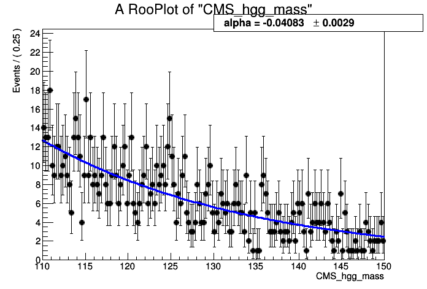

# RooFit
`RooFit` is a OO analysis environment built on `ROOT`. It has a collection of classes designed to augment root for data modeling.

This section covers a few of the basics of `RooFit`. There are many more tutorials available at this link: [https://root.cern.ch/root/html600/tutorials/roofit/index.html](https://root.cern.ch/root/html600/tutorials/roofit/index.html)

## Objects
In Roofit, any variable, data point, function, PDF (etc.) is represented by a c++ object
The most basic of these is the `RooRealVar`. Let's create one which will represent the mass of some hypothetical particle, we name it and give it an initial starting value and range.

```c++
RooRealVar MH("MH","mass of the Hypothetical Boson (H-boson) in GeV",125,120,130);
MH.Print();
```
```shell
RooRealVar::MH = 125  L(120 - 130)
```

ok, great. This variable is now an object we can play around with. We can access this object and modify it's properties, such as its value. 

```c++
MH.setVal(130);
MH.getVal();
```

In particle detectors we typically don't observe this particle mass but usually define some observable which is *sensitive* to this mass. Lets assume we can detect and reconstruct the decay products of the H-boson and measure the invariant mass of those particles. We need to make another variable which represents that invariant mass.

```c++
RooRealVar mass("m","m (GeV)",100,80,200);
```

In the perfect world we would perfectly measure the exact mass of the particle in every single event. However, our detectors are usually far from perfect so there will be some resolution effect. Lets assume the resolution of our measurement of the invariant mass is 10 GeV and call it "sigma"

```c++
RooRealVar sigma("resolution","#sigma",10,0,20);
```

More exotic variables can be constructed out of these `RooRealVar`s using `RooFormulaVars`. For example, suppose we wanted to make a function out of the variables which represented the relative resolution as a function of the hypothetical mass MH. 

```c++
RooFormulaVar func("R","@0/@1",RooArgList(sigma,mass));
func.Print("v");
```

<details>
<summary><b>Show</b></summary>
```shell
--- RooAbsArg ---
  Value State: DIRTY
  Shape State: DIRTY
  Attributes: 
  Address: 0x10e878068
  Clients: 
  Servers: 
    (0x10dcd47b0,V-) RooRealVar::resolution "#sigma"
    (0x10dcd4278,V-) RooRealVar::m "m (GeV)"
  Proxies: 
    actualVars -> 
      1)  resolution
      2)           m
--- RooAbsReal ---

  Plot label is "R"
    --- RooFormula ---
    Formula: "@0/@1"
    (resolution,m)
```
</details>


Notice how there is a list of the variables we passed (the servers or "actual vars"). We can now plot the function. RooFit has a special plotting object `RooPlot` which keeps track of the objects (and their normalisations) which we want to draw. Since RooFit doesn't know the difference between which objects are/aren't dependant, we need to tell it. 

Right now, we have the relative resolution as $R(m,\sigma)$, whereas we want to plot 
$R(m,\sigma(m))$!

```c++
TCanvas *can = new TCanvas();

//make the x-axis the "mass"
RooPlot *plot = mass.frame(); 
func.plotOn(plot);

plot->Draw();
can->Draw();
```


The main objects we are interested in using from RooFit are *probability denisty functions* or (PDFs). We can construct the PDF,

$$
f(m|M_{H},\sigma)
$$

as a simple Gaussian shape for example or a `RooGaussian` in RooFit language (think McDonald's logic, everything is a `RooSomethingOrOther`)

```c++
RooGaussian gauss("gauss","f(m|M_{H},#sigma)",mass,MH,sigma);
gauss.Print("V");
```

<details>
<summary><b>Show</b></summary>
```shell
--- RooAbsArg ---
  Value State: DIRTY
  Shape State: DIRTY
  Attributes: 
  Address: 0x10ecf4188
  Clients: 
  Servers: 
    (0x10dcd4278,V-) RooRealVar::m "m (GeV)"
    (0x10a08a9d8,V-) RooRealVar::MH "mass of the Hypothetical Boson (H-boson) in GeV"
    (0x10dcd47b0,V-) RooRealVar::resolution "#sigma"
  Proxies: 
    x -> m
    mean -> MH
    sigma -> resolution
--- RooAbsReal ---

  Plot label is "gauss"
--- RooAbsPdf ---
Cached value = 0
```
</details>

Notice how the gaussian PDF, like the `RooFormulaVar` depends on our `RooRealVar` objects, these are its servers.  Its evaluation will depend on their values. 

The main difference between PDFs and Functions in RooFit is that PDFs are *automatically normalised to unitiy*, hence they represent a probability density, you don't need to normalise yourself. Lets plot it for the different values of $m$.

```c++
plot = mass.frame();
    
gauss.plotOn(plot);

MH.setVal(120);
gauss.plotOn(plot,RooFit::LineColor(kBlue));

MH.setVal(125);
gauss.plotOn(plot,RooFit::LineColor(kRed));

MH.setVal(135);
gauss.plotOn(plot,RooFit::LineColor(kGreen));

plot->Draw();

can->Update();
can->Draw();
```


Note that as we change the value of `MH`, the PDF gets updated at the same time.

PDFs can be used to generate Monte Carlo data. One of the benefits of RooFit is that to do so only uses a single line of code! As before, we have to tell `RooFit` which variables to generate in (e.g which are the observables for an experiment). In this case, each of our events will be a single value of "mass" $m$. The arguments for the function are the set of observables, follwed by the number of events,

```c++
RooDataSet *data = (RooDataSet*) gauss.generate(RooArgSet(mass),500); 
```

Now we can plot the data as with other RooFit objects.

```c++
plot = mass.frame();

data->plotOn(plot);
gauss.plotOn(plot);
gauss.paramOn(plot);

plot->Draw();
can->Update();
can->Draw();
```


Of course we're not in the business of generating MC events, but collecting *real data!*. Next we will look at using real data in `RooFit`.

## Datasets

A dataset is essentially just a collection of points in N-dimensional (N-observables) space. There are two basic implementations in RooFit, 

1) an "unbinned" dataset - `RooDataSet`

2) a "binned" dataset - `RooDataHist`

both of these use the same basic structure as below


Lets create an empty dataset where the only observable, the mass. Points can be added to the dataset one by one ...

```c++
RooDataSet mydata("dummy","My dummy dataset",RooArgSet(mass)); 
// We've made a dataset with one observable (mass)

mass.setVal(123.4);
mydata.add(RooArgSet(mass));
mass.setVal(145.2);
mydata.add(RooArgSet(mass));
mass.setVal(170.8);
mydata.add(RooArgSet(mass));

mydata.Print();
```

```shell
RooDataSet::dummy[m] = 3 entries
```

There are also other ways to manipulate datasets in this way as shown in the diagram below 


Luckily there are also Constructors for a `RooDataSet` from a `TTree` and for a `RooDataHist` from a `TH1` so its simple to convert from your usual ROOT objects.

Let's take an example dataset put together already.

```c++
TFile *file = TFile::Open("tutorial.root");
file->ls();
```
<details>
<summary><b>Show file contents</b></summary>
```shell
TFile**		tutorial.root
 TFile*		tutorial.root
  KEY: RooWorkspace	workspace;1	Tutorial Workspace
  KEY: TProcessID	ProcessID0;1	48737500-e7e5-11e6-be6f-0d0011acbeef
```
</details>


Inside the file, there is something called a `RooWorkspace`. This is just the RooFit way of keeping a persistent link between the objects for a model. It is a very useful way to share data and PDFs/functions etc among CMS collaborators.

Let's take a look at it. It contains a `RooDataSet` and one variable. This time we called our variable (or observable) `CMS_hgg_mass`, let's assume now that this is the invariant mass of photon pairs where we assume our H-boson decays to photons.  

```c++
RooWorkspace *wspace = (RooWorkspace*) file->Get("workspace");
wspace->Print("v");
```

<details>
<summary><b>Show</b></summary>
```shell
RooWorkspace(workspace) Tutorial Workspace contents

variables
---------
(CMS_hgg_mass)

datasets
--------
RooDataSet::dataset(CMS_hgg_mass)
```
</details>

Let's have a look at the data. The `RooWorkspace` has several accessor functions, we will use the `RooWorkspace::data` one. 
There are also `RooWorkspace::var`, `RooWorkspace::function` and `RooWorkspace::pdf` with (hopefully) obvious purposes.

```c++
RooDataSet *hgg_data = (RooDataSereat*) wspace->data("dataset");
RooRealVar *hgg_mass = (RooRealVar*) wspace->var("CMS_hgg_mass");

plot = hgg_mass->frame();

hgg_data->plotOn(plot,RooFit::Binning(160)); 
// Here we've picked a certain number of bins just for plotting purposes 

plot->Draw();
can->Update();
can->Draw();
```
[](images/realdata.png)

# Likelihoods and Fitting to data 

The data we have in our file doesn't look like a Gaussian distribution. Instead, we could probably use something like an exponential to describe it. 

There is an exponential PDF already in `RooFit` (yep you guessed it) `RooExponential`. For a pdf, we only need one parameter which is the exponential slope $\alpha$ so our pdf is,  

$$ f(m|\alpha) = \dfrac{1}{N} e^{-\alpha m}$$


Where of course, $N = \int_{110}^{150} e^{-\alpha m} dm$ is the normalisation constant.

You can fund a bunch of available RooFit functions here: [https://root.cern.ch/root/html/ROOFIT_ROOFIT_Index.html](https://root.cern.ch/root/html/ROOFIT_ROOFIT_Index.html)

There is also support for a generic pdf in the form of a `RooGenericPdf`, check this link: [https://root.cern.ch/doc/v608/classRooGenericPdf.html](https://root.cern.ch/doc/v608/classRooGenericPdf.html)

Let's create an exponential PDF for our background, 

```c++
RooRealVar alpha("alpha","#alpha",-0.05,-0.2,0.01);
RooExponential expo("exp","exponential function",*hgg_mass,alpha);
```

We can use RooFit to tell us to estimate the value of $\alpha$ using this dataset. You will learn more about parameter estimation but for now we will just assume you know about maximising likelihoods. This *maximum likelihood estimator* is common in HEP and is known to give unbiased estimates for things like distribution means etc. 

This also introduces the other main use of PDFs in RooFit. They can be used to construct *likelihoods* easily.

The likelihood $\mathcal{L}$ is defined for a particluar dataset (and model) as being proportional to the probability to observe the data assuming some pdf. For our data, the probability to observe an event with a value in an interval bounded by a and b is given by,

$$ P\left(m~\epsilon~[a,b] \right) = \int_{a}^{b} f(m|\alpha)dm  $$


As that interval shrinks we can say this probability just becomes equal to $f(m|\alpha)dm$.

The probability to observe the dataset we have is given by the product of such probabilities for each of our data points, so that 

$$\mathcal{L}(\alpha) \propto \prod_{i} f(m_{i}|\alpha)$$

Note that for a specific dataset, the $dm$ factors which should be there are constnant. They can therefore be absorbed into the constant of proportionality!

The maximum likelihood esitmator for $\alpha$, usually written as $\hat{\alpha}$, is found by maximising $\mathcal{L}(\alpha)$.

Note that this won't depend on the value of the constant of proportionality so we can ignore it. This is true in most scenarios because usually only the *ratio* of likelihoods is needed, in which the constant factors out. 

Obviously this multiplication of exponentials can lead to very large (or very small) numbers which can lead to numerical instabilities. To avoid this, we can take logs of the likelihood. Its also common to multiply this by -1 and minimize the resulting **N**egative **L**og **L**ikelihood : $\mathrm{-Log}\mathcal{L}(\alpha)$.

`RooFit` can construct the **NLL** for us.

```c++
RooNLLVar *nll = (RooNLLVar*) expo.createNLL(*hgg_data);
nll->Print("v");
```

<details>
<summary><b>Show</b></summary>
```shell
--- RooAbsArg ---
  Value State: DIRTY
  Shape State: DIRTY
  Attributes:
  Address: 0x7fdddbe46200
  Clients:
  Servers:
    (0x11eab5638,V-) RooRealVar::alpha "#alpha"
  Proxies:
    paramSet ->
      1)  alpha
--- RooAbsReal ---

  Plot label is "nll_exp_dataset"
```
</details>

Notice that the NLL object knows which RooRealVar is the parameter because it doesn't find that one in the dataset. This is how RooFit distiguishes between *observables* and *parameters*.

RooFit has an interface to Minuit via the `RooMinimizer` class which takes the NLL as an argument. To minimize, we just call the `RooMinimizer::minimize()` function. **`Minuit2`** is the program and **`migrad`** is the minimization routine which uses gradient descent.

```c++
RooMinimizer minim(*nll);
minim.minimize("Minuit2","migrad");  
```
<details>
<summary><b>Show</b></summary>
```shell
 **********
 **    1 **SET PRINT           1
 **********
 **********
 **    2 **SET NOGRAD
 **********
 PARAMETER DEFINITIONS:
    NO.   NAME         VALUE      STEP SIZE      LIMITS
     1 alpha       -5.00000e-02  2.10000e-02   -2.00000e-01  1.00000e-02
 **********
 **    3 **SET ERR         0.5
 **********
 **********
 **    4 **SET PRINT           1
 **********
 **********
 **    5 **SET STR           1
 **********
 NOW USING STRATEGY  1: TRY TO BALANCE SPEED AGAINST RELIABILITY
 **********
 **    6 **MIGRAD         500           1
 **********
 FIRST CALL TO USER FUNCTION AT NEW START POINT, WITH IFLAG=4.
 START MIGRAD MINIMIZATION.  STRATEGY  1.  CONVERGENCE WHEN EDM .LT. 1.00e-03
 FCN=3589.52 FROM MIGRAD    STATUS=INITIATE        4 CALLS           5 TOTAL
                     EDM= unknown      STRATEGY= 1      NO ERROR MATRIX
  EXT PARAMETER               CURRENT GUESS       STEP         FIRST
  NO.   NAME      VALUE            ERROR          SIZE      DERIVATIVE
   1  alpha       -5.00000e-02   2.10000e-02   2.24553e-01  -9.91191e+01
                               ERR DEF= 0.5
 MIGRAD MINIMIZATION HAS CONVERGED.
 MIGRAD WILL VERIFY CONVERGENCE AND ERROR MATRIX.
 COVARIANCE MATRIX CALCULATED SUCCESSFULLY
 FCN=3584.68 FROM MIGRAD    STATUS=CONVERGED      18 CALLS          19 TOTAL
                     EDM=1.4449e-08    STRATEGY= 1      ERROR MATRIX ACCURATE
  EXT PARAMETER                                   STEP         FIRST
  NO.   NAME      VALUE            ERROR          SIZE      DERIVATIVE
   1  alpha       -4.08262e-02   2.91959e-03   1.33905e-03  -3.70254e-03
                               ERR DEF= 0.5
 EXTERNAL ERROR MATRIX.    NDIM=  25    NPAR=  1    ERR DEF=0.5
  8.527e-06
```
</details>

`RooFit` has found the best fit value of alpha for this dataset. It also estimates an uncertainty on alpha using the Hessian matrix from the fit.

```c++
alpha.Print("v");
```
```shell
--- RooAbsArg ---
  Value State: clean
  Shape State: clean
  Attributes:
  Address: 0x11eab5638
  Clients:
    (0x11eab5978,V-) RooExponential::exp "exponential function"
    (0x7fdddbe46200,V-) RooNLLVar::nll_exp_dataset "-log(likelihood)"
    (0x7fdddbe95600,V-) RooExponential::exp "exponential function"
    (0x7fdddbe5a400,V-) RooRealIntegral::exp_Int[CMS_hgg_mass] "Integral of exponential function"
  Servers:
  Proxies:
--- RooAbsReal ---

  Plot label is "alpha"
--- RooAbsRealLValue ---
  Fit range is [ -0.2 , 0.01 ]
--- RooRealVar ---
  Error = 0.00291959
```

Lets plot the resulting exponential on the data. Notice that the value of $\hat{\alpha}$ is used for the exponential. 

```c++
expo.plotOn(plot);
expo.paramOn(plot);
plot->Draw();
can->Update();
can->Draw();
```



It looks like there could be a small region near 125 GeV for which our fit doesn't quite go through the points. Maybe our hypothetical H-boson isn't so hypothetical after all!

Let's see what happens if we include some resonant signal into the fit. We can take our Gaussian function again and use that as a signal model. A reasonable value for the resolution of a resonant signal with a mass around 125 GeV decaying to a pair of photons is around a GeV.

```c++
sigma.setVal(1.);
sigma.setConstant();

MH.setVal(125);
MH.setConstant();

RooGaussian hgg_signal("signal","Gaussian PDF",*hgg_mass,MH,sigma);
```

By setting these parameters constant, RooFit knows (either when creating the NLL by hand or when using `fitTo`) that there is not need to fit for these parameters. 

We need to add this to our exponential model and fit a "Sigmal+Background model" by creating a `RooAddPdf`. In RooFit there are two ways to add PDFs, recursively where the fraction of yields for the signal and background is a parameter or absolutely where each PDF has its own normalisation. We're going to use the second one.

```c++
RooRealVar norm_s("norm_s","N_{s}",10,100);
RooRealVar norm_b("norm_b","N_{b}",0,1000);

const RooArgList components(hgg_signal,expo);
const RooArgList coeffs(norm_s,norm_b);

RooAddPdf model("model","f_{s+b}",components,coeffs);
model.Print("v");
```

<details>
<summary><b>Show</b></summary>
```shell
--- RooAbsArg ---
  Value State: DIRTY
  Shape State: DIRTY
  Attributes: 
  Address: 0x11ed5d7a8
  Clients: 
  Servers: 
    (0x11ed5a0f0,V-) RooGaussian::signal "Gaussian PDF"
    (0x11ed5d058,V-) RooRealVar::norm_s "N_{s}"
    (0x11eab5978,V-) RooExponential::exp "exponential function"
    (0x11ed5d398,V-) RooRealVar::norm_b "N_{b}"
  Proxies: 
    !refCoefNorm -> 
    !pdfs -> 
      1)  signal
      2)     exp
    !coefficients -> 
      1)  norm_s
      2)  norm_b
--- RooAbsReal ---

  Plot label is "model"
--- RooAbsPdf ---
Cached value = 0
```
</details>

Ok now lets fit the model. Note this time we add the option `Extended()` which tells RooFit that we care about the overall number of observed events in the data $n$ too. It will add an additional Poisson term in the likelihood to account for this so our likelihood this time looks like,

$$L_{s+b}(N_{s},N_{b},\alpha) = \dfrac{ N_{s}+N_{b}^{n} e^{N_{s}+N_{b}} }{n!} \cdot \prod_{i}^{n} \left[ c f_{s}(m_{i}|M_{H},\sigma)+ (1-c)f_{b}(m_{i}|\alpha)  \right] $$


where $c = \dfrac{ N_{s} }{ N_{s} + N_{b} }$,   $f_{s}(m|M_{H},\sigma)$ is the Gaussian signal pdf and $f_{b}(m|\alpha)$ is the exponential pdf. Remember that $M_{H}$ and $\sigma$ are fixed so that they are no longer parameters of the likelihood.

There is a simpler interface for maximum likelihood fits which is the `RooAbsPdf::fitTo` method. With this simple method, RooFit will construct the negative log-likelihood function, from the pdf, and minimize all of the free parameters in one step.

```c++
model.fitTo(*hgg_data,RooFit::Extended());

model.plotOn(plot,RooFit::Components("exp"),RooFit::LineColor(kGreen));
model.plotOn(plot,RooFit::LineColor(kRed));
model.paramOn(plot);

can->Clear();
plot->Draw();
can->Update();
can->Draw();
```


What about if we also fit for the mass ($M_{H}$)? we can easily do this by removing the constant setting on MH.

```c++
MH.setConstant(false);
model.fitTo(*hgg_data,RooFit::Extended());
```

<details>
<summary><b>Show output</b></summary>
```shell
[#1] INFO:Minization -- RooMinimizer::optimizeConst: activating const optimization
[#1] INFO:Minization --  The following expressions will be evaluated in cache-and-track mode: (signal,exp)
 **********
 **    1 **SET PRINT           1
 **********
 **********
 **    2 **SET NOGRAD
 **********
 PARAMETER DEFINITIONS:
    NO.   NAME         VALUE      STEP SIZE      LIMITS
     1 MH           1.25000e+02  1.00000e+00    1.20000e+02  1.30000e+02
     2 alpha       -4.08793e-02  2.96856e-03   -2.00000e-01  1.00000e-02
     3 norm_b       9.67647e+02  3.25747e+01    0.00000e+00  1.00000e+03
 MINUIT WARNING IN PARAMETR
 ============== VARIABLE3 BROUGHT BACK INSIDE LIMITS.
     4 norm_s       3.22534e+01  1.16433e+01    1.00000e+01  1.00000e+02
 **********
 **    3 **SET ERR         0.5
 **********
 **********
 **    4 **SET PRINT           1
 **********
 **********
 **    5 **SET STR           1
 **********
 NOW USING STRATEGY  1: TRY TO BALANCE SPEED AGAINST RELIABILITY
 **********
 **    6 **MIGRAD        2000           1
 **********
 FIRST CALL TO USER FUNCTION AT NEW START POINT, WITH IFLAG=4.
 START MIGRAD MINIMIZATION.  STRATEGY  1.  CONVERGENCE WHEN EDM .LT. 1.00e-03
 FCN=-2327.53 FROM MIGRAD    STATUS=INITIATE       10 CALLS          11 TOTAL
                     EDM= unknown      STRATEGY= 1      NO ERROR MATRIX       
  EXT PARAMETER               CURRENT GUESS       STEP         FIRST   
  NO.   NAME      VALUE            ERROR          SIZE      DERIVATIVE 
   1  MH           1.25000e+02   1.00000e+00   2.01358e-01   1.12769e+01
   2  alpha       -4.08793e-02   2.96856e-03   3.30048e-02  -1.22651e-01
   3  norm_b       9.67647e+02   3.25747e+01   2.56674e-01  -1.96463e-02
   4  norm_s       3.22534e+01   1.16433e+01   3.10258e-01  -8.97036e-04
                               ERR DEF= 0.5
 MIGRAD MINIMIZATION HAS CONVERGED.
 MIGRAD WILL VERIFY CONVERGENCE AND ERROR MATRIX.
 COVARIANCE MATRIX CALCULATED SUCCESSFULLY
 FCN=-2327.96 FROM MIGRAD    STATUS=CONVERGED      65 CALLS          66 TOTAL
                     EDM=1.19174e-05    STRATEGY= 1      ERROR MATRIX ACCURATE 
  EXT PARAMETER                                   STEP         FIRST   
  NO.   NAME      VALUE            ERROR          SIZE      DERIVATIVE 
   1  MH           1.24628e+02   3.98153e-01   2.66539e-03   2.46327e-02
   2  alpha       -4.07708e-02   2.97195e-03   1.10093e-03   8.33780e-02
   3  norm_b       9.66105e+02   3.25772e+01   5.96627e-03   1.83523e-03
   4  norm_s       3.39026e+01   1.17380e+01   9.60816e-03  -2.32681e-03
                               ERR DEF= 0.5
 EXTERNAL ERROR MATRIX.    NDIM=  25    NPAR=  4    ERR DEF=0.5
  1.589e-01 -3.890e-05  1.462e-01 -1.477e-01 
 -3.890e-05  8.836e-06 -2.020e-04  2.038e-04 
  1.462e-01 -2.020e-04  1.073e+03 -1.072e+02 
 -1.477e-01  2.038e-04 -1.072e+02  1.420e+02 
 PARAMETER  CORRELATION COEFFICIENTS  
       NO.  GLOBAL      1      2      3      4
        1  0.04518   1.000 -0.033  0.011 -0.031
        2  0.03317  -0.033  1.000 -0.002  0.006
        3  0.27465   0.011 -0.002  1.000 -0.275
        4  0.27610  -0.031  0.006 -0.275  1.000
 **********
 **    7 **SET ERR         0.5
 **********
 **********
 **    8 **SET PRINT           1
 **********
 **********
 **    9 **HESSE        2000
 **********
 COVARIANCE MATRIX CALCULATED SUCCESSFULLY
 FCN=-2327.96 FROM HESSE     STATUS=OK             23 CALLS          89 TOTAL
                     EDM=1.19078e-05    STRATEGY= 1      ERROR MATRIX ACCURATE 
  EXT PARAMETER                                INTERNAL      INTERNAL  
  NO.   NAME      VALUE            ERROR       STEP SIZE       VALUE   
   1  MH           1.24628e+02   3.98106e-01   5.33077e-04  -7.45154e-02
   2  alpha       -4.07708e-02   2.97195e-03   2.20186e-04   5.42722e-01
   3  norm_b       9.66105e+02   3.26003e+01   2.38651e-04   1.20047e+00
   4  norm_s       3.39026e+01   1.17445e+01   3.84326e-04  -4.87967e-01
                               ERR DEF= 0.5
 EXTERNAL ERROR MATRIX.    NDIM=  25    NPAR=  4    ERR DEF=0.5
  1.588e-01 -3.888e-05  1.304e-01 -1.304e-01 
 -3.888e-05  8.836e-06 -1.954e-04  1.954e-04 
  1.304e-01 -1.954e-04  1.074e+03 -1.082e+02 
 -1.304e-01  1.954e-04 -1.082e+02  1.421e+02 
 PARAMETER  CORRELATION COEFFICIENTS  
       NO.  GLOBAL      1      2      3      4
        1  0.04274   1.000 -0.033  0.010 -0.027
        2  0.03314  -0.033  1.000 -0.002  0.006
        3  0.27694   0.010 -0.002  1.000 -0.277
        4  0.27806  -0.027  0.006 -0.277  1.000
[#1] INFO:Minization -- RooMinimizer::optimizeConst: deactivating const optimization
```
</details>

Notice the result for the fitted MH is not 125 and is included in the list of fitted parameters. 
We can get more information about the fit, via the `RooFitResult`, using the option `Save()`. 

```c++
RooFitResult *fit_res = (RooFitResult*) model.fitTo(*hgg_data,RooFit::Extended(),RooFit::Save());
```

For example, we can get the Correlation Matrix from the fit result... Note that the order of the parameters are the same as listed in the "Floating Parameter" list above

```c++
TMatrixDSym cormat = fit_res->correlationMatrix();
cormat.Print();
```
```shell
4x4 matrix is as follows

     |      0    |      1    |      2    |      3    |
---------------------------------------------------------
   0 |          1    -0.03282    0.009538    -0.02623 
   1 |   -0.03282           1   -0.001978    0.005439 
   2 |   0.009538   -0.001978           1     -0.2769 
   3 |   -0.02623    0.005439     -0.2769           1 
```

A nice feature of `RooFit` is that once we have a PDF, data and results like this, we can import this new model into our `RooWorkspace` and show off our new discovery to our LHC friends (if we weren't already too late!). We can also save the "state" of our parameters for later, by creating a snapshot of the current values. 

```c++
wspace->import(model);  
RooArgSet *params = model.getParameters(*hgg_data);
wspace->saveSnapshot("nominal_values",*params);

wspace->Print("V");
```
<details>
<summary><b>Show output</b></summary>
```bash 
RooWorkspace(workspace) Tutorial Workspace contents

variables
---------
(CMS_hgg_mass,MH,alpha,norm_b,norm_s,resolution)

p.d.f.s
-------
RooExponential::exp[ x=CMS_hgg_mass c=alpha ] = 0.00248636
RooAddPdf::model[ norm_s * signal + norm_b * exp ] = 0.00240205
RooGaussian::signal[ x=CMS_hgg_mass mean=MH sigma=resolution ] = 5.34013e-110

datasets
--------
RooDataSet::dataset(CMS_hgg_mass)

parameter snapshots
-------------------
nominal_values = (MH=124.627 +/- 0.398094,resolution=1[C],norm_s=33.9097 +/- 11.7445,alpha=-0.040779 +/- 0.00297195,norm_b=966.109 +/- 32.6025)
```
 </details>

This is exactly what needs to be done when you want to use shape based datacards in combine with parametric models.
