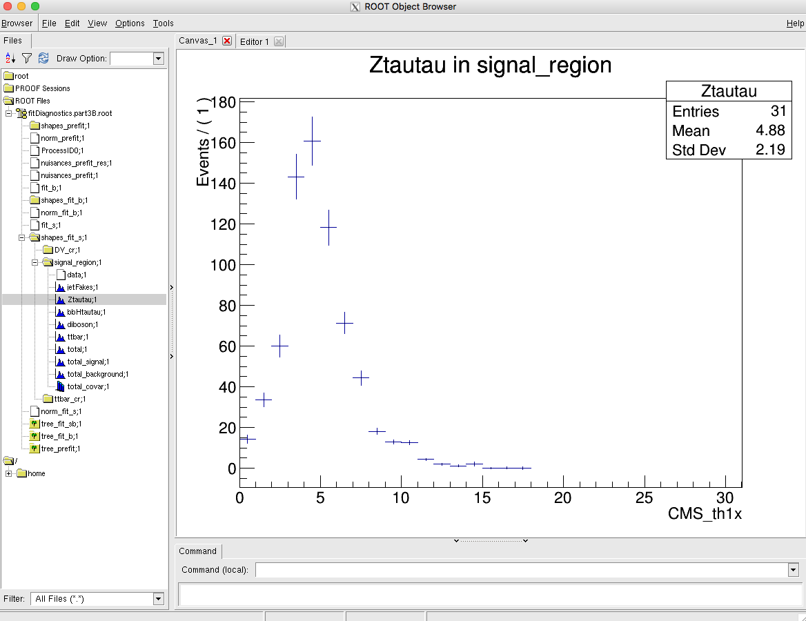

## Getting started

We need to set up a new CMSSW area and checkout the combine package: 

```shell
export SCRAM_ARCH=slc7_amd64_gcc700
cmsrel CMSSW_10_2_13
cd CMSSW_10_2_13/src
cmsenv
git clone https://github.com/cms-analysis/HiggsAnalysis-CombinedLimit.git HiggsAnalysis/CombinedLimit
cd HiggsAnalysis/CombinedLimit

cd $CMSSW_BASE/src/HiggsAnalysis/CombinedLimit
git fetch origin
git checkout v8.1.0

cd $CMSSW_BASE/src
```
We will also make use another package, `CombineHarvester`, which contains some high-level tools for working with combine. The following command will download the repository and checkout just the parts of it we need for this tutorial:
```shell
bash <(curl -s https://raw.githubusercontent.com/cms-analysis/CombineHarvester/master/CombineTools/scripts/sparse-checkout-https.sh)
```
Now make sure the CMSSW area is compiled:
```shell 
scramv1 b clean; scramv1 b
```
Finally we will checkout the working directory for these tutorials - this contains all the inputs needed to run the exercises below:

```shell
cd $CMSSW_BASE/src
git clone https://gitlab.cern.ch/adewit/combinetutorial-2020
cd combinetutorial-2020
```

## Session structure
These exercises are accompanied by introductory presentations given live during the tutorial mornings (and made available for later viewing for those who cannot follow them live)

The introductory presentations that are scheduled appear:

- Before part 1 (recording available [here](https://indico.cern.ch/event/976099/contributions/4138516/attachments/2161880/3648363/02%20RooFitIntro.mp4) )
- **Before part 1E** (recording available [here](https://indico.cern.ch/event/976099/contributions/4138517/attachments/2161767/3648364/03%20LikelihoodAndIntervals.mp4) )
- Before part 2 (recording available [here](https://indico.cern.ch/event/976099/contributions/4138518/attachments/2161882/3648365/04%20IntroToCombine.mp4) )
- **Before part 4** (recording available [here](https://indico.cern.ch/event/976099/contributions/4138520/attachments/2162856/3650080/AsymptoticLimits.mp4) )

All presentations introduce the methods you'll learn about in the following sections and in addition the presentations in **bold** contain some theoretical background.

If you get stuck while working on the exercises, or have specific questions about them, you can ask for help either directly in the zoom room during tutorial hours, or on [this mattermost channel](https://mattermost.web.cern.ch/cms-exp/channels/hcomb-tutorial). The mattermost channel will remain available after the tutorial, so if you're working on the exercises at a later date you can still ask questions about them there.


# Part 1: RooFit
You can watch the introductory presentation [here](https://indico.cern.ch/event/976099/contributions/4138516/attachments/2161880/3648363/02%20RooFitIntro.mp4)

RooFit is an object-oriented analysis environment built on ROOT, with a collection of classes designed to augment ROOT for data modelling. Combine is in turn built on RooFit, so before learning about Combine, it is useful to get to grips with a few RooFit basics. We will do that in this section.

We will use python syntax in this section; you can either call the commands in an interactive python session, or just put them in a .py script. Make sure to do `from ROOT import *` at the top of your script (or in the interactive session)

## A: Variables
In RooFit, any variable, data point, function, PDF (etc.) is represented by a c++ object. The most basic of these is the RooRealVar. Let's create one which will represent the mass of some hypothetical particle, name it, and give a hypothetical starting value and range. 

```
MH = RooRealVar("MH","mass of the Hypothetical Boson (H-boson) in GeV",125,120,130)
MH.Print()
```

The output of this is
```
RooRealVar::MH = 125  L(120 - 130)
```

So we now have a RooRealVar called MH, with default value 125 and range 120-130. We can now access the object and  change for example its value:

```
MH.setVal(130)
print MH.getVal()
```

Which should print the new value, 130. 

In particle detectors we typically don't observe this particle mass but usually define some observable which is sensitive to this mass. Lets assume we can detect and reconstruct the decay products of the H-boson and measure the invariant mass of those particles. We need to make another variable which represents that invariant mass. 

- Make a RooRealVar "mass" with a default value of 100 GeV and a range 80-200


In a perfect world we would perfectly measure the exact mass of the particle in every single event. However, our detectors are usually far from perfect so there will be some resolution effect. Let's assume the resolution of our measurement of the invariant mass is 10 GeV (range 0-20 GeV) and call it "sigma"

- Create this variable "sigma"

## B: Functions and PDFs
More exotic variables can be constructed out of these `RooRealVar`s using `RooFormulaVar`s. For example, suppose we wanted to make a function out of the variables which represented the relative resolution as a function of the hypothetical mass MH.

```
func = RooFormulaVar("R","@0/@1",RooArgList(sigma,mass))
func.Print("v")
```

The main objects we are interested in using from RooFit are probability density functions (PDFs). We can construct the PDF $f(m|M_H,\sigma)$ as a Gaussian shape, a `RooGaussian`:

```
gauss = RooGaussian("gauss","f(m|M_{H},#sigma)",mass,MH,sigma)
gauss.Print("v")
```

Notice how the gaussian PDF, like the `RooFormulaVar` depends on our `RooRealVar` objects, these are its servers. Its evaluation will depend on their values.

The main difference between PDFs and functions in RooFit is that PDFs are automatically normalised to unity, hence they represent a probability density, you don't need to normalise yourself. Let's plot it for the different values of $M_H$.

## C: Plotting
First we need to make a canvas and a `RooPlot` object. This object needs to know what observable is going to be on the x-axis:

```
can = TCanvas()
plot = mass.frame()
```

Now we can plot the gaussian PDF for several mass values. We set $M_H$ to 130 GeV earlier on, so to plot this PDF for $M_H$ of 130 GeV we just do

```
gauss.plotOn(plot,RooFit.LineColor(kGreen+3))
```

Where we're using `kGreen+3` as the line colour. Notice that we need to tell RooFit on which `RooPlot` object we want to plot our PDF, even if we only have one such object.

Let's also plot the PDF with $M_H$ at 120 GeV, in blue, and with $M_H$ 125 GeV, in red:

```
MH.setVal(120)
gauss.plotOn(plot,RooFit.LineColor(kBlue))

MH.setVal(125)
gauss.plotOn(plot,RooFit.LineColor(kRed))
```

Finally, let's try adding this PDF for $M_H$ at 115 GeV in bright green. We'll use a dashed line for this one. Afterwards we'll draw the plot and save the canvas. 

```
MH.setVal(115)
gauss.plotOn(plot,RooFit.LineColor(kGreen),RooFit.LineStyle(2))

plot.Draw()
can.Draw()
can.SaveAs("gaussians.pdf")
```

- Why do the blue and bright green lines overlap?

## D: Workspaces
Next we'll look at how to store RooFit objects and links between them. We can do this with a `RooWorkspace`. Let's create one and import our PDF, and the `RooFormulaVar` we created earlier:

```
w = RooWorkspace("w")

getattr(w,'import')(gauss)
getattr(w,'import')(func)

w.writeToFile("workspace.root")
```

Notice that the `RooRealVar`s we created are also getting imported into the workspace as our gaussian PDF depends on all three of them.

Now we can open the file that we've created in root:
```
root workspace.root
.ls
```

You should see that our workspace, named `w` is in the file:
    
```
TFile**		workspace.root
 TFile*		workspace.root
  KEY: RooWorkspace	w;1	w
  KEY: TProcessID	ProcessID0;1	94b05638-d0c4-11ea-a5b3-84978a89beef
```

We can inspect its contents:

```
w->Print()
```

<details>
<summary><b>Show output </b></summary>
    
```
RooWorkspace(w) w contents

variables
---------
(MH,m,resolution)

p.d.f.s
-------
RooGaussian::gauss[ x=m mean=MH sigma=resolution ] = 0.135335

functions
--------
RooFormulaVar::R[ actualVars=(resolution,m) formula="@0/@1" ] = 0.1
```
</details>    

Now we can check the properties of some of the objects, for example:

```
w->pdf("gauss")->Print("v")
```

<details>
<summary><b>Show output </b></summary>
    
```
--- RooAbsArg ---
  Value State: DIRTY
  Shape State: DIRTY
  Attributes:
  Address: 0x63b62e0
  Clients:
  Servers:
    (0x6781400,V-) RooRealVar::m "m (GeV)"
    (0x687edd0,V-) RooRealVar::MH "mass of the Hypothetical Boson (H-boson) in GeV"
    (0x6795740,V-) RooRealVar::resolution "#sigma"
  Proxies:
    x -> m
    mean -> MH
    sigma -> resolution
--- RooAbsReal ---

  Plot label is "gauss"
--- RooAbsPdf ---
Cached value = 0
```
</details>    

We can also check and change the values of our `RooRealVar`s

```
w->var("MH")->Print()
w->var("MH")->setVal(123)
w->var("MH")->getVal()
```

Gives:
```
RooRealVar::MH = 120  L(120 - 130)
```
and

```
(double) 123.00000
```

Note that if you close the file containing the workspace, open it again and call
```w->var("MH")->getVal()```

You will get the value as set when the workspace was created again, in our case that's 120 GeV:
```
(double) 120.00000
```

- Have a look at how to use the workspace syntax in [this](https://root.cern/doc/master/rf511__wsfactory__basic_8py.html) tutorial  and try to create the gaussian pdf and the formula directly in a workspace

## E: Fitting
You can watch the introductory presentation to part 1E [here](https://indico.cern.ch/event/976099/contributions/4138517/attachments/2161767/3648364/03%20LikelihoodAndIntervals.mp4)

**Note: from this point on if you were using the interactive python session, you should switch to a python script.**

Of course we don't just want to create variables and pdfs, we want to do fits with them. Models that we define in combine make use of likelihood fitting, so let's build a likelihood

$\mathcal{L} \propto p(\text{data}|\text{parameters})$

where our parameters are parameters of interest, $\mu$ and nuisance parameters $\theta$. The nuisance parameters are constrained by external measurements, so we add constraint terms $\pi(\vec{\theta}_0|\vec{\theta})$

So we have
$\mathcal{L} \propto p(\text{data}|\mu,\vec{\theta})\cdot \pi(\vec{\theta}_0|\vec{\theta})$

let's try to build the likelihood by hand for a 1-bin counting experiment.
The data is the number of observed events $N$, and the probability is just a poisson probability $p(N|\lambda) = \frac{\lambda^N e^{-\lambda}}{N!}$, where $\lambda$ is the number of events expected in our signal+background model: $\lambda = \mu\cdot s(\vec{\theta}) + b(\vec{\theta})$. 

In the expression, s and b are the numbers of expected signal- and background events, which both depend on the nuisance parameters. Let's start by building a simple likelihood function with one signal process and one background process. We'll assume there are no nuisance parameters for now. The number of observed events in data is 15, the expected number of signal events is 5 and the expected number of background events 8.1.

It's easiest to use the RooFit workspace factory to build our model

```
from ROOT import *
w = RooWorkspace("w")
```
We need to create an expression for the number of events in our model, $\mu s +b$:

```
w.factory('expr::n("mu*s +b", mu[1.0,0,4], s[5],b[8.1])')
```
Now we can build the likelihood which is just our poisson pdf:
```
w.factory('Poisson::poisN(N[15],n)')
```

To find the best-fit value for our parameter of interest $\mu$ we need to maximize the likelihood. In practice it's actually easier to minimize the **N**egative **l**og of the **l**ikelihood, or NLL:

```
w.factory('expr::NLL("-log(@0)",poisN)')
```

We can now use the RooMinimizer to find the minimum of the NLL


```
nll = w.function("NLL")
minim = RooMinimizer(nll)
minim.setErrorLevel(0.5)
minim.minimize("Minuit2","migrad")
bestfitnll = nll.getVal()
```
Notice that we need to set the error level to 0.5 to get the uncertainties (relying on Wilks' theorem!) - note that there is a more reliable way of extracting the confidence interval (explicitly rather than relying on migrad). We will discuss this a bit later in this section.

Now let's add a nuisance parameter, *lumi*, which represents the luminosity uncertainty. It has a 2.5% effect on both the signal and the background. The parameter will be log-normally distributed: when it's 0, the normalization of the signal and background are not modified; at $+1\sigma$ the signal and background normalizations will be multiplied by 1.025 and at $-1\sigma$ they will be divided by 1.025.  We should modify the expression for the number of events in our model:

```
w.factory('expr::n("mu*s*pow(1.025,lumi) +b*pow(1.025,lumi)", mu[1.0,0,4], s[5],b[8.1],lumi[0,-4,4])')
```

And we add a unit gaussian constraint 
```
w.factory('Gaussian::lumiconstr(lumi,0,1)')
```

Our full likelihood will now be
```
w.factory('PROD::likelihood(poisN,lumiconstr)')
```
and the NLL
```
w.factory('expr::NLL("-log(@0)",likelihood)')
```

Which we can minimize in the same way as before. 

Now let's extend our model a bit. Don't hesitate to ask for help if you get stuck!

- Expanding on what was demonstrated above, build the likelihood for $N=15$, a signal process *s* with expectation 5 events, a background *ztt* with expectation 3.7 events and a background *tt* with expectation 4.4 events. The luminosity uncertainty applies to all three processes. The signal process is further subject to a 5% log-normally distributed uncertainty *sigth*, *tt* is subject to a 6% log-normally distributed uncertainty *ttxs*, and *ztt* is subject to a 4% log-normally distributed uncertainty *zttxs*. Find the best-fit value and the associated uncertainty
- Also perform an explicit scan of the $\Delta$ NLL ( = log of profile likelihood ratio) and make a graph of the scan. Some example code can be found below to get you started. Hint: you'll need to perform fits for different values of mu, where mu is fixed. In RooFit you can set a variable to be constant as `var("VARNAME").setConstant(True)`
- From the curve that you've created by performing an explicit scan, we can extract the 68% CL interval. You can do so by eye or by writing some code to find the relevant intersections of the curve. 

```
gr = TGraph()

npoints = 0
for i in range(0,60):
  npoints+=1
  mu=0.05*i
  ...
  [perform fits for different values of mu with mu fixed]
  ...
  deltanll = ...
  gr.SetPoint(npoints,mu,deltanll)


canv = TCanvas();
gr.Draw("ALP");
canv.SaveAs("likelihoodscan.pdf")
```

Well, this is doable - but we were only looking at a simple one-bin counting experiment. This might become rather cumbersome for large models... $[*]$
We'll now switch to Combine which will make it a lot easier to set up your model and do the statistical analysis than trying to build the likelihood yourself.

$[*]$ Side note - RooFit does have additional functionality to help with statistical model building, but we won't go into detail today.   

# Part 2 Measurements of parameters in Combine
You can watch the introductory presentation for parts 2 & 3 [here](https://indico.cern.ch/event/976099/contributions/4138518/attachments/2161882/3648365/04%20IntroToCombine.mp4)

For the parts of the tutorial that follow we will work with a simplified version of a real analysis, that nonetheless will have many features of the full analysis. The analysis is a search for an additional heavy neutral Higgs boson decaying to tau lepton pairs. Such a signature is predicted in many extensions of the standard model, in particular the minimal supersymmetric standard model (MSSM). You can read about the analysis in the paper [here](https://arxiv.org/pdf/1803.06553.pdf). The statistical inference makes use of a variable called the total transverse mass ($M_{\mathrm{T}}^{\mathrm{tot}}$) that provides good discrimination between the resonant high-mass signal and the main backgrounds, which have a falling distribution in this high-mass region. The events selected in the analysis are split into a several categories which target the main di-tau final states as well as the two main production modes: gluon-fusion (ggH) and b-jet associated production (bbH). One example is given below for the fully-hadronic final state in the b-tag category which targets the bbH signal:


## A: A one-bin counting experiment

We will begin by looking at a simplified version of a datacard from the MSSM $\phi\rightarrow\tau\tau$ analysis that has been converted to a one-bin counting experiment, as discussed in the introductory presentation to this section. While the full analysis considers a range of signal mass hypotheses, we will start by considering just one: $m_{\phi}$=800GeV. Click the text below to study the datacard (`datacard_counting_part2.txt` in the `combinetutorial-2020` directory). It might bear some similarities to the model you just set up by hand. 

<details>
<summary><b>Show datacard</b></summary>
```shell
imax    1 number of bins
jmax    4 number of processes minus 1
kmax    * number of nuisance parameters
--------------------------------------------------------------------------------
--------------------------------------------------------------------------------
bin          signal_region
observation  10.0
--------------------------------------------------------------------------------
bin                      signal_region   signal_region   signal_region   signal_region   signal_region
process                  ttbar           diboson         Ztautau         jetFakes        bbHtautau
process                  1               2               3               4               0
rate                     4.43803         3.18309         3.7804          1.63396         0.711064
--------------------------------------------------------------------------------
CMS_eff_b          lnN   1.02            1.02            1.02            -               1.02
CMS_eff_t          lnN   1.12            1.12            1.12            -               1.12
CMS_eff_t_highpt   lnN   1.1             1.1             1.1             -               1.1
acceptance_Ztautau lnN   -               -               1.08            -               -
acceptance_bbH     lnN   -               -               -               -               1.05
acceptance_ttbar   lnN   1.005           -               -               -               -
lumi_13TeV         lnN   1.025           1.025           1.025           -               1.025
norm_jetFakes      lnN   -               -               -               1.2             -
xsec_Ztautau       lnN   -               -               1.04            -               -
xsec_diboson       lnN   -               1.05            -               -               -
xsec_ttbar         lnN   1.06            -               -               -               -
```
</details>

The layout of the datacard is as follows:

  -   At the top are the numbers `imax`, `jmax` and `kmax` representing the number of bins, processes and nuisance parameters respectively. Here a "bin" can refer to a literal single event count as in this example, or a full distribution we are fitting, in general with many histogram bins, as we will see later. We will refer to both as "channels" from now on. It is possible to replace these numbers with `*` and they will be deduced automatically.
  -   The first line starting with `bin` gives a unique label to each channel, and the following line starting with `observation` gives the number of events observed in data.
  -   In the remaining part of the card there are several columns: each one represents one process in one channel. The first four lines labelled `bin`, `process`, `process` and `rate` give the channel label, the process label, a process identifier (`<=0` for signal, `>0` for background) and the number of expected events respectively.
  -   The remaining lines describe sources of systematic uncertainty. Each line gives the name of the uncertainty, (which will become the name of the nuisance parameter inside our RooFit model), the type of uncertainty ("lnN" = log-normal normalisation uncertainty) and the effect on each process in each channel. E.g. a 20% uncertainty on the yield is written as 1.20.
  -   It is also possible to add a hash symbol (`#`) at the start of a line, which combine will then ignore when it reads the card.


We can now run combine directly using this datacard as input. The general format for running combine is:

```shell
combine -M [method] [datacard] [additional options...]
```

By default, combine will report measurements on a parameter called `r`, which is the default **parameter of interest (POI)** that is added to the model automatically. It is a linear scaling of the normalisation of all signal processes given in the datacard, i.e. if $s_{i,j}$ is the nominal number of signal events in channel $i$ for signal process $j$, then the normalisation of that signal in the model is given as $r\cdot s_{i,j}(\vec{\theta})$, where $\vec{\theta}$ represents the set of nuisance parameters which may also affect the signal normalisation. So `r` is the equivalent of the parameter $\mu$ we introduced in the RooFit section. We have some choice in the interpretation of r: for the measurement of a process with a well defined SM prediction we may enter this as the nominal yield in the datacard, such that $r=1$ corresponds to this SM expectation, whereas for setting limits on BSM processes we may choose the nominal yield to correspond to some cross section, e.g. 1 pb, such that we can interpret the limit as a cross section limit directly. In this example the signal has been normalised to a cross section times branching fraction of 1 fb.


We will now explore one of the most commonly used modes of combine: `FitDiagnostics` . As well as allowing us to make a **measurement** of some physical quantity, this method is useful to gain additional information about the model and the behaviour of the fit. It performs two fits:

  - A "background-only" (b-only) fit: first POI (usually "r") fixed to zero
  - A "signal+background" (s+b) fit: all POIs are floating
 
With the s+b fit combine will report the best-fit value of our signal strength modifier `r`. 

Two ouput files will be produced. One of these will be produced regardless of which combine method we use, and the file name depends on the options we ran with. It is of the form: higgsCombine[name].[method].mH[mass].root. The default name is `Test`, but you can change this with the `--name` (or `-n`) option. The file contains a TTree called `limit` which stores the numerical values returned by FitDiagnostics. Note that in our case we did not set a signal mass when running combine (i.e. -m 800), so the output file just uses the default value of 120. This does not affect our result in any way though, just the label that is used on the output file.

The second file that is produced is a file named `fitdiagnostics.root`, which contains additional information. In particular it includes two `RooFitResult` objects, one for the b-only and one for the s+b fit, which store the fitted values of all the **nuisance parameters (NPs)** and POIs as well as estimates of their uncertainties. The covariance matrix from both fits is also included, from which we can learn about the correlations between parameters. 

Task:

  - Make a datacard for the simple model that you previously set up directly in RooFit

Now run the `FitDiagnostics` method on this datacard:

```shell
combine -M FitDiagnostics datacard.txt --forceRecreateNLL
```

Note that the `--forceRecreateNLL` option is only needed for counting experiments; we will soon look at a shape-based analysis instead where this is not needed.

There are other command line options we can supply to combine which will change its behaviour when run. You can see the full set of supported options by doing `combine -h`. Many options are specific to a given method, but others are more general and are applicable to all methods. Throughout this tutorial we will highlight some of the most useful options you may need to use, for example:

  - The range on the signal strength modifier: `--rMin=X` and `--rMax=Y`: In RooFit parameters can optionally have a range specified. The implication of this is that their values cannot be adjusted beyond the limits of this range. The min and max values can be adjusted though, and we might need to do this for our POI `r` if the order of magnitude of our measurement is different from the default range of `[0, 20]`. This will be discussed again later in the tutorial.
  - Verbosity: `-v X`: By default combine does not usually produce much output on the screen other the main result at the end. However, much more detailed information can be printed by setting the `-v N` with N larger than zero. For example at `-v 3` the logs from the minimizer, Minuit, will also be printed. These are very useful for debugging problems with the fit.

Task:

  - Verify that the best-fit value and uncertainty on r are the same as what you extracted from the likelihood scan you did by hand in RooFit.

Now open the resulting `fitDiagnostics.root` file interactively and print the contents of the s+b RooFit result:

```shell
root [1] fit_s->Print()
```

<details>
<summary><b>Show output</b></summary>
        
```shell
      RooFitResult: minimized FCN value: 3.54419, estimated distance to minimum: 4.84873e-07
                covariance matrix quality: Full, accurate covariance matrix
                Status : MINIMIZE=0 HESSE=0

    Floating Parameter    FinalValue +/-  Error
  --------------------  --------------------------
                  lumi    1.6988e-04 +/-  9.94e-01
                     r    1.3792e+00 +/-  7.76e-01
                 sigth   -7.5538e-05 +/-  9.94e-01
                  ttxs    3.2043e-05 +/-  9.94e-01
                 zttxs   -2.9580e-05 +/-  9.94e-01
```
</details>


There are several useful pieces of information here. At the top the status codes from the fits that were performed is given. In this case we can see that two algorithms were run: `MINIMIZE` and `HESSE`, both of which returned a successful status code (0). Both of these are routines in the **Minuit2** minimization package - the default minimizer used in RooFit. The first performs the main fit to the data, and the second calculates the covariance matrix at the best-fit point. It is important to always check this second step was successful and the message "Full, accurate covariance matrix" is printed, otherwise the parameter uncertainties can be very inaccurate, even if the fit itself was successful.

Underneath this the best-fit values ($\theta$) and symmetrised uncertainties for all the floating parameters are given. For all the constrained nuisance parameters a convention is used by which the nominal value ($\theta_I$) is zero, corresponding to the mean of a Gaussian constraint PDF with width 1.0, such that the parameter values $\pm 1.0$ correspond to the $\pm 1\sigma$ input uncertainties.

A more useful way of looking at this is to compare the pre- and post-fit values of the parameters, to see how much the fit to data has shifted and constrained these parameters with respect to the input uncertainty. The script `diffNuisances.py` can be used for this:

```shell
python diffNuisances.py fitDiagnostics.root --all
```
<details>
<summary><b>Show output</b></summary>
```shell
name                                              b-only fit            s+b fit         rho
lumi                                             +0.17, 0.99        +0.00, 0.99       -0.09
sigth                                            +0.00, 0.99        -0.00, 0.99       -0.09
ttxs                                             +0.22, 0.99        +0.00, 0.99       -0.07
zttxs                                            +0.12, 0.99        -0.00, 0.99       -0.04
```
</details>

The numbers in each column are respectively $\frac{\theta-\theta_I}{\sigma_I}$ (often called the **pull**, though note that more than one definition is in use for this), where $\sigma_I$ is the input uncertainty; and the ratio of the post-fit to the pre-fit uncertainty $\frac{\sigma}{\sigma_I}$.

Question:

 - Can you explain why none of the nuisance parameters are pulled in the s+b fit, but in the b-only fit some are?


So far we've just been looking at our original single-bin counting experiment; let's make things a bit more interesting and move to a shape-based analysis

## B: Setting up the datacard for a shape-based analysis
Now we move to the next step: instead of a one-bin counting experiment we will fit a binned distribution. In a typical analysis we will produce TH1 histograms of some variable sensitive to the presence of signal: one for the data and one for each signal and background process. Then we add a few extra lines to the datacard to link the declared processes to these shapes which are saved in a ROOT file, for example:

<details>
<summary><b>Show datacard</b></summary>
```shell
imax 1
jmax 1
kmax *
---------------
shapes * * simple-shapes-TH1_input.root $PROCESS $PROCESS_$SYSTEMATIC
shapes sig * simple-shapes-TH1_input.root $PROCESS$MASS $PROCESS$MASS_$SYSTEMATIC
---------------
bin bin1
observation 85
------------------------------
bin             bin1       bin1
process         sig        background
process         0          1
rate            10         100
--------------------------------
lumi     lnN    1.10       1.0
bgnorm   lnN    1.00       1.3
alpha  shape    -          1
```
</details>

Note that as with the one-bin card, the total nominal rate of a given process must be specified in the `rate` line of the datacard. This should agree with the value returned by `TH1::Integral`. However, we can also put a value of `-1` and the Integral value will be substituted automatically.

There are two other differences with respect to the one-bin card:

  - A new block of lines at the top defining how channels and processes are mapped to the histograms (more than one line can be used)
  - In the list of systematic uncertainties some are marked as shape instead of lnN

The syntax of the "shapes" line is: `shapes [process] [channel] [file] [histogram] [histogram_with_systematics]`. It is possible to use the `*` wildcard to map multiple processes and/or channels with one line. The histogram entries can contain the `$PROCESS`, `$CHANNEL` and `$MASS` place-holders which will be substituted when searching for a given (process, channel) combination. The value of `$MASS` is specified by the `-m` argument when combine. By default the observed data process name will be `data_obs`.

Shape uncertainties can be added by supplying two additional histograms for a process, corresponding to the distribution obtained by shifting that parameter up and down by one standard deviation. These shapes will be interpolated with a 6th order polynomial for shifts below $1\sigma$ and linearly beyond. The normalizations are interpolated linearly in log scale just like we do for log-normal uncertainties.


The final argument of the "shapes" line above should contain the `$SYSTEMATIC` place-holder which will be substituted by the systematic name given in the datacard.

In the list of uncertainties the interpretation of the values for `shape` lines is a bit different from `lnN`. The effect can be "-" or 0 for no effect, 1 for normal effect, and possibly something different from 1 to test larger or smaller effects (in that case, the unit Gaussian is scaled by that factor before using it as parameter for the interpolation).

In this section we will use a datacard corresponding to the full distribution that was shown at the start of section 1, not just the high mass region. Have a look at `datacard_shape_part2.txt`: this is still currently a one-bin counting experiment, however the yields are much higher since we now consider the full range of $M_{\mathrm{T}}^{\mathrm{tot}}$. If you run the asymptotic limit calculation on this you should find the sensitivity is significantly worse than before.

The **first task** is to convert this to a shape analysis: the file `datacard_part2.shapes.root` contains all the necessary histograms, including those for the relevant shape systematic uncertainties. Add the relevant `shapes` lines to the top of the datacard (after the `kmax` line) to map the processes to the correct TH1s in this file. Hint: you will need a different line for the signal process.

Compared to the counting experiment we must also consider the effect of uncertainties that change the shape of the distribution. Some, like `CMS_eff_t_highpt`, were present before, as it has both a shape and normalisation effect. Others are primarily shape effects so were not included before.

Add the following shape uncertainties: `top_pt_ttbar_shape` affecting `ttbar`,the tau energy scale uncertainties `CMS_scale_t_1prong0pi0_13TeV`, `CMS_scale_t_1prong1pi0_13TeV` and `CMS_scale_t_3prong0pi0_13TeV` affecting all processes except `jetFakes`, and `CMS_eff_t_highpt` also affecting the same processes.

Once this is done you can run FitDiagnostics on the datacard. From now on we will convert the text datacard into a RooFit workspace ourselves instead of combine doing it internally every time we run. This is a good idea for more complex analyses since the conversion step can take a notable amount of time. For this we use the `text2workspace.py` command:

```shell
text2workspace.py datacard_shape_part2.txt -m 800 -o workspace_part2.root
```
And then we can use this as input to combine instead of the text datacard:
```shell
combine -M FitDiagnostics --rMin -20 --rMax 20 workspace_part2.root -m 800
```

Note that we have changed the range of the parameter of interest, r, by using `--rMin` and `--rMax`. The default range is 0-20. 

Tasks and Questions:
  - Run FitDiagnostics on this new workspace and re-run the diffNuisances script on the output `fitDiagnostics.root` file. 
  - Which parameter has the largest pull? Which has the tightest constraint?
  - Should we be concerned when a parameter is more strongly constrained than the input uncertainty (i.e. $\frac{\sigma}{\sigma_I}<1.0$)?


## C: MC statistical uncertainties

So far there is an important source of uncertainty we have neglected. Our estimates of the backgrounds come either from MC simulation or from sideband regions in data, and in both cases these estimates are subject to a statistical uncertainty on the number of simulated or data events. 
In principle we should include an independent statistical uncertainty for every bin of every process in our model. 
It's important to note that combine/RooFit does not take this into account automatically - statistical fluctuations of the data are implicitly accounted 
for in the likelihood formalism, but statistical uncertainties in the model must be specified by us.

One way to implement these uncertainties is to create a `shape` uncertainty for each bin of each process, in which the up and down histograms have the contents of the bin
 shifted up and down by the $1\sigma$ uncertainty. 
However this makes the likelihood evaluation computationally inefficient, and can lead to a large number of nuisance parameters 
in more complex models. Instead we will use a feature in combine called `autoMCStats` that creates these automatically from the datacard, 
and uses a technique called "Barlow-Beeston-lite" to reduce the number of systematic uncertainties that are created. 
This works on the assumption that for high MC event counts we can model the uncertainty with a Gaussian distribution. Given the uncertainties in different bins are independent, the total uncertainty of several processes in a particular bin is just the sum of $N$ individual Gaussians, which is itself a Gaussian distribution. 
So instead of $N$ nuisance parameters we need only one. This breaks down when the number of events is small and we are not in the Gaussian regime. 
The `autoMCStats` tool has a threshold setting on the number of events below which the the Barlow-Beeston-lite approach is not used, and instead a 
Poisson PDF is used to model per-process uncertainties in that bin.

After reading the full documentation on `autoMCStats` [here](http://cms-analysis.github.io/HiggsAnalysis-CombinedLimit/part2/bin-wise-stats/), add the corresponding line to your datacard. 
Start by setting a threshold of 0, i.e. `[channel] autoMCStats 0`, to force the use of Barlow-Beeston-lite in all bins.

**Tasks and questions:**

  - Check how much the cross section measurement and uncertainties change using `FitDiagnostics`.

# Part 3: Further investigation of shape-based models
## A: Nuisance parameter impacts

It is often useful to examine in detail the effects the systematic uncertainties have on the signal strength measurement. This is often referred to as calculating the "impact" of each uncertainty. What this means is to determine the shift in the signal strength, with respect to the best-fit, that is induced if a given nuisance parameter is shifted by its $\pm1\sigma$ post-fit uncertainty values. If the signal strength shifts a lot, it tells us that it has a strong dependency on this systematic uncertainty. In fact, what we are measuring here is strongly related to the correlation coefficient between the signal strength and the nuisance parameter. The `MultiDimFit` method has an algorithm for calculating the impact for a given systematic: `--algo impact -P [parameter name]`, but it is typical to use a higher-level script, `combineTool.py` (part of the CombineHarvester package you checked out at the beginning) to automatically run the impacts for all parameters. Full documentation on this is given [here](http://cms-analysis.github.io/HiggsAnalysis-CombinedLimit/part3/nonstandard/#nuisance-parameter-impacts). There is a three step process for running this. We will demonstrate this with a similar analysis to what we were using before, but at a lower mass point (200 GeV) as this region is more sensitive to the background uncertainties. The datacard is provided for you (datacard_part3.txt). Make the workspace first to be able to perform the steps for the impacts. First we perform an initial fit for the signal strength and its uncertainty:

```shell
combineTool.py -M Impacts -d workspace_part3.root -m 200 --rMin -1 --rMax 2 --robustFit 1 --doInitialFit
```
Then we run the impacts for all the nuisance parameters:
```shell
combineTool.py -M Impacts -d workspace_part3.root -m 200 --rMin -1 --rMax 2 --robustFit 1 --doFits
```
This will take a little bit of time. When finished we collect all the output and convert it to a json file:
```shell
combineTool.py -M Impacts -d workspace_part3.root -m 200 --rMin -1 --rMax 2 --robustFit 1 --output impacts.json
```
We can then make a plot showing the pulls and parameter impacts, sorted by the largest impact:
```shell
plotImpacts.py -i impacts.json -o impacts
```

**Tasks and questions:**

  - Identify the most important uncertainties using the impacts tool.


## B: Post-fit distributions
Another thing the `FitDiagnostics` mode can help us with is visualising the distributions we are fitting, and the uncertainties on those distributions, both before the fit is performed ("pre-fit") and after ("post-fit"). The pre-fit can give us some idea of how well our uncertainties cover any data-MC discrepancy, and the post-fit if discrepancies remain after the fit to data (as well as possibly letting us see the presence of a significant signal!).

To produce these distributions add the `--saveShapes` and `--saveWithUncertainties` options when running `FitDiagnostics`:

```shell
combine -M FitDiagnostics workspace_part3.root -m 200 --rMin -1 --rMax 2 --saveShapes --saveWithUncertainties
```

Combine will produce pre- and post-fit distributions (for fit_s and fit_b) in the fitdiagnostics.root output file:



**Tasks and questions:**

  - Make a plot showing the expected background and signal contributions using the output from `FitDiagnostics` - do this for both the pre-fit and post-fit. You will find a script `postFitPlot.py` in the `combinetutorial-2020` repository that can help you get started.
 The bin errors on the TH1s in the fitdiagnostics file are determined from the systematic uncertainties. In the post-fit these take into account the additional constraints on the nuisance parameters as well as any correlations.

  - Why is the uncertainty on the post-fit so much smaller than on the pre-fit?

# Part 4: Setting limits 

You can watch the introductory presentation to part 4 [here](https://indico.cern.ch/event/976099/contributions/4138520/attachments/2162856/3650080/AsymptoticLimits.mp4)

## A: Asymptotic limits

As we are searching for a signal process that does not exist in the standard model, it's natural to set an upper limit on the cross section times branching fraction of the process (assuming our dataset does not contain a significant discovery of new physics). Combine has dedicated method for calculating upper limits. The most commonly used one is `AsymptoticLimits`, which implements the CLs criterion and uses the profile likelihood ratio as the test statistic. As the name implies, the test statistic distributions are determined analytically in the asymptotic approximation, so there is no need for more time-intensive toy throwing and fitting. First we will go back to the first datacard we looked at, which is a one-bin counting experiment again. Try running the following command:

```shell
combine -M AsymptoticLimits datacard_counting_part2.txt 
```

You should see the results of the observed and expected limit calculations printed to the screen. They are also saved to the usual output file. 

The expected limit is given under the background-only hypothesis. The median value under this hypothesis as well as the quantiles needed to give the 68% and 95% intervals are also calculated. These are all the ingredients needed to produce the standard limit plots you will see in many CMS results, for example the $\sigma \times \mathcal{B}$ limits for the $\text{bb}\phi\rightarrow\tau\tau$ process:


In this case we only computed the values for one signal mass hypothesis, indicated by a red dashed line.

**Tasks and questions:**

  -   Try changing the values of some uncertainties (up or down, or removing them altogether) - how do the expected and observed limits change?
  -   Now try changing the number of observed events. The observed limit will naturally change, but the expected does too - why might this be?


Most analyses are developed and optimised while we are "blind" to the region of data where we expect our signal to be. With `AsymptoticLimits` we can choose just to run the expected limit (`--run expected`), so as not to calculate the observed. However the data is still used, even for the expected, since in the frequentist approach a background-only fit to the data is performed to define the Asimov dataset used to calculate the expected limits. To skip this fit to data and use the pre-fit state of the model the option `--run blind` or `--noFitAsimov` can be used. **Task:** Compare the expected limits calculated with `--run expected` and `--run blind`. Why are they different?

A more general way of blinding is to use combine's toy and Asimov dataset generating functionality. You can read more about this [here](http://cms-analysis.github.io/HiggsAnalysis-CombinedLimit/part3/runningthetool/#toy-data-generation). These options can be used with any method in combine, not just `AsymptoticLimits`.

**Task:** Calculate a blind limit by generating a background-only Asimov with the `-t -1` option instead of using the `AsymptoticLimits` specific options. You should find the observed limit is the same (up to numerical differences) as the expected. Then see what happens if you inject a signal into the Asimov dataset using the `--expectSignal [X]` option.

## B: Computing limits with toys
Now we will look at computing limits without the asymptotic approximation, so instead using toy datasets to determine the test statistic distributions under the signal+background and background-only hypotheses. This can be necessary if we are searching for signal in bins with a small number of events expected. In combine we will use the `HybridNew` method to calculate limits using toys. This mode is capable of calculating limits with several different test statistics and with fine-grained control over how the toy datasets are generated internally. To calculate LHC-style profile likelihood limits (i.e. the same as we did with the asymptotic) we set the option `--LHCmode LHC-limits`. You can read more about the different options in the [Combine documentation](http://cms-analysis.github.io/HiggsAnalysis-CombinedLimit/part3/commonstatsmethods/#computing-limits-with-toys).

Run the following command:
```shell
combine -M HybridNew datacard_counting_part2.txt --LHCmode LHC-limits -n .part4B --saveHybridResult --fork 0
```
In contrast to `AsymptoticLimits` this will only determine the observed limit, and will take around five minutes. There will not be much output to the screen while combine is running. You can add the option `-v 1` to get a better idea of what is going on. You should see combine stepping around in `r`, trying to find the value for which CLs = 0.05, i.e. the 95% CL limit. The `--saveHybridResult` option will cause the test statistic distributions that are generated at each tested value of `r` to be saved in the output ROOT file.

To get an expected limit add the option `--expectedFromGrid X`, where `X` is the desired quantile, e.g. for the median:

```shell
combine -M HybridNew datacard_counting_part2.txt --LHCmode LHC-limits -n .part4B --saveHybridResult --fork 0 --expectedFromGrid 0.500
```

Calculate the median expected limit and the 68% range. The 95% range could also be done, but note it will take much longer to run the 0.025 quantile. While combine is running you can move on to the next steps below.

**Tasks and questions:**
- In contrast to `AsymptoticLimits`, with `HybridNew` each limit comes with an uncertainty. What is the origin of this uncertainty?
- How good is the agreement between the asymptotic and toy-based methods?
- Why does it take longer to calculate the lower expected quantiles (e.g. 0.025, 0.16)? Think about how the statistical uncertainty on the CLs value depends on CLs+b and CLb.

Next plot the test statistic distributions stored in the output file:
```shell
python $CMSSW_BASE/src/HiggsAnalysis/CombinedLimit/test/plotTestStatCLs.py --input higgsCombine.part4B.HybridNew.mH120.root --poi r --val all --mass 120
```

This produces a new ROOT file `cls_qmu_distributions.root` containing the plots, to save them as pdf/png files run this small script and look at the resulting figures:

```shell
python printTestStatPlots.py cls_qmu_distributions.root
```

### Advanced exercises
These distributions can be useful in understanding features in the CLs limits, especially in the low statistics regime. To explore this, try reducing the observed and expected yields in the datacard by a factor of 10, and rerun the above steps to compare the observed and expected limits with the asymptotic approach, and plot the test statistic distributions.

**Tasks and questions:**

  - Is the asymptotic limit still a good approximation?
  - You might notice that the test statistic distributions are not smooth but rather have several "bump" structures? Where might this come from? Try reducing the size of the systematic uncertainties to make them more pronounced.

Note that for more complex models the fitting time can increase significantly, making it infeasible to run all the toy-based limits interactively like this. An alternative strategy is documented [here](http://cms-analysis.github.io/HiggsAnalysis-CombinedLimit/part3/commonstatsmethods/#complex-models)


# Advanced tasks

If you have time, you can go back to your shape analysis from part 2B and:

  - Compare the expected sensitivities of the counting experiment and the shape-based analysis. Which one is more sensitive?
  - Check the pulls and constraints on a b-only and s+b asimov dataset instead. This check is [required](https://twiki.cern.ch/twiki/bin/viewauth/CMS/HiggsWG/HiggsPAGPreapprovalChecks) for all analyses in the Higgs PAG. It serves both as a closure test (do we fit exactly what signal strength we input?) and a way to check whether there are any infeasibly strong constraints while the analysis is still blind (typical example: something has probably gone wrong if we constrain the luminosity uncertainty to 10% of the input!)
  - Sometimes there are problems in the fit model that aren't apparent from only fitting the Asimov dataset, but will appear when fitting randomised data. Follow the exercise on toy-by-toy diagnostics [here](http://cms-analysis.github.io/HiggsAnalysis-CombinedLimit/part3/nonstandard/#toy-by-toy-diagnostics) to explore the tools available for this.

