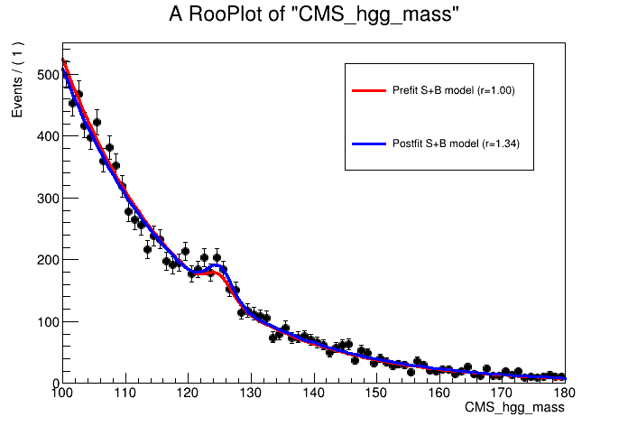
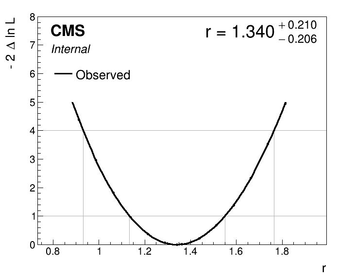
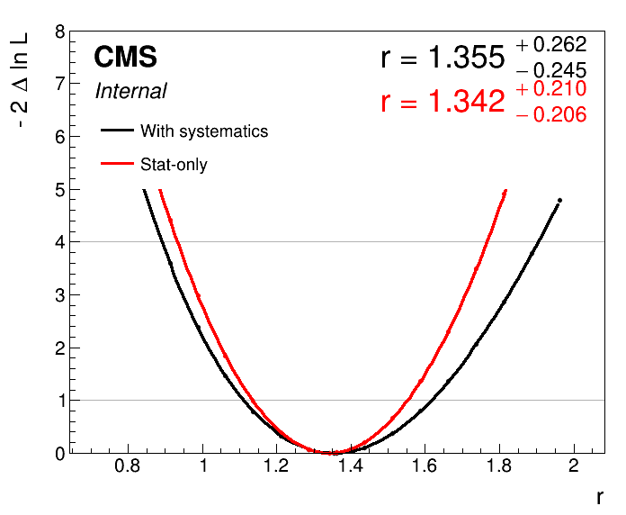
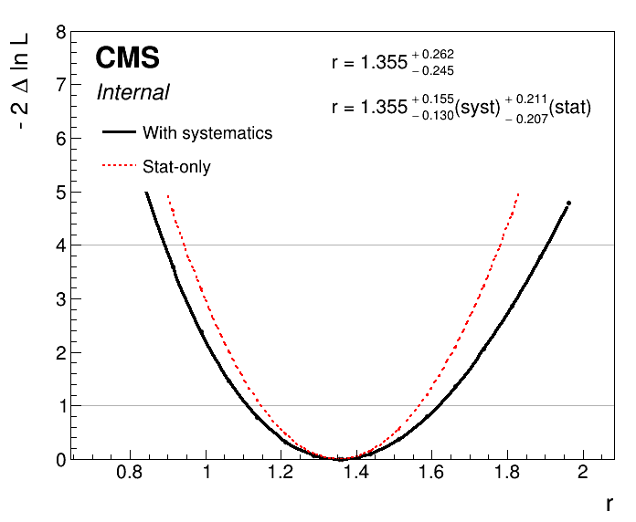
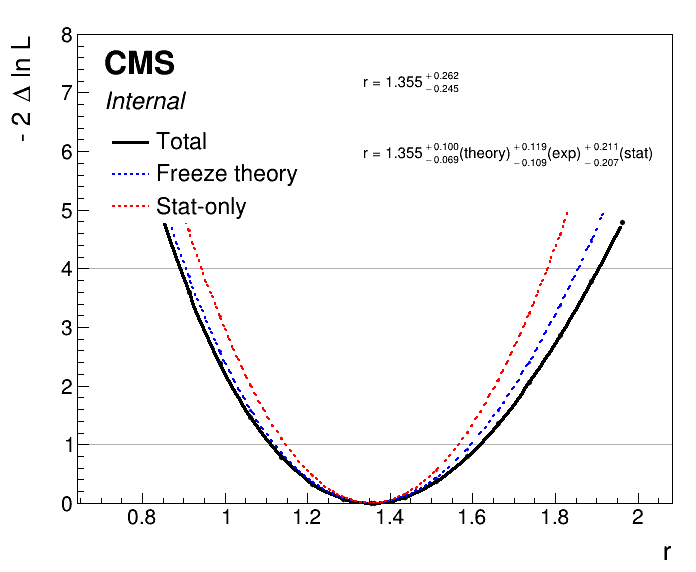
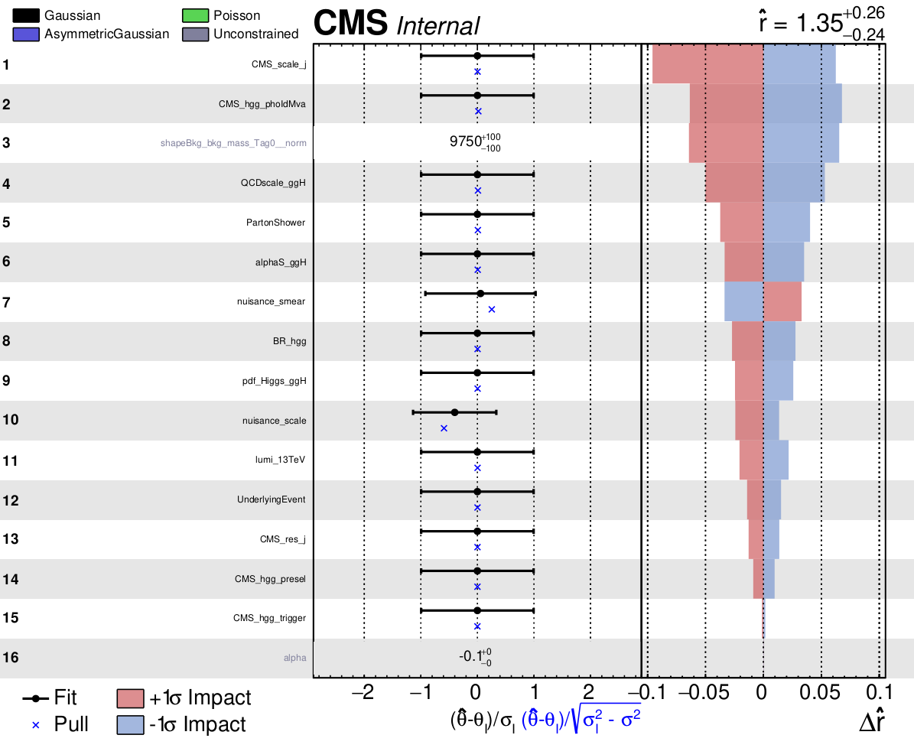
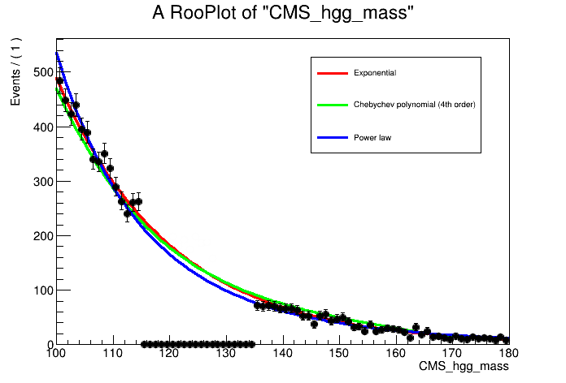
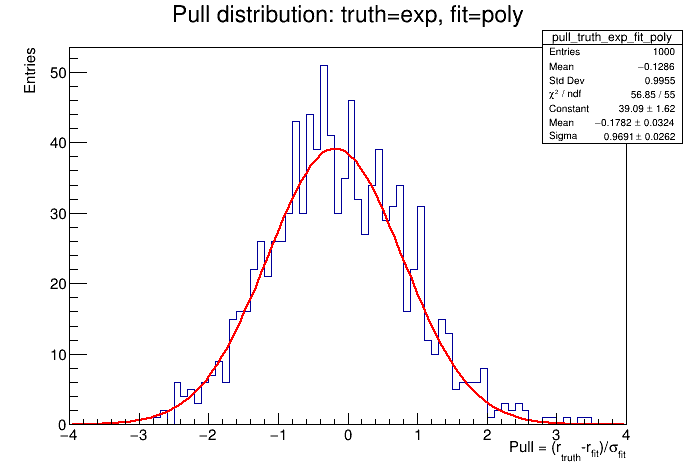
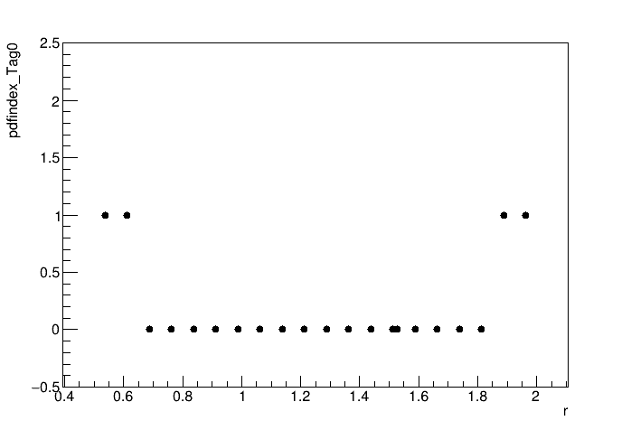
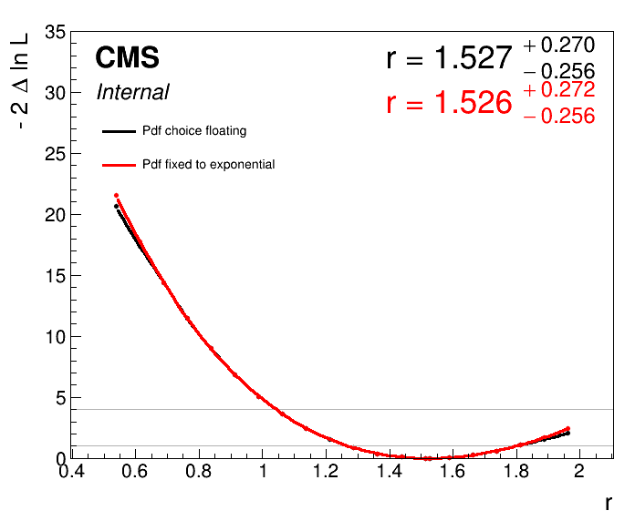

# Parametric fitting exercise

## Getting started

Add getting started details here

## Session structure

## Analysis overview

## Part 1: Building models

<details>
  <summary>Open</summary>

As with any fitting exercise, the first step is to explore the input data and understand the format. Firstly, we will learn how to construct a model to fit the signal peak using a Monte Carlo simulation sample of gluon-gluon fusion (ggH) events. 

FIXME: add details about the model construction steps here. This will be based off the script `construct_models.py`.

Before, we can run the fits we need to build the **datacard**. Given the low complexity of this example, the datacard will be short. The datacard is titled `datacard_part1.txt`. Take some time to understand the different lines. In particular, the values for the process normalisations:

* Where does the signal (ggH) normalisation come from?
* Why do we use a value of 1.0 for the background model normalisation in this analysis?

```shell
# Datacard example for combine tutorial 2023 (part 1)
---------------------------------------------
imax 1
jmax 1
kmax *
---------------------------------------------

shapes      ggH          Tag0      workspace_sig.root      workspace_sig:model_ggH_Tag0
shapes      bkg_mass     Tag0      workspace_bkg.root      workspace_bkg:model_bkg_Tag0
shapes      data_obs     Tag0      workspace_bkg.root      workspace_bkg:data_Tag0

---------------------------------------------
bin             Tag0
observation     -1
---------------------------------------------
bin             Tag0         Tag0
process         ggH          bkg_mass
process         0            1
rate            181.01       1.0
---------------------------------------------
```
To compile the datacard we run the following command, using an initial value of the Higgs mass of 125.0:
```
text2workspace.py datacard_part1.txt -m 125
```
Open the compiled workspace (`datacard_part1.root`) and print the contents. Are all the variables you expect in there? What does the variable `r` correspond to? Try (verbose) printing the variable: 
```
w->var("r")->Print("v")
```
### Signal normalisation
In the example above, the signal normalisation is defined by hand in the datacard. We can instead define the signal normalisation components in the model construction, and add to the workspace in a similar fashion to the background model normalisation. Let's build the cross section (ggH), branching fraction (H->gamgam), and efficiency variables. It's important to set these terms to be constant for the final fit to data:
```python
xs_ggH = ROOT.RooRealVar("xs_ggH", "Cross section of ggH in [pb]", 48.58 )
br_gamgam = ROOT.RooRealVar("BR_gamgam", "Branching ratio of Higgs to gamma gamma", 0.0027 )
eff_ggH_Tag0 = ROOT.RooRealVar("eff_ggH_Tag0", "Efficiency for ggH events to land in Tag0", eff )

xs_ggH.setConstant(True)
br_gamgam.setConstant(True)
eff_ggH_Tag0.setConstant(True)
```
The normalisation component is then defined as the product of these three variables:
```python
norm_sig = ROOT.RooProduct("model_ggH_Tag0_norm", "Normalisation term for ggH in Tag 0", ROOT.RooArgList(xs_ggH,br_gamgam,eff_ggH_Tag0))
```

Combine will pick this up automatically if the `{model}_norm` syntax has been used in the naming scheme.
* How do we need to modify the datacard to account for this normalisation term? Importantly, the `_norm` term in the updated workspace does not contain the luminosity component. Therefore, we need to modify the rate term in the datacard to be equal to the luminosity in [pb^-1] (as the cross section was defined in [pb]). The total normalisation for the signal model is then `_norm x rate`. You can find the example datacard here: `datacard_part1_withNorm.txt`. 
* Does it compile successfully?

### Extension: unbinned vs binned
TODO: add details. For parametric analysis it is as simple as changing RooDataSet to RooDataHist in the data input. Talk about consequences.

### Extension: RooAddPdf
Show how to combine pdfs into a single parametric model

</details>

## Part 2: Simple fits 

<details>
  <summary>Open</summary>

Now the parametric models have been constructed and the datacard has been compiled, we are ready to start using combine for running fits. In CMS analyses we begin by blinding ourselves to the data in the signal region, and looking only at the expected results based off toys datasets (asimov or pseudo-experiments). In this exercise, we will look straight away at the observed results. 

To run a simple best-fit for the signal strength, `r`, fixing the Higgs mass to 125 GeV, you can run the command:
```
combine -M MultiDimFit datacard_part1_withNorm.root -m 125 --freezeParameters MH --saveWorkspace -n .bestfit
```
* The option `--saveWorkspace` stores a snapshot of the postfit workspace in the output file (`higgsCombine.bestfit.MultiDimFit.mH125.root`). We can load the postfit workspace and look at the values of the parameters (see `MultiDimFit` parameter snapshot):
```python
f = ROOT.TFile("higgsCombine.bestfit.MultiDimFit.mH125.root")
w = f.Get("w")
w.Print("v")
```
We can even plot the postfit distribution using the workspace snapshot:
```python
n_bins = 80
binning = ROOT.RooFit.Binning(n_bins,100,180)

can = ROOT.TCanvas()
plot = w.var("CMS_hgg_mass").frame()
w.data("data_obs").plotOn( plot, binning )

sb_model = w.pdf("model_s").getPdf("Tag0")
# Prefit
sb_model.plotOn( plot, ROOT.RooFit.LineColor(2), ROOT.RooFit.Name("prefit") )
# Postfit
w.loadSnapshot("MultiDimFit")
sb_model.plotOn( plot, ROOT.RooFit.LineColor(4), ROOT.RooFit.Name("postfit") )
r_bestfit = w.var("r").getVal()
plot.Draw()

leg = ROOT.TLegend(0.55,0.6,0.85,0.85)
leg.AddEntry("prefit", "Prefit S+B model (r=1.00)", "L")
leg.AddEntry("postfit", "Postfit S+B model (r=%.2f)"%r_bestfit, "L")
leg.Draw("Same")

can.Update()
can.Draw()
```


### Confidence intervals
We not only want to find the best-fit value of the signal strength, r, but also the confidence intervals. The `singles` algorithm will find the 68% CL intervals:
```
combine -M MultiDimFit datacard_part1_withNorm.root -m 125 --freezeParameters MH -n .singles --algo singles
```
To perform a likelihood scan (i.e. calculate 2NLL at fixed values of the signal strength, profiling the other parameters), we use the `grid` algorithm. We can control the number of points in the scan using the `--points` option. Also, it is important to set the range a suitable range for the signal strength given the sensitivity in the data. The `singles` algorithm has shown us that the 1 stdev interval on r is around +/-0.2. Use this to define a suitable range in the scan with the `--setParameterRanges r=lo,hi` option.
```
combine -M MultiDimFit datacard_part1_withNorm.root -m 125 --freezeParameters MH -n .scan --algo grid --points 20 --setParameterRanges lo,hi
```
We can use the `plot1DScan.py` function from combineHarvester to plot the likelihood scan:



### Extension: expected fits

### Extension: goodness-of-fit
Only works with binned fits. Will need to save the dataset as `RooDataHist` in the background model file.

</details>

## Part 3: Systematic uncertainties

<details>
  <summary>Open</summary>

In this section, we will learn how to add systematic uncertainties to a parametric fit analysis. For uncertainties which only affect the process normalisation, we can simply implement these as `lnN` uncertainties in the datacard. The file `mc_part1_with_syst.root` contains the systematic-varied trees i.e. Monte-Carlo events where some systematic uncertainty `{photonID,JEC,scale,smear}` have been varied up and down by $1\sigma$.
```python
f = ROOT.TFile("mc_part1_with_syst.root")
f.ls()

TFile**		mc_part1_with_syst.root	
 TFile*		mc_part1_with_syst.root	
  KEY: TTree	ggH_Tag0;1	ggH_Tag0
  KEY: TTree	ggH_Tag0_photonIDUp01Sigma;1	ggH_Tag0_photonIDUp01Sigma
  KEY: TTree	ggH_Tag0_photonIDDown01Sigma;1	ggH_Tag0_photonIDDown01Sigma
  KEY: TTree	ggH_Tag0_scaleUp01Sigma;1	ggH_Tag0_scaleUp01Sigma
  KEY: TTree	ggH_Tag0_scaleDown01Sigma;1	ggH_Tag0_scaleDown01Sigma
  KEY: TTree	ggH_Tag0_smearUp01Sigma;1	ggH_Tag0_smearUp01Sigma
  KEY: TTree	ggH_Tag0_smearDown01Sigma;1	ggH_Tag0_smearDown01Sigma
  KEY: TTree	ggH_Tag0_JECUp01Sigma;1	ggH_Tag0_JECUp01Sigma
  KEY: TTree	ggH_Tag0_JECDown01Sigma;1	ggH_Tag0_JECDown01Sigma
```
Let's first load the systematic varied trees as RooDataSets:
```python
mass = ROOT.RooRealVar("CMS_hgg_mass", "CMS_hgg_mass", 125, 100, 180)
weight = ROOT.RooRealVar("weight","weight",0,0,1)

mc = {}

t = f.Get("ggH_Tag0")
mc['nominal'] = ROOT.RooDataSet("ggH_Tag0","ggH_Tag0", t, ROOT.RooArgSet(mass,weight), "", "weight" )

for syst in ['JEC','photonID','scale','smear']:
    for direction in ['Up','Down']:
        key = "%s%s01Sigma"%(syst,direction)
        name = "ggH_Tag0_%s"%(key)
        t = f.Get(name)
        mc[key] = ROOT.RooDataSet(name, name, t, ROOT.RooArgSet(mass,weight), "", "weight" )
```

The jet energy scale (JEC) and photon identification (photonID) uncertainties do not affect the shape of the $m_{\gamma\gamma}$ distribution i.e. they only effect the signal yield. We can calculate their impact by comparing the sum of weights to the nominal dataset. Note, the photonID uncertainty changes the weight of the events in the tree, whereas the JEC varied trees contain a different set of events, generated by shifting the jet energy scale in the simulation. In any case, the means for calculating the yield variations is equivalent:
```python
for syst in ['JEC','photonID']:
    for direction in ['Up','Down']:
        yield_variation = mc['%s%s01Sigma'%(syst,direction)].sumEntries()/mc['nominal'].sumEntries()
        print("Systematic varied yield (%s,%s): %.3f"%(syst,direction,yield_variation))
```
```
Systematic varied yield (JEC,Up): 1.077
Systematic varied yield (JEC,Down): 0.956
Systematic varied yield (photonID,Up): 1.050
Systematic varied yield (photonID,Down): 0.950
```
We can write these yield variations in the datacard with the lines:
```shell
CMS_scale_j           lnN      0.956/1.077      -
CMS_hgg_phoIdMva      lnN      1.05             -   
```
Note in this analysis there are no systematic uncertainties affecting the background estimate, as the background model has been derived directly from data.
* Why is the photonID uncertainty expressed as one number, whereas the JEC uncertainty is defined by two?

### Parametric shape uncertainties
What about systematic uncertainties which affect the shape of the fitted model?

In a parametric analysis, we need to build the dependence directly into the model parameters. The examples in this tutorial are the photon energy scale and smearing uncertainties. From the names alone we can expect that the **scale** uncertainty will affect the mean of the signal Gaussian, and the **smear** uncertainty will impact the resolution (sigma). But let's take a look for the `scaleUp01Sigma` dataset:

```python
mean = ROOT.RooRealVar("mean", "mean", 125, 124, 126)
sigma = ROOT.RooRealVar("sigma", "sigma", 2, 1.5, 2.5)
gaus = ROOT.RooGaussian("model", "model", mass, mean, sigma)

# FIXME: run fit twice to get closer to minimum (change minimizer options instead?)
gaus.fitTo(mc['scaleUp01Sigma'])
gaus.fitTo(mc['scaleUp01Sigma'])
print("Mean = %.3f +- %.3f GeV, Sigma = %.3f +- %.3f GeV"%(mean.getVal(),mean.getError(),sigma.getVal(),sigma.getError()) )
```
```
Mean = 125.370 +- 0.009 GeV, Sigma = 2.012 +- 0.006 GeV
```
Now let's compare the values to the nominal fit for all systematic-varied trees. We observe a significant variation in the mean for the **scale** uncertainty, and a significant variation in sigma for the **smear** uncertainty. 
```
nominal: mean = 125.001 +- 0.009 GeV, sigma = 1.997 +- 0.006 GeV
scaleUp01Sigma: mean = 125.370 +- 0.009 GeV, sigma = 2.011 +- 0.006 GeV
scaleDown01Sigma: mean = 124.609 +- 0.009 GeV, sigma = 2.005 +- 0.006 GeV
smearUp01Sigma: mean = 125.005 +- 0.009 GeV, sigma = 2.097 +- 0.007 GeV
smearDown01Sigma: mean = 125.007 +- 0.009 GeV, sigma = 1.912 +- 0.006 GeV
```
The values tell us that the scale uncertainty (at $\pm 1 \sigma$) varies the signal peak mean by around 0.3%, and the smear uncertainty (at $\pm 1 \sigma$) varies the signal width (sigma) by around 4.5%. Now we need to bake these effects into the parametric signal model.

The mean of the Gaussian was previously defined as:
$$ \mu = m_H + \delta$$
We introduce the nuisance parameter `nuisance_scale` = $\eta$ to account for a shift in the signal peak mean using:
$$ \mu = (m_H + \delta) \cdot (1+0.003\eta)$$
At $\eta = +1 (-1)$ the signal peak mean will shift up (down) by 0.3%... this is what we want! To build this into the RooFit signal model we simply define a new parameter, $\eta$, and update the definition of the mean:
```python
dMH = ROOT.RooRealVar("dMH_ggH_Tag0", "dMH_ggH_Tag0", 0, -5, 5 )
eta = ROOT.RooRealVar("nuisance_scale", "nuisance_scale", 0, -5, 5)
eta.setConstant(True)
mean_formula = ROOT.RooFormulaVar("mean_ggH_Tag0", "mean_ggH_Tag0", "(@0+@1)*(1+0.003*@2)", ROOT.RooArgList(MH,dMH,eta))
```
Similar for the width using:
$$ \sigma = \sigma \cdot (1+0.045\chi)$$

```python
sigma = ROOT.RooRealVar("sigma_ggH_Tag0_nominal", "sigma_ggH_Tag0_nominal", 2, 1, 5)
chi = ROOT.RooRealVar("nuisance_smear", "nuisance_smear", 0, -5, 5)
chi.setConstant(True)
sigma_formula = ROOT.RooFormulaVar("sigma_ggH_Tag0", "sigma_ggH_Tag0", "@0*(1+0.045*@1)", ROOT.RooArgList(sigma,chi))
```
Let's now fit the model to the Monte-Carlo dataset and save the workspace.
```python
# Define Gaussian
model = ROOT.RooGaussian( "model_ggH_Tag0", "model_ggH_Tag0", mass, mean_formula, sigma_formula )

# Fit model to MC
model.fitTo( mc, ROOT.RooFit.SumW2Error(True) )

# Set shape parameters of model to be constant (i.e. fixed in fit to data)
dMH.setConstant(True)
sigma.setConstant(True)

# Build new signal model workspace with signal normalisation term. 
f_out = ROOT.TFile("workspace_sig_with_syst.root", "RECREATE")
w_sig = ROOT.RooWorkspace("workspace_sig","workspace_sig")
getattr(w_sig, "import")(model)
getattr(w_sig, "import")(norm_sig)
w_sig.Print()
w_sig.Write()
f_out.Close()
```
The final step is to add the parametric uncertainties as Gaussian-constrained nuisance parameters into the datacard. The syntax means the Gaussian constraint term will have a mean of 0 and a width of 1.
```
nuisance_scale        param    0.0    1.0
nuisance_smear        param    0.0    1.0
```
Try adding these lines, along with the lines for the `JEC` and `photonID` yield uncertainties above, and compiling with the `text2workspace` command. Open the workspace and look at its contents. 
* Can you see the new objects in the workspace that have been created for the systematic uncertainties? What do they correspond to?

We can now run a fit with the systematic uncertainties included. The option `--saveSpecifiedNuis` can be called to save the postfit nuisance parameter values in the combine output. 
```
combine -M MultiDimFit datacard_part1_with_syst.root -m 125 --freezeParameters MH --saveWorkspace -n .bestfit.with_syst --saveSpecifiedNuis CMS_scale_j,CMS_hgg_phoIdMva,nuisance_scale,nuisance_sm
```
* What do the postfit values of the nuisances tell us here?
* Try plotting the postfit mass distribution (as detailed before). Do you notice any difference?

### Uncertainty breakdown
A more complete version of the datacard with additional nuisance parameters is stored in `datacard_part1_with_syst_full.txt`. The following line has been appended to the end of the datacard to define the set of theory nuisance parameters. This will come in handy when calculating the uncertainty breakdown.
```
theory group = BR_hgg QCDscale_ggH pdf_Higgs_ggH alphaS_ggH UnderlyingEvent PartonShower
```
Try compiling the datacard and running an observed `MultiDimFit` likelihood scan over the signal strength, r:
```
text2workspace.py datacard_part1_with_syst_full.txt -m 125

combine -M MultiDimFit datacard_part1_with_syst_full.root -m 125 --freezeParameters MH -n .scan.with_syst --algo grid --points 20 --setParameterRanges r=0.5,2
```
To get the statistical-uncertainty-only scan it should be as simple as freezing the nuisance parameters in the fit... right? Try it by adding `,rgx{.*}` to the `--freezeParameters` option. This will freeze all nuisance parameters by using a wildcard in the regular expression. Note, in combine you can use the option `--freezeParameters allConstrainedNuisances`, but this will not work here as we want to additionally freeze `MH`.
```
combine -M MultiDimFit datacard_part1_with_syst_full.root -m 125 --freezeParameters MH,rgx{.*} -n .scan.with_syst.statonly --algo grid --points 20 --setParameterRanges r=0.5,2
```
You can plot the two likelihood scans on the same axis with the command:
```
plot1DScan.py higgsCombine.scan.with_syst.MultiDimFit.mH125.root --main-label "With systematics" --main-color 1 --others higgsCombine.scan.with_syst.statonly.MultiDimFit.mH125.root:"Stat-only":2 -o scan_uncertainty_breakdown_1
```


* Can you spot the problem? The nuisance parameters have pulled the best-fit signal strength point! Therefore we cannot simply subtract the uncertainties in quadrature to get an estimate for the systematic/statistical uncertainty breakdown. 

The solution is to freeze the nuisance parameters to their respective best-fit values in the stat-only scan. We can do this by saving the workspace from a best-fit with all nuisance parameters included. Then we load the best-fit snapshot (with the option `--snapshotName MultiDimFit`) from the combine output in the previous step, before freezing the nuisance parameters in the stat-only scan.
```
combine -M MultiDimFit datacard_part1_with_syst_full.root -m 125 --freezeParameters MH -n .bestfit.with_syst --setParameterRanges r=0.5,2 --saveWorkspace

combine -M MultiDimFit higgsCombine.bestfit.with_syst.MultiDimFit.mH125.root -m 125 --freezeParameters MH,rgx{.*} -n .scan.with_syst.statonly_correct --algo grid --points 20 --setParameterRanges r=0.5,2 --snapshotName MultiDimFit
```
Adding the option `--breakdown syst,stat` to the `plot1DScan.py` command will automatically calculate the uncertainty breakdown for you.
```
plot1DScan.py higgsCombine.scan.with_syst.MultiDimFit.mH125.root --main-label "With systematics" --main-color 1 --others higgsCombine.scan.with_syst.statonly_correct.MultiDimFit.mH125.root:"Stat-only":2 -o scan_uncertainty_breakdown_2 --breakdown syst,stat
```



We can also freeze groups of nuisance parameters defined in the datacard with the option `--freezeNuisanceGroups`. Let's run a scan freezing only the theory uncertainties (using the nuisance group we defined in the datacard):
```
combine -M MultiDimFit higgsCombine.bestfit.with_syst.MultiDimFit.mH125.root -m 125 --freezeParameters MH --freezeNuisanceGroups theory -n .scan.with_syst.freezeTheory --algo grid --points 20 --setParameterRanges r=0.5,2 --snapshotName MultiDimFit
```
To breakdown the total uncertainty into the theory, experimental and statistical components we can then use:
```
plot1DScan.py higgsCombine.scan.with_syst.MultiDimFit.mH125.root --main-label Total --main-color 1 --others higgsCombine.scan.with_syst.freezeTheory.MultiDimFit.mH125.root:"Freeze theory":4 higgsCombine.scan.with_syst.statonly_correct.MultiDimFit.mH125.root:"Stat-only":2 -o scan_uncertainty_breakdown_3 --breakdown theory,exp,stat
```



These methods are not limited to this grouping of systematics. We can use the above to assess the impact of any nuisance parameter(s) on the signal strength confidence interval. 
* Try and calculate the contribution to the total uncertainty from the luminosity estimate?

### Impacts
It is often useful/required to check the impacts of the nuisance parameters (NP) on the parameter of interest, r. The impacts is defined as the shift $\Delta r$ induced as the NP, $\theta$ is fixed to its $\pm1\sigma$ values, with all other parameters profiled as normal. More information can be found in the combine documentation via this [link](https://cms-analysis.github.io/HiggsAnalysis-CombinedLimit/part3/nonstandard/#nuisance-parameter-impacts).

Let's calculate the impacts for our analysis. We can use the `combineTool.py` from the `CombineHarvester` package to automate the scripts. The impacts are calculated in a few stages:

1) Do an initial fit for the parameter of interest, adding the `--robustFit 1` option:
```
combineTool.py -M Impacts -d datacard_part1_with_syst_full.root -m 125 --freezeParameters MH -n .impacts --setParameterRanges r=0.5,2 --doInitialFit --robustFit 1
```
* What does the option `--robustFit 1` do? 

2) Next perform a similar scan for each NP with the `--doFits` option. This may take a few minutes:
```
combineTool.py -M Impacts -d datacard_part1_with_syst_full.root -m 125 --freezeParameters MH -n .impacts --setParameterRanges r=0.5,2 --doFits --robustFit 1
```

3) Collect the outputs from the previous step and write the results to a json file:
```
combineTool.py -M Impacts -d datacard_part1_with_syst_full.root -m 125 --freezeParameters MH -n .impacts --setParameterRanges r=0.5,2 -o impacts_part1.json
```

4) Produce a plot summarising the nuisance parameter values and impacts:
```
plotImpacts.py -i impacts_part1.json -o impacts_part1
```



There is a lot of information in these plots, which can be of invaluable use to us analysers in understanding the fit. Do you understand what the plot is showing?
* Which NP has the highest impact on the signal strength measurement?
* Which NP is pulled the most in the fit to data? What does this information tell us about the signal model in relation to the data?
* Which NP is the most constrained in the fit to the data? What does it mean for a nuisance parameter to be constrained?
* Try adding the option `--summary` to the impacts plotting command. This is a nice new feature in combine!

Let's look over a few [slides]() (TODO: add slides) to fully understand the impact plots, and learn what we can do with this information.

</details>

## Part 4: Toy generation and bias studies
<details>
    <summary> Open </summary>
With combine we can generate toy datasets from the model in the workspace. Please read [this section](https://cms-analysis.github.io/HiggsAnalysis-CombinedLimit/part3/runningthetool/#toy-data-generation) in the combine manual before proceeding.

An interesting use case of toy generation is when performing bias studies. In the Higgs to two photon (Hgg) analysis, the background is fit with some functional form. However (due to the complexities of QCD) the exact form of this function is unknown. Therefore, we need to understand how our choice of background function may impact the fitted signal strength. This is performed using a bias study, which will indicate how much potential bias is present given a certain choice of functional form.

In the classical bias studies we begin by building a set of workspaces which correspond to different background function choices. In addition to the `RooExponential` constructed in Section 1, let's also try a (4th order) `RooChebychev` polynomial and a simple power law function to fit the background $m_{\gamma\gamma}$ distribution. 

The script used to fit the different functions and build the workspaces is `construct_bias_study_models.py`. Take some time to look at the script and understand what the code is doing, and then run it. In particular notice how we have saved the data as a `RooDataHist` in the workspace. This means we are now performing **binned** maximum likelihood fits (this is useful for part 4 to speed up fitting the many toys). If the binning is sufficiently granular, then there will be no noticeable difference to the **unbinned** likelihood fits. The outputs are a set of workspaces which correspond to different choices of background model function, and a plot showing the fits to the data mass sidebands.



The next step is to write the datacards to load in each background model workspace and subsequently compile them.
```
for pdf in {exp,poly,pow}; do text2workspace.py datacard_part4_${pdf}.txt -m 125; done
```

For the bias studies we want to generate ("throw") toy datasets with some choice of background function and fit back with another. The toys are thrown with a known value of the signal strength (r=1 in this example), which we will call this $r_{truth}$. The fitted value of r is defined as $r_{fit}$, with some uncertainty $\sigma_{fit}$. A pull value, $P$, is calculated for each toy dataset according to,
$$ P = (r_{truth}-r_{fit})/\sigma_{fit}$$
By repeating the process for many toys we can build up a pull distribution. If there is no bias present then we would expect to obtain a normal distribution centred at 0, with a standard deviation of 1. Let's calculate the bias for our analysis.

Firstly,  we generate N=1000 toys from each of the background function choices and save them in a ROOT file. For this we use the `GenerateOnly` method. We will inject signal in the toys by setting `r=1` using the `--expectSignal 1` option. If time allows, you could repeat the study with `--expectSignal 0`. This will inform us of the potential bias in the signal strength measurement given that there is no signal.

The following commands show the example of throwing the toys with the exponential functions, but fitting back with the Chebychev polynomial. We use the `singles` algorithm to obtain a value for $r_{fit}$ and $\sigma_{fit}$ simultaneously.
```
combine -M GenerateOnly datacard_part4_exp.root -m 125 --freezeParameters MH -t 1000 -n .generate_exp --expectSignal 1 --saveToys

combine -M MultiDimFit datacard_part4_poly.root -m 125 --freezeParameters MH -t 1000 -n .bias_truth_exp_fit_poly --expectSignal 1 --toysFile higgsCombine.generate_exp.GenerateOnly.mH125.123456.root --algo singles
```
The script `plot_bias_pull.py` will plot the pull distribution with a fitted Gaussian:



The bias is defined as the (fitted) mean of the pull distribution, which in this case is (-)0.18. 
* What threshold do we use to define "acceptable" bias? The bias is defined relative to the total uncertainty in the signal strength. Some analyses use 0.14 as the threshold because a bias below this value would change the total uncertainty (when added in quadrature) by less than 1% (see equation below). Other analyses use 0.2 as this will change the total uncertainty by less than 2%. We should define the threshold before performing the bias study.
$$ \sqrt{ 1^2 + 0.14^2} = 1.0098 $$
* How does the bias compare to the thresholds? It depends which threshold decided a-priori when constructing the bias study. If the bias from one fitted function is found to fall outside the acceptable region then we should account for this using a **spurious signal** method (see extension).
* Repeat the bias study for each possible truth and fitted background function combinations. Do the bias values induced by the choice of background function merit adding a spurious signal component into the fit?
* What would the bias value be for a function that does not fit the data well? What metric could we use to reject such functions beforehand?

### Extension: spurious signal method

</details>

## Part 5: Discrete-profiling
If multiple pdfs exist to fit some distribution, we can store all pdfs in a single workspace by using a `RooMultiPdf` object. The script `construct_multipdf_models.py` shows how to store the exponential, (4th order) Chebychev polynomial and the power law function from the previous section in a `RooMultiPdf` object. This requires a `RooCategory` index, which controls the pdf which is active at any one time. 
* Run the script and update the datacard to load the multipdf from the new workspace as the background model. You will need to add the following line to tell combine about the index. Does the datacard compile successfully?
```
pdfindex_Tag0         discrete
```

The `RooMultiPdf` is a handy object for performing bias studies as all functions can be stored in a single workspace. You can then set which function is used for generating the toys with the `--setParameters pdfindex=i` option, and which function is used for fitting with `--setParameters pdfindex=i --freezeParameters pdfindex=j` options. 
* It would be a useful exercise to repeat the bias studies from part 4 but using the RooMultiPdf workspace. What happens when you do not freeze the index in the fitting step?

But simpler bias studies are not the only benefit of using the `RooMultiPdf`! It also allows us to apply the [discrete profiling method](https://arxiv.org/pdf/1408.6865.pdf). In this method, the index labelling which pdf is active (a discrete nuisance parameter) is left floating in the fit, and will be profiled by looping through all the possible index values and finding the pdf which gives the best fit. In this manner, we are able to account for the uncertainty in the **choice of the background function**. 

Note, by default, the multipdf will tell combine to add 0.5 to the NLL for each parameter. This is known as the penalty term (or correction factor) for the discrete profiling method. You can toggle this term when building the workspace with the command `multipdf.setCorrectionFactor(0.5)`. You may need to change the value of this term obtain acceptable bias in your fit!

Let's run a likelihood scan using the compiled datacard with the `RooMultiPdf`:
```
combine -M MultiDimFit datacard_part5.root -m 125 --freezeParameters MH -n .scan.multidimfit --algo grid --points 20 --cminDefaultMinimizerStrategy 0 --saveSpecifiedIndex pdfindex_Tag0 --setParameterRanges r=0.5,2
```
* The option `--cminDefaultMinimizerStrategy 0` is required to prevent HESSE being called as this cannot handle discrete nuisance parameters. HESSE is the full calculation of the second derivative matrix (Hessian) of the likelihood using finite difference methods.
* The option `--saveSpecifiedIndex pdfindex_Tag0` saves the value of the index at each point in the likelihood scan. Let's have a look at how the index value changes as a function of the signal strength:


By floating the discrete nuisance parameter `pdfindex_Tag0`, at each point in the likelihood scan the pdfs will be iterated over and the one which gives the max likelihood (lowest 2NLL) including the correction factor will be used. The plot above shows that the `pdfindex_Tag0=0` (exponential) is chosen for the majority of r values, but this switches to `pdfindex_Tag0=1` (Chebychev polynomial) at the edges of the r range. We can see the impact on the likelihood scan by fixing the pdf to the exponential:
```
combine -M MultiDimFit datacard_part5.root -m 125 --freezeParameters MH,pdfindex_Tag0 --setParameters pdfindex_Tag0=0 -n .scan.multidimfit.fix_exp --algo grid --points 20 --cminDefaultMinimizerStrategy 0 --saveSpecifiedIndex pdfindex_Tag0 --setParameterRanges r=0.5,2

plot1DScan.py higgsCombine.scan.multidimfit.MultiDimFit.mH125.root --main-label "Pdf choice floating" --main-color 1 --others higgsCombine.scan.multidimfit.fix_exp.MultiDimFit.mH125.root:"Pdf fixed to exponential":2 -o scan_part5 --y-cut 35 --y-max 35
```


The impact on the likelihood scan is evident at the edges, where the scan in which the index is floating becomes wider. In this example, the $+2\sigma$ interval on the signal strength would be extended i.e. the uncertainty in the choice of background function is accounted for in the signal strength uncertainty. 

* Coming back to the bias studies. If you do not freeze the index in the fitting stage then you are fitting the toys with the discrete profiling method. This is what we use for the bias estimates in analyses that use the discrete-profiling method.

There are a number of options which can be added to the combine command to improve the performance when using discrete nuisance parameters. These are detailed at the end of this [section](https://cms-analysis.github.io/HiggsAnalysis-CombinedLimit/part3/nonstandard/#discrete-profiling) in the combine manual.


## Part 6: Multi-signal model
