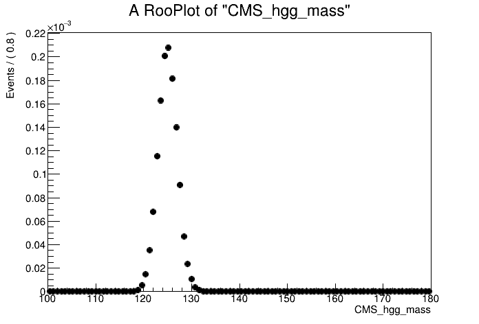
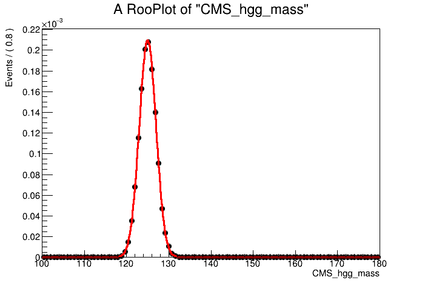
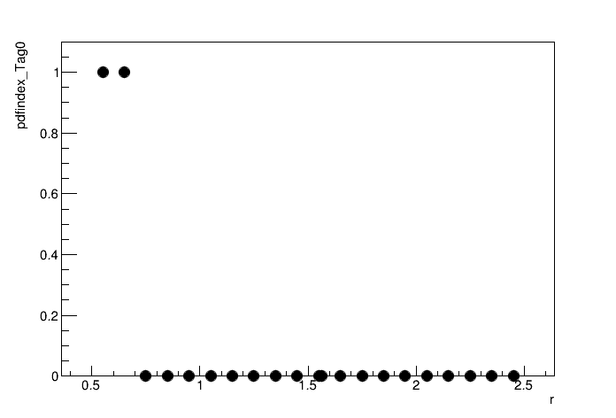

# Parametric fitting exercise

## Getting started

Add getting started details here

## Session structure
All code is in python version 3. Don't forget to import `ROOT`

## Analysis overview
TODO: define the fitting strategy.

## Part 1: Parametric model building
As with any fitting exercise, the first step is to understand the format of the input data, explore its contents and construct a model. The python script which performs the model construction is `construct_models_part1.py`. This section will explain what the various lines of code are doing.

### Signal modelling
Firstly, we will construct a model to fit the signal (H $\rightarrow\gamma\gamma$) mass peak using a Monte Carlo simulation sample of gluon-gluon fusion (ggH) events with $m_H=125$ GeV, which enter some analysis category (Tag0). The events are stored in a ROOT `TTree`, where the diphoton mass (`CMS_hgg_mass`) and the event weight are saved. We begin by loading the MC, and converting the `TTree` data into `RooDataSet`:
```python
import ROOT
ROOT.gROOT.SetBatch(True)

f = ROOT.TFile("mc_part1.root","r")
# Load TTree
t = f.Get("ggH_Tag0")

# Define mass and weight variables
mass = ROOT.RooRealVar("CMS_hgg_mass", "CMS_hgg_mass", 125, 100, 180)
weight = ROOT.RooRealVar("weight","weight",0,0,1)

# Convert to RooDataSet
mc = ROOT.RooDataSet("ggH_Tag0","ggH_Tag0", t, ROOT.RooArgSet(mass,weight), "", "weight" )

# Lets plot the signal mass distribution
can = ROOT.TCanvas()
plot = mass.frame()
mc.plotOn(plot)
plot.Draw()
can.Update()
can.SaveAs("part1_signal_mass.png")
```
<details>
<summary> Show </summary>

</details>


The plot shows a peak centred on the Higgs mass at 125 GeV. Let's use a simple Gaussian to model the peak.
```python
# Introduce a RooRealVar into the workspace for the Higgs mass
MH = ROOT.RooRealVar("MH", "MH", 125, 120, 130 )
MH.setConstant(True)

# Signal peak width
sigma = ROOT.RooRealVar("sigma_ggH_Tag0", "sigma_ggH_Tag0", 2, 1, 5)

# Define the Gaussian with mean=MH and width=sigma
model = ROOT.RooGaussian( "model_ggH_Tag0", "model_ggH_Tag0", mass, MH, sigma ) 

# Fit Gaussian to MC events and plot
model.fitTo(mc,ROOT.RooFit.SumW2Error(True))

can = ROOT.TCanvas()
plot = mass.frame()
mc.plotOn(plot)
model.plotOn( plot, ROOT.RooFit.LineColor(2) )
plot.Draw()
can.Update()
can.Draw()
can.SaveAs("part1_signal_model_v0.png")
```
<details>
<summary> Show </summary>

</details>

It looks like a good fit!

But what if the mean of the model does not correspond directly to the Higgs boson mass i.e. there are some reconstruction effects. Let's instead define the mean of the model as:
$$ \mu = m_H + \delta$$
and we can fit for $\delta$ in the model construction. For this we introduce a `RooFormulaVar`.
```python
dMH = ROOT.RooRealVar("dMH_ggH_Tag0", "dMH_ggH_Tag0", 0, -1, 1 )
mean = ROOT.RooFormulaVar("mean_ggH_Tag0", "mean_ggH_Tag0", "(@0+@1)", ROOT.RooArgList(MH,dMH))
model = ROOT.RooGaussian( "model_ggH_Tag0", "model_ggH_Tag0", mass, mean, sigma )

# Fit the new model with a variable mean
model.fitTo(mc,ROOT.RooFit.SumW2Error(True))

# Model is parametric in MH. Let's show this by plotting for different values of MH
can = ROOT.TCanvas()
plot = mass.frame()
MH.setVal(120)
model.plotOn( plot, ROOT.RooFit.LineColor(2) )
MH.setVal(125)
model.plotOn( plot, ROOT.RooFit.LineColor(3) )
MH.setVal(130)
model.plotOn( plot, ROOT.RooFit.LineColor(4) )
plot.Draw()
can.Update()
can.SaveAs("part1_signal_model_v1.png")
```
<details>
<summary> Show </summary>

</details>

Let's now save the model inside a `RooWorkspace`. Combine will load this model when performing the fits. Crucially, we need to freeze the fit parameters of the signal model, otherwise they will be freely floating in the final results extraction.
```python
MH.setVal(125)
dMH.setConstant(True)
sigma.setConstant(True)

f_out = ROOT.TFile("workspace_sig.root", "RECREATE")
w_sig = ROOT.RooWorkspace("workspace_sig","workspace_sig")
getattr(w_sig, "import")(model)
w_sig.Print()
w_sig.Write()
f_out.Close()
```
We have successfully constructed a parametric model to fit the shape of the signal peak. But we also need to know the yield/normalisation of the signal process. In the SM, the ggH event yield is equal to:
$$ N = \sigma_{ggH} \cdot \mathcal{B}^{\gamma\gamma} \cdot \epsilon \cdot \mathcal{L}$$
Where $\sigma_{ggH}$ is the SM cross section, $\mathcal{B}^{\gamma\gamma}$ is the SM branching fraction of the Higgs boson to two photons, $\epsilon$ is the efficiency factor and corresponds to the fraction of the total ggH events landing in the Tag0 analysis category. Finally $\mathcal{L}$ is the integrated luminosity.

In this example, the ggH MC events are normalised to $\sigma_{ggH} \cdot \mathcal{B}^{\gamma\gamma}$ **before any selection**, taking the values from the [LHCHWG twiki](https://twiki.cern.ch/twiki/bin/view/LHCPhysics/LHCHWG#Production_cross_sections_and_de). Therefore, we can calculate the efficiency factor $\epsilon$ by taking the sum of weights in the MC dataset and dividing through by $\sigma_{ggH} \cdot \mathcal{B}^{\gamma\gamma}$. 
```python
# Define SM cross section and branching fraction values
xs_ggH = 48.58 #in [pb]
br_gamgam = 2.7e-3

# Calculate the efficiency and print output
sumw = mc.sumEntries()
eff = sumw/(xs_ggH*br_gamgam)
print("Efficiency of ggH events landing in Tag0 is: %.2f%%"%(eff*100))

# Calculate the total yield (assuming full Run 2 lumi) and print output
lumi = 138000
N = xs_ggH*br_gamgam*eff*lumi
print("For 138fb^-1, total normalisation of signal is: N = xs * br * eff * lumi = %.2f events"%N)
```
Gives the output:
```
Efficiency of ggH events landing in Tag0 is: 1.00%
For 138fb^-1, total normalisation of signal is: N = xs * br * eff * lumi = 181.01 events
```
We need to make a note of the signal yield (`181.01`) for later.

### Background modelling
In the H $\rightarrow\gamma\gamma$ analysis we construct the background model directly from data. To avoid biasing our background estimate, we remove the signal region from the model construction and fit the mass sidebands. Let's begin by loading the data `TTree` and converting to a `RooDataSet`. We will then plot the mass sidebands.
```python
f = ROOT.TFile("data_part1.root","r")
t = f.Get("data_Tag0")

# Convert TTree to a RooDataSet
data = ROOT.RooDataSet("data_Tag0", "data_Tag0", t, ROOT.RooArgSet(mass), "", "weight")

# Define mass sideband ranges on the mass variable: 100-115 and 135-180
n_bins = 80
binning = ROOT.RooFit.Binning(n_bins,100,180)
mass.setRange("loSB", 100, 115 )
mass.setRange("hiSB", 135, 180 )
mass.setRange("full", 100, 180 )
fit_range = "loSB,hiSB"

# Plot the data in the mass sidebands
can = ROOT.TCanvas()
plot = mass.frame()
data.plotOn( plot, ROOT.RooFit.CutRange(fit_range), binning )
plot.Draw()
can.Update()
can.Draw()
can.SaveAs("part1_data_sidebands.png")
```
<details>
<summary> Show </summary>

</details>

By eye, it looks like an exponential function would fit the data sidebands well. Let's construct the background model using a `RooExponential` and fit the data sidebands:
```python
alpha = ROOT.RooRealVar("alpha", "alpha", -0.05, -0.2, 0 )
model_bkg = ROOT.RooExponential("model_bkg_Tag0", "model_bkg_Tag0", mass, alpha )

# Fit model to data sidebands
model_bkg.fitTo( data, ROOT.RooFit.Range(fit_range) )

# Let's plot the model fit to the data
can = ROOT.TCanvas()
plot = mass.frame()
# We have to be careful with the normalisation as we only fit over sidebands
# First do an invisible plot of the full data set
data.plotOn( plot, binning, ROOT.RooFit.MarkerColor(0), ROOT.RooFit.LineColor(0) )
model_bkg.plotOn( plot, ROOT.RooFit.NormRange(fit_range), ROOT.RooFit.Range("full"), ROOT.RooFit.LineColor(2))
data.plotOn( plot, ROOT.RooFit.CutRange(fit_range), binning )
plot.Draw()
can.Update()
can.Draw()
can.SaveAs("part1_bkg_model.png")
```
<details>
<summary> Show </summary>

</details>

As the background model is extracted from data, we want to introduce a freely floating normalisation term. We use the total number of data events (including in the signal region) as the initial prefit value of this normalisation object i.e. assuming no signal in the data. The syntax to the name this object is `{model}_norm` which will the be picked up automatically by combine. Note we also allow the shape parameter to float in the final fit to data.
```python
norm = ROOT.RooRealVar("model_bkg_Tag0_norm", "Number of background events in Tag0", data.numEntries(), 0, 3*data.numEntries() )
alpha.setConstant(False)
```
Let's then save the background model, the normalisation object, and the data distribution to a new `RooWorkspace`:
```python
f_out = ROOT.TFile("workspace_bkg.root", "RECREATE")
w_bkg = ROOT.RooWorkspace("workspace_bkg","workspace_bkg")
getattr(w_bkg, "import")(data)
getattr(w_bkg, "import")(norm)
getattr(w_bkg, "import")(model_bkg)
w_bkg.Print()
w_bkg.Write()
f_out.Close()
```

### Datacard
The model workspaces have now been constructed. But before we can run any fits in combine we need to build the so-called **datacard**. This is a text file which defines the different processes entering the fit and their expected yields, and maps these processes to the corresponding models. We also store information on the systematic uncertainties in the datacard (see part 3). Given the low complexity of this example, the datacard is reasonably short. The datacard for this section is titled `datacard_part1.txt`. Take some time to understand the different lines. In particular, the values for the process normalisations:

* Where does the signal (ggH) normalisation come from?
* Why do we use a value of 1.0 for the background model normalisation in this analysis?

```
# Datacard example for combine tutorial 2023 (part 1)
---------------------------------------------
imax 1
jmax 1
kmax *
---------------------------------------------

shapes      ggH          Tag0      workspace_sig.root      workspace_sig:model_ggH_Tag0
shapes      bkg_mass     Tag0      workspace_bkg.root      workspace_bkg:model_bkg_Tag0
shapes      data_obs     Tag0      workspace_bkg.root      workspace_bkg:data_Tag0

---------------------------------------------
bin             Tag0
observation     -1
---------------------------------------------
bin             Tag0         Tag0
process         ggH          bkg_mass
process         0            1
rate            181.01       1.0
---------------------------------------------
```
To compile the datacard we run the following command, using a value of the Higgs mass of 125.0:
```
text2workspace.py datacard_part1.txt -m 125
```
Try opening the compiled workspace (`root datacard_part1.root`) and print the contents.
```
w->Print()
```

 Do you understand what all the different objects are? What does the variable `r` correspond to? Try (verbose) printing with: 
```
w->var("r")->Print("v")
```
### Extension: signal normalisation object
In the example above, the signal model normalisation is input by hand in the datacard. We can instead define the signal normalisation components in the model in a similar fashion to the background model normalisation object. Let's build the cross section (ggH), branching fraction (H->gamgam), and efficiency variables. It's important to set these terms to be constant for the final fit to data:
```python
xs_ggH = ROOT.RooRealVar("xs_ggH", "Cross section of ggH in [pb]", 48.58 )
br_gamgam = ROOT.RooRealVar("BR_gamgam", "Branching ratio of Higgs to gamma gamma", 0.0027 )
eff_ggH_Tag0 = ROOT.RooRealVar("eff_ggH_Tag0", "Efficiency for ggH events to land in Tag0", eff )

xs_ggH.setConstant(True)
br_gamgam.setConstant(True)
eff_ggH_Tag0.setConstant(True)
```
The normalisation component is then defined as the product of these three variables:
```python
norm_sig = ROOT.RooProduct("model_ggH_Tag0_norm", "Normalisation term for ggH in Tag 0", ROOT.RooArgList(xs_ggH,br_gamgam,eff_ggH_Tag0))
```

Again the syntax `{model}_norm` has been used so that combine will automatically assign this object as the normalisation for the model (`model_ggH_Tag0`).

* Firstly we need to save a new version of the signal model workspace with the normalisation term included. 
```python
f_out = ROOT.TFile("workspace_sig_with_norm.root", "RECREATE")
w_sig = ROOT.RooWorkspace("workspace_sig","workspace_sig")
getattr(w_sig, "import")(model)
getattr(w_sig, "import")(norm_sig)
w_sig.Print()
w_sig.Write()
f_out.Close()
```
* We then need to modify the datacard to account for this normalisation term. Importantly, the `{model}_norm` term in our updated signal model workspace does not contain the integrated luminosity. Therefore, the `rate` term in the datacard must be set equal to the integrated luminosity in [pb^-1] (as the cross section was defined in [pb]). The total normalisation for the signal model is then the product of the `{model}_norm` and the `rate` value. 
* You can find the example datacard here: `datacard_part1_with_norm.txt` with the signal normalisation object included. Check if it compiles successfully using `text2workspace`? If so, try printing out the contents of the workspace. Can you see the normalisation component?

### Extension: unbinned vs binned
In a parametric analysis, the fit can be performed using a binned or unbinned likelihood function. The consequences of binned vs unbinned likelihoods were discussed in the [morning session](https://indico.cern.ch/event/1227742/contributions/5240048/). In combine, we can simply toggle between binned and unbinned fits by changing how the data set is stored in the workspace. In the example above, the data was saved as a `RooDataSet`. This means that an unbinned maximum likelihood function would be used.

To switch to a **binned** maximum likelihood fit, we need to store the data set in the workspace as a `RooDataHist`. Let's first load the data as a `RooDataSet` as before:
```python
f = ROOT.TFile("data_part1.root","r")
t = f.Get("data_Tag0")

# Convert TTree to a RooDataSet
data = ROOT.RooDataSet("data_Tag0", "data_Tag0", t, ROOT.RooArgSet(mass, weight), "", "weight")
```
We then need to set the number of bins in the observable and convert the data to a `RooDataHist`. In this example we will use 320 bins over the full mass range (0.25 GeV per bin). It is important that the binning is sufficiently granular so that we do not lose information in the data by switching to a binned likelihood fit. When fitting a signal peak over a background we want the bin width to be sufficiently smaller than the signal model mass resolution.
```python
# Set bin number for mass variables
mass.setBins(320)
data_hist = ROOT.RooDataHist("data_hist_Tag0", "data_hist_Tag0", mass, data)

# Save the background model with the RooDataHist instead
f_out = ROOT.TFile("workspace_bkg_binned.root", "RECREATE")
w_bkg = ROOT.RooWorkspace("workspace_bkg","workspace_bkg")
getattr(w_bkg, "import")(data_hist)
getattr(w_bkg, "import")(norm)
getattr(w_bkg, "import")(model_bkg)
w_bkg.Print()
w_bkg.Write()
f_out.Close()
```

## Part 2: Simple fits 
Now the parametric models have been constructed and the datacard has been compiled, we are ready to start using combine for running fits. In CMS analyses we begin by blinding ourselves to the data in the signal region, and looking only at the expected results based off toys datasets (asimov or pseudo-experiments). In this exercise, we will look straight away at the observed results. Note, the python commands in this section are taken from `simple_fits.py`.

To run a simple best-fit for the signal strength, `r`, fixing the Higgs mass to 125 GeV, you can run the command in the terminal:
```
combine -M MultiDimFit datacard_part1_with_norm.root -m 125 --freezeParameters MH --saveWorkspace -n .bestfit
```
We obtain a best-fit signal strength of `r = 1.548` i.e. the observed signal yield is 1.548 times the SM prediction.

The option `--saveWorkspace` stores a snapshot of the postfit workspace in the output file (`higgsCombine.bestfit.MultiDimFit.mH125.root`). We can load the postfit workspace and look at how the values of all the fit parameters change (compare the `clean` and `MultiDimFit` parameter snapshots):
```python
import ROOT

f = ROOT.TFile("higgsCombine.bestfit.MultiDimFit.mH125.root")
w = f.Get("w")
w.Print("v")
```
We can even plot the postfit signal-plus-background model using the workspace snapshot:
```python
n_bins = 80
binning = ROOT.RooFit.Binning(n_bins,100,180)

can = ROOT.TCanvas()
plot = w.var("CMS_hgg_mass").frame()
w.data("data_obs").plotOn( plot, binning )

# Load the S+B model
sb_model = w.pdf("model_s").getPdf("Tag0")

# Prefit
sb_model.plotOn( plot, ROOT.RooFit.LineColor(2), ROOT.RooFit.Name("prefit") )

# Postfit
w.loadSnapshot("MultiDimFit")
sb_model.plotOn( plot, ROOT.RooFit.LineColor(4), ROOT.RooFit.Name("postfit") )
r_bestfit = w.var("r").getVal()

plot.Draw()

leg = ROOT.TLegend(0.55,0.6,0.85,0.85)
leg.AddEntry("prefit", "Prefit S+B model (r=1.00)", "L")
leg.AddEntry("postfit", "Postfit S+B model (r=%.2f)"%r_bestfit, "L")
leg.Draw("Same")

can.Update()
can.SaveAs("part2_sb_model.png")
```
<details>
<summary> Show </summary>

</details>

### Confidence intervals
We not only want to find the best-fit value of the signal strength, r, but also the confidence intervals. The `singles` algorithm will find the 68% CL intervals:
```
combine -M MultiDimFit datacard_part1_with_norm.root -m 125 --freezeParameters MH -n .singles --algo singles
```
To perform a likelihood scan (i.e. calculate 2NLL at fixed values of the signal strength, profiling the other parameters), we use the `grid` algorithm. We can control the number of points in the scan using the `--points` option. Also, it is important to set a suitable range for the signal strength parameter. The `singles` algorithm has shown us that the 1 stdev interval on r is around +/-0.2. 
* Use these intervals to define a suitable range for the scan, and change `lo,hi` in the following options accordingly: `--setParameterRanges r=lo,hi`.
```
combine -M MultiDimFit datacard_part1_with_norm.root -m 125 --freezeParameters MH -n .scan --algo grid --points 20 --setParameterRanges r=lo,hi
```
We can use the `plot1DScan.py` function from combineTools to plot the likelihood scan:
```
plot1DScan.py higgsCombine.scan.MultiDimFit.mH125.root -o part2_scan
```

<details>
<summary> Show </summary>

</details>

* Do you understand what the plot is showing? What information about the signal strength parameter can be inferred from the plot?

### Extension: expected fits
To run *expected* fits we simply add `-t N` to the combine command. For `N>0`, this will generate N random toys from the model and fit each one independently. For `N=-1`, this will generate an asimov toys in which all statistical fluctuations from the model are suppressed. 

You can use the `--expectSignal 1` option to see the signal strength parameter to 1 when generating the toy. Alternatively, `--expectSignal 0` will generate a toy from the background-only model. For multiple parameter models you can set the initial values when generating the toy(s) using `--setParameters`. For example, if you want to throw a toy where the Higgs mass is at 124 GeV and the background slope parameter `alpha` is equation -0.05, you would add `--setParameters MH=124.0,alpha=-0.05`.

* Try running the asimov likelihood scan for `r=1` and `r=0`, and plotting the likelihood scans.

### Extension: goodness-of-fit tests
The goodness-of-fit tests available in combine are only well-defined for binned maximum likelihood fits. Therefore, to perform a goodness-of-fit test with a parametric datacard, make sure to save the data object as a `RooDataHist`, as in `workspace_bkg_binned.root`. 

* Using what you have learnt from the goodness-of-fit checks in the template-based analysis pre-exercise, can you run a goodness-of-fit check for this analysis?

## Part 3: Systematic uncertainties
In this section, we will learn how to add systematic uncertainties to a parametric fit analysis. The python commands are taken from the `systematics.py` script. 

For uncertainties which only affect the process normalisation, we can simply implement these as `lnN` uncertainties in the datacard. The file `mc_part3.root` contains the systematic-varied trees i.e. Monte-Carlo events where some systematic uncertainty source `{photonID,JEC,scale,smear}` has been varied up and down by $1\sigma$.
```python
import ROOT

f = ROOT.TFile("mc_part3.root")
f.ls()
```
Gives the output:
```
TFile**		mc_part3.root	
 TFile*		mc_part3.root	
  KEY: TTree	ggH_Tag0;1	ggH_Tag0
  KEY: TTree	ggH_Tag0_photonIDUp01Sigma;1	ggH_Tag0_photonIDUp01Sigma
  KEY: TTree	ggH_Tag0_photonIDDown01Sigma;1	ggH_Tag0_photonIDDown01Sigma
  KEY: TTree	ggH_Tag0_scaleUp01Sigma;1	ggH_Tag0_scaleUp01Sigma
  KEY: TTree	ggH_Tag0_scaleDown01Sigma;1	ggH_Tag0_scaleDown01Sigma
  KEY: TTree	ggH_Tag0_smearUp01Sigma;1	ggH_Tag0_smearUp01Sigma
  KEY: TTree	ggH_Tag0_smearDown01Sigma;1	ggH_Tag0_smearDown01Sigma
  KEY: TTree	ggH_Tag0_JECUp01Sigma;1	ggH_Tag0_JECUp01Sigma
  KEY: TTree	ggH_Tag0_JECDown01Sigma;1	ggH_Tag0_JECDown01Sigma
```
Let's first load the systematic-varied trees as RooDataSets and store them in a python dictionary, `mc`:
```python
# Define mass and weight variables
mass = ROOT.RooRealVar("CMS_hgg_mass", "CMS_hgg_mass", 125, 100, 180)
weight = ROOT.RooRealVar("weight","weight",0,0,1)

mc = {}

# Load the nominal dataset
t = f.Get("ggH_Tag0")
mc['nominal'] = ROOT.RooDataSet("ggH_Tag0","ggH_Tag0", t, ROOT.RooArgSet(mass,weight), "", "weight" )

# Load the systematic-varied datasets
for syst in ['JEC','photonID','scale','smear']:
    for direction in ['Up','Down']:
        key = "%s%s01Sigma"%(syst,direction)
        name = "ggH_Tag0_%s"%(key)
        t = f.Get(name)
        mc[key] = ROOT.RooDataSet(name, name, t, ROOT.RooArgSet(mass,weight), "", "weight" )
```

The jet energy scale (JEC) and photon identification (photonID) uncertainties do not affect the shape of the $m_{\gamma\gamma}$ distribution i.e. they only effect the signal yield estimate. We can calculate their impact by comparing the sum of weights to the nominal dataset. Note, the photonID uncertainty changes the weight of the events in the tree, whereas the JEC varied trees contain a different set of events, generated by shifting the jet energy scale in the simulation. In any case, the means for calculating the yield variations is equivalent:
```python
for syst in ['JEC','photonID']:
    for direction in ['Up','Down']:
        yield_variation = mc['%s%s01Sigma'%(syst,direction)].sumEntries()/mc['nominal'].sumEntries()
        print("Systematic varied yield (%s,%s): %.3f"%(syst,direction,yield_variation))
```
```
Systematic varied yield (JEC,Up): 1.056
Systematic varied yield (JEC,Down): 0.951
Systematic varied yield (photonID,Up): 1.050
Systematic varied yield (photonID,Down): 0.950
```
We can write these yield variations in the datacard with the lines:
```
CMS_scale_j           lnN      0.951/1.056      -
CMS_hgg_phoIdMva      lnN      1.05             -   
```
* Why is the photonID uncertainty expressed as one number, whereas the JEC uncertainty is defined by two?

Note in this analysis there are no systematic uncertainties affecting the background estimate (` - ` in the datacard), as the background model has been derived directly from data.

### Parametric shape uncertainties
What about systematic uncertainties which affect the shape of the mass distribution?

In a parametric analysis, we need to build the dependence directly into the model parameters. The example uncertainty sources in this tutorial are the photon energy scale and smearing uncertainties. From the names alone we can expect that the **scale** uncertainty will affect the mean of the signal Gaussian, and the **smear** uncertainty will impact the resolution (sigma). Let's first take a look at the `scaleUp01Sigma` dataset:

```python
# Build the model to fit the systematic-varied datasets
mean = ROOT.RooRealVar("mean", "mean", 125, 124, 126)
sigma = ROOT.RooRealVar("sigma", "sigma", 2, 1.5, 2.5)
gaus = ROOT.RooGaussian("model", "model", mass, mean, sigma)

# Run the fits twice (second time from the best-fit of first run) to obtain more reliable results
gaus.fitTo(mc['scaleUp01Sigma'], ROOT.RooFit.SumW2Error(True))
gaus.fitTo(mc['scaleUp01Sigma'], ROOT.RooFit.SumW2Error(True))
print("Mean = %.3f +- %.3f GeV, Sigma = %.3f +- %.3f GeV"%(mean.getVal(),mean.getError(),sigma.getVal(),sigma.getError()) )
```
Gives the output:
```
Mean = 125.370 +- 0.009 GeV, Sigma = 2.011 +- 0.006 GeV
```
Now let's compare the values to the nominal fit for all systematic-varied trees. We observe a significant variation in the mean for the **scale** uncertainty, and a significant variation in sigma for the **smear** uncertainty. 
```python
# First fit the nominal dataset
gaus.fitTo(mc['nominal'], ROOT.RooFit.SumW2Error(True) )
gaus.fitTo(mc['nominal'], ROOT.RooFit.SumW2Error(True) )
# Save the mean and sigma values and errors to python dicts
mean_values, sigma_values = {}, {}
mean_values['nominal'] = [mean.getVal(),mean.getError()]
sigma_values['nominal'] = [sigma.getVal(),sigma.getError()]

# Next for the systematic varied datasets
for syst in ['scale','smear']:
    for direction in ['Up','Down']:
        key = "%s%s01Sigma"%(syst,direction)
        gaus.fitTo(mc[key] , ROOT.RooFit.SumW2Error(True) )
        gaus.fitTo(mc[key], ROOT.RooFit.SumW2Error(True))
        mean_values[key] = [mean.getVal(), mean.getError()]
        sigma_values[key] = [sigma.getVal(), sigma.getError()]

# Print the variations in mean and sigma
for key in mean_values.keys():
    print("%s: mean = %.3f +- %.3f GeV, sigma = %.3f +- %.3f GeV"%(key,mean_values[key][0],mean_values[key][1],sigma_values[key][0],sigma_values[key][1]))
```
Prints the output:
```
nominal: mean = 125.001 +- 0.009 GeV, sigma = 1.996 +- 0.006 GeV
scaleUp01Sigma: mean = 125.370 +- 0.009 GeV, sigma = 2.011 +- 0.006 GeV
scaleDown01Sigma: mean = 124.609 +- 0.009 GeV, sigma = 2.005 +- 0.006 GeV
smearUp01Sigma: mean = 125.005 +- 0.009 GeV, sigma = 2.097 +- 0.007 GeV
smearDown01Sigma: mean = 125.007 +- 0.009 GeV, sigma = 1.912 +- 0.006 GeV
```
The values tell us that the scale uncertainty (at $\pm 1 \sigma$) varies the signal peak mean by around 0.3%, and the smear uncertainty (at $\pm 1 \sigma$) varies the signal width (sigma) by around 4.5% (average of up and down variations). 

Now we need to bake these effects into the parametric signal model. The mean of the Gaussian was previously defined as:
$$ \mu = m_H + \delta$$
We introduce the nuisance parameter `nuisance_scale` = $\eta$ to account for a shift in the signal peak mean using:
$$ \mu = (m_H + \delta) \cdot (1+0.003\eta)$$
At $\eta = +1 (-1)$ the signal peak mean will shift up (down) by 0.3%. To build this into the RooFit signal model we simply define a new parameter, $\eta$, and update the definition of the mean formula variable:
```python
# Building the workspace with systematic variations
MH = ROOT.RooRealVar("MH", "MH", 125, 120, 130 )
MH.setConstant(True)

# Define formula for mean of Gaussian
dMH = ROOT.RooRealVar("dMH_ggH_Tag0", "dMH_ggH_Tag0", 0, -5, 5 )
eta = ROOT.RooRealVar("nuisance_scale", "nuisance_scale", 0, -5, 5)
eta.setConstant(True)
mean_formula = ROOT.RooFormulaVar("mean_ggH_Tag0", "mean_ggH_Tag0", "(@0+@1)*(1+0.003*@2)", ROOT.RooArgList(MH,dMH,eta))
```
* Why do we set the nuisance parameter to constant at this stage?

Similar for the width introducing a nuisance parameter, $\chi$:
$$ \sigma = \sigma \cdot (1+0.045\chi)$$

```python
sigma = ROOT.RooRealVar("sigma_ggH_Tag0_nominal", "sigma_ggH_Tag0_nominal", 2, 1, 5)
chi = ROOT.RooRealVar("nuisance_smear", "nuisance_smear", 0, -5, 5)
chi.setConstant(True)
sigma_formula = ROOT.RooFormulaVar("sigma_ggH_Tag0", "sigma_ggH_Tag0", "@0*(1+0.045*@1)", ROOT.RooArgList(sigma,chi))
```
Let's now fit the new model to the signal Monte-Carlo dataset, build the normalisation object and save the workspace.
```python
# Define Gaussian
model = ROOT.RooGaussian( "model_ggH_Tag0", "model_ggH_Tag0", mass, mean_formula, sigma_formula )

# Fit model to MC
model.fitTo( mc['nominal'], ROOT.RooFit.SumW2Error(True) )

# Build signal model normalisation object
xs_ggH = ROOT.RooRealVar("xs_ggH", "Cross section of ggH in [pb]", 48.58 )
br_gamgam = ROOT.RooRealVar("BR_gamgam", "Branching ratio of Higgs to gamma gamma", 0.0027 )
eff = mc['nominal'].sumEntries()/(xs_ggH.getVal()*br_gamgam.getVal())
eff_ggH_Tag0 = ROOT.RooRealVar("eff_ggH_Tag0", "Efficiency for ggH events to land in Tag0", eff )
# Set values to be constant
xs_ggH.setConstant(True)
br_gamgam.setConstant(True)
eff_ggH_Tag0.setConstant(True)
# Define normalisation component as product of these three variables
norm_sig = ROOT.RooProduct("model_ggH_Tag0_norm", "Normalisation term for ggH in Tag 0", ROOT.RooArgList(xs_ggH,br_gamgam,eff_ggH_Tag0))

# Set shape parameters of model to be constant (i.e. fixed in fit to data)
dMH.setConstant(True)
sigma.setConstant(True)

# Build new signal model workspace with signal normalisation term. 
f_out = ROOT.TFile("workspace_sig_with_syst.root", "RECREATE")
w_sig = ROOT.RooWorkspace("workspace_sig","workspace_sig")
getattr(w_sig, "import")(model)
getattr(w_sig, "import")(norm_sig)
w_sig.Print()
w_sig.Write()
f_out.Close()
```
The final step is to add the parametric uncertainties as Gaussian-constrained nuisance parameters into the datacard. The syntax means the Gaussian constraint term in the likelihood function will have a mean of 0 and a width of 1.
```
nuisance_scale        param    0.0    1.0
nuisance_smear        param    0.0    1.0
```
* Try adding these lines to `datacard_part1_with_norm.txt`, along with the lines for the JEC and photonID yield uncertainties above, and compiling with the `text2workspace` command. Open the workspace and look at its contents. You will need to change the signa process workspace file name in the datacard to point to the new workspace (`workspace_sig_with_syst.root`).
* Can you see the new objects in the compiled datacard that have been created for the systematic uncertainties? What do they correspond to?

We can now run a fit with the systematic uncertainties included. The option `--saveSpecifiedNuis` can be called to save the postfit nuisance parameter values in the combine output limit tree. 
```
combine -M MultiDimFit datacard_part1_with_norm.root -m 125 --freezeParameters MH --saveWorkspace -n .bestfit.with_syst --saveSpecifiedNuis CMS_scale_j,CMS_hgg_phoIdMva,nuisance_scale,nuisance_smear
```
* What do the postfit values of the nuisances tell us here? You can check them by opening the output file (`root higgsCombine.bestfit.with_syst.MultiDimFit.mH125.root`) and running `limit->Show(0)`.
* Try plotting the postfit mass distribution (as detailed in part 2). Do you notice any difference?

### Uncertainty breakdown
A more complete datacard with additional nuisance parameters is stored in `datacard_part3.txt`. We will use this datacard for the rest of part 3. Open the text file and have a look at the contents.

The following line has been appended to the end of the datacard to define the set of theory nuisance parameters. This will come in handy when calculating the uncertainty breakdown.
```
theory group = BR_hgg QCDscale_ggH pdf_Higgs_ggH alphaS_ggH UnderlyingEvent PartonShower
```
Compile the datacard and run an observed `MultiDimFit` likelihood scan over the signal strength, r:
```
text2workspace.py datacard_part3.txt -m 125

combine -M MultiDimFit datacard_part3.root -m 125 --freezeParameters MH -n .scan.with_syst --algo grid --points 20 --setParameterRanges r=0.5,2.5
```
Our aim is to break down the total uncertainty into the systematic and statistical components. To get the statistical-uncertainty-only scan it should be as simple as freezing the nuisance parameters in the fit... right? 

Try it by adding `,rgx{.*}` to the `--freezeParameters` option. This will freeze all nuisance parameters by using a wildcard in the regular expression. Note, in combine you can use the option `--freezeParameters allConstrainedNuisances`, but this will not work here as we want to additionally freeze `MH`.
```
combine -M MultiDimFit datacard_part3.root -m 125 --freezeParameters MH,rgx{.*} -n .scan.with_syst.statonly --algo grid --points 20 --setParameterRanges r=0.5,2.5
```
You can plot the two likelihood scans on the same axis with the command:
```
plot1DScan.py higgsCombine.scan.with_syst.MultiDimFit.mH125.root --main-label "With systematics" --main-color 1 --others higgsCombine.scan.with_syst.statonly.MultiDimFit.mH125.root:"Stat-only":2 -o part3_scan_v0
```
<details>
<summary> Show </summary>

</details>

* Can you spot the problem? 

The nuisance parameters introduced into the model have pulled the best-fit signal strength point! Therefore we cannot simply subtract the uncertainties in quadrature to get an estimate for the systematic/statistical uncertainty breakdown. 

The correct approach is to freeze the nuisance parameters to their respective best-fit values in the stat-only scan. We can do this by first saving a postfit workspace with all nuisance parameters profiled in the fit. Then we load the postfit snapshot values of the nuisance parameters (with the option `--snapshotName MultiDimFit`) from the combine output of the previous step, and then freeze the nuisance parameters for the stat-only scan.
```
combine -M MultiDimFit datacard_part3.root -m 125 --freezeParameters MH -n .bestfit.with_syst --setParameterRanges r=0.5,2.5 --saveWorkspace

combine -M MultiDimFit higgsCombine.bestfit.with_syst.MultiDimFit.mH125.root -m 125 --freezeParameters MH,rgx{.*} -n .scan.with_syst.statonly_correct --algo grid --points 20 --setParameterRanges r=0.5,2.5 --snapshotName MultiDimFit
```
Adding the option `--breakdown syst,stat` to the `plot1DScan.py` command will automatically calculate the uncertainty breakdown for you.
```
plot1DScan.py higgsCombine.scan.with_syst.MultiDimFit.mH125.root --main-label "With systematics" --main-color 1 --others higgsCombine.scan.with_syst.statonly_correct.MultiDimFit.mH125.root:"Stat-only":2 -o part3_scan_v1 --breakdown syst,stat
```
<details>
<summary> Show </summary>

</details>

We can also freeze groups of nuisance parameters defined in the datacard with the option `--freezeNuisanceGroups`. Let's run a scan freezing only the theory uncertainties (using the nuisance group we defined in the datacard):
```
combine -M MultiDimFit higgsCombine.bestfit.with_syst.MultiDimFit.mH125.root -m 125 --freezeParameters MH --freezeNuisanceGroups theory -n .scan.with_syst.freezeTheory --algo grid --points 20 --setParameterRanges r=0.5,2.5 --snapshotName MultiDimFit
```
To breakdown the total uncertainty into the theory, experimental and statistical components we can then use:
```
plot1DScan.py higgsCombine.scan.with_syst.MultiDimFit.mH125.root --main-label Total --main-color 1 --others higgsCombine.scan.with_syst.freezeTheory.MultiDimFit.mH125.root:"Freeze theory":4 higgsCombine.scan.with_syst.statonly_correct.MultiDimFit.mH125.root:"Stat-only":2 -o part3_scan_v2 --breakdown theory,exp,stat
```
<details>
<summary> Show </summary>

</details>

These methods are not limited to this particular grouping of systematics. We can use the above procedure to assess the impact of any nuisance parameter(s) on the signal strength confidence interval. 
* Try and calculate the contribution to the total uncertainty from the luminosity estimate using this approach.

### Impacts
It is often useful/required to check the impacts of the nuisance parameters (NP) on the parameter of interest, r. The impacts is defined as the shift $\Delta r$ induced as the NP, $\theta$ is fixed to its $\pm1\sigma$ values, with all other parameters profiled as normal. More information can be found in the combine documentation via this [link](https://cms-analysis.github.io/HiggsAnalysis-CombinedLimit/part3/nonstandard/#nuisance-parameter-impacts).

Let's calculate the impacts for our analysis. We can use the `combineTool.py` from the `CombineHarvester` package to automate the scripts. The impacts are calculated in a few stages:

1) Do an initial fit for the parameter of interest, adding the `--robustFit 1` option:
```
combineTool.py -M Impacts -d datacard_part3.root -m 125 --freezeParameters MH -n .impacts --setParameterRanges r=0.5,2.5 --doInitialFit --robustFit 1
```
* What does the option `--robustFit 1` do? 

2) Next perform a similar scan for each NP with the `--doFits` option. This may take a few minutes:
```
combineTool.py -M Impacts -d datacard_part3.root -m 125 --freezeParameters MH -n .impacts --setParameterRanges r=0.5,2.5 --doFits --robustFit 1
```

3) Collect the outputs from the previous step and write the results to a json file:
```
combineTool.py -M Impacts -d datacard_part3.root -m 125 --freezeParameters MH -n .impacts --setParameterRanges r=0.5,2.5 -o impacts_part3.json
```

4) Produce a plot summarising the nuisance parameter values and impacts:
```
plotImpacts.py -i impacts_part3.json -o impacts_part3
```
<details>
<summary> Show </summary>

</details>

There is a lot of information in these plots, which can be of invaluable use to analysers in understanding the fit. Do you understand everything that the plot is showing?
* Which NP has the highest impact on the signal strength measurement?
* Which NP is pulled the most in the fit to data? What does this information imply about the signal model mean in relation to the data?
* Which NP is the most constrained in the fit to the data? What does it mean for a nuisance parameter to be constrained?
* Try adding the option `--summary` to the impacts plotting command. This is a nice new feature in combine!

## Part 4: Toy generation and bias studies
With combine we can generate toy datasets from the compiled datacard workspace. Please read [this section](https://cms-analysis.github.io/HiggsAnalysis-CombinedLimit/part3/runningthetool/#toy-data-generation) in the combine manual before proceeding.

An interesting use case of toy generation is when performing bias studies. In the Higgs to two photon (Hgg) analysis, the background is fit with some functional form. However (due to the complexities of QCD) the exact form of this function is unknown. Therefore, we need to understand how our choice of background function may impact the fitted signal strength. This is performed using a bias study, which will indicate how much potential bias is present given a certain choice of functional form.

In the classical bias studies we begin by building a set of workspaces which correspond to different background function choices. In addition to the `RooExponential` constructed in Section 1, let's also try a (4th order) `RooChebychev` polynomial and a simple power law function to fit the background $m_{\gamma\gamma}$ distribution. 

The script used to fit the different functions and build the workspaces is `construct_models_bias_study_part4.py`. Take some time to look at the script and understand what the code is doing. In particular notice how we have saved the data as a `RooDataHist` in the workspace. This means we are now performing **binned** maximum likelihood fits (this is useful for part 4 to speed up fitting the many toys). If the binning is sufficiently granular, then there will be no noticeable difference in the results to the **unbinned** likelihood fits. Run the script with:
```
python3  construct_models_bias_study_part4.py
```

The outputs are a set of workspaces which correspond to different choices of background model functions, and a plot showing fits of the different functions to the data mass sidebands.

<details>
<summary> Show </summary>

</details>

The datacards for the different background model functions are saved as `datacard_part4_{pdf}.txt` where `pdf = {exp,poly,pow}`. Have a look inside the .txt files and understand what changes have been made to pick up the different functions. Compile the datacards with:
```
for pdf in {exp,poly,pow}; do text2workspace.py datacard_part4_${pdf}.txt -m 125; done
```

### Bias studies
For the bias studies we want to generate ("throw") toy datasets with some choice of background function and fit back with another. The toys are thrown with a known value of the signal strength (r=1 in this example), which we will call $r_{truth}$. The fitted value of r is defined as $r_{fit}$, with some uncertainty $\sigma_{fit}$. A pull value, $P$, is calculated for each toy dataset according to,
$$ P = (r_{truth}-r_{fit})/\sigma_{fit}$$
By repeating the process for many toys we can build up a pull distribution. If there is no bias present then we would expect to obtain a normal distribution centred at 0, with a standard deviation of 1. Let's calculate the bias for our analysis.

Firstly,  we generate N=1000 toys from each of the background function choices and save them in a ROOT file. For this we use the `GenerateOnly` method of combine. We will inject signal in the toys by setting `r=1` using the `--expectSignal 1` option. 
* If time allows, repeat the bias studies with `--expectSignal 0`. This will inform us of the potential bias in the signal strength measurement given that there is no true signal.

The following commands show the example of throwing 1000 toys from the exponential function, and then fitting back with the 4th-order Chebychev polynomial. We use the `singles` algorithm to obtain a value for $r_{fit}$ and $\sigma_{fit}$ simultaneously.
```
combine -M GenerateOnly datacard_part4_exp.root -m 125 --freezeParameters MH -t 1000 -n .generate_exp --expectSignal 1 --saveToys

combine -M MultiDimFit datacard_part4_poly.root -m 125 --freezeParameters MH -t 1000 -n .bias_truth_exp_fit_poly --expectSignal 1 --toysFile higgsCombine.generate_exp.GenerateOnly.mH125.123456.root --algo singles
```
The script `plot_bias_pull.py` will plot the pull distribution and fit a Gaussian to it:
```
python3 plot_bias_pull.py
```
<details>
<summary> Show </summary>

</details>

The potential bias is defined as the (fitted) mean of the pull distribution. In this case it is -0.233. 
* What threshold do we use to define "acceptable" bias? 

The bias is defined relative to the total uncertainty in the signal strength. Some analyses use 0.14 as the threshold because a bias below this value would change the total uncertainty (when added in quadrature) by less than 1% (see equation below). Other analyses use 0.2 as this will change the total uncertainty by less than 2%. We should define the threshold before performing the bias study.
$$ \sqrt{ 1^2 + 0.14^2} = 1.0098 $$
* How does our bias value compare to the thresholds? If we are using a threshold of 0.2 then the bias in this case is outside the acceptable region! We therefore should account for this using a **spurious signal** method (see advanced exercises TBA).
* Repeat the bias study for each possible truth and fitted background function combinations. Do the bias values induced by the choice of background function merit adding a spurious signal component into the fit?
* What would you expect the bias value to be for a background function that does not fit the data well? Should we be worried about such functions? What test could we use to reject such functions from the study beforehand?

## Part 5: Discrete-profiling
If multiple pdfs exist to fit some distribution, we can store all pdfs in a single workspace by using a `RooMultiPdf` object. The script `construct_models_multipdf_part5.py` shows how to store the exponential, (4th order) Chebychev polynomial and the power law function from the previous section in a `RooMultiPdf` object. This requires a `RooCategory` index, which controls the pdf which is active at any one time. Look at the contents of the script and then run with:
```
python3 construct_models_multipdf_part5.py
```
The file `datacard_part5.txt` will load the multipdf as the background model. Notice the line at the end of the datacard (see below). This tells combine about the `RooCategory` index.
```
pdfindex_Tag0         discrete
```
Compile the datacard with:
```
text2workspace.py datacard_part5.txt -m 125
```

The `RooMultiPdf` is a handy object for performing bias studies as all functions can be stored in a single workspace. You can then set which function is used for generating the toys with the `--setParameters pdfindex=i` option, and which function is used for fitting with `--setParameters pdfindex=i --freezeParameters pdfindex=j` options. 
* It would be a useful exercise to repeat the bias studies from part 4 but using the RooMultiPdf workspace. What happens when you do not freeze the index in the fitting step?

But simpler bias studies are not the only benefit of using the `RooMultiPdf`! It also allows us to apply the [discrete profiling method](https://arxiv.org/pdf/1408.6865.pdf) in our analysis. In this method, the index labelling which pdf is active (a discrete nuisance parameter) is left floating in the fit, and will be profiled by looping through all the possible index values and finding the pdf which gives the best fit. In this manner, we are able to account for the **uncertainty in the choice of the background function**. 

Note, by default, the multipdf will tell combine to add 0.5 to the NLL for each parameter in the pdf. This is known as the penalty term (or correction factor) for the discrete profiling method. You can toggle this term when building the workspace with the command `multipdf.setCorrectionFactor(0.5)`. You may need to change the value of this term to obtain an acceptable bias in your fit!

Let's run a likelihood scan using the compiled datacard with the `RooMultiPdf`:
```
combine -M MultiDimFit datacard_part5.root -m 125 --freezeParameters MH -n .scan.multidimfit --algo grid --points 20 --cminDefaultMinimizerStrategy 0 --saveSpecifiedIndex pdfindex_Tag0 --setParameterRanges r=0.5,2.5
```
* The option `--cminDefaultMinimizerStrategy 0` is required to prevent HESSE being called as this cannot handle discrete nuisance parameters. HESSE is the full calculation of the second derivative matrix (Hessian) of the likelihood using finite difference methods.
* The option `--saveSpecifiedIndex pdfindex_Tag0` saves the value of the index at each point in the likelihood scan. Let's have a look at how the index value changes as a function of the signal strength. You can make the following plot by running:
```
python3 plot_pdfindex.py
```
<details>
<summary> Show </summary>

</details>

By floating the discrete nuisance parameter `pdfindex_Tag0`, at each point in the likelihood scan the pdfs will be iterated over and the one which gives the max likelihood (lowest 2NLL) including the correction factor will be used. The plot above shows that the `pdfindex_Tag0=0` (exponential) is chosen for the majority of r values, but this switches to `pdfindex_Tag0=1` (Chebychev polynomial) at the lower edge of the r range. We can see the impact on the likelihood scan by fixing the pdf to the exponential:
```
combine -M MultiDimFit datacard_part5.root -m 125 --freezeParameters MH,pdfindex_Tag0 --setParameters pdfindex_Tag0=0 -n .scan.multidimfit.fix_exp --algo grid --points 20 --cminDefaultMinimizerStrategy 0 --saveSpecifiedIndex pdfindex_Tag0 --setParameterRanges r=0.5,2.5
```
Plotting the two scans on the same axis:
```
plot1DScan.py higgsCombine.scan.multidimfit.MultiDimFit.mH125.root --main-label "Pdf choice floating" --main-color 1 --others higgsCombine.scan.multidimfit.fix_exp.MultiDimFit.mH125.root:"Pdf fixed to exponential":2 -o part5_scan --y-cut 35 --y-max 35
```
<details>
<summary> Show </summary>

</details>

The impact on the likelihood scan is evident at the lower edge, where the scan in which the index is floating flattens out. In this example, neither the $1\sigma$ or $2\sigma$ intervals are affected. But this is not always the case! Ultimately, this method allows us to account for the uncertainty in the choice of background function in the signal strength measurement. 

Coming back to the bias studies. Do you now understand what you are testing if you do not freeze the index in the fitting stage? In this case you are fitting the toys back with the discrete profiling method. This is the standard approach for the bias studies when we use the discrete-profiling method in an analysis.

There are a number of options which can be added to the combine command to improve the performance when using discrete nuisance parameters. These are detailed at the end of this [section](https://cms-analysis.github.io/HiggsAnalysis-CombinedLimit/part3/nonstandard/#discrete-profiling) in the combine manual.


## Part 6: Multi-signal model
In reality, there are multiple Higgs boson processes which contribute to the total signal model, not only ggH. This section will explain how we can add an additional signal process (VBF) into the fit. Following this, we will add a second analysis category (Tag1), which has a higher purity of VBF events. To put this in context, the selection for Tag1 may require two jets with a large pseudorapidity separation and high invariant mass, which are typical properties of the VBF topology. By including this additional category with a different relative yield of VBF to ggH production, we are able to simultaneously constrain the rate of the two production modes.

### Building the models
Firstly, lets build the necessary inputs for this section using `construct_models_part6.py`. This script uses everything we have learnt in the previous sections:
* Signal models (Gaussians) are built separately for each process (ggH and VBF) in each analysis category (Tag0 and Tag1). This uses separate `TTrees` for each contribution in the `mc_part6.root` file. The mean and width of the Gaussians include the effect of the parametric shape uncertainties, `nuisance_scale` and `nuisance_smear`. Each signal model is normalised according to the following equation, where $\epsilon_{ij}$ labels the fraction of process, $i$ (=ggH,VBF), landing in analysis category, $j$ (=Tag0,Tag1), and $\mathcal{L}$ is the integrated luminosity (defined in the datacard).
$$ N_{ij} = \sigma_i \cdot \mathcal{B}^{\gamma\gamma} \cdot \epsilon_{ij} \cdot \mathcal{L}$$
* A background model is constructed for each analysis category by fitting the mass sidebands in data. The input data is stored in the `data_part6.root` file. The models are `RooMultiPdfs` which contain an exponential, a 4th-order Chebychev polynomial and a power law function. The shape parameters and normalisation terms of the background models are freely floating in the final fit.
* Have a look through the `construct_models_part6.py` script and try to understand all parts of the model construction. When you are happy, go ahead and construct the models with:
```
python3 construct_models_part6.py
```

The datacards for the two analysis categories are saved separately as `datacard_part6_Tag0.txt` and `datacard_part6_Tag1.txt`. 
* Do you understand the changes made to include multiple signal processes in the datacard?
* Try compiling the individual datacards. What are the prefit ggH and VBF yields in each analysis category? You can find these by opening the workspace and printing the contents.
* Run the best fits and plot the prefit and postfit S+B models along with the data (see code in part 2). How does the absolute number of data events in Tag1 compare to Tag0? What about the signal-to-background ratio, S/B? 

In order to combine the two categories into a single datacard, we make use of the `combineCards.py` script:
```
combineCards.py datacard_part6_Tag0.txt datacard_part6_Tag1.txt > datacard_part6_combined.txt
```
### Running the fits
If we use the default `text2workspace` command on the combined datacard, then this will introduce a single signal strength modifer which modifies the rate of all signal processes (ggH and VBF) by the same factor. 
* Try compiling the combined datacard and running a likelihood scan. Does the sensitivity to the global signal strength improve by adding the additional analysis category "Tag1"?

If we want to measure the independet rates of both processes simultaneously, then we need to introduce a separate signal strength for ggH and VBF. To do this we use the `multiSignalModel` physics model in combine by adding the following options to the `text2workspace` command:
```
text2workspace.py datacard_part6_combined.txt -m 125 -P HiggsAnalysis.CombinedLimit.PhysicsModel:multiSignalModel --PO "map=.*/ggH:r_ggH[1,0,2]" --PO "map=.*/VBF:r_VBF[1,0,3]" -o datacard_part6_combined_multiSignalModel.root
```
The syntax for the parameter to process mapping is `map=category/process/POI[default,min,max]`. We have used the wildcard `.*` to tell combine that the POI (parameter of interest) should scale all cases of that process, regardless of the analysis category. The output of this command tells us what is scaled by the two signal strengths:
```
Will scale  ch1/ggH  by  r_ggH
Will scale  ch1/VBF  by  r_VBF
Will scale  ch1/bkg_mass  by  1
Will scale  ch2/ggH  by  r_ggH
Will scale  ch2/VBF  by  r_VBF
Will scale  ch2/bkg_mass  by  1
Will scale  ch1/ggH  by  r_ggH
Will scale  ch1/VBF  by  r_VBF
Will scale  ch1/bkg_mass  by  1
Will scale  ch2/ggH  by  r_ggH
Will scale  ch2/VBF  by  r_VBF
Will scale  ch2/bkg_mass  by  1
```
Exactly what we require!

To run a 1D "profiled" likelihood scan for ggH we use the following command:
```
combine -M MultiDimFit datacard_part6_combined_multiSignalModel.root -m 125 --freezeParameters MH -n .scan.part6_multiSignalModel_ggH --algo grid --points 20 --cminDefaultMinimizerStrategy 0 --saveInactivePOI 1 -P r_ggH --floatOtherPOIs 1
```
* "Profiled" here means we are profiling over the other parameter of interest, `r_VBF` in the fit. In other words, we are treating `r_VBF` as an additional nuisance parameter. The option `--saveInactivePOI 1` stores the value of `r_VBF` in the combine output. Take a look at the fit output. Does the value of `r_VBF` depend on `r_ggH`? Are the two parameters of interest correlated? Remember, to look at the contents of the TTree you can use `limit->Show(i)`, where i is an integer labelling the point in the likelihood scan.
* Run the profiled scan for the VBF signal strength. Plot the `r_ggH` and `r_VBF` likelihood scans using the `plot1DScan.py` script. You will need to change some of the input options, in particular the `--POI` option. You can list the full set of options by running:
```
plot1DScan.py --help
```

### Two-dimensional likelihood scan
We can also run the fit at fixed points in (`r_ggH`,`r_VBF`) space. By using a sufficient number of points, we are able to up the 2D likelihood surface. Let's change the ranges of the parameters of interest to match what we have found in the profiled scans:
```
combine -M MultiDimFit datacard_part6_combined_multiSignalModel.root -m 125 --freezeParameters MH -n .scan2D.part6_multiSignalModel --algo grid --points 800 --cminDefaultMinimizerStrategy 0 -P r_ggH -P r_VBF --setParameterRanges r_ggH=0.5,2.5:r_VBF=-1,2
```
To plot the output you can use the `plot_2D_scan.py` script:
```
python3 plot_2D_scan.py
```
This script interpolates the 2NLL value between the points ran in the scan so that the plot shows a smooth likelihood surface. You may find in some cases, the number of scanned points and interpolation parameters need to be tuned to get a sensible looking surface. This basically depends on how complicated the likelihood surface is.

<details>
<summary> Show </summary>

</details>

* The plot shows that the data is in agreement with the SM within the $2\sigma$ CL.
* The $1\sigma$ and $2\sigma$ confidence interval contours corresponds to 2NLL values of 2.3 and 5.99, respectively. Do you understand why this? Think about Wilk's theorem.
* Does the plot show any correlation between the ggH and VBF signal strengths? Are the two positively or negatively correlated? Does this make sense for this pair of parameters given the analysis setup? Try repeating the 2D likelihood scan using the "Tag0" only datacard. How does the correlation behaviour change?
* How can we read off the "profiled" 1D likelihood scan constraints from this plot?

### Correlations between parameters
For template-based analyses we can use the `FitDiagnostics` method in combine to extract the covariance matrix for the fit parameters. Unfortunately, this method is not compatible when using discrete nuisance parameters (`RooMultiPdf`). Instead, we can use the `robustHesse` method to find the Hessian matrix by finite difference methods. The matrix is then inverted to get the covariance. Subsequently, we can use the covariance to extract the correlations between fit parameters. 
```
combine -M MultiDimFit datacard_part6_combined_multiSignalModel.root -m 125 --freezeParameters MH -n .robustHesse.part6_multiSignalModel --cminDefaultMinimizerStrategy 0 -P r_ggH -P r_VBF --setParameterRanges r_ggH=0.5,2.5:r_VBF=-1,2 --robustHesse 1 --robustHesseSave 1 --saveFitResult
```
The output file `robustHesse.robustHesse.part6_multiSignalModel.root` stores the correlation matrix (`h_correlation`). This contains the correlations between all parameters including the nuisances. So if we are interested in the correlation between `r_ggH` and `r_VBF`, we first need to find which bin corresponds to these parameters:
```
root robustHesse.robustHesse.part6_multiSignalModel.root

root [1] h_correlation->GetXaxis()->GetBinLabel(19)
(const char *) "r_VBF"
root [2] h_correlation->GetYaxis()->GetBinLabel(20)
(const char *) "r_ggH"
root [3] h_correlation->GetBinContent(19,20)
(double) -0.19822058
```
* The two parameters of interest have a correlation coefficient of -0.198. This means the two parameters are somewhat anti-correlated. Does this match what we see in the 2D likelihood scan?

### Impacts
We extract the impacts for each parameter of interest using the following commands:
```
combineTool.py -M Impacts -d datacard_part6_combined_multiSignalModel.root -m 125 --freezeParameters MH -n .impacts_part6_multiSignal --robustFit 1 --cminDefaultMinimizerStrategy 0 -P r_ggH -P r_VBF --doInitialFit

combineTool.py -M Impacts -d datacard_part6_combined_multiSignalModel.root -m 125 --freezeParameters MH -n .impacts_part6_multiSignal --robustFit 1 --cminDefaultMinimizerStrategy 0 -P r_ggH -P r_VBF --doFits

combineTool.py -M Impacts -d datacard_part6_combined_multiSignalModel.root -m 125 --freezeParameters MH -n .impacts_part6_multiSignal --robustFit 1 --cminDefaultMinimizerStrategy 0 -P r_ggH -P r_VBF -o impacts_part6.json

plotImpacts.py -i impacts_part6.json -o impacts_part6_r_ggH --POI r_ggH
plotImpacts.py -i impacts_part6.json -o impacts_part6_r_VBF --POI r_VBF
```
* Look at the output PDF files. How does the ranking of the nuisance parameters change for the different signal strengths? 

## Advanced exercises
The combine experts will include additional exercises here in due course. These will include:
* Convolution of model pdfs: `RooAddPdf`
* Application of the spurious signal method
* Advanced physics models including parametrised signal strengths e.g. SMEFT
* Mass fits
* Two-dimensional parametric models 