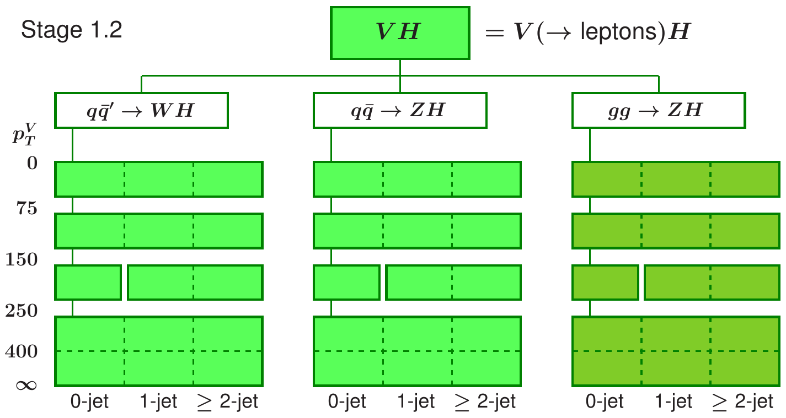
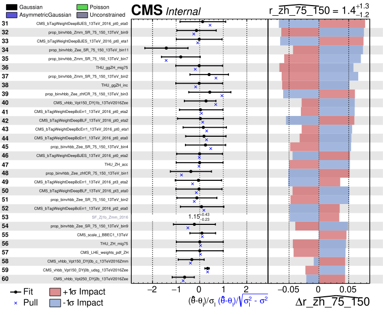
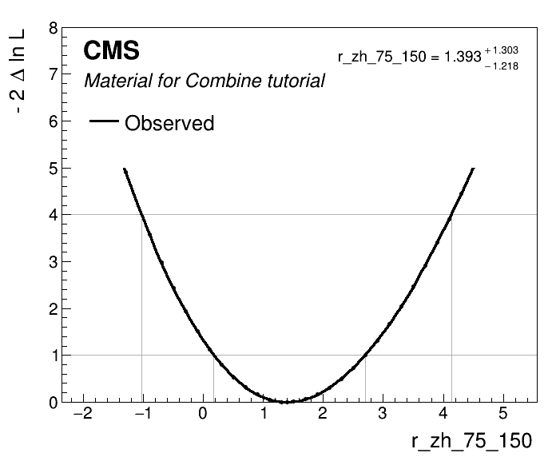
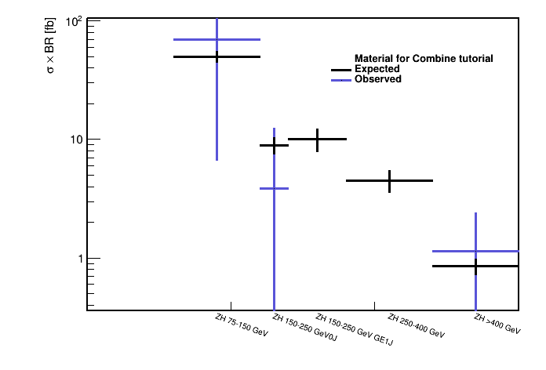
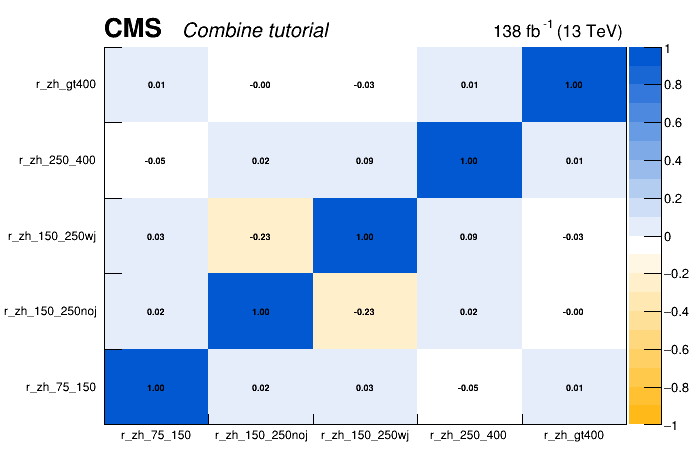

# Combine unfolding exercise

## Getting started
By now you should have a working setup of Combine v9 from the pre-tutorial exercise. If so then move onto the cloning of the parametric fitting exercise gitlab repo below. If not then you need to set up a CMSSW area and checkout the combine package:
```shell
cmsrel CMSSW_11_3_4
cd CMSSW_11_3_4/src
cmsenv
git clone https://github.com/cms-analysis/HiggsAnalysis-CombinedLimit.git HiggsAnalysis/CombinedLimit
cd HiggsAnalysis/CombinedLimit

cd $CMSSW_BASE/src/HiggsAnalysis/CombinedLimit
git fetch origin
git checkout v9.1.0
```
We will also make use of another package, `CombineHarvester`, which contains some high-level tools for working with combine. The following command will download the repository and checkout just the parts of it we need for this exercise:
```shell
cd $CMSSW_BASE/src/
bash <(curl -s https://raw.githubusercontent.com/cms-analysis/CombineHarvester/main/CombineTools/scripts/sparse-checkout-https.sh)
```
Now let's compile the CMSSW area:
```shell
scramv1 b clean; scramv1 b
cmsenv
```
Finally, let's clone the working directory for this tutorial which contains all of the inputs and scripts needed to run the unfolding fitting exercise:
```shell
cd $CMSSW_BASE/src/
git clone https://gitlab.cern.ch/cms-analysis/general/combine-unfolding-tutorial-2023.git
cd combine-unfolding-tutorial-2023
```

## Exercise outline

The hands-on exercise is split into seven parts: 

1) Counting experiment

2) Migration matrix from the datacards

3) Shape analysis with control regions

4) Extract the expected intervals

5) Impacts for multiple POIs

6) Unfold to the gen-level quantities 
   
7) Extract POIs correlations from the FitDiagnostics output

 > Throughout the tutorial there are a number of questions and exercises for you to complete. These are shown in the boxes like this one. 

Note that the general recomendation on unfolding in `Combine` are available [here](https://cms-analysis.github.io/HiggsAnalysis-CombinedLimit/part3/regularisation/), which also includes recommendations on regularisation techniques and when to use it, which is completely is not discussed in this tutorial at all. 
  
## Analysis overview

In this tutorial we will look at the cross section measurements of on of the SM Higgs processes VH, in $H\to b\bar{b}$ (VHbb) final state. 

The measurement is performed within the Simplified Template Cross Section framework, which provides the prediction in the bins of gen-level quantities $p_{T}(V)$ and number of additional jets. The maximum likelihood based unfolding is performed to measure the cross section in the gen-level bins defined by STXS scheme. At the reco-level we defined appropriate categories to match the STXS bins as close as possible. 

 

In this tutorial we will focus on the ZH production, with Z boson decaying to charged leptons, and Higgs boson reconstructed with the resolved $b\bar{b}$ pair. We will also use only a part of the Run 2 categories, so the analysis sensitivity is not going to be achieved. Note that ggZH and ZH production modes are combined in the fit, since it is not possible to resolve them at this stage of the analysis. The STXS categories are defined independently of the Higgs decay channel, to streamline the combinations of the cross section measurement. 

## Simple datacards, one-bin measurement

When constructing the reco-level for any differential analysis the main goal is to match the gen-level bins as closely as possible. In the simplest case it can be done with the cut-based approach, i.e. applying the selection on the corresponding reco-level variables: $p_{T}(Z)$ and $n_{\text{add. jets}}$. 
Due to the good lepton $p_{T}$ resolution we can follow the original STXS scheme quite closely with the reco-level selection, with one exception, it is not possible to access the very-low transverse momenta bin $p_{T}(Z)<75$ GeV.  

In `counting/regions` dicrectory you can find the datacards with five reco-level categories, each targetting a corresponding gen-level bin. Below you can find an example of the datacard for reco-level bin with $p_{T}(Z)$>400 GeV, 

```
imax    1 number of bins
jmax    9 number of processes minus 1
kmax    * number of nuisance parameters
--------------------------------------------------------------------------------
--------------------------------------------------------------------------------
bin          vhbb_Zmm_gt400_13TeV
observation  12.0
--------------------------------------------------------------------------------
bin                                   vhbb_Zmm_gt400_13TeV   vhbb_Zmm_gt400_13TeV vhbb_Zmm_gt400_13TeV   vhbb_Zmm_gt400_13TeV     vhbb_Zmm_gt400_13TeV vhbb_Zmm_gt400_13TeV vhbb_Zmm_gt400_13TeV vhbb_Zmm_gt400_13TeV vhbb_Zmm_gt400_13TeV vhbb_Zmm_gt400_13TeV
process                               ggZH_lep_PTV_GT400_hbb ZH_lep_PTV_GT400_hbb ZH_lep_PTV_250_400_hbb ggZH_lep_PTV_250_400_hbb Zj1b            Zj0b_c          Zj0b_udsg       VVLF            Zj2b            VVHF
process                               -3                     -2                   -1                     0                        1               2               3               4               5               6
rate                                  0.0907733              0.668303             0.026293               0.00434588               3.78735         2.58885         4.09457         0.413716        7.02731         0.642605
--------------------------------------------------------------------------------

```

where you can see the contributions from various background processes, namely Z+jets, $t\bar{t}$ and the single top, as well as signal processes corresponding to the STXS scheme discussed above. 

One of the most important stages in the analysis design, is to make sure that the reco-level categories are pure with the corresponding gen-level processes.

To explicitly check it, one can plot the contributions of gen-level bins in all of the reco-level bins. We propose to use the script provided in the tutorial git-lab page. This script uses `CombineHarvester` to loop over detector level bins, and get the rate at which each of the signal processes (generator-level bins) contributes to that detector-level bin; which is then used to plot the migration matrix.

```shell
python scripts/get_migration_matrix.py counting/combined_ratesOnly.txt

```
 

Now that we checked the response matrix we can attempt the maximum likelihood unfolding. We can use the `multiSignalModel` physics model available in `Combine`, which assigns a parameter of interest `poi` to a process `p` within a bin `b` using the syntax `--PO 'map=b/p:poi[init, min, max]'` to linearly scale the normalisation of this process under the POI variations. To create the workspace we can run the following command: 
```shell
text2workspace.py -m 125  counting/combined_ratesOnly.txt -P HiggsAnalysis.CombinedLimit.PhysicsModel:multiSignalModel  --PO verbose --PO 'map=.*/.*ZH_lep_PTV_75_150_hbb:r_zh_75_150[1,-5,5]' --PO 'map=.*/.*ZH_lep_PTV_150_250_0J_hbb:r_zh_150_250noj[1,-5,5]'  --PO 'map=.*/.*ZH_lep_PTV_150_250_GE1J_hbb:r_zh_150_250wj[1,-5,5]' --PO 'map=.*/.*ZH_lep_PTV_250_400_hbb:r_zh_250_400[1,-5,5]' --PO 'map=.*/.*ZH_lep_PTV_GT400_hbb:r_zh_gt400[1,-5,5]' -o ws_counting.root
```
In the example given above a signal POI is assigned to each gen-level bin independent on reco-level bin. This allows to take into account the non-trivial acceptance effects. One can also perform bin-by-bin unfolding using the mapping to the bin names rather that processes, e.g. `'map= vhbb_Zmm_gt400_13TeV/.*:r_reco_zh_gt400[1,-5,5]'`, but this method is not recommended and can be used only for tests as another way to ensure that the migration matrix is close to diagonal. 

To extract the measurement let's run the initial fit first using the `MultiDimFit` implemented in `Combine` to extract the best-fit values and uncertainties on all floating parameters:  

```shell
combineTool.py -M MultiDimFit --datacard ws_counting.root --setParameters r_zh_250_400=1,r_zh_150_250noj=1,r_zh_75_150=1,r_zh_150_250wj=1,r_zh_gt400=1 --redefineSignalPOIs r_zh_75_150,r_zh_150_250noj,r_zh_150_250wj,r_zh_250_400,r_zh_gt400 -t -1 
```
> With the option `-t -1` we set `Combine` to fit asimov dataset instead of actual data.
> The `--setParameters <param>=<value>` set the initial value of parameter named <param>.
> `--redefineSignalPOIs r_zh_75_150,r_zh_150_250noj,r_zh_150_250wj,r_zh_250_400,r_zh_gt400` set the POIs to the comma-separated list, instead of the default one `r`.

While the uncertainties on the POI can be extracted in multiple ways, the most robust way is to run the likelihood scans for a POI corresponding to each gen-level bin, it allows to spot discontinuities in the likelihood shape in case of problems with the model. 

```shell
combineTool.py -M MultiDimFit --datacard ws_counting.root -t -1 --setParameters r_zh_250_400=1,r_zh_150_250noj=1,r_zh_75_150=1,r_zh_150_250wj=1,r_zh_gt400=1 --redefineSignalPOIs r_zh_75_150,r_zh_150_250noj,r_zh_150_250wj,r_zh_250_400,r_zh_gt400 --algo=grid --points=100 -P r_zh_75_150 --floatOtherPOIs=1 -n scan_r_zh_75_150

```
Now we can plot the likelihood scan and extract the expected intervals.

```shell
python scripts/plot1DScan.py higgsCombinescan_r_zh_75_150.MultiDimFit.mH120.root -o r_zh_75_150 --POI r_zh_75_150
```
* Repeat for all POIs

## Shape analysis with control regions

One of the advantages of the maximum likelihood unfolding is the flexibility to choose the analysis observable and include more information on the event kinematics, consequently improving the analysis sensitivity. This analysis benefits from the shape information of the DNN output trained to differentiate the VH(bb) signal from the SM backgrounds. 

The datacards for this part of the exercise located `full_model_datacards/`, where you can find a separate datacard for each region within `full_model_datacards/regions` directory and also a combined datacard `full_model_datacards/comb_full_model.txt`. 
 
As you will find the datacards also contain several background processes. To control them properly we will add the regions enriched in the respective backgrounds. Then we can define a common set of rate parameters for signal and control regions to scale the rates or other parameters affecting their shape.  

For the shape datacards one has to specify the mapping of histograms and channels/processes as given described below:

```
shapes [process] [channel] [file] [nominal] [systematics_templates]
```
Then the `shape` nuisance parameters can be defined in the systematics block in the datacard. 

In the realistic CMS analysis there are hundreds of nuisance parameters corresponding to various source of systematics. 

When we unfold to the gen-level observable we should remove the nuisances affecting the rate of the gen-level bins, i.e. the `lnN` NPs: `THU_ZH_mig*, THU_ZH_inc` and keep only the acceptance `shape` uncertainties: `THU_ZH_acc` and `THU_ggZH_acc`, which do not scale the inclusive cross sections by construction. 
This can be achieved by freezing the respective nuisance parameters with the option `--freezeParameters par_name1,par_name2`. Alternatively you can create a group following the syntax given below at the end of the combined datacard, and freeze the parameters with the `--freezeNuisanceGroups group_name` option.


```
[group_name] group = uncertainty_1 uncertainty_2 ... uncertainty_N
```

Now we can create the workspace using the same `multiSignalmodel`:

```shell
text2workspace.py -m 125  full_model_datacards/comb_full_model.txt -P HiggsAnalysis.CombinedLimit.PhysicsModel:multiSignalModel  --PO verbose --PO 'map=.*/.*ZH_lep_PTV_75_150_hbb:r_zh_75_150[1,-5,5]' --PO 'map=.*/.*ZH_lep_PTV_150_250_0J_hbb:r_zh_150_250noj[1,-5,5]'  --PO 'map=.*/.*ZH_lep_PTV_150_250_GE1J_hbb:r_zh_150_250wj[1,-5,5]' --PO 'map=.*/.*ZH_lep_PTV_250_400_hbb:r_zh_250_400[1,-5,5]' --PO 'map=.*/.*ZH_lep_PTV_GT400_hbb:r_zh_gt400[1,-5,5]' --for-fits --no-wrappers --X-pack-asympows --optimize-simpdf-constraints=cms --use-histsum -o ws_full.root
```
> As you might have noticed we are using a few extra versions `--for-fits --no-wrappers --X-pack-asympows --optimize-simpdf-constraints=cms --use-histsum` to create a workspace. They are needed to construct a more optimised pdf using the `CMSHistSum` class implemented in Combine to significantly lower the memory consumption.
 
* Following the instructions given earlier, create the workspace and run the initial fit with `-t -1` and set the name `-n .BestFit`. 

Since this time the datacards include shape uncertainties as well as additional categories to improve the background description the fit might take much longer, but we can submit condor jobs and have results ready to look at in a few minutes. 

```shell 
combineTool.py -M MultiDimFit -d ws_full.root --setParameters r_zh_250_400=1,r_zh_150_250noj=1,r_zh_75_150=1,r_zh_150_250wj=1,r_zh_gt400=1 --redefineSignalPOIs r_zh_75_150,r_zh_150_250noj,r_zh_150_250wj,r_zh_250_400,r_zh_gt400  -t -1 --X-rtd FAST_VERTICAL_MORPH --algo=grid --points=50 --floatOtherPOIs=1 -n .scans_blinded --job-mode condor --task-name scans_zh  --split-points 1 --generate P:n::r_zh_gt400,r_zh_gt400:r_zh_250_400,r_zh_250_400:r_zh_150_250wj,r_zh_150_250wj:r_zh_150_250noj,r_zh_150_250noj:r_zh_75_150,r_zh_75_150
```
> The option `--X-rtd FAST_VERTICAL_MORPH` is added here and for all `combineTool.py -M MultiDimFit ...` to speed up the minimisation. 

> The job submission is handled by the `CombineHarvester`, the combination of options `--job-mode condor --task-name scans_zh  --split-points 1 --generate P:n::r_zh_gt400,r_zh_gt400:r_zh_250_400,r_zh_250_400:r_zh_150_250wj,r_zh_150_250wj:r_zh_150_250noj,r_zh_150_250noj:r_zh_75_150,r_zh_75_150` will submit the jobs to HTCondor for POI. You can add `--dry-run` option to create the submissions files first and check them, and then submit the jobs with `condor_submit condor_scans_zh.sub`. 

> If you are running the tutorial from a cluster where HTCondor is not available you can also submit the jobs to the slurm system, just change the `--job-mode condor` to `--job-mode slurm`. 

After all jobs are completed we can combine the files for each POI: 

```shell
for p in r_zh_75_150 r_zh_150_250noj r_zh_150_250wj r_zh_250_400 r_zh_gt400
do
    hadd -k -f scan_${p}_blinded.root higgsCombine.scans_blinded.${p}.POINTS.*.MultiDimFit.mH120.root
done
```
And finally plot the likelihood scans 

```shell
python scripts/plot1DScan.py scan_r_zh_75_150_blinded.root  -o scan_r_zh_75_150_blinded --POI r_zh_75_150 --json summary_zh_stxs_blinded.json
```


## Impacts

One of the important tests before we move to the unblinding stage is to check the impacts of nuisance parameters on each POI. For this we can run the `combineTool.py` with `-M Impacts` method. We start with the initial fit, which should take ~20 minutes (good time to have a coffee break!):
 
```shell
combineTool.py -M Impacts -d ws_full.root -m 125 --robustFit 1 --doInitialFit --redefineSignalPOIs r_zh_75_150,r_zh_150_250noj,r_zh_150_250wj,r_zh_250_400,r_zh_gt400
```

> Note that it is important to add the option `--redefineSignalPOIs [list of parameters]`, to produce the impacts for all POIs we defined when the workspace was created with the `multiSignalModel`.

After the initial fit is completed we can perform the likelihood scans for each nuisance parameter as shown below

```shell
combineTool.py -M Impacts -d ws_full.root -m 125 --robustFit 1 --doFits --redefineSignalPOIs r_zh_75_150,r_zh_150_250noj,r_zh_150_250wj,r_zh_250_400,r_zh_gt400 --job-mode condor --task-name impacts_zh 
```
We will submit the jobs to the HTCondor to speed up the process.

Now we can combine the results into the `.json` format and use it to produce the impact plots.

```shell
combineTool.py -M Impacts -d ws_full.root -m 125 --redefineSignalPOIs r_zh_75_150,r_zh_150_250noj,r_zh_150_250wj,r_zh_250_400,r_zh_gt400 --output impacts.json 

plotImpacts.py -i impacts.json -o impacts_r_zh_75_150 --POI r_zh_75_150
```


* Do you observe differences in impacts plots for different POIs, do these differences make sense to you? 

## Unfolded measurements

Now that we studied the NP impacts for each POI, we can finally extract the measurements.
Note, that in this exercise we are skipping further checks and validation that you should do on your analysis for the purposes of the tutorial. Namely the goodness of fit test and the post-fit plots of folded observables. Both of these checks were detailed in the previous exercises, you can find the description under the following links. 

At this stage we'll run the `MultiDimFit` again scanning each POI to calculate the intervals, but this time we'll remove the `-t -1` option to extract the unblinded results. 

Also since we want to unfold the measurements to the gen-level observables, i.e. extract the cross sections, we have to remove the theoretical uncertainties affecting the rates of signal processes, we can simply do this be freezing them `--freezeNuisanceGroups <group_name>`, using the `group_name` you assigned earlier in the tutorial. 

Plot the scans and collect the measurements in the json file `summary_zh_stxs.json`. 

```shell
python scripts/plot1DScan.py scan_r_zh_75_150.root -o r_zh_75_150 --POI r_zh_75_150 --json summary_zh_stxs.json  
``` 



Repeat the same command for other POIs to fill the `summary_zh_stxs.json`, which can then be used to create the cross section plot as shown below. 

```shell
python scripts/make_XSplot.py summary_zh_stxs.json
```


## POIs correlations

In addition to the cross-section measurements it is very important to publish correlation matrix of measured cross sections.  

The correlation matrix can be extracted from the covariance matrix after the fit. Here we can use the `FitDiagnostics` or `MultiDimFit` method.

``` shell
combineTool.py -M FitDiagnostics --datacard ws_full.root --setParameters r_zh_250_400=1,r_zh_150_250noj=1,r_zh_75_150=1,r_zh_150_250wj=1,r_zh_gt400=1 --redefineSignalPOIs r_zh_75_150,r_zh_150_250noj,r_zh_150_250wj,r_zh_250_400,r_zh_gt400  --robustHesse 1 -n .full_model --X-rtd FAST_VERTICAL_MORPH
```

Then the `RooFitResult`, containing correlations matrix, can be found in the `fitDiagnostics.full_model.root` file under the name `fit_s`. The script `plotCorrelations_pois.py` from the exercise git-lab repository can help to plot the correlation matrix.

```shell
python scripts/plotCorrelations_pois.py -i fitDiagnostics.full_model.root:fit_s -p r_zh_75_150,r_zh_150_250noj,r_zh_150_250wj,r_zh_250_400,r_zh_gt400

```


