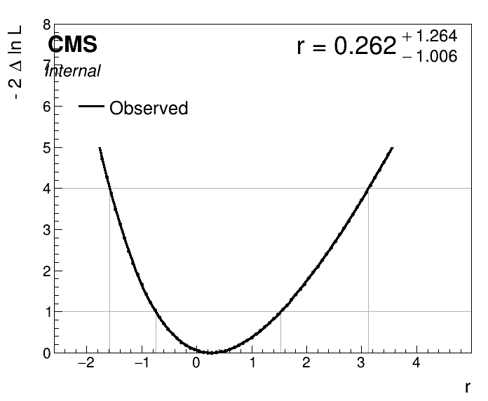
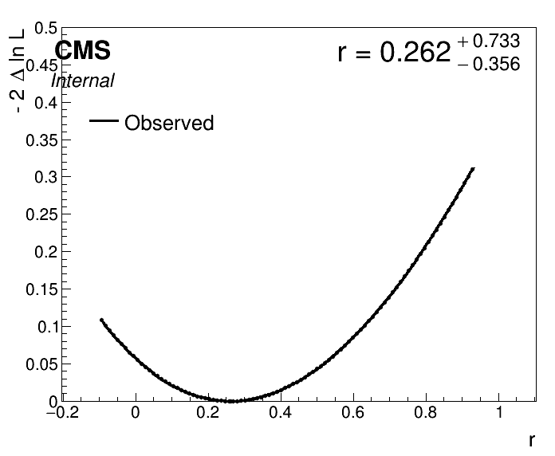
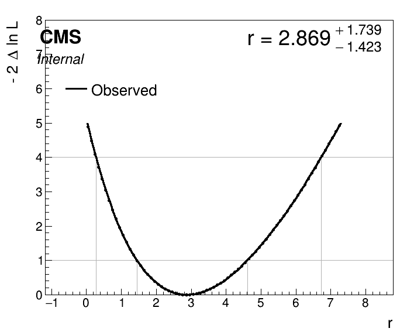
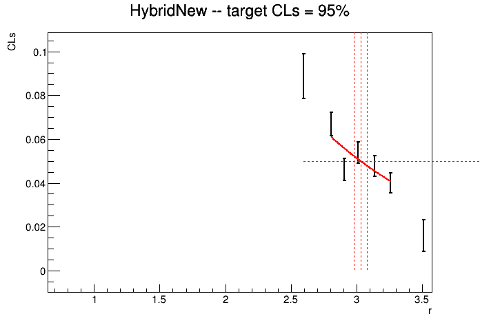
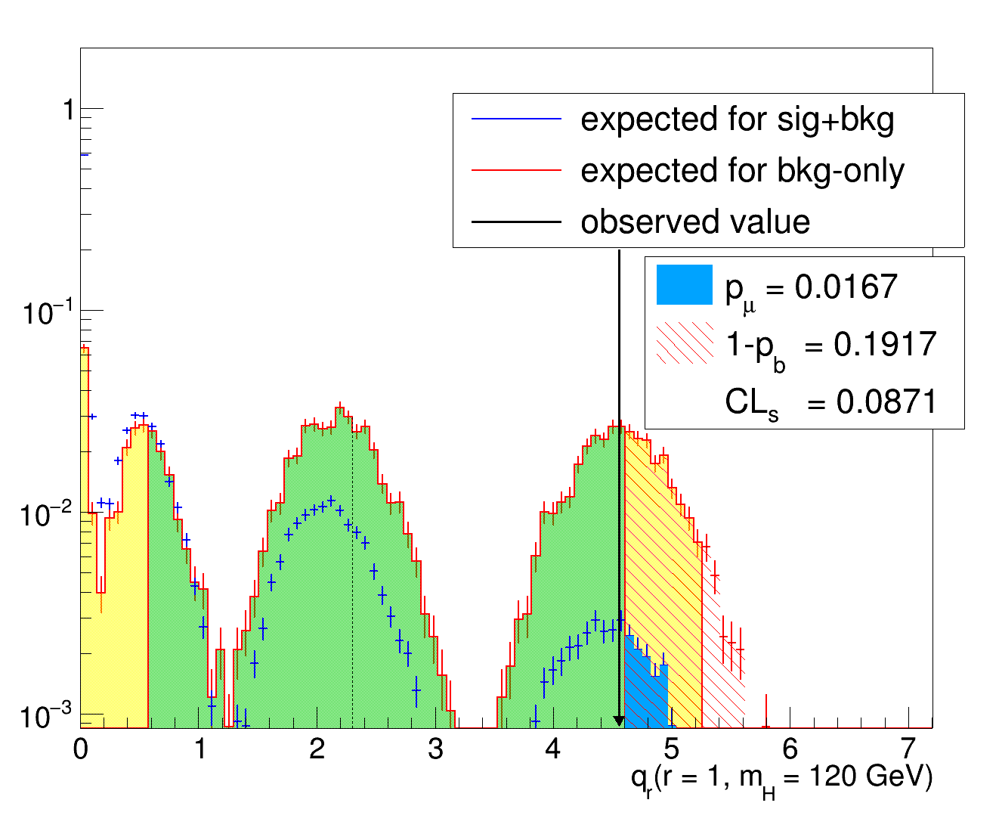

# Understanding Statistical Routines in Combine

## Getting started
To get started, you should have a working setup of `Combine`, please follow the instructions from the [home page](https://cms-analysis.github.io/HiggsAnalysis-CombinedLimit/latest/#within-cmssw-recommended-for-cms-users). Make sure to use the latest recommended release.

After setting up `Combine`, you can access the working directory for this tutorial which contains all of the inputs and scripts needed to run the unfolding fitting exercise:

```shell
cd $CMSSW_BASE/src/HiggsAnalysis/CombinedLimit/data/tutorials/statistical_routines_tutorial
```

## The model

This tutorial will go through various statistical routines in combine in detail using a very simple counting experiment model.
There is a single channel with contributions from Higgs production and WW production, and three nuisance parameters.

The model details can be seen in the `datacard.txt` file in the tutorial directory.

The parameter of interest (POI) for this model is a single signal strength parameter (called `r` or $\mu$) which scales the total yield of the signal (Higgs) process.

We will use this model to run statistical tests such as estimating the higgs cross section, attempting to discover the higgs, and setting limits on the cross section.

## Estimating a best fit value

The most commonly used statistical routines in combine are frequentist maximum-likelihood based routines.
For these routines, "best-fit" values of a parameter, $\mu$, are denoted $\hat{\mu}$ and they are determined by finding the value of that parameter which maximizes the likelihood, $\mathrm{L}(\mu)$.

In combine you can find the best-fit value of your parameter of interest with the `MultiDimFit` routine:

```
combine -M MultiDimFit datacard.txt
```

you should get some output, which prints the best fit signal strength

```
Doing initial fit: 

 --- MultiDimFit ---
best fit parameter values: 
   r :    +0.266
```

## Uncertainty Intervals

to get more information, you can add the `--algo singles` flag which will also calculate the uncertainty on the parameter.
In order to get the full uncertainty, let's also change the limits on `r`, which are $[0,20]$ by default:

```
combine -M MultiDimFit datacard.txt --algo singles --rMin -10 --rMax 10
```

now the output should contain the uncertainties as well as the best fit value

```
Doing initial fit: 

 --- MultiDimFit ---
best fit parameter values and profile-likelihood uncertainties: 
   r :    +0.260   -1.004/+1.265 (68%)
Done in 0.00 min (cpu), 0.00 min (real)
```

These uncertainty intervals have been computed internally as part of the fit.
What do they mean, and how are they determined?

These are frequentist confidence intervals, which means that if our statistical model is good enough and we were to perform repeated experiments of this type, we would expected that 68% of the confidence intervals we produce would contain the true value of our signal strength parameter, `r`.

These can be constructed from first principles using the Neyman Construction, by finding, but in practice they are usually constructed assuming Wilks' theorem.
Wilks' theorem tells us what the expected distribution of the likelihood ratio $\Lambda = \frac{\mathrm{L}(r)}{\mathrm{L}(\hat{r})}$ is, and from this we can construct confidence intervals.
In practice, we use the log-likelihood ratio $t_r \equiv -2 \ln( \Lambda )$, rather than the likelihood ratio itself.
The confidence interval is constructed by finding all values of `r` for which the $-2 \ln(\Lambda)$ is below a threshold value which depends on the confidence level we are using.

We can also calculat the best fit value and confidence interval using the `FitDiagnostics` routine:

```
combine -M FitDiagnostics datacard.txt --rMin -10 --rMax 10
```

which should give you a compatible result. 
The `FitDiagnostics` routine also produces an output file called `fitDiagnosticsTest.root` which contains the full result of fits of both the background-only and signal + background model.

You can see the results of the signal + background model fit by opening the file and checking the fit result:

```
root -l fitDiagnosticsTest.root
root [1]> fit_s->Print()
  RooFitResult: minimized FCN value: -2.92406e-05, estimated distance to minimum: 7.08971e-07
                covariance matrix quality: Full, accurate covariance matrix
                Status : MINIMIZE=0 HESSE=0 

    Floating Parameter    FinalValue +/-  Error   
  --------------------  --------------------------
                  lumi    3.1405e-04 +/-  1.00e+00
                     r    2.6039e-01 +/-  1.12e+00
                 xs_WW    8.6964e-04 +/-  1.00e+00
                xs_ggH    7.3756e-04 +/-  1.00e+00
```

Notice that in this case, the uncertainty interval for `r` is reported as a symmetric interval. 
What's the difference between this interval and the asymmetric one?

In both cases, the interval is found by determining the values of `r` for which $-2 \ln(\Lambda)$ is below the threshold value, which in this case for the 68% interval is 1.
Both algorithms take the best fit value $\hat{r}$ for which $-2 \ln(\Lambda)$ will always be 0, and then try to find the interval by estimating the crossing points where $-2 \ln(\Lambda) = 1$.

However, the different intervals estimate this value in different ways.
The asymmetric intervals are "minos errors", which means that the crossing points were determined by explicitly scanning the likelihood as a function of `r` to look for the crossing, while minimizing other parameters at each step (profiling).
The symmetric intervals are "hesse errors", which means that the crossing points were determined by taking the matrix of second-order partial derivatives (Hessian) at the minimum, and inverting it to estimate the crossing assuming all other derivatives vanish.

> The information printed under the `Status` section of the `RooFitResult` is showing that the minimization suceeded and that the hessian was positive definite, i.e. that all the second derivates are positive, as they should be at the minimum of a function. 
> If the HESSE status is not 0 or the covariance matrix quality indicates it had to be forced positive definite, this indicates that there are problems with the fit.

### Running an explicit likelihood scan

You can see that the minos errors should match the crossing points of the likelihood-ratio by explicitly scanning the likelihood function with `MultiDimFit`, using the `--algo grid` option and specifying the range and how many points to scan:

```
combine -M MultiDimFit datacard.txt --algo grid --points 100 --rMin -2 --rMax 6
```

The results can then be plotted using the `plot1Dscan.py` script, using the file `higgsCombineTest.MultiDimFit.mH120.root` which was output by the scan:

```
python3 ../../../scripts/plot1DScan.py --POI r higgsCombineTest.MultiDimFit.mH120.root
```

it should produce an output pdf and png files which look like the one shown below.
You can see the best fit values, as well as the crossing points for the $1\sigma$ and $2\sigma$ intervals.



### Uncertainty intervals from first principles

All the methods mentioned above rely on Wilks' theorem, which only holds under certain conditions.
In some cases, particularly those of low statistics or some other cases, such as sometimes when the yield depends quadratically on the parameter of interest, Wilks' theorem will not be a good approximation.

One thing you can do is check the uncertainty intervals explicitly, following the Neyman Construction.
In order to do this you would scan your signal strength parameter `r`, at each value generating a set of pseudodata toys to determine the expected distribution of the test statistic $t_\mu$ under the hypothesis that the true signal strength is $\mu$.
Then, you can check the distribution of $t_\mu$ and find the critical value of the test statistic, $t'$, such that:


$$ \int_{t'}^{\infty} p(t_{\mu}) \mathrm{d}t_{\mu} =(1 - \mathrm{CL}) $$

where $\mathrm{CL}$ is the confidence level you are trying to reach (e.g. 68%).

For a given value of `r`, we can check the test statistic distribution explicitly and determine the crossing point of the interval.
Let's do that for the upper end of our confidence interval, using the `MultiDimFit` method.

We do it by generating a number of toy datasets with `r = 1.525`, which is our upper bound value. 
Then we calculate the test statistic: 


$$ t_{\mu=1.525} = -2 \ln (\frac{\mathrm{L}(r=1.525)}{\mathrm{L}(r=\hat{r})}) $$

on each of these toy datasets, and fill a histogram with the results to determine the expect distribution under the the null hypothesis (in this case that `r` = 1.525).
We could do this all in one command using the `-t <n_toys>` functionality of combine, but let's split it into two steps to make the logic more clear.

First, lets generate a set of 1000 toys from our model with `r` = 1.525.
Since we want to generate frequentist toys (since we are calculating a frequentist confidence interval), we also need the `--toysFrequentist` option.

```
combine -M GenerateOnly datacard.txt -t 1000 --toysFrequentist --setParameters r=1.525 --saveToys 
```

Now we can tell `MultiDimFit` to run over these toys by using the output from the previous step, with the command line argument `--toysFile <output_file_from_toy_generation>`.
To calculate the test statistic with MultiDimFit we will use `--algo fixed --fixedPointPOIs r=1.525` to tell `MultiDimFit` to calculate the log-likelihood ratio using that point in the numerator.
The full command is then:

```
combine -M MultiDimFit datacard.txt --rMin -10 --rMax 10 --algo fixed --fixedPointPOIs r=1.525 -t 500 --toysFrequentist   --toysFile higgsCombineTest.GenerateOnly.mH120.123456.root
```

We can inspect the results of all of our toy fits by opening the `higgsCombineTest.MultiDimFit.mH120.123456.root` file our command created, and looking at the `limit` tree contained in it.
The log-likelihood ratio $-\ln(\Lambda)$ is stored in the `deltaNLL` branch of the tree.
For the `fixed` algorithm, there are two entries stored in the tree for every dataset: one for the best fit point, and one for the fixed point passed as the aregument to `--fixedPointPOIs`.
In order to select only the values we are interest in we can pass the requirement `quantileExpected >= 0` to our TTree selection, because combine uses the value `-1` for `quantileExpected` to indicate best fit points.

You can draw the $t_{\mu}$ distribution with:

```
root -l higgsCombineTest.MultiDimFit.mH120.123456.root
root [1] > limit->Draw("2*deltaNLL","quantileExpected >= 0")
```


To test wether or not this point should be rejected, we first define the confidence level of our rejection, say $1\sigma$ (approximately 68%), then we use the empirical distribution of the test statistic to estimate the cut-off value of the test statistic.
This is done for you in the script `get_quantile.py`, which you can run:


```
python3 get_quantile.py --input higgsCombineTest.MultiDimFit.mH120.123456.root
```

- How does the value estimated from this method compare to the value using Wilks' theorem and the methods above?
- How does the value change if you generate more toys?
- Check the observed value of the test statistic on the data, how does it compare to threshold value for this point? Is the point accepted or rejected?

You can do the toy data generation and the fits in one step for a given parameter value with the command:

```
combine -M MultiDimFit datacard.txt --rMin -10 --rMax 10 --algo fixed --fixedPointPOIs r=<r_val> --setParameters r=<r_val> -t <ntoys> --toysFrequentist
```

Test out a few values of `r` and see if they all give you the same result. 
What happens for `r` less than about -1? Can you explain why? (hint: look at the values in the datacard)


## Significance Testing

For significance testing, we want to test the compatibility of our model with the background-only hypothesis $\mu = 0$.
However, when performing significance testing we are typically only interested in rejecting the null hypothesis if the confidence level is very high (e.g. $5\sigma$).
Furthermore, we typically use a modified test-statistic $q_0$ which is equal to 0 whenever the best-fit signal strength is less than 0, to avoid rejecting the null hypothesis due to a deficit of events.

A typical significance test can be run with combine using the `Significance` method:

```
combine -M Significance datacard.txt
```

for this datacard, we get a very modest significance of about `0.24`, meaning we fail to reject the null hypothesis.  
This method is run using the asymptotic approximation, which relies on Wilks' theorem, similar to as it was used above.
Under this approximation the significance is directly related to our test statistic, $q_0$ by: Significance = $\sqrt{q_0}$.
So for positive values of $\hat{r}$ we can read the Significance from the likelihood scan, by checking the value at the origin.

```
combine -M MultiDimFit datacard.txt --algo grid --points 100 --rMin -0.1 --rMax 1
python3 ../../../scripts/plot1DScan.py --POI r higgsCombineTest.MultiDimFit.mH120.root --y-max 0.5
```

This will produce the same likelihood scan as before, but where we've restricted the range to be able to see the value of the curve at `r` = 0 more clearly.
As expected, the crossing happens at around $0.24^2$



### Going beyond the Asymptotic Approximation with Hybrid New

We could move beyond the asymptotic approximation as we did before by generating toys and explicitly calculating the test statistic.
In order to do this, we would simply run `MultiDimFit` using:

```
combine -M MultiDimFit datacard.txt --rMin -10 --rMax 10 --algo fixed --fixedPointPOIs r=0 --setParameters r=0 -t 500 --toysFrequentist
```

and then calculate the value of $q_0$ for every toy, check their distribution and compare the observed value in data to the distribution from the toys.

However, we can also use the `HybridNew` method, which has a built-in routine to do this for us, and save us the work of calculating the test-statistic values ourselves.

```
combine -M HybridNew --LHCmode LHC-significance datacard.txt
```

We see that in this case, the value is a little different from the asymptotic approximation, though not drastically so.

```
 -- Hybrid New -- 
Significance: 0.306006  -0.0127243/+0.012774
Null p-value: 0.3798 +/- 0.00485337
```

## Limit Setting

**NOTE: This section explores several methods which are not recommended to be used in limit setting, in order to better understand their limitations before getting to the commonly used procedure**

One might be tempted to set limits by simply setting a confidence level (e.g. 95%), using the profile-likelihood ratio test statistic, $t_\mu$, and finding the values of the signal strength which are rejected.
This is not what is typically done for setting limits, but lets try to set some limits this way as an exercise.

Under the asymptotic approximation, then, we can read off the values which we would reject from our earlier likelihood scan, they are all the values above about 4.

Let's see what happens if we were to have observed 12 events instead of 6. There is a modified datacard `datacard_obs12.txt` with this already set for you.


```
combine -M MultiDimFit datacard_obs12.txt --algo grid --points 100 --rMin -2 --rMax 8
python3 ../../../scripts/plot1DScan.py --POI r higgsCombineTest.MultiDimFit.mH120.root
```




In this case we would reject values of `r` above about 6.7, but also values of `r` below about 0.3 at the 95% CL.
However, despite rejecting `r` = 0, our 95% CL is far below typical particle physics standards for claiming discovery.
We therefore prefer to set only an upper bound, which we can do by modifying the test statistic to be 0 for all values below the best fit value.

However, even with such a modification, there is another problem, with a large enough under-fluctuation of the background we will set our limit below `r` = 0.
You can check thiswith the `HybridNew` method, and the slightly modified datacard `datacard_underfluctuation.txt`:


```
combine -M HybridNew --frequentist --testStat=Profile datacard_underfluctuation.txt  --rule Pmu --rMin -5 --rMax 10
```

The above command is telling combine to calculate the limit, but we have to pass the non-standard arguemnts `--testStat=Profile --rule Pmu` to tell combine to use the profile likelihood ratio test statistic $t_{\mu}$ directly, and not to use the $\mathrm{CL}_\mathrm{s}$ criterion which is normally applied.

Usually at the LHC, for upper limits we use the modified test statistic $\tilde{q}_{\mu}$ which is set to 0 for $\mu < \hat{\mu}$ but also replaces $\hat{\mu}$ with 0 if $\min(\hat{\mu},0)$ so that upper limits are always positive.

If we use the standard LHC test statistic we will get a positive limit:

```
combine -M HybridNew --frequentist --testStat=LHC --rule Pmu  datacard_underfluctuation.txt  
```

gives the result:

```
 -- Hybrid New -- 
Limit: r < 0.0736126 +/- 0.0902187 @ 95% CL
```

But this is an extremely tight bound on our signal strength, given that a signal strength of 1 is still within the statistical uncertainty of the background.

### the CL_s criterion

With the limit setting procedure above we set a limit of `r` < 0.07, due to an underfluctuation in the observed data.
However, if we had designed our experiment better so that the expected background were lower, we never would have been able to set a limit that strong.
We can see this with the datacard `datacard_lowbackground.txt` where the expected background is 1 event, but 0 events are observed. 
In this case, we only manage to set a limit of `r` < 0.5:

```
combine -M HybridNew --frequentist --testStat=LHC --rule Pmu  datacard_lowbackground.txt  
```

```
 -- Hybrid New -- 
Limit: r < 0.509028 +/- 0.0188724 @ 95% CL
```


The CL_s criterion takes into account how likely the data are under the background only hypothesis as well as under the signal + background hypothesis.
This has the effect of increasing the limit if the data are unlikely under the background-only hypothesis as well as the signal hypothesis.
This prevents setting limits below the expected sensitivity of the experiment, as we can see by rerunning our cards with the option `--rule CLs`, which is actually the default value.

```
combine -M HybridNew --frequentist --testStat=LHC --rule CLs datacard_lowbackground.txt  
```
 
gives a limit around 1.2, whereas

```
combine -M HybridNew --frequentist --testStat=LHC --rule CLs datacard_underfluctuation.txt 
```

sets a limit around 2.7. This is reasonable, given that we should expect a better limit when we have a better experimental design which manages to reduce backgrounds without any change in the signal acceptance.

These are the default settings for setting limits at the LHC and the arguments `--frequentist --testStat LHC --rule CLs` can be replaced by `--LHCmode LHC-limits`.

### Asymptotic Limits

The `HybridNew` method generates pseudodata to estimate the distributions of the test statistics and set a limit, however often the asymptotic distributions, which have analytically known forms, can be used.
This is computationally much faster than running `HybridNew` and can be run with:

```
combine -M AsymptoticLimits <datacard>
```

- Try comparing the asymptotic limits to the results with HybridNew computed above,  how do they compare for the two cases?

As well as the observed limit, the `AsymptoticLimits` method will automatically tell you the 2.5%, 16.0%, 50.0%, 84.0% and 97.5% expected limits.
These are calculated by taking the appropriate quantiles from the distribution of the test-statistic under the background-only hypothesis.


### The limit setting algorithm

Because the $CL_s$ value as a function of $r$ is not known analytically, the limit setting algorithm follows an iterative process.
It starts by picking a value of the signal strength, then it calculates the expected distributions of the test-statistics for that signal strength $\tilde{q}_{\mu}$ under both the background-only and signal+background hypotheses.

We can try this ourselves by running the `HybridNew` method with the `--singlePoint` option.
We can also use the `--saveHybridResult` argument to save the distribution of the test-statistic:

```
combine -M HybridNew --LHCmode LHC-limits --singlePoint r=2 --saveHybridResult datacard.txt
```

Then the test-statistic distributions can be plotted:

```
python3  ../../../test/plotTestStatCLs.py --input higgsCombineTest.HybridNew.mH120.root --poi r --val all --mass 120
```


This plot shows the expected distribution of the test statistic under the signal hypothesis (blue histogram) and the background-only hypothesis (red histogram), as well as the actual observed value in the data (black arrow).
the p-values of each of the hypotheses are calculated, as is the CLs value.

This particular point is not rejected, and so to set the limit, we'd need to increase the value of `r`, find the expected distributions, observed value and calculate CLs again.
Repeating this many times, we could find the value of `r` at which the CLs value crosses our threshold (in this case 0.05, for a 95% CL).

When we run without the `--singlePoint` option, combine does this all for us internally, but running individual points manually can be helpful for debugging or splitting up fits of large models across parallel jobs.

You can see the various `r` values at which combine calculated the CLs and the interpolation it performs to find the crossing by using the `--plot` option:

```
combine -M HybridNew --LHCmode LHC-limits --plot r_scan.png datacard.txt
```




- Where do the uncertainties on the CLs value at each value of `r` come from in the plot?
- How could the precision of the limit be increased?

### Debugging

If you see some strange or unexpected behaviour in your limits, you can look at the distributions of the test static, or the various CLs values computed in order to better understand where the problem might be coming from.

One situation you might encounter is observing the discrete nature or the counts when you are in the low statistics regime.

```
combine -M HybridNew --LHCmode LHC-limits --singlePoint r=1 --saveHybridResult datacard_lowbackground.txt
python3  ../../../test/plotTestStatCLs.py --input higgsCombineTest.HybridNew.mH120.root --poi r --val all --mass 120
```



There is nothing wrong with this distribution, but noting its features may help you understand the results you are seeing and if they are reasonable or there might be an issue with the fit.
In a case like this, we can certainly expect the asymptotic approximation not to be very reliable.
With low backgrounds, the shapes of the signal-hypothesis and signal+background hypothesis distributions can also start to look very similar.
In such cases, some of the quantiles of the expected limits may be very compressed, and statistical fluctuations in the empirical distributions may be more apparent.

