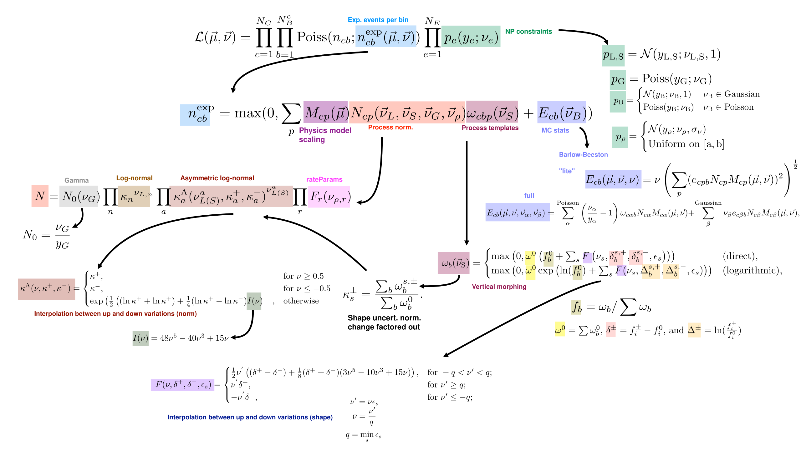

# Observation Models and Likelihoods

## The Observation Model

The observation model, $\mathcal{M}_0(\vec{\mu}_{0},\vec{\theta}_{0})$ defines the expected observations given specific values of the input parameters of interest $\vec{\mu}$ and nuisance parameters $\vec{\theta}$.

Combine is designed for counting experiments, where the number of events with particular features are counted, and so the model is a model of observed event counts.
The events can either be binned, as in histograms, or unbinned, where continuous values are stored for each event.

The model consists of a sum over different processes, each processes having its own model defining it.  
The expected observation is then the sum of the expected observations for each of the processes, $m =\sum_{p} m_{p}$.

The model can also be composed of multiple channels. $\mathcal{M}_{0} = \{ m_{c1}, m_{c2}, .... m_{cN}\}$. 
The expected observations which define the model is then the union of the sets of expected observations in each individual channel.

Combining full models together is possible by combining their channels together, assuming that the channels are each independent.

### Sets of Observation Models

We are typically not interested in a single model, but in a set of models, parameterized by a set of real numbers representing possible versions of the model.

Model parameters include the parameters of interest ( $\vec{\mu}$, those being measured such as a cross section) as well as nuisance parameters ($\vec{\theta}$), which may not be of interest but still affect the model expectation.

The full model therefore defines the expected observations over all the channels, given all the processes and model parameters:

$$ \mathcal{M} = \{ m_{c1}(\vec{\mu},\vec{\theta}), m_{c2}(\vec{\mu},\vec{\theta}), ..., m_{cN}(\vec{\mu},\vec{\theta}) \} $$

Combine provides tools and interfaces for defining the model as arbitrary functions of the input parameters.
In practice, however, there are a number of most commonly used functional forms which define how the expected events depend on the model parameters.
These are discussed in detail in the context of the full likelihood below.

## The Likelihood 

For any given model, $\mathcal{M}(\vec{\mu},\vec{\theta})$, [the likelihood](https://en.wikipedia.org/wiki/Likelihood_function) defines the probability of observing a given dataset. 
It is numerically equal to the probability of observing the data, given the model. 

$$ \mathcal{L}(\vec{\mu},\vec{\theta}|\mathrm{data}) = p(\mathrm{data}|\vec{\mu},\vec{\theta}) $$

It should be understood through, that the likelihood depends on the parameters through the observation model, $\mathcal{L}(\vec{\theta},\vec{\mu}) = \mathcal{L}_{\mathcal{M}}(\vec{\mu},\vec{\theta})$.
Changing the observation model, though it may depend on the same parameters, will also change the likelihood function.

The likelihood takes the general form:

$$ \mathcal{L} =  \mathcal{L}_{\textrm{data}} \cdot \mathcal{L}_{\textrm{constraint}} $$

Where $\mathcal{L}_{\mathrm{data}}$ is the probability of observing the data given your model, and $\mathcal{L}_{\mathrm{constraint}}$ represent some external constraints.
The constraint term does not depend on the observed data, but rather encodes other constraints which may be constraints from previous measurements (such as Jet Energy Scales) or prior beliefs about the value some parameter in the model should have. 

Both $\mathcal{L}_{\mathrm{data}}$ and $\mathcal{L}_{\mathrm{constraint}}$ can be composed of many sublikelihoods, for example for observations of different bins and constraints on different nuisance parameters. 

This form is entirely general. However, as with the model itself, there are typical forms that the likelihood takes which will cover most use cases, and for which combine is primarily designed.

### Binned Data Likelihoods

For a binned likelihood, the probability of observing a certain number of counts, given a model takes on a simple form. For each bin:

$$
\mathcal{L}_{\mathrm{bin}}(\vec{\mu},\vec{\theta}|\mathrm{data}) = \mathrm{Poiss}(n_{\mathrm{obs}}| n_{\mathrm{exp}}) 
$$

i.e. it is a poisson distribution with the mean given by the expected number of events in that bin. 
The full data likelihood is simply the product of each of the bins' likelihoods:

$$ \mathcal{L}_\mathrm{data} = \prod_\mathrm{bins} \mathcal{L}_\mathrm{bin}. $$

This is the underlying likelihood model used for every binned analysis. 
The freedom in the analysis comes in how $n_\mathrm{exp}$ depends on the model parameters, and the constraints that are placed on those parameters.

### Unbinned Data Likelihoods

For unbinned likelihood models, a likelihood can be given to each data point. It is proportional to the probability density function at that point, $\vec{x}$.

$$ \mathcal{L}_\mathrm{data} = \mathrm{Poiss}(N_{\mathrm{obs}} | N_{\mathrm{exp}}(\vec{x})) \prod_{i}^{N_{\mathrm{obs}}} \mathrm{pdf}(\vec{x}_i | \vec{\mu}, \vec{\theta} ) $$

Where $N_{\mathrm{obs}}$ and $N_{\mathrm{exp}}$ are the total number of observed and expected events, respectively.

### Constraint Likelihoods

The constraint terms encode the probability of model nuisance parameters taking on a certain value.
In [frequentist](https://en.wikipedia.org/wiki/Frequentist_probability) frameworks, this usually represents the result of a previous measurement (such as of the jet energy scale).
In [bayesian](https://en.wikipedia.org/wiki/Bayesian_probability) frameworks, these terms represent the [prior](https://en.wikipedia.org/wiki/Prior_probability).

We will write in a mostly frequentist framework, though combine can be used for either frequentist or bayesian analyses.
In this framework, each constraint term represents the likelihood of some parameter, $\theta$, given some previous observation $\tilde{\theta}$, often called a "global observable".

$$ \mathcal{L}_{\mathrm{constraint}}( \theta | \tilde{\theta} ) = p(\tilde{\theta} | \theta ) $$

In principle the form of the likelihood can be any function where the corresponding $p$ is a valid probability distribution.
In practice, most constraint terms are gaussian, and the definition of $\theta$ is chosen such that the central observation $\tilde{\theta} = 0$ , and the width of the gaussian is one.

Note that on its own, the form of the constraint term is not meaningful; what is meaningful is the relationship between the constraint term and how the model expectation is altered by the parameter.
Any co-ordinate transformation of the parameter values can be absorbed into the definition of the parameter. 
A reparameterization would change the mathematical form of the constraint term, but would also simultaneously change how the model depends on the parameter in such a way that the total likelihood is unchanged.
e.g. if you define  $\theta = \sigma(tt)$ or $\theta = \sigma(tt) - \sigma_0$ you will change the form of the constraint term, but the you will not change the overall likelihood.

### Details of Generic binned likelihoods

Although customizations are possible, binned likelihood models can be defined by the user by providing simple inputs such as a set of histograms and systematic uncertainties.

Here, we describe the details of the mathematical form of these likelihoods. 
As already mentioned, the likelihood can be written as a product of two parts:

$$ \mathcal{L} =  \mathcal{L}_\mathrm{data} \cdot \mathcal{L}_\mathrm{constraint} = \prod_{c=1}^{N_c} \prod_{b=1}^{N_b^c} \mathrm{Poiss}(n_{cb}| n^\mathrm{exp}_{cb}(\vec{\mu},\vec{\theta})) \prod_{e=1}^{N_E} p_e(\tilde{\theta}_e | \theta_e) $$

Where $c$ indexes the channel, $b$ indexes the histogram bin, and $e$ indexes the nuisance parameter. 

#### Binned Data Likelihood Model

The generic model implemented in combine is given by:

$$n^\mathrm{exp}_{cb} = \mathrm{max}(0, \sum_{p} M_{cp}(\vec{\mu})N_{cp}(\vec{\theta}_L,\vec{\theta}_S,\vec{\theta}_G,\vec{\theta}_{\rho})y_{cbp}(\vec{\theta}_S) + E_{cb}(\vec{\theta}_B) ) $$

where here: 

- $p$ indexes the processes contributing to the channel; 
- $\vec{\theta}_L, \vec{\theta}_S, \vec{\theta}_G, \vec{\theta}_{\rho}$ and $\vec{\theta}_B$ are different types of nuisance parameters which modify the processes with different functional forms;
    - $\vec{\theta}_{L}$ are log-normal nuisances,
    - $\vec{\theta}_{S}$ are "shape" nuisances,
    - $\vec{\theta}_{G}$ are gamma nuisances,
    - $\vec{\theta}_{\rho}$ are user defined rate parameters, and
    - $\vec{\theta}_{B}$ are nuisance parameters related to the statistical uncertainties in the simulation used to build the model.
- $M$ defines the effect of the parameters of interest on the signal process;
- $N$ defines the overall normalization effect of the nuisance parameters;
- $y$ defines the shape effects (i.e. bin-dependent effects) of the nuisance parameters; and
- $E$ defines the impact of statistical uncertainties from the samples used to derive the histogram templates used to build the model.

##### Parameter of Interest Model

The function $M$ can take on aribitrary functional forms, as defined by the user, but in the most common case, the nuisance parameters $\mu$ simply scale the contributions from signal processes:

$$\label{eq:sig_param}
M_{cp}(\mu) = \begin{cases} 
    \mu  &\mathrm{if\ } p \in \mathrm{signal} \\
    1    &\mathrm{otherwise} \end{cases}
$$

However, combine supports many more models beyond this. 
As well as built-in support for models with multiple parameters of interest, combine comes with many pre-defined models targetted at various types of searches and measurements beyond simple process normalization.

##### Normalization Effects

The overall normalization $N$ is affected differently by the different types of nuisances parameters, and takes the general form 

$$N = \prod_X \prod_i f_X(\vec{\theta}_{X}^{i})\mathrm{,}$$ 

multiplying together the morphings from each of the individual nuisance parameters from each of the nuisance types.

/// details | **Normalization Parameterization Details**

The full functional form of the normalization term is given by:

$$ N_{cp} = N_{\mathrm{0}}(\theta_{G})\prod_{n} {\kappa_{n}}^{\theta_{L,n}}\prod_{a} {\kappa^{\mathrm{A}}_{a}(\theta_{L(S)}^{a},\kappa^{+}_{a}, \kappa^{-}_{a})}^{\theta_{L(S)}^{a}} \prod_{r}F_{r}(\rho) $$

where:

- $N_{\mathrm{0}}(\theta_{G}) \equiv \frac{\theta_{G}}{\tilde{\theta}_{G}}$, is the normalization effect of a gamma uncertainty. $\tilde{\theta}_{G}$ is taken as the observed number of events in some external control region and $\theta_{G}$ has a constraint pdf $\mathrm{Poiss}(\theta; \tilde{\theta})$
- $\kappa_{n}^{\theta_{L,n}}$, are log-normal uncertainties specified by a fixed value $\kappa$;
- $\kappa^{\mathrm{A}}_{a}(\theta_{L(S)}^{a},\kappa^{+}_{a}, \kappa^{-}_{a})$ are asymmetric log-normal uncertainties, in which the value of $\kappa^{\mathrm{A}}$ depends on the nuisance parameter and two fixed values $\kappa^{+}_{a}$ and $\kappa^{-}_{a}$. The functions, $\kappa^A$, define a smooth interpolation for the asymmetric uncertainty; and
- $F_{r}(\vec{\theta}_\rho)$ are arbitrary user-defined functions of the user defined nuisance parameters which may have uniform or gaussian constraint terms.

The function for the asymmetric normalization modifier, $\kappa^A$ is 

$$
    \kappa^{\mathrm{A}}(\theta,\kappa^{+}, \kappa^{-}) =
    \begin{cases}
        \kappa^{+}, &\mathrm{for } \theta \geq 0.5 \\
        \kappa^{-}, &\mathrm{for } \theta \leq -0.5 \\
        \exp\left(\frac{1}{2} \left( (\ln{\kappa^{+}}+\ln{\kappa^{-}}) + \frac{1}{4}(\ln{\kappa^{+}}-\ln{\kappa^{-}})I(\theta)\right)\right), &\mathrm{otherwise}\end{cases}
$$

where $I(\theta) = 48\theta^5 - 40\theta^3 + 15\theta$, which ensures $\kappa^{\mathrm{A}}$ and its first and second derivatives are continuous for all values of $\theta$.

and the $\kappa^{+}$ and $\kappa^{-}$ are the relative normalizations of the two systematics variations; i.e.:

$$
\kappa^{\pm}_{s} = \frac{\sum_{b}y_{b}^{s,\pm}}{\sum_{b}y_{b}^{0}}.
$$

where $y_{b}^{s,\pm}$ is the bin yield as defined by the two shifted values  $\theta_{S} = \theta_{S}^{\pm}$, and $y_{b}^{0}$ is the bin yield when $\theta_{S} = \tilde{\theta}_{S}$.

///

##### Shape Morhping Systematics

The number of events in a given bin $b$, $y_{cbp}$, is a function of the shape parameters $\vec{\theta}_{S}$. 
The shape interpolation works with the fractional yields in each bin, where the interpolation can be performed either directly on the fractional yield, or on the logarithm of the fraction yield, which is then exponentiated again.

/// details | **Shape parameterization Details**

In the following, the channel and process labels $c$ and $p$ apply to every term, and so are omitted.

The fixed nominal number of events is denoted $y_{b}^{0}$.
For each applicable shape uncertainty $s$, two additional predictions are specified, $y_{b}^{s,+}$ and $y_{b}^{s,-}$, typically corresponding to the $+1\sigma$ and $-1\sigma$ variations, respectively.
These may change both the shape and normalization of the process.
The two effects are separated; the shape transformation is constructed in terms of the fractional event counts in the templates via a smooth vertical interpolation, and the normalization is treated as an asymmetric log-normal uncertainty, as described above in the description of the $N$ term in the likelihood. 

For a given process, the shape may be interpolated either directly in terms of the fractional bin yields, $f_b = y_b / \sum y_{b}$ or their logarithms, $\ln(f_b)$. The transformed yield is then given as, respectively,

$$
y_{b}(\vec{\theta}) =
\begin{cases}
\max\left(0, y^{0}\left(f^{0}_{b} + \sum_{s} F(\theta_{s}, \delta^{s,+}_{b}, \delta^{s,-}_{b}, \epsilon_{s})\right)\right) & \text{(direct),}\\
\max\left(0, y^{0}\exp\left(\ln(f^{0}_{b}) + \sum_{s} F(\theta_{s}, \Delta^{s,+}_{b}, \Delta^{s,-}_{b}, \epsilon_{s})\right) \right) & \text{(logarithmic)},
\end{cases}
$$

where $y^{0} = \sum y_{b}^{0}$, $\delta^{\pm} = f^{\pm}_{i} - f^{0}_{i}$, and $\Delta^{\pm} = \ln(\frac{f^{\pm}_{i}}{f^{0}_{i}})$. 

The smooth interpolating function $F$, defined below, depends on a set of coefficients, $\epsilon_{s}$. These are assumed to be unity by default, but may be set to different values, for example if the $y_{b}^{s,\pm}$ correspond to the $\pm X\sigma$ variations, then $\epsilon_{s} = 1/X$ is typically set. The minimum value of $\epsilon$ over the shape uncertainties for a given process is  $q = \min({{\epsilon_{s}}})$. The function ${F}$ is then defined as

$$
F(\theta, \delta^{+}, \delta^{-}, \epsilon) = 
\begin{cases}
\frac{1}{2}\theta^{'} \left( (\delta^{+}-\delta^{-}) + \frac{1}{8}(\delta^{+}+\delta^{-})(3\bar{\theta}^5 - 10\bar{\theta}^3 + 15\bar{\theta}) \right), & \text{for } -q < \theta < q; \\
\theta^{'}\delta^{+}, & \text{for } \theta \ge q;\\
-\theta^{'}\delta^{-}, & \text{for } \theta \le -q;\\
\end{cases}
$$

where $\theta^{'} = \theta\epsilon$, $\bar{\theta} = \theta^{'} / q$, and the label $s$ has been omitted. This function ensures the yield and its first and second derivatives are continuous for all values of $\theta$.

///

##### Statistical Uncertainties in the Simulation used to build the Model

Since the histograms used in a binned shape analysis are typically created from simulated samples, the yields in each bin are also subject to statistical uncertainties on the bin yields.
These are taken into account by either assigning one nuisance parameter per bin, or as many parameters as contributing processes per bin.

If the uncertainty in each bin is modelled as a single nuisance parameter it takes the form:

/// details | **Model Statistical Uncertainty Details**

$$
E_{cb}(\theta) = \theta\left(\sum_{p} (e_{cpb}N_{cp}M_{cp}(\vec{\alpha}))^{2}\right)^{\frac{1}{2}}.
$$

Alternatively, one parameter is assigned per process, which may be modelled with either a Poisson or Gaussian constraint pdf:

$$
    E_{cb}(\vec{\theta}) = \sum_{i}^{\text{Poisson}} \left(\frac{\theta_{i}}{\tilde{\theta}_{i}} - 1\right)y_{cib}N_{ci}M_{ci}(\vec{\alpha}) + \sum_{j}^{\text{Gaussian}} \theta_{j}e_{cjb}N_{cj}M_{cj}(\vec{\alpha}),
$$

where the indices $i$ and $j$ runs over the Poisson- and Gaussian-constrained processes, respectively. The parameters $\tilde{\theta}_{i}$ represent the nominal unweighted numbers of events, and are treated as the external measurements and $N_{cp}$ and $y_{cib}$ are defined as above.

///

#### Customizing the form of $n_{exp}$ 

Although the above likelihood defines some specific functional forms, users are also able to implement custom functional forms for $M$, $N$, and $y_{cbp}$.
In practice, this makes the functional form almost entirely general. 

However, some constraints, such as the requirement that bin contents be positive, and that the function $M$ only depends on $\vec{\mu}$, whereas $N$, and $y_{cbp}$ only depend on $\vec{\theta}$ do exist.

#### Standard Constraint Likelihood terms

The constraint terms implemented in combine are Gaussian, Poisson or Uniform:

$$ 
p_{e} \propto \exp{(-0.5 (\frac{(\theta_{e} - \tilde{\theta}_{e})}{\sigma})^2 )}\mathrm{;} \\
p_{e} = \mathrm{Poiss}( \theta_{e}; \tilde{\theta}_{e} ) \mathrm{;\ or} \\
p_{e} \propto \mathrm{constant\ (on\ some\ interval\ [a,b])}.
$$

Which form they have depends on the type of nuisance paramater:

- The shape ($\vec{\theta}_{S}$) and log-normal ($\vec{\theta}_{L}$), nuisance parameters always use gaussian constraint terms;
- The gamma ($\vec{\theta}_{G}$) nuisance parameters always use Poisson constraints;
- The rate parameters ($\vec{\theta}_{\rho}$) may have either Gaussian or Uniform constraints; and
- The model statistical uncertiainties ($\vec{\theta}_{B}$) may use Gaussian or  Poisson Constraints.

Nonetheless, with this parameterization of the nuisance parameters, there is a lot of freedom in defining different types of models based on how the nuisance parameters affect the expected distribution $n^\mathrm{exp}_{cb}$.
While combine does not provide functionality for user-defined constraint term pdfs, the effect of nuisance paramters is highly customizable through the form of the dependence of $n^\mathrm{exp}_{cb}$ on the parameter.

### Overview of the complete binned likelihood model in Combine

An overview of the binned likelihood model built by combine is given below. 
Note that $M_{cp}$ can be chosen by the user from a set of predefined models, or defined by the user themselves.

